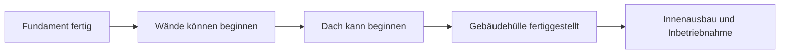
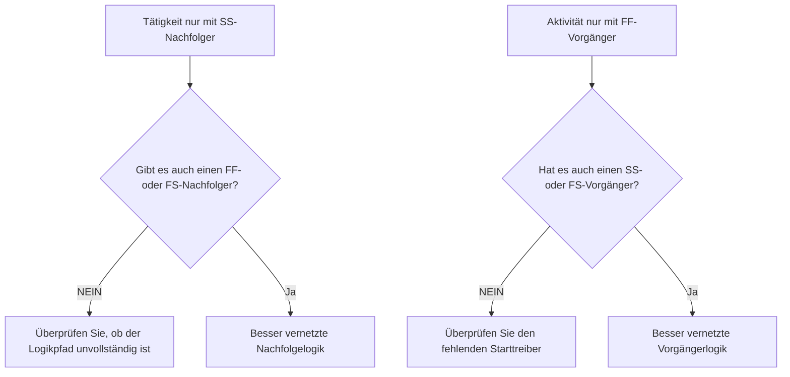

Logik ist die mathematische Darstellung der Abfolge und Abhängigkeiten innerhalb eines Projektzeitplans. Es erklärt, was vor was passieren muss, welche Aktivitäten gleichzeitig stattfinden können und wie das Projektteam von der ersten Aktivität bis zur endgültigen Fertigstellung vorgehen will.

In einem guten Primavera P6-Zeitplan ist Logik keine Dekoration. Es ist die Engine, die es dem Zeitplan ermöglicht, Termine, Puffer, kritische Pfade und prognostizierte Bewegungen zu berechnen. Es erzählt die Geschichte der Ausführung auf eine Weise, die überprüft, in Frage gestellt und verbessert werden kann.

Wenn im Zeitplan steht: „Grundlagen legen, dann Wände bauen, dann das Dach bauen“, dann ist es die Logik, die diese Abfolge in ein kalkulierbares Netzwerk verwandelt. Der Planer zeichnet nicht nur einen Zeitplan. Der Planer definiert den Lieferweg.

## Logik erzählt die Geschichte der Arbeit

Jedes Projektteam hat eine bestimmte Art und Weise, das Projekt auszuführen. Das Engineering kann den Entwurf nach Bereichen freigeben. Der Einkauf kann die Ausrüstung per Paket liefern. Bauarbeiten können den Zugang vorbereiten, bevor mit den Rohbauarbeiten begonnen wird. Möglicherweise muss die mechanische Fertigstellung erfolgen, bevor mit der Inbetriebnahme begonnen werden kann.

Logische Verknüpfungen sind der mathematische Ausdruck dieses Plans.

Dieses einfache Diagramm ist nicht nur eine Sequenz. Es handelt sich um ein Entscheidungsmodell. Wenn die Fundamente verspätet sind, können auch die Wände verspätet sein. Wenn die Wände verspätet sind, kann auch das Dach verspätet sein. Wenn das Dach verspätet ist, kann dies Auswirkungen auf den Innenausbau haben. Der Zeitplan kann diese Auswirkungen nur dann zeigen, wenn die Logik vorhanden ist.

Robuste Logik bedeutet, dass der Zeitplan erklären kann, warum Aktivitäten beginnen, warum sie enden und was passiert, wenn ein Teil des Plans verschoben wird.

## Warum robuste Logik beim Datendatum wichtig ist

Die Metrik „Aktivitäten, die am Datendatum ohne Fahrlogik beginnen“ ist ein starker Test für die Zeitplanqualität.

Das Datendatum ist die Grenze zwischen tatsächlicher Leistung und prognostizierter Arbeit. Wenn eine Aktivität genau am Datendatum beginnt, sollte der Prüfer eine einfache Frage stellen: Was treibt diesen Start voran?

Wenn die Aktivität über eine gültige Vorgängerlogik verfügt, kann der Zeitplan den Start erklären. Möglicherweise wurde ein Bereich freigegeben. Möglicherweise wurde eine Materiallieferung abgeschlossen. Möglicherweise wurde die Vorgängeraktivität beendet und die nächste Crew konnte beginnen.

Wenn die Aktivität keine Antriebslogik hat, ist der Start schwächer. Die Aktivität befindet sich möglicherweise am Datendatum, weil sie keinen Vorgänger hat, weil die Logik unvollständig ist, weil eine Einschränkung sie erzwingt oder weil die Aktualisierung nicht den vollständigen Status hatte.

Deshalb ist robuste Logik wichtig. Ein Zeitplan sollte nicht zulassen, dass die Arbeit fertig erscheint, nur weil das Datendatum verschoben wurde. Es sollte den tatsächlichen Zustand zeigen, der den Beginn der Arbeiten ermöglicht.

## Die Balance: Genug Logik, keine redundante Logik

Gute Logik ist ausgewogen. Der Zeitplan benötigt genügend Beziehungen, um Aktivitäten ordnungsgemäß mit Vorgängern und Nachfolgern zu verbinden. Gleichzeitig sollte redundante Logik vermieden werden, die dieselbe Abhängigkeit auf unnötige Weise wiederholt.

Zu wenig Logik führt zu offenen Starts, offenen Enden, unzuverlässigem Float und schwachen kritischen Pfadergebnissen. Zu viel Logik kann die Überprüfung des Netzwerks erschweren und den wahren Treiber einer Aktivität verbergen.

Das Ziel besteht nicht darin, die Anzahl der Beziehungen zu maximieren. Ziel ist es, zwingende und erforderliche Abhängigkeiten übersichtlich darzustellen.

Für jede Aktivität sollte der Planer antworten können:

- Was ermöglicht den Beginn dieser Aktivität?
- Was ermöglicht diese Aktivität als nächstes?
- Welche Beziehung treibt die Aktivität wirklich voran?
- Gibt es eine doppelte oder unnötige Beziehung?
- Würde ein Rezensent die beabsichtigte Reihenfolge verstehen?

Dieses Gleichgewicht ist für PMO-Planüberprüfungen von zentraler Bedeutung. Ein dichtes Netzwerk ist nicht automatisch ein starkes Netzwerk. Ein Light-Netzwerk ist nicht automatisch ein sauberes Netzwerk. Das richtige Netzwerk erklärt den Ausführungsplan ohne Unordnung.

## Jede Aktivität benötigt einen Starttreiber

Robuste Logik bedeutet, dass jede Aktivität einen Vorgänger hat, der ihren Start ermöglicht oder auslöst, mit Ausnahme gültiger Projektstarts oder extern autorisierter Ausnahmen.

Bei einer Bautätigkeit kann der Zugang zum Gebiet, die vorherige Fertigstellung, die Materialverfügbarkeit, die Entwurfsfreigabe, die Genehmigung oder die frühere Fertigstellung des Bauvorhabens der Ausgangspunkt sein. Bei einer Beschaffungsaktivität kann es sich um eine Entwurfsgenehmigung oder eine Bestellfreigabe handeln. Bei der Inbetriebnahme kann es sich um die mechanische Fertigstellung, die Testpaketbereitschaft oder den Systemwechsel handeln.

Wenn dieser Starttreiber fehlt, kann die Aktivität an eine künstliche Position im Zeitplan verschoben werden. Bei Aktualisierungen kann es beim Datendatum erscheinen. Das erzeugt ein falsches Gefühl der Bereitschaft.

Betrachten Sie eine Aktivität namens „Installieren von Pumpen“. Wenn es am Datendatum beginnt, aber keinen Vorgänger für die Fertigstellung des Fundaments, die Lieferung der Pumpe oder die Übergabe des Gebiets hat, erklärt der Zeitplan nicht, warum mit der Installation begonnen werden kann. Die Aktivität mag geplant sein, aber die Logik ist nicht robust.

## SS und FF sind Halbbeziehungen

Anfang-zu-Anfang- und Ende-zu-Ende-Beziehungen sind nützlich, sollten jedoch mit Vorsicht verwendet werden. In vielen Zeitplanüberprüfungen werden sie am besten als „halbe“ Beziehungen verstanden, da sie die Aktivität nicht vollständig in einen vollständigen logischen Pfad einordnen.

Eine SS-Beziehung kann erklären, wann eine Aktivität beginnen darf, aber sie erklärt möglicherweise nicht, wann die Aktivität enden muss oder was sie übergibt. Eine FF-Beziehung kann die Endausrichtung erklären, sie erklärt jedoch möglicherweise nicht, wann die Aktivität beginnen darf.

Das macht SS oder FF nicht falsch. Überlappende Arbeiten sind häufig und oft realistisch. Die Frage ist, ob die Aktivität vollständig verbunden ist.

Zum Beispiel:

- Eine Tätigkeit mit einem SS-Nachfolger sollte in der Regel auch einen FF- oder FS-Nachfolger haben.
- Eine Aktivität mit einem FF-Vorgänger sollte in der Regel auch einen SS- oder FS-Vorgänger haben.

Dadurch wird verhindert, dass Aktivitäten nur auf einer Seite ihrer Dauer verbunden sind. Der Zeitplan sollte sowohl erklären, wie die Arbeit beginnt als auch wie die Arbeit abgeschlossen wird.

## Robuste Logik in der Praxis

Eine praktische Logiküberprüfung sollte mit Aktivitäten in der Nähe des Datendatums, kritischen und nahezu kritischen Arbeiten sowie wichtigen Übergabepfaden beginnen. Diese Bereiche haben den größten Einfluss auf die aktuelle Entscheidungsfindung.

Zu den nützlichen Überprüfungsspalten in P6 gehören Aktivitäts-ID, Aktivitätsname, WBS, Start, Ende, Aktivitätsstatus, Gesamtpuffer, Vorgänger, Nachfolger, Beziehungstyp, Verzögerung, Einschränkungen, Kalender und Indikatoren für treibende Beziehungen, sofern verfügbar.

Fragen Sie für jede Aktivität, die am Datendatum beginnt:

- Ist die Aktivität wirklich startbereit?
- Welcher Vorgänger ermöglicht den Start?
- Ist dieser Vorgänger abgeschlossen, in Bearbeitung oder prognostiziert?
- Ist die Beziehung treibend?
- Ersetzt eine Einschränkung oder ein erwartetes Datum die Logik?
- Verfügt die Aktivität auch über eine gültige Nachfolgerlogik?

Wenn die Antwort unklar ist, sollte die Aktivität mit dem verantwortlichen Eigentümer überprüft werden. Die Korrektur kann darin bestehen, einen fehlenden Vorgänger hinzuzufügen, den Beziehungstyp zu ändern, eine Einschränkung zu entfernen, Ist-Werte zu aktualisieren oder eine gültige Ausnahme zu dokumentieren.

## Künstliche Logik vermeiden

Ein Fehler besteht darin, Beziehungen nur hinzuzufügen, um eine Metrik zu übergeben. Das schafft keine robuste Logik. Es entsteht künstliche Logik.

Beziehungen sollten echte Abhängigkeiten darstellen. Wenn ein Link nicht den Bauablauf, die technische Freigabe, den Beschaffungsbedarf, den Zugang, die Genehmigung, die Prüfung, die Inbetriebnahme oder die Übergabe widerspiegelt, gehört er möglicherweise nicht zum Netzwerk.

Ein weiterer Fehler besteht darin, redundante Logik zu belassen, weil sie sicherer aussieht. Wenn dieselbe Abhängigkeit bereits durch eine klarere Beziehung dargestellt wird, können zusätzliche Links den kritischen Pfad verwirren und die Überwachung des Netzwerks erschweren.

Robuste Logik ist klar, zielgerichtet und vertretbar.

## Abschluss

Logik ist die mathematische Geschichte darüber, wie das Projekt ausgeführt wird. Es definiert, was zuerst passieren muss, was gemeinsam passieren kann und was als nächstes folgt.

Robuste Logik bedeutet nicht, so viele Links wie möglich hinzuzufügen. Es bedeutet, die richtigen Links hinzuzufügen: genug, um jede Aktivität mit echten Vorgängern und Nachfolgern zu verbinden, aber nicht so viele, dass das Netzwerk überflüssig oder irreführend wird.

Wenn Aktivitäten am Datendatum ohne treibende Logik beginnen, deckt der Zeitplan eine Schwachstelle in dieser Geschichte auf. Die Aktivität wird möglicherweise als bereit angezeigt, das Netzwerk erklärt jedoch nicht, warum.

Ein verlässlicher Zeitplan sollte diese Frage klar beantworten. Was ermöglicht den Beginn dieser Arbeit? Was wird als nächstes aktiviert? Wenn der Zeitplan beides beantworten kann, wird die Logik robust. Wenn dies nicht möglich ist, muss das Projektteam weitere Sequenzierungsarbeiten durchführen, bevor der Prognose vertraut werden kann.
