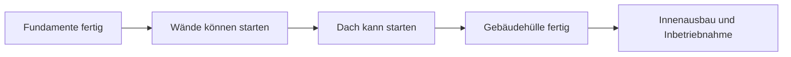
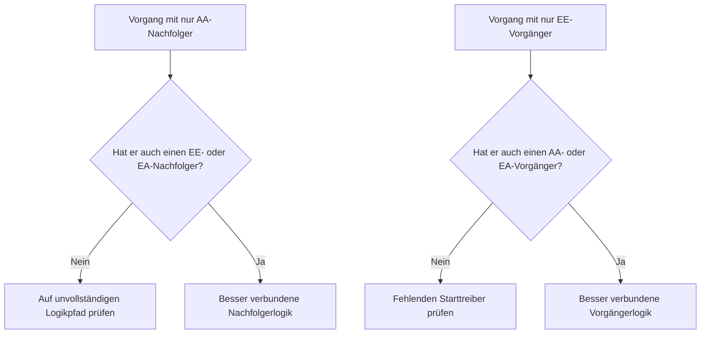

Logik ist die mathematische Darstellung von Reihenfolge und Abhängigkeiten in einem Projektterminplan. Sie erklärt, was vor was geschehen muss, welche Vorgänge gleichzeitig stattfinden können und wie das Projektteam vom ersten Vorgang bis zur endgültigen Fertigstellung voranzugehen beabsichtigt.

In einem guten Primavera P6-Terminplan ist Logik kein Dekorationselement. Sie ist das Antriebssystem, das dem Terminplan ermöglicht, Termine, Puffer (Float), kritischen Weg und Prognosebewegung zu berechnen. Sie erzählt die Geschichte der Ausführung auf eine Weise, die überprüft, hinterfragt und verbessert werden kann.

Wenn der Terminplan sagt „Fundamente legen, dann Wände bauen, dann das Dach bauen", ist die Logik das, was diese Abfolge in ein berechenbares Netzwerk verwandelt. Der Planer zeichnet nicht nur einen Zeitstrahl. Der Planer definiert den Lieferweg.

## Logik erzählt die Geschichte der Arbeit

Jedes Projektteam hat eine beabsichtigte Art, das Projekt auszuführen. Engineering kann den Entwurf nach Bereichen freigeben. Beschaffung kann Ausrüstung nach Paketen liefern. Tiefbauarbeiten können den Zugang vorbereiten, bevor Stahlbauarbeiten beginnen. Mechanischer Abschluss muss möglicherweise stattfinden, bevor die Inbetriebnahme beginnen kann.

Logikverknüpfungen sind der mathematische Ausdruck dieses Plans.

Dieses einfache Diagramm ist nicht nur eine Abfolge. Es ist ein Entscheidungsmodell. Wenn Fundamente verspätet sind, können Wände verspätet sein. Wenn Wände verspätet sind, kann das Dach verspätet sein. Wenn das Dach verspätet ist, kann der Innenausbau betroffen sein. Der Terminplan kann diese Auswirkung nur zeigen, wenn die Logik vorhanden ist.

Robuste Logik bedeutet, dass der Terminplan erklären kann, warum Vorgänge beginnen, warum sie enden und was passiert, wenn sich ein Teil des Plans verschiebt.

## Warum robuste Logik am Stichtag wichtig ist

Die Metrik „Vorgänge, die am Stichtag ohne steuernde Logik beginnen" ist ein starker Test der Terminqualität.

Der Stichtag (Data Date) ist die Grenze zwischen tatsächlichem Fortschritt und prognostizierter Arbeit. Wenn ein Vorgang genau am Stichtag beginnt, sollte der Prüfer eine einfache Frage stellen: Was treibt diesen Start?

Wenn der Vorgang eine gültige Vorgängerlogik hat, kann der Terminplan den Start erklären. Vielleicht wurde ein Bereich freigegeben. Vielleicht wurde eine Materiallieferung abgeschlossen. Vielleicht wurde der Vorgängervorgang abgeschlossen und ermöglichte es dem nächsten Team, zu beginnen.

Wenn der Vorgang keine steuernde Logik hat, ist der Start schwächer. Der Vorgang kann am Stichtag sitzen, weil er keinen Vorgänger hat, weil die Logik unvollständig ist, weil eine Einschränkung ihn erzwingt oder weil die Aktualisierung nicht vollständig bearbeitet wurde.

Deshalb ist robuste Logik wichtig. Ein Terminplan sollte nicht erlauben, dass Arbeit als bereit erscheint, nur weil sich der Stichtag verschoben hat. Er sollte die echte Bedingung zeigen, die es ermöglicht, die Arbeit zu beginnen.

## Die Balance: Genug Logik, keine redundante Logik

Gute Logik ist ausgewogen. Der Terminplan benötigt genug Beziehungen, um Vorgänge ordnungsgemäß mit Vorgängern und Nachfolgern zu verbinden. Gleichzeitig sollte er redundante Logik vermeiden, die dieselbe Abhängigkeit auf unnötige Weise wiederholt.

Zu wenig Logik erzeugt offene Starts, offene Enden, unzuverlässigen Puffer und schwache Ergebnisse beim kritischen Weg. Zu viel Logik kann das Netzwerk schwer überprüfbar machen und den echten Treiber eines Vorgangs verbergen.

Das Ziel ist nicht, die Anzahl der Beziehungen zu maximieren. Das Ziel ist es, zwingende und erforderliche Abhängigkeiten klar darzustellen.

Für jeden Vorgang sollte der Planer in der Lage sein, folgende Fragen zu beantworten:

- Was erlaubt diesem Vorgang, zu beginnen?
- Was ermöglicht dieser Vorgang als nächstes?
- Welche Beziehung steuert den Vorgang wirklich?
- Ist eine Beziehung doppelt oder unnötig?
- Würde ein Prüfer die beabsichtigte Abfolge verstehen?

Diese Balance ist zentral für PMO-Terminplanprüfungen. Ein dichtes Netzwerk ist nicht automatisch ein starkes Netzwerk. Ein leichtes Netzwerk ist nicht automatisch ein sauberes Netzwerk. Das richtige Netzwerk erklärt den Ausführungsplan ohne Unklarheiten.

## Jeder Vorgang braucht einen Starttreiber

Robuste Logik bedeutet, dass jeder Vorgang einen Vorgänger hat, der seinen Start erlaubt oder auslöst, außer bei gültigen Projektstart- oder extern autorisierten Ausnahmen.

Für einen Bauvorgang kann der Starttreiber Bereichszugang, Vorgängerabschluss, Materialverfügbarkeit, Entwurfsfreigabe, Genehmigungszulassung oder vorheriger Gewerkeabschluss sein. Für einen Beschaffungsvorgang kann es Entwurfsgenehmigung oder Kaufauftragserteilung sein. Für die Inbetriebnahme kann es mechanischer Abschluss, Testpaketbereitschaft oder Systemübergabe sein.

Wenn dieser Starttreiber fehlt, kann der Vorgang in eine künstliche Position im Terminplan gleiten. Bei Aktualisierungen kann er am Stichtag erscheinen. Das erzeugt ein falsches Gefühl von Bereitschaft.

Betrachten Sie einen Vorgang namens „Pumpen installieren". Wenn er am Stichtag beginnt, aber keinen Vorgänger für den Fundamentabschluss, die Pumpenlieferung oder die Bereichsübergabe hat, erklärt der Terminplan nicht, warum die Installation beginnen kann. Der Vorgang mag geplant sein, aber die Logik ist nicht robust.

## AA- und EE-Verknüpfungen sind halbe Beziehungen

Anfang-Anfang- (Start-to-Start, SS) und Ende-Ende-Verknüpfungen (Finish-to-Finish, FF) sind nützlich, sollten aber mit Sorgfalt verwendet werden. Bei vielen Terminplanprüfungen werden sie am besten als „halbe" Beziehungen verstanden, da sie den Vorgang allein nicht vollständig in einen vollständigen Logikpfad einbetten.

Eine AA-Verknüpfung kann erklären, wann ein Vorgang beginnen kann, aber sie erklärt möglicherweise nicht, wann der Vorgang enden muss oder was er übergibt. Eine EE-Verknüpfung kann die Endausrichtung erklären, aber sie erklärt möglicherweise nicht, wann der Vorgang beginnen darf.

Das macht AA oder EE nicht falsch. Überlappende Arbeit ist häufig und oft realistisch. Das Problem ist, ob der Vorgang vollständig verbunden ist.

Zum Beispiel:

- Ein Vorgang mit einem AA-Nachfolger sollte normalerweise auch einen EE- oder EA-Nachfolger (Finish-to-Start, FS) haben.
- Ein Vorgang mit einem EE-Vorgänger sollte normalerweise auch einen AA- oder EA-Vorgänger haben.

Dies verhindert, dass Vorgänge nur auf einer Seite ihrer Dauer verbunden sind. Der Terminplan sollte erklären, wie Arbeit beginnt und wie Arbeit endet.

## Robuste Logik in der Praxis

Eine praktische Logikprüfung sollte mit Vorgängen nahe dem Stichtag, kritischer und nahezu kritischer Arbeit sowie wichtigen Übergabewegen beginnen. Diese Bereiche haben den größten Einfluss auf aktuelle Entscheidungen.

In P6 umfassen nützliche Prüfspalten Vorgangs-ID, Vorgangsname, PSP (WBS), Start, Ende, Vorgangsstatus, Gesamtpuffer, Vorgänger, Nachfolger, Beziehungstyp, Versatz (Lag), Einschränkungen, Kalender und steuernde Beziehungsindikatoren, sofern verfügbar.

Fragen Sie für jeden Vorgang, der am Stichtag beginnt:

- Ist der Vorgang wirklich bereit zu starten?
- Welcher Vorgänger erlaubt den Start?
- Ist dieser Vorgänger abgeschlossen, in Bearbeitung oder prognostiziert?
- Ist die Beziehung steuernd?
- Ersetzt eine Einschränkung oder ein erwartetes Datum die Logik?
- Hat der Vorgang auch gültige Nachfolgerlogik?

Wenn die Antwort unklar ist, sollte der Vorgang mit dem verantwortlichen Eigentümer überprüft werden. Die Korrektur kann das Hinzufügen eines fehlenden Vorgängers, das Ändern des Beziehungstyps, das Entfernen einer Einschränkung, das Aktualisieren von Ist-Werten oder das Dokumentieren einer gültigen Ausnahme sein.

## Künstliche Logik vermeiden

Ein Fehler ist das Hinzufügen von Beziehungen nur, um eine Metrik zu erfüllen. Das schafft keine robuste Logik. Es schafft künstliche Logik.

Beziehungen sollten echte Abhängigkeiten darstellen. Wenn eine Verknüpfung keine Bauabfolge, Engineering-Freigabe, Beschaffungsbedarf, Zugang, Genehmigung, Testing, Inbetriebnahme oder Übergabe widerspiegelt, gehört sie möglicherweise nicht in das Netzwerk.

Ein weiterer Fehler ist das Belassen redundanter Logik, weil sie sicherer erscheint. Wenn dieselbe Abhängigkeit bereits durch eine klarere Beziehung dargestellt wird, können zusätzliche Verknüpfungen den kritischen Weg verwirren und das Netzwerk schwerer prüfbar machen.

Robuste Logik ist klar, zweckvoll und verteidigbar.

## Fazit

Logik ist die mathematische Geschichte, wie das Projekt ausgeführt wird. Sie definiert, was zuerst geschehen muss, was zusammen geschehen kann und was als nächstes folgt.

Robuste Logik bedeutet nicht, so viele Verknüpfungen wie möglich hinzuzufügen. Es bedeutet, die richtigen Verknüpfungen hinzuzufügen: genug, um jeden Vorgang mit echten Vorgängern und Nachfolgern zu verbinden, aber nicht so viele, dass das Netzwerk redundant oder irreführend wird.

Wenn Vorgänge am Stichtag ohne steuernde Logik beginnen, zeigt der Terminplan eine Schwäche in dieser Geschichte. Der Vorgang kann als bereit angezeigt werden, aber das Netzwerk erklärt nicht, warum.

Ein zuverlässiger Terminplan sollte diese Frage klar beantworten können: Was erlaubt dieser Arbeit zu beginnen? Was ermöglicht sie als nächstes? Wenn der Terminplan beides beantworten kann, wird die Logik robust. Wenn nicht, hat das Projektteam mehr Sequenzierungsarbeit zu tun, bevor der Prognose vertraut werden kann.
