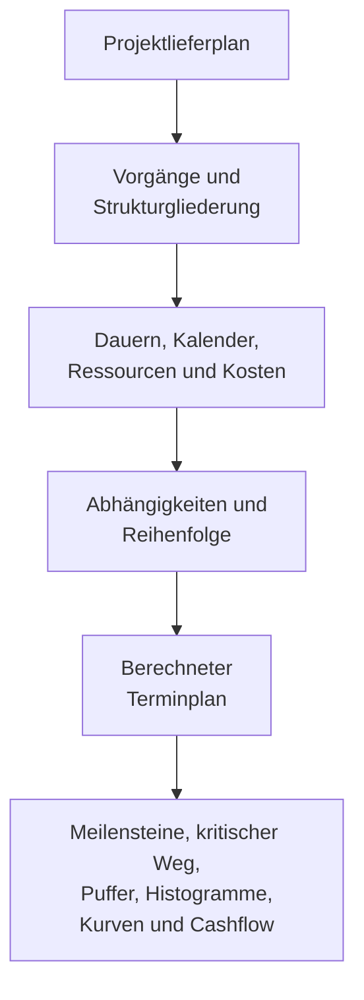

Ein Projektterminplan ist mehr als eine Liste von Terminen. Er ist eine grafische und logische Darstellung des Projektlieferplans. Er erklärt, wie das Projekt von Anfang bis Ende umgesetzt wird, wie Arbeitspakete miteinander verbunden sind, wann wichtige Meilensteine erreicht werden sollen, und welche Informationen das Projektteam für Entscheidungen heranziehen sollte.

Einfach ausgedrückt: Der Terminplan wandelt den Projektplan in einen Fahrplan um. Er hilft allen Beteiligten zu verstehen, was zu tun ist, wann es geschehen muss und wer dafür verantwortlich ist. Für Projektmanager, Planer, Bauteams, Ingenieure, Einkaufsverantwortliche und PMO-Prüfer wird der Terminplan zu einem der wichtigsten Koordinations- und Steuerungsinstrumente.

Der Terminplan ist ein Zeitstrahl, aber nicht nur ein Zeitstrahl. Ein schwacher Terminplan kann Termine zeigen. Ein starker Terminplan erklärt, warum diese Termine glaubwürdig sind.

## Der Terminplan als Lieferfahrplan

Jedes Projekt beginnt mit einer Absicht. Das Team weiß, was geliefert werden muss: ein Gebäude, eine Anlage, ein Industriesystem, einen Stillstand, ein Infrastrukturasset oder ein Arbeitspaket. Doch die Lieferung erfordert mehr als das Kennen des Endziels. Das Team muss die Reihenfolge verstehen.

Was kommt zuerst? Was kann parallel laufen? Was muss auf Entwurfsgenehmigung, Materiallieferung, Zugang, Genehmigungserteilung, Testing oder Übergabe warten? Welche Vorgänge steuern das Fertigstellungsdatum? Welche Meilensteine sind für den Auftraggeber am wichtigsten?

Ein Terminplan beantwortet diese Fragen, indem er den Plan in Vorgänge, Dauern, Abhängigkeiten (Predecessor/Successor), Kalender, Ressourcen, Kosten und Meilensteine überführt.

Der grafische Zeitstrahl ist nützlich, weil man die Arbeit sehen kann. Das Logiknetzwerk ist nützlich, weil die Software die Arbeit berechnen kann. Zusammen ermöglichen sie dem Terminplan, sowohl als Kommunikations- als auch als Steuerungsinstrument zu dienen.

## Was den Terminplan speist

Ein Terminplan ist nur so zuverlässig wie die Informationen, die zu seiner Erstellung verwendet wurden. In Primavera P6 wird der Terminplan durch mehrere wesentliche Eingaben gespeist.

Die erste Eingabe ist die Vorgangsliste. Vorgänge gliedern das Projekt in überschaubare Arbeitseinheiten. Jeder Vorgang sollte klar genug sein, um geplant, aktualisiert und gemessen zu werden.

Die zweite Eingabe ist die deterministische Dauer. Dies ist die geplante Arbeitszeit, die zur Fertigstellung jedes Vorgangs benötigt wird. Die Dauer sollte die Ausführungsmethode, Produktivitätsannahmen, Teamgröße, Zugang, Einschränkungen und Projektbedingungen widerspiegeln.

Die dritte Eingabe ist die Abhängigkeitslogik. Abhängigkeiten erklären, wie Vorgänge miteinander zusammenhängen. Ein Vorgang muss möglicherweise abgeschlossen sein, bevor ein anderer beginnt. Zwei Vorgänge können gleichzeitig starten. Zwei Fertigstellungen müssen möglicherweise aufeinander abgestimmt sein. Diese Beziehungen bilden das CPM-Netzwerk.

Die vierte Eingabe ist die Reihenfolge. Die Reihenfolge ist die praktische Ausführungsabfolge. Sie berücksichtigt Baubarkeit, Engineering-Ablauf, Beschaffungszeitplanung, Zugang, Inbetriebnahmelogik, Übergabestrategie und Auftragegeberprioritäten.

Die fünfte Eingabe sind Ressourcen und Kosten. Die Ressourcenplanung ermöglicht es dem Terminplan, den Arbeits-, Geräte- und Materialbedarf über die Zeit darzustellen. Die Kostenplanung ermöglicht es dem Terminplan, Cashflow, Earned Value und Finanzprognosen zu unterstützen.

Wenn diese Eingaben vollständig und realistisch sind, kann der Terminplan nützliche Ausgaben erzeugen.

## Was der Terminplan uns sagt

Ein gut aufgebauter Terminplan zeigt die Gesamtprojektdauer. Er zeigt geplante Fertigstellungsmeilensteine und Zwischenliefergegenstände. Er erzeugt Ressourcenhistogramme, die zeigen, wann der Arbeits- oder Gerätebedarf steigt und fällt. Er unterstützt Fortschrittskurven, Cashflow-Kurven, Earned-Value-Berichterstattung und Vorausschauplanning (Lookahead).

Am wichtigsten ist, dass er den kritischen Weg oder den längsten Weg identifiziert. Dies ist die Arbeitskette, die den Projektabschluss bestimmt. Wenn Vorgänge auf diesem Weg sich verschieben, kann sich das Projektfertigstellungsdatum verschieben. Deshalb ist Logik so wichtig. Ohne gute Abhängigkeiten zeigt der kritische Weg möglicherweise nicht die echten Treiber des Projekts.

Puffer (Float) ist ein weiteres wichtiges Ergebnis. Puffer gibt an, wie viel Flexibilität ein Vorgang hat, bevor er einen anderen Vorgang oder den Projektabschluss beeinflusst. Puffer ist jedoch nur aussagekräftig, wenn das Terminplannetzwerk vollständig ist. Wenn Vorgängen Logik fehlt, kann der Puffer besser oder schlechter erscheinen als die Realität.

## Warum Logik den Zeitstrahl glaubwürdig macht

Hier wird die Metrik „Vorgänge, die am Stichtag ohne steuernde Logik beginnen" wichtig.

Der Stichtag (Data Date) in P6 ist die Grenze zwischen tatsächlichem Fortschritt und der Prognose. Alles vor dem Stichtag sollte das bereits Geschehene darstellen. Alles nach dem Stichtag sollte den Plan ab diesem Zeitpunkt darstellen.

Wenn Vorgänge genau am Stichtag ohne steuernde Logik beginnen, sendet der Terminplan ein Warnsignal. Es mag so aussehen, als ob die Arbeit sofort beginnen kann, aber der Terminplan kann möglicherweise nicht erklären, warum. Es gibt möglicherweise keinen Vorgänger (Predecessor), der zeigt, dass der Bereich verfügbar ist, keine Verknüpfung zur Materiallieferung, keine Anbindung an die Entwurfsgenehmigung, keine Verbindung zur Freigabe für die Inspektion und keine Logik aus vorheriger Arbeit.

Das ist wichtig, weil ein Terminplan nicht einfach Arbeit auf ein Datum setzen sollte. Er sollte den Weg zu diesem Datum erklären.

Wenn ein Vorgang am Stichtag beginnt, weil alle erforderlichen Vorgängerarbeiten abgeschlossen sind und die Logik den Start unterstützt, ist das Datum verteidigbar. Wenn er dort beginnt, weil der Vorgang offen, ungesteuert, eingeschränkt oder schlecht aktualisiert ist, ist das Datum schwach. Das Projektteam glaubt möglicherweise, dass die Arbeit bereit ist, obwohl die tatsächlichen Freigabebedingungen nicht modelliert wurden.

## Ein praktisches Beispiel

Stellen Sie sich einen Projektterminplan mit einem Stichtag vom 01. Juni vor. Nach der Aktualisierung beginnen mehrere Vorgänge am 01. Juni:

- Kabeltrassenmontage in Bereich B installieren.
- Rohrdruckprüfung starten.
- Geräteausrichtung beginnen.
- Isolierkolonne mobilisieren.

Auf den ersten Blick erscheint der Vorausschau beschäftigt und bereit. Wenn der Planer jedoch die Logik überprüft, wird das Problem deutlich. Die Kabeltrassenmontage ist nicht mit der Materiallieferung verknüpft. Die Druckprüfung ist nicht mit dem Rohrabschluss verknüpft. Bei der Geräteausrichtung fehlt der Vorgänger für den mechanischen Abschluss. Die Mobilisierung der Isolierkolonne hat keinen Vorgänger für die Zugangsgenehmigung.

Der Terminplan zeigt Arbeit am Stichtag, erklärt aber nicht, warum die Arbeit beginnen kann. Das ist kein zuverlässiger Fahrplan. Es ist eine Liste kurzfristiger Absichten.

Die Lösung besteht darin, echte CPM-Logik hinzuzufügen oder zu korrigieren. Wenn die Materiallieferung die Kabeltrassenmontage steuert, verknüpfen Sie sie. Wenn der Rohrabschluss die Druckprüfung steuert, verknüpfen Sie ihn. Wenn die Zugangsgenehmigung die Isolierung steuert, modellieren Sie diese Bedingung. Nach der Neuberechnung können einige Vorgänge immer noch nahe am Stichtag beginnen, aber jetzt kann der Terminplan erklären, warum.

## Was ein guter Terminplan leisten sollte

Ein guter Terminplan sollte dem Team helfen, den Plan zu sehen, zu testen und zu verwalten.

Er sollte zeigen, was getan werden muss. Er sollte die Reihenfolge der Arbeit erklären. Er sollte identifizieren, wer wann handeln muss. Er sollte den kritischen Weg aufzeigen. Er sollte Ressourcenplanung, Fortschrittsmessung, Cashflow-Prognose und PMO-Berichterstattung unterstützen.

Er sollte auch schwache Stellen sichtbar machen. Fehlende Logik, harte Einschränkungen, veraltete Termine, offene Starts, offene Enden und Vorgänge, die sich am Stichtag häufen, sind nicht nur technische Probleme. Sie beeinflussen, wie das Projektteam Bereitschaft, Risiko und Steuerung versteht.

## Fazit

Ein Terminplan ist der Projektlieferplan, ausgedrückt als Zeit, Logik und messbare Arbeit. Er ist ein Fahrplan, ein Berechnungsmodell und ein Kommunikationsinstrument.

Wenn er gut aufgebaut ist, sagt er dem Projektteam, was geschehen muss, wann es geschehen muss und warum die Termine glaubwürdig sind. Wenn Vorgänge am Stichtag ohne steuernde Logik beginnen, wird diese Glaubwürdigkeit geschwächt. Der Terminplan hört auf, den Plan zu erklären, und fängt an, den nächsten Schritt zu raten.

Aus diesem Grund sollten Terminqualitätsprüfungen immer eine einfache Frage stellen: Erklärt der Terminplan, warum die Arbeit beginnt, wenn sie beginnt? Wenn die Antwort ja ist, erfüllt der Terminplan seine Aufgabe. Wenn die Antwort nein ist, benötigt der Fahrplan mehr Logik, bevor ihm vertraut werden kann.
