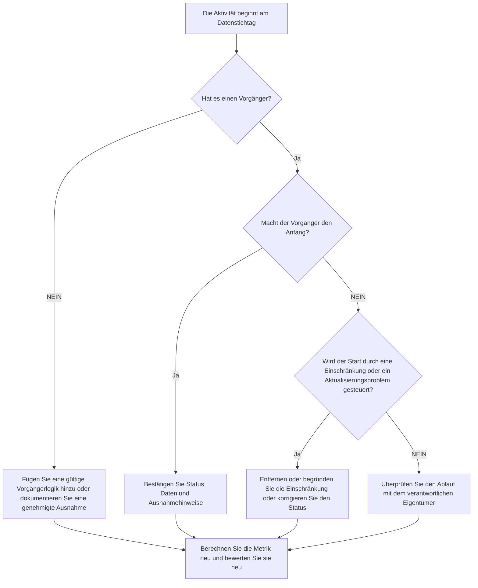

## Zweck

Dieser Leitfaden hilft Planern und Projektkontrollteams, Aktivitäten zu reduzieren oder zu eliminieren, deren Start am Primavera P6-Datenstichtag geplant ist, ohne dass eine gültige Vorgängerlogik den Start vorantreibt. Es gilt für geplante Qualitätsprüfungen, PMO-Integritätsprüfungen und die Aktualisierungszyklusvalidierung.

Das Ziel besteht darin, zu bestätigen, dass die kurzfristige Arbeit durch eine klare CPM-Logik unterstützt wird und dass Aktivitäten nicht nur aufgrund fehlender Beziehungen, Einschränkungen, manueller Daten oder unvollständiger Fortschrittsaktualisierungen am Datenstichtag beginnen.

## Bevor Sie beginnen

Sammeln Sie die folgenden Informationen, bevor Sie Maßnahmen ergreifen:

- Aktuelles Bewertungsergebnis für diese Metrik.
- Projektdatendatum, das in der letzten Terminberechnung verwendet wird.
- Liste der offenen oder noch nicht begonnenen Aktivitäten mit einem Startdatum, das dem Datenstichtag entspricht.
- Details zur Vorgänger- und Nachfolgerbeziehung für jede Aktivität.
- Einschränkungen, erwartete Daten, Ist-Termine und Kalenderzuweisungen.
- Für die Aktualisierung verwendete P6-Planungsoptionen, einschließlich beibehaltener Logik oder Einstellungen zum Überschreiben des Fortschritts, sofern relevant.
- Alle genehmigten Ausnahmen, z. B. Projektstartaktivitäten, externe Schnittstellenmeilensteine ​​oder vom Eigentümer gesteuerte Starts.

## Verstehen Sie Ihr Ergebnis

Ein starkes Ergebnis sind null ungelöste Aktivitäten ab dem Datenstichtag, ohne dass die Vorgängerlogik vorangetrieben wird. Dies bedeutet, dass die aktuelle und kurzfristige Arbeit mit dem Terminplannetzwerk verbunden ist und der Datenstichtag keine fehlende Reihenfolge verbirgt.

Ein akzeptables Ergebnis kann eine kleine Anzahl dokumentierter Ausnahmen umfassen. Diese sollten überprüft und genehmigt und nicht ignoriert werden. Beispielsweise benötigt ein „Notice-to-Proceed“-Meilenstein oder eine extern autorisierte Aktivität möglicherweise keinen normalen Vorgänger, aber der Grund sollte für Prüfer sichtbar sein.

Ein schwaches Ergebnis bedeutet, dass am Datenstichtag mehrere Aktivitäten ohne einen klaren logischen Treiber beginnen. Dies kann auf offene Starts, fehlende Vorgängerbeziehungen, übermäßige Einschränkungen, unvollständige Fortschrittsaktualisierungen oder Aktivitäten hinweisen, die nach der letzten Aktualisierung nicht ordnungsgemäß neu geordnet wurden.

## Verbesserungsziel

Das Ziel sind 0 ungelöste Aktivitäten ab dem Datenstichtag ohne gültige steuernde Logik.

Das Verbesserungsziel besteht nicht nur darin, die Anzahl zu reduzieren. Das tiefere Ziel besteht darin, sicherzustellen, dass jede Aktivität in der Nähe des Datenstichtags einen vertretbaren Grund für ihren prognostizierten Beginn hat. Nach der Korrektur sollte jede betroffene Aktivität entweder über eine entsprechende Vorgängerlogik, eine dokumentierte Ausnahme oder eine korrigierte Status-/Datumsbedingung verfügen.

## Aktionsplan

### Schritt 1: Identifizieren Sie das Hauptproblem

Erstellen Sie ein P6-Layout oder einen Bericht, der nach offenen oder noch nicht begonnenen Aktivitäten filtert, deren Startdatum dem Datenstichtag entspricht. Fügen Sie Spalten für Aktivitäts-ID, Aktivitätsname, WBS, Start, Ende, Status, Gesamtpuffer, Kalender, primäre Einschränkung, Vorgänger, Nachfolger und Treiberbeziehungsindikatoren hinzu, sofern verfügbar.

Überprüfen Sie jede Aktivität und fragen Sie:

- Hat die Aktivität Vorläufer?
- Wenn es Vorgänger gibt, treiben sie dann tatsächlich den Anfang?
- Wird die Aktivität durch eine Einschränkung gehalten oder verschoben?
- Fehlt der Aktivität eine tatsächliche Start- oder Fortschrittsaktualisierung?
- Handelt es sich bei der Aktivität um eine gültige Ausnahme, beispielsweise um einen Projektstartmeilenstein?
- Gehört die Aktivität zu einem WBS-Bereich, in dem die Logik im Allgemeinen schwach ist?

Gruppieren Sie die Ergebnisse nach praktischen Ursachen: fehlende Vorgänger, nicht fahrende Vorgänger, Einschränkungen oder erwartete Termine, Aktualisierungs-/Statusfehler oder genehmigte Ausnahmen.

### Schritt 2: Wenden Sie die empfohlenen Fixes an

Beginnen Sie mit fehlender oder schwacher Logik. Fügen Sie ggf. gültige Vorgängerbeziehungen hinzu, die den tatsächlichen Arbeitsablauf darstellen, z. B. Ende-zu-Anfang-, Anfang-zu-Anfang- oder Ende-Ende-Beziehungen. Vermeiden Sie es, Beziehungen nur hinzuzufügen, um die Metrik zu erfüllen. Jede Beziehung sollte eine tatsächliche Bau-, Technik-, Beschaffungs-, Zugangs-, Genehmigungs- oder Übergabeabhängigkeit widerspiegeln.

Überprüfen Sie als Nächstes die Einschränkungen. Wenn eine Aktivität am Stichtag aufgrund einer Startbeschränkung beginnt, bestätigen Sie, ob die Beschränkung vertraglich oder betrieblich gerechtfertigt ist. Entfernen Sie unnötige Einschränkungen und ermöglichen Sie, dass die Aktivität durch Logik gesteuert wird. Wenn die Einschränkung gültig ist, dokumentieren Sie den Grund und bestätigen Sie, dass sie den kritischen Pfad nicht verzerrt.

Überprüfen Sie den Fortschrittsstatus. Wenn die Arbeit bereits begonnen hat, aktualisieren Sie den tatsächlichen Beginn und die verbleibende Dauer korrekt. Wenn die Arbeiten noch nicht begonnen haben, bestätigen Sie, dass der prognostizierte Beginn am Datenstichtag liegen soll. Eine Aktivität sollte nicht einfach deshalb als startbereit erscheinen, weil sie durch den Aktualisierungszyklus auf das aktuelle Datum verschoben wurde.

Nachdem Änderungen vorgenommen wurden, berechnen Sie den Terminplan neu und überprüfen Sie die betroffenen Aktivitäten erneut. Bestätigen Sie, dass das Startdatum nun logisch gesteuert ist, einen korrekten Status hat oder als genehmigte Ausnahme dokumentiert ist.

### Schritt 3: Häufige Blocker entfernen

Häufige Hindernisse sind unklares Feld-Feedback, fehlende Schnittstelleninformationen und der Druck, kurzfristige Arbeiten fertig aussehen zu lassen. Beheben Sie diese Probleme, indem Sie die betroffenen Aktivitäten mit Disziplinarleitern, Bauleitern, Beschaffungsverantwortlichen oder Paketmanagern besprechen.

Ein weiteres häufiges Hindernis ist der Missbrauch von Einschränkungen als Ersatz für Logik. In einigen Fällen können Einschränkungen erforderlich sein, sie sollten jedoch das Terminplannetzwerk nicht ersetzen. Wenn eine Einschränkung beibehalten wird, dokumentieren Sie, warum sie existiert und wie sie sich auf Puffer und den längsten Pfad auswirkt.

Überprüfen Sie außerdem, ob das Problem durch Terminplanberechnungseinstellungen oder Aktualisierungspraktiken verursacht wird. Wenn sich Fortschrittsüberschreibung, beibehaltene Logik, nicht in der Reihenfolge liegender Fortschritt oder unvollständige Aktualisierung auf das Ergebnis auswirken, stimmen Sie die Aktualisierungsmethode mit dem Projektkontrollverfahren ab, bevor Sie die Metrik neu bewerten.

### Schritt 4: Validieren Sie die Änderungen

Validieren Sie den korrigierten Terminplan vor der nächsten Beurteilung. Führen Sie den Filter für offene oder nicht gestartete Aktivitäten ab dem Datenstichtag ohne steuernde Logik erneut aus. Bestätigen Sie, dass jedes verbleibende Element entweder korrigiert oder als genehmigte Ausnahme dokumentiert ist.

Überprüfen Sie nach der Neuberechnung den gesamten Puffer, den längsten Pfad und die kurzfristigen Look-Ahead-Aktivitäten. Eine logische Korrektur kann den kritischen Pfad ändern oder zusätzliche Sequenzierungsprobleme aufdecken. Wenn die Terminplanverschiebung erheblich ist, teilen Sie die Auswirkungen dem Projektkontrollleiter oder dem PMO-Prüfer mit.

## Verbesserungsplan

### Tag 1: Überprüfung und Diagnose

Führen Sie die Metrik aus, bestätigen Sie der Datenstichtag und erstellen Sie die Aktivitätsliste. Unterteilen Sie die Ergebnisse in fehlende Logik, nicht steuernde Logik, Einschränkungen, Statusfehler und potenzielle Ausnahmen.

### Tage 2–3: Implementieren Sie vorrangige Maßnahmen

Korrigieren Sie zuerst die Aktivitäten mit den größten Auswirkungen, insbesondere kritische oder nahezu kritische Aktivitäten. Fügen Sie gültige Vorgängerlogik hinzu, entfernen Sie unnötige Einschränkungen, aktualisieren Sie falsche Status und dokumentieren Sie Ausnahmen.

### Tage 4–5: Überwachen Sie die ersten Ergebnisse

Berechnen Sie den Terminplan neu und prüfen Sie, ob die betroffenen Aktivitäten jetzt logikgesteuert sind. Überprüfen Sie, ob sich der Gesamtpuffer, der längste Pfad und die Meilensteindaten unerwartet geändert haben.

### Tag 6: Letzte Anpassungen

Beheben Sie verbleibende Blocker mit der zuständigen Disziplin oder dem Paketeigentümer. Bestätigen Sie, dass alle beibehaltenen Ausnahmen begründet und klar dokumentiert sind.

### Tag 7: Neubewertung und Vergleich

Führen Sie die Bewertung erneut durch und vergleichen Sie das neue Ergebnis mit dem vorherigen Ergebnis und dem Zielschwellenwert. Bestätigen Sie, ob die Metrik jetzt bei null ungelösten Aktivitäten liegt oder ob weitere Maßnahmen erforderlich sind.

## Fortschritt verfolgen

Verwenden Sie einen einfachen Tracker, um Korrekturen und Genehmigungen zu verwalten.

| Datum | Maßnahmen ergriffen | Erwartete Auswirkungen | Ergebnis / Beobachtung | Nächster Schritt |
| --- | --- | --- | --- | --- |
| [Datum] | Überprüfte Aktivitäten beginnend mit dem Datenstichtag ohne steuernde Logik | Identifizieren Sie fehlende oder schwache Logik | [Beobachtetes Ergebnis] | Weisen Sie Korrekturen dem verantwortlichen Eigentümer zu |
| [Datum] | Gültige Vorgängerbeziehungen hinzugefügt | Verbessern Sie die CPM-Sequenzierung | [Beobachtetes Ergebnis] | Berechnen und überprüfen Sie die Puffer-Auswirkungen neu |
| [Datum] | Entfernte oder gerechtfertigte Einschränkungen | Reduzieren Sie künstliche Starts | [Beobachtetes Ergebnis] | Bestätigen Sie die verbleibenden Ausnahmen |
| [Datum] | Falscher Aktivitätsstatus aktualisiert | Verbessern Sie die Aktualisierungsgenauigkeit | [Beobachtetes Ergebnis] | Führen Sie die Bewertung erneut durch |

## Wenn sich die Ergebnisse nicht verbessern

Wenn sich das Ergebnis nicht verbessert, überprüfen Sie, ob dieselben Aktivitäten immer noch fehlschlagen oder ob zum Datenstichtag neue Aktivitäten auftauchen. Wiederholte Fehler können auf ein umfassenderes Problem bei der Terminplanentwicklung hinweisen, z. B. auf eine unvollständige Logik in einem WBS-Bereich, eine schwache Aktualisierungsdisziplin oder eine inkonsistente Verwendung von Einschränkungen.

Leiten Sie anhaltende Probleme an den Projektkontrollleiter, den Planungsmanager oder den PMO-Prüfer weiter. Erwägen Sie bei größeren Terminplänen einen gezielten Logik-Review-Workshop für die betroffenen Arbeitspakete. Wenn der Terminplan für Vertragsberichte, Verzögerungsanalysen oder Earned Valueprognosen verwendet wird, sollten ungelöste Punkte als Qualitätsproblem behandelt werden.

## Wartung

Überprüfen Sie diese Metrik bei jedem Aktualisierungszyklus, bevor Sie den Terminplan herausgeben. Die Prüfung sollte Teil der standardmäßigen Zustandsüberprüfung des Terminplans sein, insbesondere nach Fortschrittsaktualisierungen, Neusequenzierungen, größeren Änderungen des Umfangs oder Wiederherstellungsplanung.

Zu den guten Wartungsgewohnheiten gehört es, Vorgänger- und Nachfolgerspalten in P6-Layouts sichtbar zu halten, offene Starts vor jeder Übermittlung zu überprüfen, genehmigte Ausnahmen zu dokumentieren und zu überprüfen, dass durch die Datenstichtagsverschiebung keine neue Gruppe nicht gesteuerter Aktivitäten entsteht.

## Zusammenfassende Checkliste

- [ ] Aktuelles Ergebnis überprüft
- [ ] Zielschwelle bestätigt
- [ ] Datenstichtag bestätigt
- [ ] Aktivitäten beginnend mit dem identifizierten Datenstichtag
- [ ] Hauptproblem identifiziert
- [ ] Fehlende oder schwache Logik korrigiert
- [ ] Einschränkungen überprüft und begründet oder entfernt
- [ ] Statusdaten überprüft
- [ ] Genehmigte Ausnahmen dokumentiert
- [ ] Terminplan neu berechnet
- [ ] Ergebnisse überwacht
- [ ] Beurteilung wiederholt
- [ ] Nächste Schritte dokumentiert
## Verwandte Inhalte
- [Blog-Vorlage](03_blog_template.md)
- [Was für ein Terminplan ist](../../09b_blogs_de/01_WHAT%20A%20SCHEDULE%20IS/01_blog.md)
- [Robuste Logik](../../09b_blogs_de/02_ROBUST%20LOGIC/02_ROBUST%20LOGIC.md)
