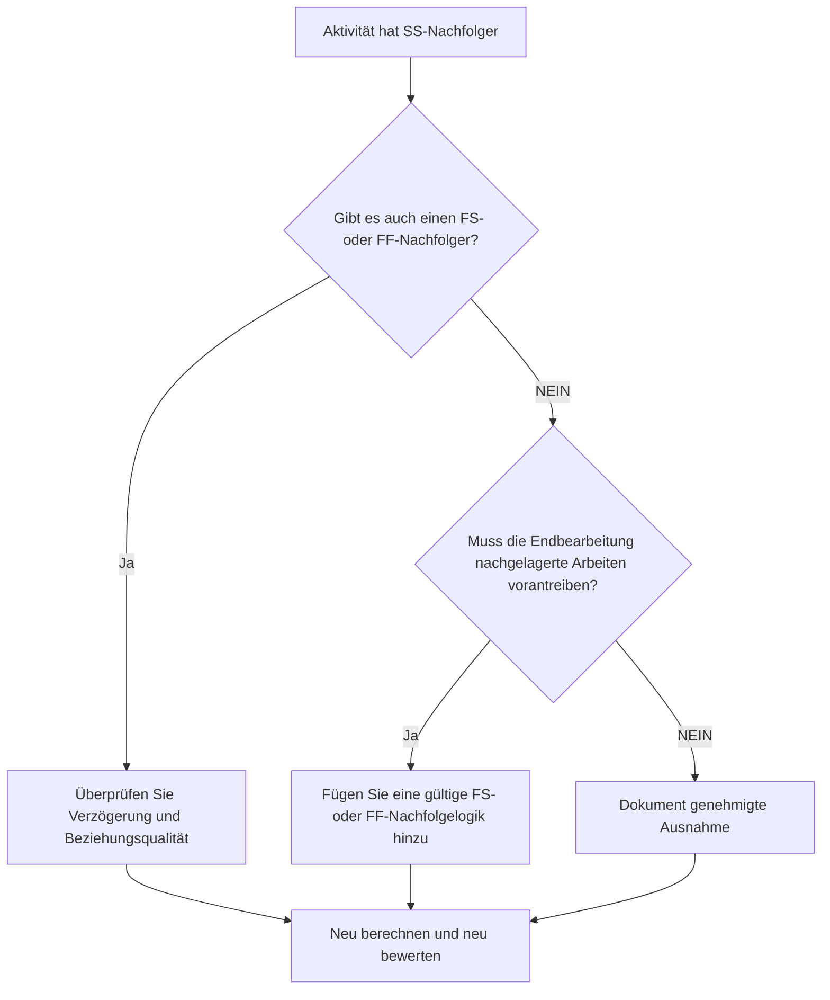

# Aktivitäten mit SS-Nachfolgern und ohne FS- oder FF-Nachfolger - Verbesserungsleitfaden

## Zweck

Dieser Leitfaden hilft Planern, Aktivitäten zu überprüfen und zu korrigieren, die Start-to-Start-Nachfolger, aber keine Finish-to-Start- oder Finish-to-Finish-Nachfolger haben. Es unterstützt eine stärkere CPM-Logik, indem es bestätigt, dass Aktivitätsenden und nicht nur Starts mit dem nachgelagerten Terminplannetzwerk verbunden sind.

## Bevor Sie beginnen

Sammeln Sie die folgenden Informationen, bevor Sie Maßnahmen ergreifen:

- Aktuelles Bewertungsergebnis für diese Metrik.
- Liste der Tätigkeiten mit SS-Nachfolgern und ohne FS- oder FF-Nachfolger.
- Details zur Nachfolgerbeziehung für jede Aktivität.
- Aktivitätstyp, Dauer, Status, Kalender, Gesamtpuffer und WBS.
- Alle Verzögerungen, Einschränkungen oder erwarteten Termine, die sich auf die Aktivität oder ihre Nachfolger auswirken.
- Relevante Informationen zur Bau-, Technik-, Beschaffungs- oder Übergabesequenz.

## Verstehen Sie Ihr Ergebnis

Ein starkes Ergebnis ist, dass es in diesem Zustand keine ungelösten Aktivitäten mehr gibt. Dies bedeutet, dass Aktivitäten, mit denen nachgelagerte Arbeiten beginnen, auch eine abschlussbasierte Logik haben, bei der es auf den Abschluss der Arbeit ankommt.

Ein akzeptables Ergebnis kann dokumentierte Ausnahmen umfassen, wie z. B. Aktivitäten mit hohem Aufwand, Verwaltungsaktivitäten oder absichtlich überlappende Arbeiten, bei denen keine Abschlusslogik erforderlich ist. Diese sollten überprüft und nicht als gültig angenommen werden.

Ein schwaches Ergebnis bedeutet, dass mehrere Aktivitäten Nachfolger starten können, aber kein Nachfolge-Ende oder -Start durch ihren eigenen Abschluss steuern. Dies kann dazu führen, dass unvollendete Arbeiten keinen Einfluss mehr auf den Terminplan haben.

## Verbesserungsziel

Das Ziel sind 0 ungelöste Aktivitäten mit SS-Nachfolgern und keinen FS- oder FF-Nachfolgern.

Das Ziel besteht darin, zu bestätigen, dass es für jede Aktivität einen realistischen, abschlussgesteuerten Nachfolger gibt, bei dem sich der Abschluss auf nachgelagerte Arbeiten auswirkt, oder dass das Fehlen einer Abschlusslogik gerechtfertigt und dokumentiert ist.

## Aktionsplan

### Schritt 1: Identifizieren Sie das Hauptproblem

Erstellen Sie ein P6-Layout oder einen Export, das Aktivitäten mit mindestens einem SS-Nachfolger und keinem FS- oder FF-Nachfolger auflistet. Geben Sie Aktivitäts-ID, Aktivitätsname, PSP, ursprüngliche Dauer, verbleibende Dauer, Gesamtpuffer, Nachfolger, Beziehungstyp, Verzögerung, Einschränkungen und Aktivitätsstatus an.

Überprüfen Sie jede Aktivität und fragen Sie:

- Welche Arbeit beginnt, weil diese Aktivität beginnt?
- Welche Arbeiten, Meilensteine, Übergaben oder Inspektionen hängen vom Abschluss dieser Aktivität ab?
- Fehlt ein FS- oder FF-Nachfolger?
- Wird die SS-Beziehung zur korrekten Modellierung überlappender Arbeiten verwendet?
- Handelt es sich bei der Aktivität um eine gültige Ausnahme, beispielsweise um eine Aufwandsstufe oder eine Supportaktivität?

### Schritt 2: Wenden Sie die empfohlenen Fixes an

Fügen Sie eine abschlussbasierte Logik hinzu, bei der der Abschluss der Aktivität die spätere Arbeit steuern soll. Verwenden Sie FS, wenn der Nachfolger nicht beginnen kann, bis die Aktivität beendet ist. Verwenden Sie FF, wenn der Nachfolger überlappen kann, aber erst fertig werden kann, wenn der Vorgänger fertig ist.

Überprüfen Sie SS-Beziehungen mit Verzögerung. Wenn die Verzögerung zur Annäherung an die Zielabhängigkeit verwendet wird, ersetzen oder ergänzen Sie sie durch eine klarere FS- oder FF-Beziehung. Vermeiden Sie es, Logik nur hinzuzufügen, um die Metrik zu erfüllen. Jede Beziehung sollte den tatsächlichen Arbeitsablauf widerspiegeln.

Wenn es sich bei der Aktivität um eine gültige Ausnahme handelt, dokumentieren Sie den Grund in einem Notizbuchthema, einer UDF, einem Kommentarfeld oder einem Terminplanqualitäts-Tracker.

### Schritt 3: Häufige Blocker entfernen

Zu den häufigsten Blockern gehören kopierte Logik aus alten Terminplänen, übermäßige SS-Beziehungen, unklare Übergabepunkte und fehlender Input von Außendienst- oder Disziplinarleitern. Beheben Sie diese Probleme, indem Sie den tatsächlichen Arbeitsablauf mit dem verantwortlichen Eigentümer besprechen.

Ein weiteres Hindernis ist die Überzeugung, dass sich überschneidende Arbeiten immer nur der SS-Logik bedürfen. Überschneidungen können zwar gültig sein, aber der Abschluss des Vorgängers muss häufig noch einen Abschluss, eine Inspektion, einen Umsatz oder eine Folgeaktivität des Nachfolgers steuern.

### Schritt 4: Validieren Sie die Änderungen

Berechnen Sie den Terminplan nach Korrekturen neu. Führen Sie die Metrik erneut aus und bestätigen Sie, dass jede verbleibende Aktivität entweder korrigiert oder als genehmigte Ausnahme dokumentiert wurde.

Überprüfen Sie die Auswirkungen auf den gesamten Puffer, den kritischen Pfad, den längsten Pfad und kurzfristige Meilensteine. Wenn durch das Hinzufügen der Abschlusslogik wichtige Termine geändert werden, teilen Sie das Ergebnis dem Projektkontrollleiter oder dem PMO-Prüfer mit.

## Verbesserungsplan

### Tag 1: Überprüfung und Diagnose

Führen Sie die Metrik aus, bestätigen Sie die betroffene Aktivitätsliste und unterteilen Sie Aktivitäten in fehlende Abschlusslogik, schwache SS-Logik, Verzögerungsprobleme und mögliche Ausnahmen.

### Tage 2–3: Implementieren Sie vorrangige Maßnahmen

Korrigieren Sie zuerst kritische und nahezu kritische Aktivitäten. Fügen Sie gültige FS- oder FF-Nachfolger hinzu, passen Sie unangemessene SS-Logik an und dokumentieren Sie begründete Ausnahmen.

### Tage 4–5: Überwachen Sie die ersten Ergebnisse

Berechnen Sie den Terminplan neu und überprüfen Sie die Bewegung in Pufferzeit, längstem Pfad und Meilensteindaten.

### Tag 6: Letzte Anpassungen

Klären Sie verbleibende unsichere Punkte mit der zuständigen Disziplin, dem Paketeigentümer oder dem Bauleiter.

### Tag 7: Neubewertung und Vergleich

Führen Sie die Bewertung erneut durch und vergleichen Sie das Ergebnis mit dem Zielschwellenwert.

## Fortschritt verfolgen

Verwenden Sie einen einfachen Tracker, um Korrekturen und Genehmigungen zu verwalten.

| Datum | Maßnahmen ergriffen | Erwartete Auswirkungen | Ergebnis / Beobachtung | Nächster Schritt |
| --- | --- | --- | --- | --- |
| [Datum] | Überprüfte Nachfolgeaktivitäten nur für die SS | Identifizieren Sie fehlende Abschlusslogik | [Beobachtetes Ergebnis] | Korrekturen zuordnen |
| [Datum] | FS- oder FF-Nachfolgelogik hinzugefügt | Verbessern Sie die CPM-Kontinuität | [Beobachtetes Ergebnis] | Terminplan neu berechnen |
| [Datum] | Dokumentierte gültige Ausnahmen | Verbessern Sie die Rückverfolgbarkeit von Bewertungen | [Beobachtetes Ergebnis] | Metrik neu bewerten |

## Wenn sich die Ergebnisse nicht verbessern

Wenn sich die Ergebnisse nicht verbessern, prüfen Sie, ob der Filter gültige Ausnahmen, doppelte Logik oder Aktivitäten in einem bestimmten WBS-Bereich mit schwacher Netzwerkentwicklung identifiziert. Ein wiederholtes Problem kann darauf hindeuten, dass sich das Team bei der Planung zu stark auf SS-Beziehungen verlässt.

Eskalieren Sie ungelöste Probleme an den Planungsleiter oder PMO-Prüfer, wenn sie kritische, nahezu kritische, vertragliche oder übergabebezogene Arbeiten betreffen.

## Wartung

Überprüfen Sie diese Metrik bei jeder Terminplanaktualisierung und vor der Basisgenehmigung. Seien Sie besonders aufmerksam nach Neusequenzierung, Wiederherstellungsplanung, kopierter Terminplanentwicklung oder größeren Umfangsänderungen.

## Zusammenfassende Checkliste

- [ ] Aktuelles Ergebnis überprüft
- [ ] Zielschwelle bestätigt
- [ ] Hauptproblem identifiziert
- [ ] SS-Nachfolger überprüft
- [ ] Fehlende FS- oder FF-Logik korrigiert
- [ ] Verzögerungen und Einschränkungen überprüft
- [ ] Gültige Ausnahmen dokumentiert
- [ ] Terminplan neu berechnet
- [ ] Ergebnisse überwacht
- [ ] Beurteilung wiederholt
- [ ] Nächste Schritte dokumentiert
## Verwandte Inhalte
- [Aktivitäten mit SS-Nachfolgern und ohne FS- oder FF-Nachfolger - Überblick](01_overview_template.md)
- [Blog-Vorlage](03_blog_template.md)
- [Was für ein Terminplan ist](../../09b_blogs_de/01_WHAT%20A%20SCHEDULE%20IS/01_blog.md)
- [Robuste Logik](../../09b_blogs_de/02_ROBUST%20LOGIC/02_ROBUST%20LOGIC.md)
