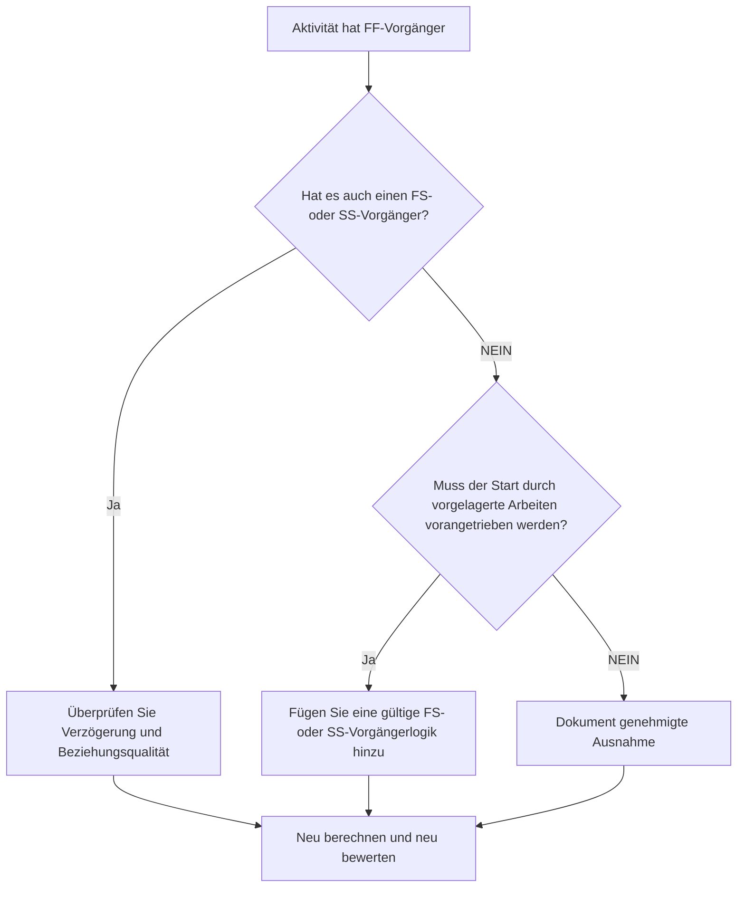

## Zweck

Dieser Leitfaden hilft Planern, Aktivitäten zu überprüfen und zu korrigieren, die Ende-Ende-Vorgänger, aber keine Ende-Start- oder Start-Start-Vorgänger haben. Es unterstützt eine stärkere CPM-Logik, indem es bestätigt, dass Aktivitätsstarts und nicht nur Enden mit dem vorgelagerten Terminplannetzwerk verbunden sind.

## Bevor Sie beginnen

Sammeln Sie die folgenden Informationen, bevor Sie Maßnahmen ergreifen:

- Aktuelles Bewertungsergebnis für diese Metrik.
- Liste der Aktivitäten mit FF-Vorgängern und ohne FS- oder SS-Vorgänger.
- Details zur Vorgängerbeziehung für jede Aktivität.
- Aktivitätstyp, Dauer, Status, Kalender, Gesamtpuffer und WBS.
- Alle Verzögerungen, Einschränkungen oder erwarteten Termine, die sich auf die Aktivität oder ihre Vorgänger auswirken.
- Relevante Informationen zu Bau, Technik, Beschaffung, Zugang, Genehmigung oder Übergabesequenz.

## Verstehen Sie Ihr Ergebnis

Ein starkes Ergebnis ist, dass es in diesem Zustand keine ungelösten Aktivitäten mehr gibt. Dies bedeutet, dass Aktivitäten, deren Abschluss an frühere Arbeiten gebunden ist, bei Bedarf auch über eine gültige Start-Steuernde Logik verfügen.

Ein akzeptables Ergebnis kann dokumentierte Ausnahmen umfassen, wie z. B. Aufwandsaktivitäten, Verwaltungsaktivitäten oder absichtlich modellierte parallele Arbeiten, bei denen keine Startlogik erforderlich ist. Diese sollten überprüft und nicht als gültig angenommen werden.

Ein schwaches Ergebnis bedeutet, dass mehrere Aktivitäten im Vergleich zu Vorgängern beendet werden können, ihre Starts jedoch nicht durch vorgelagerte Arbeiten kontrolliert werden. Dies kann dazu führen, dass Aktivitäten früher beginnen, als es die tatsächliche Reihenfolge zulässt.

## Verbesserungsziel

Das Ziel sind 0 ungelöste Aktivitäten mit FF-Vorgängern und keinen FS- oder SS-Vorgängern.

Das Ziel besteht darin, zu bestätigen, dass jede Aktivität einen realistischen Start-treibenden Vorgänger hat, bei dem der Start von vorgelagerten Arbeiten abhängt, oder dass das Fehlen einer Startlogik gerechtfertigt und dokumentiert ist.

## Aktionsplan

### Schritt 1: Identifizieren Sie das Hauptproblem

Erstellen Sie ein P6-Layout oder einen Export, das Aktivitäten mit mindestens einem FF-Vorgänger und keinem FS- oder SS-Vorgänger auflistet. Geben Sie Aktivitäts-ID, Aktivitätsname, PSP, ursprüngliche Dauer, verbleibende Dauer, Gesamtpuffer, Vorgänger, Beziehungstyp, Verzögerung, Einschränkungen und Aktivitätsstatus an.

Überprüfen Sie jede Aktivität und fragen Sie:

- Was muss passieren, bevor diese Aktivität beginnen kann?
- Kontrolliert der FF-Vorgänger nur die Zielausrichtung?
- Fehlt ein FS- oder SS-Vorgänger?
- Wird die FF-Beziehung verwendet, um überlappende Arbeiten korrekt zu modellieren?
- Handelt es sich bei der Aktivität um eine gültige Ausnahme, beispielsweise um eine Aufwandsstufe oder eine Supportaktivität?

### Schritt 2: Wenden Sie die empfohlenen Fixes an

Fügen Sie eine Startsteuerungslogik hinzu, bei der der Aktivitätsstart von der vorherigen Arbeit abhängen sollte. Verwenden Sie FS, wenn die Aktivität erst beginnen kann, wenn die Vorgängerin abgeschlossen ist. Verwenden Sie SS, wenn die Aktivität beginnen kann, nachdem die Vorgängerin gestartet ist oder einen definierten Fortschrittspunkt erreicht.

Überprüfen Sie FF-Beziehungen mit Verzögerung. Wenn die Verzögerung zur Annäherung an die Startabhängigkeit verwendet wird, ersetzen oder ergänzen Sie sie durch eine klarere FS- oder SS-Logik. Vermeiden Sie es, Beziehungen nur hinzuzufügen, um die Metrik zu erfüllen. Jede Beziehung sollte den tatsächlichen Arbeitsablauf widerspiegeln.

Wenn es sich bei der Aktivität um eine gültige Ausnahme handelt, dokumentieren Sie den Grund in einem Notizbuchthema, einer UDF, einem Kommentarfeld oder einem Terminplanqualitäts-Tracker.

### Schritt 3: Häufige Blocker entfernen

Zu den häufigsten Blockern gehören kopierte Logik aus alten Terminplänen, übermäßige Nutzung von FF-Beziehungen, unklare Zugriffs- oder Freigabepunkte und fehlender Input von Außendienst- oder Disziplinleitern. Beheben Sie diese, indem Sie die tatsächlichen Startbedingungen mit dem verantwortlichen Eigentümer besprechen.

Ein weiteres Hindernis ist die Überzeugung, dass die FF-Logik ausreicht, wenn zwei Aktivitäten zusammen abgeschlossen werden müssen. Die Endausrichtung kann gültig sein, die Nachfolgeaktivität benötigt jedoch häufig noch eine eindeutige Startbedingung.

### Schritt 4: Validieren Sie die Änderungen

Berechnen Sie den Terminplan nach Korrekturen neu. Führen Sie die Metrik erneut aus und bestätigen Sie, dass jede verbleibende Aktivität entweder korrigiert oder als genehmigte Ausnahme dokumentiert wurde.

Überprüfen Sie die Auswirkungen auf frühe Termine, den Gesamtbestand, den kritischen Pfad, den längsten Pfad und kurzfristige Meilensteine. Wenn durch das Hinzufügen der Startlogik wichtige Daten geändert werden, teilen Sie das Ergebnis dem Projektsteuerungsleiter oder dem PMO-Prüfer mit.

## Verbesserungsplan

### Tag 1: Überprüfung und Diagnose

Führen Sie die Metrik aus, bestätigen Sie die Liste der betroffenen Aktivitäten und unterteilen Sie Aktivitäten in fehlende Startlogik, schwache FF-Logik, Verzögerungsprobleme und mögliche Ausnahmen.

### Tage 2–3: Implementieren Sie vorrangige Maßnahmen

Korrigieren Sie zuerst kritische und nahezu kritische Aktivitäten. Fügen Sie gültige FS- oder SS-Vorgänger hinzu, passen Sie ungeeignete FF-Logik an und dokumentieren Sie begründete Ausnahmen.

### Tage 4–5: Überwachen Sie die ersten Ergebnisse

Berechnen Sie den Terminplan neu und überprüfen Sie die Bewegung in frühen Terminen, Puffer-, längsten Pfad- und Meilensteinterminen.

### Tag 6: Letzte Anpassungen

Klären Sie verbleibende unsichere Punkte mit der zuständigen Disziplin, dem Paketeigentümer oder dem Bauleiter.

### Tag 7: Neubewertung und Vergleich

Führen Sie die Bewertung erneut durch und vergleichen Sie das Ergebnis mit dem Zielschwellenwert.

## Fortschritt verfolgen

Verwenden Sie einen einfachen Tracker, um Korrekturen und Genehmigungen zu verwalten.

| Datum | Maßnahmen ergriffen | Erwartete Auswirkungen | Ergebnis / Beobachtung | Nächster Schritt |
| --- | --- | --- | --- | --- |
| [Datum] | Überprüfung der reinen FF-Vorgängeraktivitäten | Identifizieren Sie fehlende Startlogik | [Beobachtetes Ergebnis] | Korrekturen zuordnen |
| [Datum] | FS- oder SS-Vorgängerlogik hinzugefügt | Verbessern Sie die CPM-Kontinuität | [Beobachtetes Ergebnis] | Terminplan neu berechnen |
| [Datum] | Dokumentierte gültige Ausnahmen | Verbessern Sie die Rückverfolgbarkeit von Bewertungen | [Beobachtetes Ergebnis] | Metrik neu bewerten |

## Wenn sich die Ergebnisse nicht verbessern

Wenn sich die Ergebnisse nicht verbessern, prüfen Sie, ob der Filter gültige Ausnahmen, doppelte Logik oder Aktivitäten in einem bestimmten WBS-Bereich mit schwacher Netzwerkentwicklung identifiziert. Ein wiederholtes Problem kann darauf hindeuten, dass sich das Team bei der Planung zu stark auf FF-Beziehungen verlässt.

Eskalieren Sie ungelöste Probleme an den Planungsleiter oder PMO-Prüfer, wenn sie kritische, nahezu kritische, vertragliche, zugriffsbezogene oder übergabebezogene Arbeiten betreffen.

## Wartung

Überprüfen Sie diese Metrik bei jeder Terminplanaktualisierung und vor der Basisgenehmigung. Seien Sie besonders aufmerksam nach Neusequenzierung, Wiederherstellungsplanung, kopierter Terminplanentwicklung oder größeren Umfangsänderungen.

## Zusammenfassende Checkliste

- [ ] Aktuelles Ergebnis überprüft
- [ ] Zielschwelle bestätigt
- [ ] Hauptproblem identifiziert
- [ ] FF-Vorgänger überprüft
- [ ] Fehlende FS- oder SS-Logik korrigiert
- [ ] Verzögerungen und Einschränkungen überprüft
- [ ] Gültige Ausnahmen dokumentiert
- [ ] Terminplan neu berechnet
- [ ] Ergebnisse überwacht
- [ ] Beurteilung wiederholt
- [ ] Nächste Schritte dokumentiert
## Verwandte Inhalte
- [Blog-Vorlage](03_blog_template.md)
- [Was für ein Terminplan ist](../../09b_blogs_de/01_WHAT%20A%20SCHEDULE%20IS/01_blog.md)
- [Robuste Logik](../../09b_blogs_de/02_ROBUST%20LOGIC/02_ROBUST%20LOGIC.md)
