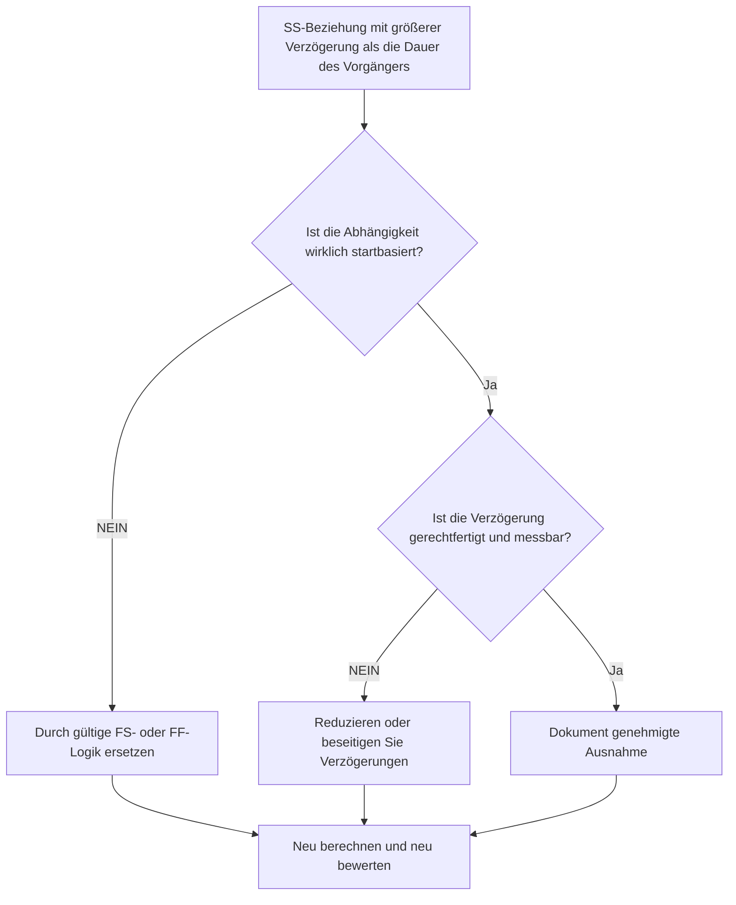

# SS-Beziehungen mit einer Verzögerung, die größer als die Dauer des Vorgängers ist - Verbesserungsleitfaden

## Zweck

Dieser Leitfaden hilft Planern dabei, Start-Start-Beziehungen zu überprüfen und zu korrigieren, bei denen die Verzögerung größer als die Dauer der Vorgängeraktivität ist. Es unterstützt eine klarere CPM-Logik, indem übermäßige SS-Verzögerungen durch eine Beziehungslogik ersetzt werden, die den tatsächlichen Arbeitsablauf besser darstellt.

## Bevor Sie beginnen

Sammeln Sie die folgenden Informationen, bevor Sie Maßnahmen ergreifen:

- Aktuelles Bewertungsergebnis für diese Metrik.
- Liste der SS-Beziehungen, bei denen die Verzögerung größer ist als die Vorgängerdauer.
- Vorgänger- und Nachfolger-Aktivitäts-IDs, Namen, WBS, Dauer, Kalender und Status.
- Beziehungsverzögerung, Beziehungstyp und alle damit verbundenen Einschränkungen.
- Terminplanberechnungseinstellungen und Kalenderbasis für Verzögerungen.
- Feld-, Technik-, Beschaffungs- oder Übergabelogik, die die beabsichtigte Abhängigkeit erläutert.

## Verstehen Sie Ihr Ergebnis

Ein starkes Ergebnis sind keine ungelösten SS-Beziehungen, bei denen die Verzögerung die Dauer des Vorgängers übersteigt.

Ein akzeptables Ergebnis kann dokumentierte Ausnahmen umfassen, diese sollten jedoch selten sein. Eine lange SS-Verzögerung weist häufig darauf hin, dass der Beziehungstyp nicht mit der modellierten Abhängigkeit übereinstimmt.

Ein schwaches Ergebnis bedeutet, dass der Terminplan mehrere Start-Start-Links enthält, bei denen der Nachfolger erst mit einer Verzögerung startet, die länger als die Dauer des Vorgängers ist. Dies könnte die Ziellogik hinter einer SS-Beziehung verbergen.

## Verbesserungsziel

Das Ziel sind 0 ungelöste SS-Beziehungen mit einer Verzögerung, die größer als die Dauer des Vorgängers ist.

Das Ziel besteht darin, zu bestätigen, ob jede Beziehung SS bleiben, in FS- oder FF-Logik konvertiert werden soll, ob die Verzögerung reduziert werden soll oder ob sie als gültige Ausnahme dokumentiert werden soll.

## Aktionsplan

### Schritt 1: Identifizieren Sie das Hauptproblem

Erstellen Sie ein P6-Layout oder einen Export, das SS-Beziehungen auflistet, bei denen die Verzögerung größer als die Vorgängerdauer ist. Geben Sie die Vorgänger- und Nachfolger-Aktivitäts-ID, den Aktivitätsnamen, den PSP, die ursprüngliche Dauer, die verbleibende Dauer, den Beziehungstyp, die Verzögerung, den Kalender, den Gesamtpuffer und den Aktivitätsstatus an.

Überprüfen Sie jede Beziehung und fragen Sie:

- Warum startet der Nachfolger mit so langer Verzögerung?
- Hängt der Nachfolger tatsächlich davon ab, dass der Vorgänger startet oder dass der Vorgänger endet?
- Ist die Verzögerung größer als die ursprüngliche Dauer des Vorgängers, die verbleibende Dauer oder beides?
- Wird die Verzögerung zur Modellierung von Beschaffung, Aushärtung, Überprüfungszeit, Zugang oder einer anderen echten Wartezeit verwendet?
- Würde eine FS- oder FF-Beziehung die Abhängigkeit klarer machen?

### Schritt 2: Wenden Sie die empfohlenen Fixes an

Wenn der Nachfolger beginnen soll, nachdem der Vorgänger beendet ist, ersetzen Sie die SS-Beziehung durch eine FS-Beziehung. Wenn sich die Arbeit überschneiden kann, der Nachfolger aber erst fertig werden kann, wenn der Vorgänger fertig ist, verwenden Sie die FF-Logik.

Wenn die Beziehung tatsächlich startbasiert ist, überprüfen Sie den Verzögerungswert. Reduzieren Sie übermäßige Verzögerungen, wenn sie als grober Platzhalter verwendet oder von kopierter Logik übernommen wurden. Wenn die Verzögerung eine echte Wartezeit darstellt, bestätigen Sie, dass die Einheit, der Kalender und die Erklärung korrekt sind.

Vermeiden Sie lange Verzögerungen als Ersatz für Aktivitäten, die im Terminplan sichtbar sein sollten. Wenn es sich bei der Verzögerung um die Überprüfungs-, Heilungs-, Bereitstellungs-, Mobilisierungs- oder Genehmigungszeit handelt, sollten Sie die Modellierung dieser Arbeit als separate Aktivität in Betracht ziehen.

### Schritt 3: Häufige Blocker entfernen

Zu den häufigsten Blockern gehören kopierte Logik aus früheren Terminplänen, versteckte Wartezeiten, Kalenderverwirrung und der Druck, das Netzwerk einfach zu halten. Beheben Sie diese, indem Sie die beabsichtigte Abhängigkeit mit dem verantwortlichen Eigentümer bestätigen.

Ein anderer Blocker betrachtet Lag als harmlos. Lange Verzögerungen können schwer zu überprüfen sein, Risiken verbergen und die Verzögerungsanalyse erschweren, da die Wartezeit nicht als Aktivität sichtbar ist.

### Schritt 4: Validieren Sie die Änderungen

Berechnen Sie den Terminplan nach Korrekturen neu. Führen Sie die Metrik erneut aus und bestätigen Sie, dass jedes verbleibende Element entweder korrigiert oder als genehmigte Ausnahme dokumentiert ist.

Überprüfen Sie den Gesamtbestand, den längsten Pfad, den kritischen Pfad und die kurzfristigen Meilensteine. Wenn sich durch Beziehungsänderungen wichtige Termine verschieben, teilen Sie das Ergebnis dem Projektkontrollleiter oder dem PMO-Prüfer mit.

## Verbesserungsplan

### Tag 1: Überprüfung und Diagnose

Führen Sie die Metrik aus, bestätigen Sie die Liste der betroffenen Beziehungen und unterteilen Sie die Elemente in falschen Beziehungstyp, übermäßige Verzögerung, versteckte Aktivität, Kalenderproblem und mögliche Ausnahme.

### Tage 2–3: Implementieren Sie vorrangige Maßnahmen

Korrigieren Sie zunächst kritische und nahezu kritische Beziehungen. Konvertieren Sie die SS-Logik gegebenenfalls in FS oder FF, reduzieren Sie ungerechtfertigte Verzögerungen und dokumentieren Sie gültige Ausnahmen.

### Tage 4–5: Überwachen Sie die ersten Ergebnisse

Berechnen Sie den Terminplan neu und überprüfen Sie die Bewegung in Pufferzeit, längstem Pfad und Meilensteindaten.

### Tag 6: Letzte Anpassungen

Klären Sie verbleibende unsichere Punkte mit der zuständigen Disziplin, dem Paketeigentümer oder dem Bauleiter.

### Tag 7: Neubewertung und Vergleich

Führen Sie die Bewertung erneut durch und vergleichen Sie das Ergebnis mit dem Zielschwellenwert.

## Fortschritt verfolgen

Verwenden Sie einen einfachen Tracker, um Korrekturen und Genehmigungen zu verwalten.

| Datum | Maßnahmen ergriffen | Erwartete Auswirkungen | Ergebnis / Beobachtung | Nächster Schritt |
| --- | --- | --- | --- | --- |
| [Datum] | Überprüfte SS-Verzögerung größer als die Dauer des Vorgängers | Identifizieren Sie schwache oder unklare Logik | [Beobachtetes Ergebnis] | Korrekturen zuordnen |
| [Datum] | Konvertierte Beziehung zu FS oder FF | Verbessern Sie die Klarheit der CPM-Logik | [Beobachtetes Ergebnis] | Terminplan neu berechnen |
| [Datum] | Reduzierte oder dokumentierte Verzögerung | Verbessern Sie die Rückverfolgbarkeit von Bewertungen | [Beobachtetes Ergebnis] | Metrik neu bewerten |

## Wenn sich die Ergebnisse nicht verbessern

Wenn sich die Ergebnisse nicht verbessern, prüfen Sie, ob dieselben Beziehungsmuster in einem bestimmten PSP-Bereich, einer bestimmten Disziplin oder einem kopierten Terminplanabschnitt wiederholt werden. Wiederholte Erkenntnisse könnten darauf hindeuten, dass das Team SS-Lag als Standardabkürzung verwendet, anstatt echte Abhängigkeiten zu modellieren.

Eskalieren Sie ungelöste Probleme, wenn sie kritische, nahezu kritische, vertragliche, beschaffungs-, genehmigungs- oder übergabebezogene Arbeiten betreffen.

## Wartung

Überprüfen Sie diese Metrik bei jeder Terminplanaktualisierung und vor der Basisgenehmigung. Seien Sie besonders aufmerksam, wenn Sie einen kopierten Terminplan entwickeln, eine neue Reihenfolge festlegen, eine Wiederherstellungsplanung vornehmen oder den Umfang erheblich ändern.

## Zusammenfassende Checkliste

- [ ] Aktuelles Ergebnis überprüft
- [ ] Zielschwelle bestätigt
- [ ] Hauptproblem identifiziert
- [ ] SS-Beziehungen überprüft
- [ ] Übermäßige Verzögerung korrigiert oder gerechtfertigt
- [ ] Bei Bedarf wurden FS- oder FF-Ersatzteile eingesetzt
- [ ] Gegebenenfalls werden versteckte Arbeiten modelliert
- [ ] Terminplan neu berechnet
- [ ] Ergebnisse überwacht
- [ ] Beurteilung wiederholt
- [ ] Nächste Schritte dokumentiert
## Verwandte Inhalte
- [SS-Beziehungen mit einer Verzögerung, die größer als die Dauer des Vorgängers ist - Überblick](01_overview_template.md)
- [Blog-Vorlage](03_blog_template.md)
- [Was für ein Terminplan ist](../../09b_blogs_de/01_WHAT%20A%20SCHEDULE%20IS/01_blog.md)
- [Robuste Logik](../../09b_blogs_de/02_ROBUST%20LOGIC/02_ROBUST%20LOGIC.md)
