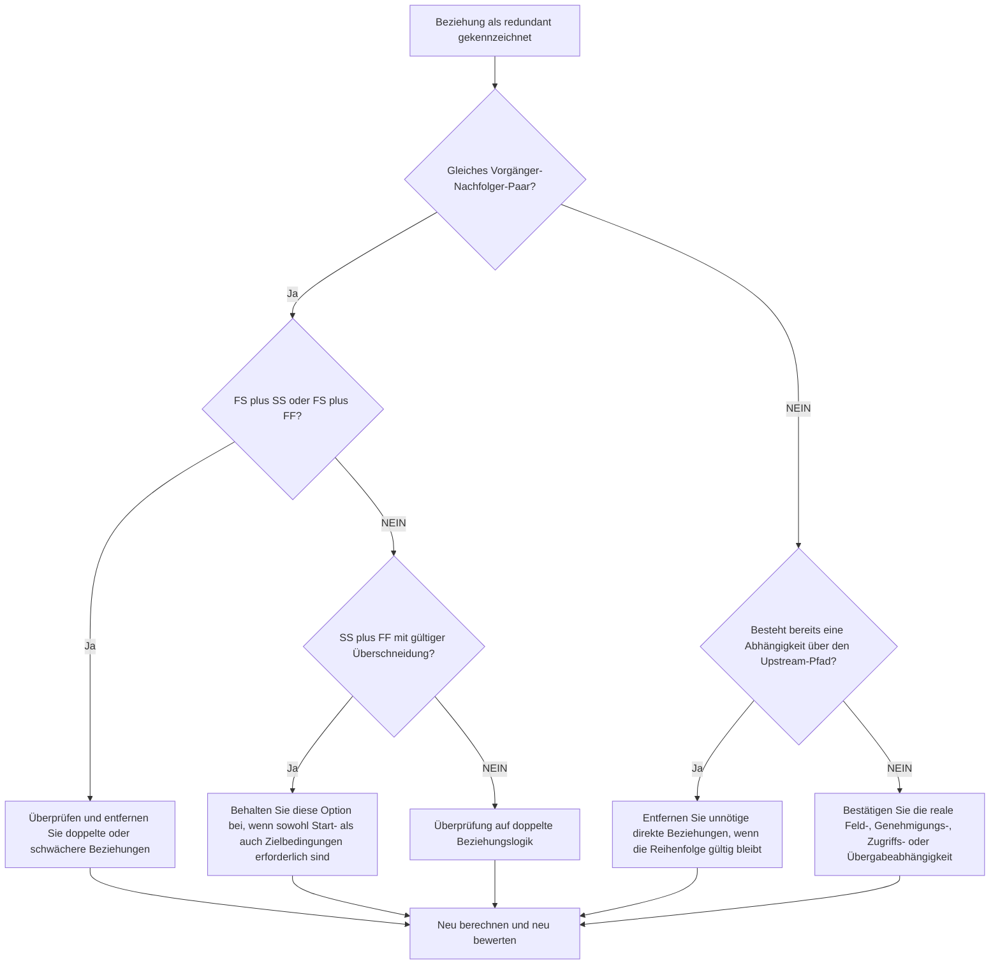

# Redundante Logik in Primavera P6-Terminplänen - Verbesserungsleitfaden

## Zweck

Dieser Leitfaden hilft Planern dabei, redundante Logik aus einem Primavera P6-Terminplan zu identifizieren und zu entfernen. Dies gilt für doppelte Beziehungsmuster, wiederholte Vorgängerlogik und unnötige Abhängigkeiten, die keinen echten Arbeitsablauf darstellen.

## Bevor Sie beginnen

Sammeln Sie die folgenden Informationen, bevor Sie Maßnahmen ergreifen:

- Aktuelles Bewertungsergebnis für diese Metrik.
- Liste der Aktivitäten und Beziehungen, die als redundante Logik gekennzeichnet sind.
- Vorgänger- und Nachfolgerdetails für jede markierte Aktivität.
- Beziehungstypen, Verzögerungen, Kalender, Gesamtpuffer und steuernde Beziehungsindikatoren.
- WBS, Aktivitätscodes und Disziplin- oder Arbeitspaketeigentum.
- Feld-, Technik-, Beschaffungs-, Genehmigungs- oder Übergabeinformationen, die die tatsächliche Abhängigkeit erläutern.

## Verstehen Sie Ihr Ergebnis

Ein starkes Ergebnis sind keine ungelösten redundanten Beziehungen.

Ein akzeptables Ergebnis kann seltene dokumentierte Ausnahmen umfassen, bei denen aus einem vertretbaren Grund absichtlich eine doppelt aussehende Logik verwendet wird. Diese Fälle sollten sorgfältig geprüft werden, da redundante Logik normalerweise ein Problem mit der Qualität des Terminplans darstellt.

Ein schwaches Ergebnis bedeutet, dass der Terminplan wiederholte oder unnötige Beziehungslogik enthält. Dies kann passieren, wenn kopierte Terminplanabschnitte nicht bereinigt werden, Beziehungen ohne Überprüfung vorhandener Pfade hinzugefügt werden oder mehrere Abhängigkeitstypen zwischen denselben Aktivitäten verwendet werden.

## Verbesserungsziel

Das Ziel sind 0 ungelöste redundante Beziehungen.

Das Ziel besteht darin, nur die Beziehungen beizubehalten, die echte Abhängigkeiten darstellen, und Logik zu entfernen, die den tatsächlichen Arbeitsablauf dupliziert, maskiert oder überbewertet.

## Aktionsplan

### Schritt 1: Identifizieren Sie das Hauptproblem

Erstellen Sie ein P6-Layout, einen Bericht oder eine externe Beziehungsüberprüfung, die wahrscheinlich redundante Logik identifiziert. Konzentrieren Sie sich auf diese Fälle:

- Derselbe Vorgänger wurde mehr als einmal mit demselben Nachfolger verbunden, insbesondere FS plus SS oder FS plus FF.
- SS plus FF zwischen denselben beiden Aktivitäten können gültig sein, wenn die Überlappung korrekt modelliert wird und sowohl Start- als auch Endbedingungen wichtig sind.
- Eine Aktivität mit demselben Vorgänger und demselben Beziehungstyp wie ihr eigener Vorgänger, wodurch eine wiederholte vererbte Logik in der Kette entsteht.
- Längere wiederholte Vorgängerketten, bei denen dieselbe Abhängigkeit mehrere Schritte zurück auftritt.
- Abhängigkeiten, die Reihenfolge, Termine, Umlauf, Übergabe, Zugriff oder Risikokontrolle nicht ändern.

Überprüfen Sie jede gemeldete Beziehung und fragen Sie:

- Fügt diese Beziehung eine echte Abhängigkeit hinzu?
- Wird die Abhängigkeit bereits durch eine andere Beziehung zwischen denselben Aktivitäten repräsentiert?
- Wird die Abhängigkeit bereits durch einen Upstream-Pfad dargestellt?
- Würde das Entfernen der Beziehung die gültige Terminplanlogik ändern oder nur das Netzwerk vereinfachen?
- Hat die Beziehung einen legitimen Grund, Daten zu beeinflussen, oder nur, weil überflüssige Logik hinzugefügt wurde?

### Schritt 2: Wenden Sie die empfohlenen Fixes an

Beginnen Sie mit exakten Duplikaten und wiederholten Vorgänger-Nachfolger-Paaren. Wenn dieselben zwei Aktivitäten mit FS plus SS oder FS plus FF verbunden sind, ermitteln Sie, welche Beziehung die tatsächliche Abhängigkeit darstellt. Entfernen Sie die Beziehung, die die Logik dupliziert oder schwächt.

Sehen Sie sich die SS- und FF-Paare separat an. Diese Kombination kann gültig sein, wenn eine Beziehung steuert, wann überlappende Arbeiten beginnen können, und die andere steuert, wann sie enden kann. Bewahren Sie es nur dann auf, wenn beide Bedingungen real sind und durch den Arbeitsablauf dokumentiert sind.

Überprüfen Sie als Nächstes die geerbte Vorgängerlogik. Wenn Aktivität C dieselbe Vorgängerbeziehung wie Aktivität B hat und Aktivität B bereits ein Vorgänger von Aktivität C ist, ist die direkte Beziehung der früheren Aktivität möglicherweise nicht erforderlich. Entfernen Sie es, wenn die CPM-Sequenz über den vorhandenen Pfad korrekt bleibt.

Entfernen Sie abschließend unnötige Abhängigkeiten, die Arbeitsabläufe, Zugriff, Genehmigung, Übergabe, Risikokontrolle oder Vertragslogik nicht unterstützen.

### Schritt 3: Häufige Blocker entfernen

Zu den häufigsten Blockaden gehören kopierte Logik aus älteren Terminplänen, Übermodellierung, um das Netzwerk verbunden aussehen zu lassen, und das Hinzufügen von Beziehungen bei Aktualisierungen, ohne den vorhandenen Pfad zu überprüfen.

Ein weiteres Hindernis ist die Angst, dass das Entfernen von Beziehungen den Terminplan schwächen würde. Das Ziel besteht nicht darin, gültige Kontrollen zu entfernen; Es geht darum, Beziehungen zu entfernen, die bereits im Netzwerk vorhandene Steuerelemente duplizieren.

### Schritt 4: Validieren Sie die Änderungen

Berechnen Sie den Terminplan neu, nachdem Sie redundante Logik entfernt oder angepasst haben. Überprüfen Sie den gesamten Puffer, die treibenden Beziehungen, den längsten Pfad, den kritischen Pfad und wichtige Meilensteindaten.

Wenn sich durch das Entfernen einer Beziehung die Daten unerwartet ändern, prüfen Sie, ob der entfernte Link tatsächlich eine gültige Abhängigkeit bediente oder ob eine weitere fehlende Beziehung genauer hinzugefügt werden muss.

## Verbesserungsplan

### Tag 1: Überprüfung und Diagnose

Führen Sie die Metrik aus, bestätigen Sie die betroffene Beziehungsliste und unterteilen Sie die Ergebnisse in Duplikatpaare, FS plus SS/FF-Kombinationen, geerbte Vorgängerlogik und unnötige Abhängigkeiten.

### Tage 2–3: Implementieren Sie vorrangige Maßnahmen

Korrigieren Sie zunächst kritische und nahezu kritische Beziehungen. Entfernen Sie exakte Duplikate, bereinigen Sie wiederholte Vorgängerpaare und dokumentieren Sie gültige SS- und FF-Kombinationen.

### Tage 4–5: Überwachen Sie die ersten Ergebnisse

Berechnen Sie den Terminplan neu und überprüfen Sie die Bewegung in Puffer, längstem Weg, Fahrbeziehungen und Meilensteindaten.

### Tag 6: Letzte Anpassungen

Klären Sie unsichere Probleme mit der zuständigen Disziplin, dem Paketeigentümer oder dem Bauleiter.

### Tag 7: Neubewertung und Vergleich

Führen Sie die Bewertung erneut durch und vergleichen Sie das Ergebnis mit dem Zielschwellenwert.

## Fortschritt verfolgen

Verwenden Sie einen einfachen Tracker, um Korrekturen und Genehmigungen zu verwalten.

| Datum | Maßnahmen ergriffen | Erwartete Auswirkungen | Ergebnis / Beobachtung | Nächster Schritt |
| --- | --- | --- | --- | --- |
| [Datum] | Überprüfte Liste redundanter Beziehungen | Identifizieren Sie doppelte oder unnötige Logik | [Beobachtetes Ergebnis] | Korrekturen zuordnen |
| [Datum] | Doppelte Beziehungen entfernt | Vereinfachen Sie das CPM-Netzwerk | [Beobachtetes Ergebnis] | Terminplan neu berechnen |
| [Datum] | Dokumentierte gültige Ausnahmen | Verbessern Sie die Rückverfolgbarkeit von Bewertungen | [Beobachtetes Ergebnis] | Metrik neu bewerten |

## Wenn sich die Ergebnisse nicht verbessern

Wenn sich die Ergebnisse nicht verbessern, prüfen Sie, ob die redundante Logik in einem bestimmten PSP-Bereich, einem kopierten Projektabschnitt, einer Disziplin oder einem Terminplanaktualisierungszeitraum konzentriert ist. Wiederholte Feststellungen können darauf hindeuten, dass die Bereinigung von Beziehungen nicht Teil des normalen Planungsworkflows ist.

Eskalieren Sie ungelöste redundante Logik, wenn sie kritische, nahezu kritische, vertragliche, zugriffs-, genehmigungs- oder übergabebezogene Arbeiten betrifft.

## Wartung

Überprüfen Sie diese Metrik bei jeder Terminplanaktualisierung und vor der Basisgenehmigung. Achten Sie besonders auf die Entwicklung kopierter Terminpläne, Neusequenzierungen, Wiederherstellungsplanungen oder umfangreiche Logikrevisionen.

## Zusammenfassende Checkliste

- [ ] Aktuelles Ergebnis überprüft
- [ ] Zielschwelle bestätigt
- [ ] Hauptproblem identifiziert
- [ ] Doppelte Vorgänger-Nachfolger-Paare überprüft
- [ ] FS plus SS oder FS plus FF-Kombinationen korrigiert
- [ ] Gültige SS- und FF-Kombinationen dokumentiert
- [ ] Geerbte Vorgängerlogik überprüft
- [ ] Unnötige Abhängigkeiten entfernt
- [ ] Terminplan neu berechnet
- [ ] Ergebnisse überwacht
- [ ] Beurteilung wiederholt
- [ ] Nächste Schritte dokumentiert
## Verwandte Inhalte
- [Redundante Logik in Primavera P6-Terminplänen - Überblick](01_overview_template.md)
- [Blog-Vorlage](03_blog_template.md)
- [Was für ein Terminplan ist](../../09b_blogs_de/01_WHAT%20A%20SCHEDULE%20IS/01_blog.md)
- [Robuste Logik](../../09b_blogs_de/02_ROBUST%20LOGIC/02_ROBUST%20LOGIC.md)
