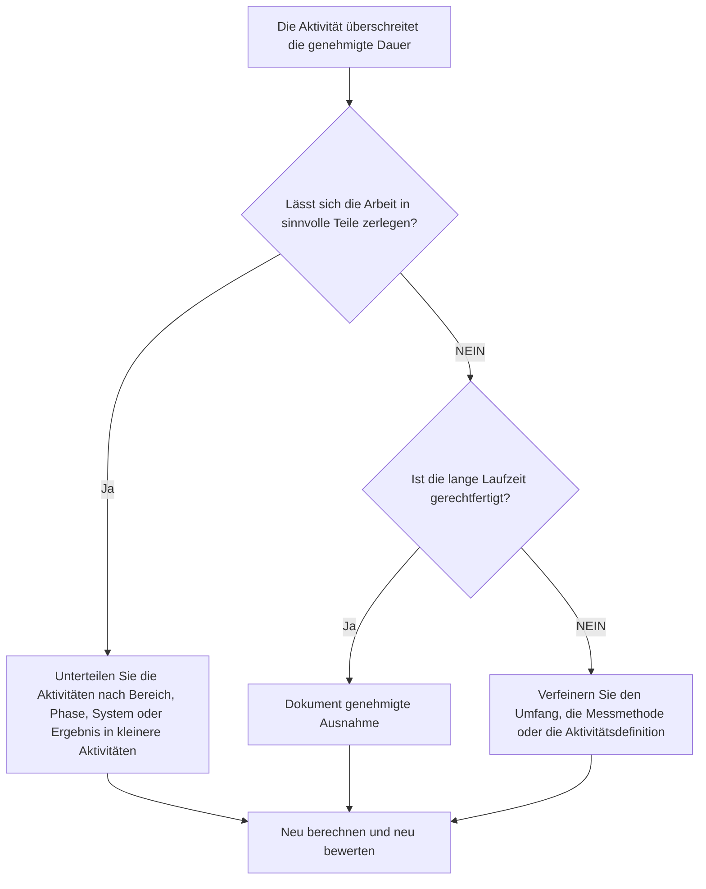

# Lange Aufgabendauer in Primavera P6-Terminplanbewertungen - Verbesserungsleitfaden

## Zweck

Dieser Leitfaden hilft Planern, Aktivitäten zu überprüfen und zu verbessern, deren Dauer den genehmigten Projektschwellenwert überschreitet. Die akzeptable Dauer hängt von der Projektart, dem Detaillierungsgrad, dem Berichtszyklus, den Vertragsanforderungen und der Sensibilität des Kunden gegenüber langen Aktivitäten ab.

## Bevor Sie beginnen

Sammeln Sie die folgenden Informationen, bevor Sie Maßnahmen ergreifen:

- Aktuelles Bewertungsergebnis für diese Metrik.
- Genehmigte maximale Aktivitätsdauer für die Projekt- oder Terminplanebene.
- Liste der Aktivitäten oberhalb des Dauerschwellenwerts.
- Ursprüngliche Dauer, verbleibende Dauer, Aktivitätstyp, Status, WBS, Kalender und Gesamtpuffer.
- Grundlegende Anforderungen, Erwartungen an die Kundenberichterstattung und Qualitätsregeln für den PMO-Terminplan.
- Vorausschauender Planungszeitraum, Fortschrittsaktualisierungszyklus und Disziplin oder Paketeigentum.
- Alle gerechtfertigten Ausnahmen, wie z. B. Beschaffung, Aushärtung, Lieferung, Überprüfung, Tests oder Aktivitäten nach Maßgabe des Aufwands.

## Verstehen Sie Ihr Ergebnis

Ein starkes Ergebnis sind null ungelöste Aktivitäten oberhalb des genehmigten Langzeitschwellenwerts.

Ein akzeptables Ergebnis kann dokumentierte Ausnahmen umfassen, insbesondere für Aktivitäten, die nicht sinnvoll aufgeschlüsselt werden können oder absichtlich als zusammenfassende Kontrollaktivitäten verwaltet werden. Diese sollten begrenzt und klar begründet sein.

Ein schwaches Ergebnis bedeutet, dass der Terminplan viele Aktivitäten enthält, die für eine effektive Planung und Kontrolle zu umfassend sind. Dies kann die Sichtbarkeit des Fortschritts beeinträchtigen und es schwieriger machen, zu verstehen, welche Arbeit tatsächlich den Terminplan bestimmt.

## Verbesserungsziel

Das Ziel sind 0 ungelöste Aktivitäten über der genehmigten Dauergrenze.

Das Ziel besteht darin, lange Aktivitäten in kleinere, sinnvolle Aktivitäten aufzuteilen, bei denen eine bessere Kontrolle erforderlich ist, und gleichzeitig gültige Ausnahmen zu dokumentieren, bei denen eine lange Dauer angemessen ist.

## Aktionsplan

### Schritt 1: Identifizieren Sie das Hauptproblem

Erstellen Sie ein P6-Layout oder einen Bericht, der Aktivitäten auflistet, die den im Projekt definierten Dauerschwellenwert überschreiten. Geben Sie Aktivitäts-ID, Aktivitätsname, WBS, Aktivitätstyp, ursprüngliche Dauer, verbleibende Dauer, Start, Ende, Kalender, Gesamtpuffer und Aktivitätsstatus an.

Überprüfen Sie jede Aktivität und fragen Sie:

- Ist die Aktivitätsdauer länger als der genehmigte Schwellenwert für diesen Projekttyp und diese Terminplanebene?
- Umfasst die Aktivität mehrere Arbeitsschritte, Standorte, Systeme, Bereiche oder Liefergegenstände?
- Kann der Fortschritt während jedes Aktualisierungszyklus objektiv gemessen werden?
- Benötigt die Aktivität detailliertere Angaben, weil der Kunde oder das PMO auf lange Zeiträume empfindlich reagiert?
- Handelt es sich bei der Aktivität um eine gültige Ausnahme, die lange bestehen bleiben sollte?

### Schritt 2: Wenden Sie die empfohlenen Fixes an

Teilen Sie lange Aktivitäten auf, sodass die Arbeit in kleinere Teile geplant und gemessen werden kann. Zu den gängigen Aufschlüsselungsmethoden gehören Standort, WBS-Bereich, Disziplin, System, Liefergegenstand, Phase, Teamreihenfolge oder Berichtszeitraum.

Behalten Sie beim Aufteilen einer Aktivität die tatsächliche logische Reihenfolge bei. Fügen Sie geeignete Vorgänger und Nachfolger hinzu, weisen Sie den richtigen Kalender zu und bestätigen Sie, dass die neuen Aktivitäten widerspiegeln, wie die Arbeit tatsächlich ausgeführt wird.

Teilen Sie Aktivitäten nicht nur auf, um die Metrik zu erfüllen. Die Aufschlüsselung soll die Kontrolle, die Fortschrittsmessung, die Vorausplanung oder die Klarheit der Berichterstattung verbessern.

### Schritt 3: Häufige Blocker entfernen

Zu den häufigsten Hindernissen zählen eine unvollständige Umfangsdefinition, eine schwache WBS-Struktur, begrenzte Feldeingaben und der Druck, die Aktivitätsanzahl niedrig zu halten. Beheben Sie diese Probleme, indem Sie langwierige Aktivitäten mit der verantwortlichen Disziplin, dem Paketeigentümer oder dem Bauleiter besprechen.

Ein weiterer Blocker ist die Verwendung einer langen Aktivität zur Darstellung von Arbeit, die als Sequenz geplant werden sollte. Wenn die Aktivität mehrere Übergaben, Arbeitsflächen, Leistungen oder Kontrollpunkte enthält, sind wahrscheinlich weitere Details erforderlich.

### Schritt 4: Validieren Sie die Änderungen

Berechnen Sie den Terminplan neu, nachdem Sie lange Aktivitäten aufgeteilt oder angepasst haben. Stellen Sie sicher, dass jede neue Aktivität über die entsprechende Logik, Dauer, Kalender und Fortschrittsmessung verfügt.

Überprüfen Sie den gesamten Puffer, den kritischen Pfad, den längsten Pfad und die Meilensteindaten. Wenn sich durch die Aufschlüsselung wichtige Daten ändern, teilen Sie den Grund dem Projektkontrollleiter oder dem PMO-Prüfer mit.

## Verbesserungsplan

### Tag 1: Überprüfung und Diagnose

Führen Sie die Metrik aus, bestätigen Sie den Dauerschwellenwert und unterteilen Sie Aktivitäten in Aufteilungskandidaten, gültige Ausnahmen und Elemente, die eine Eigentümereingabe erfordern.

### Tage 2–3: Implementieren Sie vorrangige Maßnahmen

Korrigieren Sie zuerst kritische, nahezu kritische und kundensensible Aktivitäten. Teilen Sie allgemeine Aktivitäten auf und dokumentieren Sie gültige Ausnahmen.

### Tage 4–5: Überwachen Sie die ersten Ergebnisse

Berechnen Sie den Terminplan neu und überprüfen Sie die Bewegung in Puffer, längstem Pfad, Meilensteindaten und Look-Ahead-Sichtbarkeit.

### Tag 6: Letzte Anpassungen

Klären Sie verbleibende unsichere Punkte mit der zuständigen Disziplin, dem Paketeigentümer oder dem Projektkontrollleiter.

### Tag 7: Neubewertung und Vergleich

Führen Sie die Bewertung erneut durch und vergleichen Sie das Ergebnis mit dem Zielschwellenwert.

## Fortschritt verfolgen

Verwenden Sie einen einfachen Tracker, um Korrekturen und Genehmigungen zu verwalten.

| Datum | Maßnahmen ergriffen | Erwartete Auswirkungen | Ergebnis / Beobachtung | Nächster Schritt |
| --- | --- | --- | --- | --- |
| [Datum] | Überprüfte Langzeitaktivitäten | Identifizieren Sie Aktivitäten, die aufgeschlüsselt werden müssen | [Beobachtetes Ergebnis] | Besitzer zuweisen |
| [Datum] | Teilen Sie die Tätigkeit in kleinere Arbeitsschritte auf | Verbessern Sie die Sichtbarkeit des Fortschritts | [Beobachtetes Ergebnis] | Terminplan neu berechnen |
| [Datum] | Dokumentierte gültige Ausnahme | Verbessern Sie die Rückverfolgbarkeit von Bewertungen | [Beobachtetes Ergebnis] | Metrik neu bewerten |

## Wenn sich die Ergebnisse nicht verbessern

Wenn sich die Ergebnisse nicht verbessern, prüfen Sie, ob der Dauerschwellenwert unklar ist, inkonsistent angewendet wird oder nicht mit der Terminplanebene übereinstimmt. Überprüfen Sie auch, ob sich lange Aktivitäten auf einen bestimmten WBS-Bereich, eine bestimmte Disziplin oder eine bestimmte Projektphase konzentrieren.

Eskalieren Sie ungelöste Langzeitaktivitäten, wenn sie kritische, nahezu kritische, vertragliche, Berichts- oder kundensensible Arbeiten betreffen.

## Wartung

Überprüfen Sie diese Kennzahl bei jeder Terminplanaktualisierung, Basisplan-Entwicklung und größeren Neusequenzierungsübungen. Aktualisieren Sie den Schwellenwert, wenn das Projekt in eine andere Phase oder Detailebene wechselt.

## Zusammenfassende Checkliste

- [ ] Aktuelles Ergebnis überprüft
- [ ] Zielschwelle bestätigt
- [ ] Hauptproblem identifiziert
- [ ] Lange Aktivitäten überprüft
- [ ] Gespaltene Kandidaten identifiziert
- [ ] Wo sinnvoll, werden die Aktivitäten aufgeschlüsselt
- [ ] Gültige Ausnahmen dokumentiert
- [ ] Terminplan neu berechnet
- [ ] Ergebnisse überwacht
- [ ] Beurteilung wiederholt
- [ ] Nächste Schritte dokumentiert
## Verwandte Inhalte
- [Lange Aufgabendauer in Primavera P6-Terminplanbewertungen - Überblick](01_overview_template.md)
- [Blog-Vorlage](03_blog_template.md)
- [Was für ein Terminplan ist](../../09b_blogs_de/01_WHAT%20A%20SCHEDULE%20IS/01_blog.md)
- [Robuste Logik](../../09b_blogs_de/02_ROBUST%20LOGIC/02_ROBUST%20LOGIC.md)
