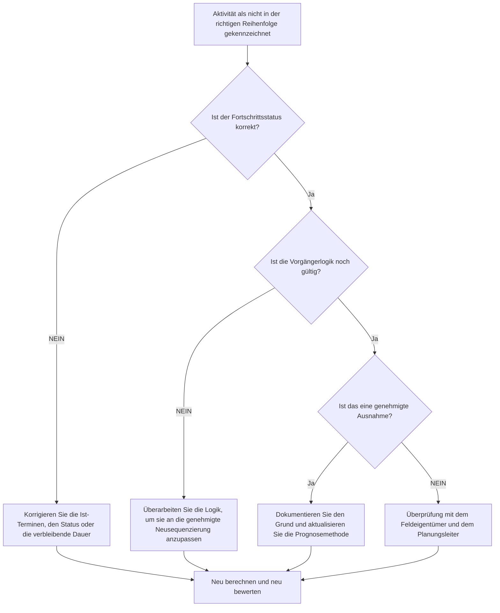

## Zweck

Dieser Leitfaden hilft Planern, Aktivitäten zu überprüfen und zu korrigieren, die in Primavera P6 nicht in der richtigen Reihenfolge sind. Dies gilt, wenn eine Aktivität gestartet oder fortgeschritten ist, bevor die erforderliche Vorgängerlogik erfüllt wurde.

## Bevor Sie beginnen

Sammeln Sie die folgenden Informationen, bevor Sie Maßnahmen ergreifen:

- Aktuelles Bewertungsergebnis für diese Metrik.
- Liste der Aktivitäten, die als nicht in der Reihenfolge gekennzeichnet sind.
- Datenstichtag, das im letzten Update verwendet wurde.
- Ist-Start, Ist-Ende, verbleibende Dauer und Aktivitätsstatus.
- Details zur Vorgänger- und Nachfolgerbeziehung, einschließlich Beziehungstyp und Verzögerung.
- Planen Sie Berechnungseinstellungen, insbesondere beibehaltene Logik und Fortschrittsüberschreibung.
- Felderklärung, warum die Arbeit voranschritt, bevor die geplante Logik abgeschlossen war.

## Verstehen Sie Ihr Ergebnis

Ein starkes Ergebnis sind keine ungelösten Aktivitäten außerhalb der Reihenfolge.

Ein akzeptables Ergebnis kann dokumentierte Ausnahmen umfassen, bei denen die Arbeit absichtlich neu angeordnet wurde und die Terminplanlogik aktualisiert wurde, um den neuen Plan widerzuspiegeln.

Ein schwaches Ergebnis bedeutet, dass die Terminplanaktualisierung einen Fortschritt enthält, der mit dem vorhandenen Logiknetzwerk in Konflikt steht. Dies kann auf einen falschen Status, fehlende Ist-Werte, veraltete Logik oder eine tatsächliche Neuordnung der Felder hinweisen, die noch nicht in der Prognose berücksichtigt wurde.

## Verbesserungsziel

Das Ziel sind 0 ungelöste Out-of-Sequence-Aktivitäten.

Das Ziel besteht darin, festzustellen, ob es sich bei jedem Element um einen Statusfehler, einen Logikfehler oder ein echtes Neusequenzierungsereignis handelt, und dann den Terminplan so zu korrigieren, dass er den aktuellen Plan darstellt.

## Aktionsplan

### Schritt 1: Identifizieren Sie das Hauptproblem

Erstellen Sie ein P6-Layout oder einen Bericht, in dem Aktivitäten außerhalb der Reihenfolge aufgeführt sind. Dazu gehören Aktivitäts-ID, Aktivitätsname, WBS, Status, Ist-Start, Ist-Ende, verbleibende Dauer, Start, Ende, Gesamtpuffer, Vorgänger, Nachfolger, Beziehungstyp, Verzögerung und steuernde Beziehungsindikatoren.

Überprüfen Sie jede Aktivität und fragen Sie:

- Hat die Aktivität tatsächlich begonnen, bevor die Vorgängeranforderung erfüllt war?
- Stimmt der Vorgängerstand?
- Ist der Nachfolgestatus korrekt?
- Ist die Beziehung nach der Neusequenzierung der Felder noch gültig?
- Sollte die Terminplanlogik geändert oder die Fortschrittsaktualisierung korrigiert werden?
- Welche P6-Planungsoption wird verwendet: beibehaltene Logik oder Fortschrittsüberschreibung?

### Schritt 2: Wenden Sie die empfohlenen Fixes an

Beheben Sie zunächst Statusfehler. Wenn ein Ist-Start, ein Ist-Ende, eine verbleibende Dauer oder ein Vorgängerstatus falsch sind, aktualisieren Sie die Aktivitätsdaten, bevor Sie die Logik ändern.

Wenn sich die Feldreihenfolge geändert hat, überarbeiten Sie die Logik, um den genehmigten aktuellen Plan darzustellen. Entfernen Sie nicht einfach Vorgängerbeziehungen, um die Metrik zu löschen. Ersetzen Sie veraltete Logik durch Beziehungen, die der tatsächlichen Ausführungssequenz entsprechen.

Überprüfen Sie die beibehaltenen Logik- und Fortschrittsüberschreibungseinstellungen. Die beibehaltene Logik behält im Allgemeinen die ursprüngliche Vorgängerlogik für die verbleibende Arbeit bei, während die Fortschrittsüberschreibung es ermöglichen kann, die verbleibende Arbeit trotz unvollständiger Vorgängerlogik fortzusetzen. Die Einstellung sollte mit dem Projektkontrollverfahren übereinstimmen und verstanden werden, bevor das Ergebnis gemeldet wird.

### Schritt 3: Häufige Blocker entfernen

Zu den häufigsten Hindernissen zählen verspätete Feldaktualisierungen, unvollständige Ist-Daten, der Druck, Fortschritte ohne Logikprüfung zu akzeptieren, und Verwirrung über die Optionen zur Terminplanberechnung.

Ein weiterer Blocker besteht darin, den Fortschritt außerhalb der Reihenfolge nur als Softwareproblem zu betrachten. Die eigentliche Frage ist, ob das Projekt die Reihenfolge der Arbeiten geändert hat und ob der Terminplan jetzt diese genehmigte Reihenfolge widerspiegelt.

### Schritt 4: Validieren Sie die Änderungen

Berechnen Sie den Terminplan nach Korrekturen neu. Führen Sie die Außer-Reihenfolge-Prüfung erneut durch und bestätigen Sie, dass jedes verbleibende Element korrigiert, begründet oder zur Nachverfolgung zugewiesen wurde.

Überprüfen Sie den Gesamtbestand, den längsten Pfad, den kritischen Pfad und die kurzfristigen Meilensteine. Korrekturen außerhalb der Reihenfolge können Prognosedaten ändern. Teilen Sie daher sinnvolle Auswirkungen dem Projektkontrollleiter oder dem PMO-Prüfer mit.

## Verbesserungsplan

### Tag 1: Überprüfung und Diagnose

Führen Sie die Metrik aus, bestätigen Sie der Datenstichtag und unterteilen Sie die Ergebnisse in Statusfehler, Logikfehler, tatsächliche Neusequenzierung und mögliche Ausnahmen.

### Tage 2–3: Implementieren Sie vorrangige Maßnahmen

Korrigieren Sie zuerst kritische, nahezu kritische und vorausschauende Aktivitäten. Aktualisieren Sie den Status, überarbeiten Sie veraltete Logik und dokumentieren Sie genehmigte Neusequenzierungen.

### Tage 4–5: Überwachen Sie die ersten Ergebnisse

Berechnen Sie den Terminplan neu und überprüfen Sie die Bewegung in Pufferzeit, längstem Pfad, kritischem Pfad und Meilensteindaten.

### Tag 6: Letzte Anpassungen

Lösen Sie verbleibende Probleme mit Außendienstleitern, Disziplinverantwortlichen oder dem Planungsmanager.

### Tag 7: Neubewertung und Vergleich

Führen Sie die Bewertung erneut durch und vergleichen Sie das Ergebnis mit dem Zielschwellenwert.

## Fortschritt verfolgen

Verwenden Sie einen einfachen Tracker, um Korrekturen und Genehmigungen zu verwalten.

| Datum | Maßnahmen ergriffen | Erwartete Auswirkungen | Ergebnis / Beobachtung | Nächster Schritt |
| --- | --- | --- | --- | --- |
| [Datum] | Überprüfte Aktivitäten außerhalb der Reihenfolge | Identifizieren Sie Status- oder Logikprobleme | [Beobachtetes Ergebnis] | Besitzer zuweisen |
| [Datum] | Korrigierter Status oder Ist-Termine | Verbessern Sie die Aktualisierungsgenauigkeit | [Beobachtetes Ergebnis] | Terminplan neu berechnen |
| [Datum] | Überarbeitete Logik für genehmigte Neusequenzierung | Verbessern Sie die Prognosesicherheit | [Beobachtetes Ergebnis] | Metrik neu bewerten |

## Wenn sich die Ergebnisse nicht verbessern

Wenn sich die Ergebnisse nicht verbessern, prüfen Sie, ob dieselben Arbeitsbereiche wiederholt in der falschen Reihenfolge ausgeführt werden. Dies kann auf eine schwache Update-Disziplin, unrealistische Logik, unvollständige Feldkoordination oder häufige nicht genehmigte Neusequenzierung hinweisen.

Eskalieren Sie ungelöste Probleme, wenn sie kritische, nahezu kritische, vertragliche, Zugangs-, Übergabe- oder kundensensible Arbeiten betreffen.

## Wartung

Überprüfen Sie diese Metrik bei jedem Aktualisierungszyklus, bevor Sie den Terminplan herausgeben. Bestätigen Sie, dass der Fortschritt außerhalb der Reihenfolge behoben ist, bevor Terminplanberichte für PMO-Berichte, Verzögerungsanalysen oder Wiederherstellungsplanung verwendet werden.

## Zusammenfassende Checkliste

- [ ] Aktuelles Ergebnis überprüft
- [ ] Zielschwelle bestätigt
- [ ] Datenstichtag bestätigt
- [ ] Hauptproblem identifiziert
- [ ] Statusfehler korrigiert
- [ ] Logikfehler korrigiert
- [ ] Genehmigte Neusequenzierung dokumentiert
- [ ] Terminplanberechnungseinstellung überprüft
- [ ] Terminplan neu berechnet
- [ ] Ergebnisse überwacht
- [ ] Beurteilung wiederholt
- [ ] Nächste Schritte dokumentiert
## Verwandte Inhalte
- [Blog-Vorlage](03_blog_template.md)
- [Was für ein Terminplan ist](../../09b_blogs_de/01_WHAT%20A%20SCHEDULE%20IS/01_blog.md)
- [Robuste Logik](../../09b_blogs_de/02_ROBUST%20LOGIC/02_ROBUST%20LOGIC.md)
