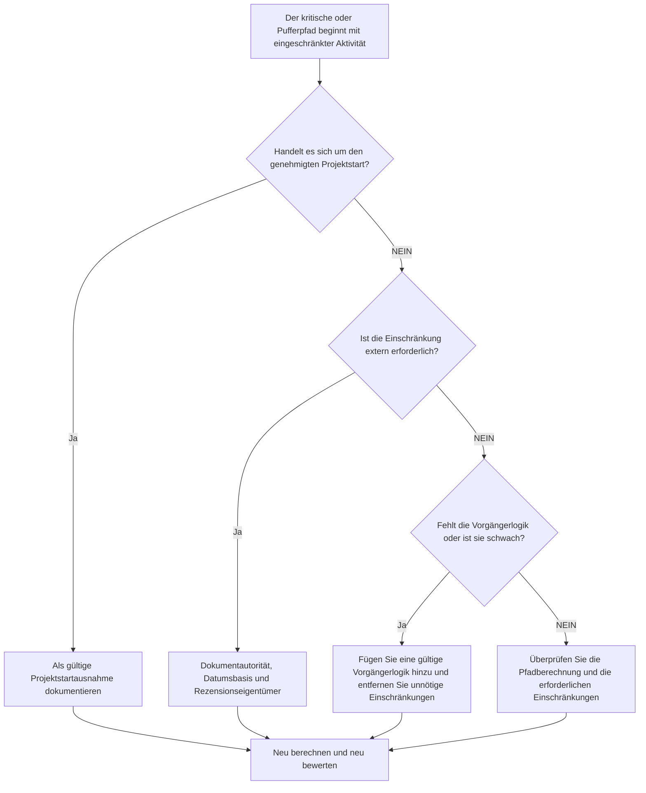

# Kritischer Pfad oder Pufferpfad, beginnend mit einer Einschränkung - Verbesserungsleitfaden

## Zweck

Dieser Leitfaden hilft Planern dabei, kritische Pfad- oder Puffering-Pfad-Ketten zu überprüfen, die mit einer eingeschränkten Aktivität beginnen. Der genehmigte Projektstart stellt in der Regel eine gültige Ausnahme dar; Das Problem besteht darin, dass ein Downstream-Pfad mit einer Einschränkung und nicht mit einer logischen Reihenfolge beginnt.

## Bevor Sie beginnen

Sammeln Sie die folgenden Informationen, bevor Sie Maßnahmen ergreifen:

- Aktuelles Bewertungsergebnis für diese Metrik.
- Kritischer Pfad- oder Pufferpfad-Bericht von Primavera P6.
- Erste Aktivität auf jedem markierten Pfad.
- Einschränkungstyp, Einschränkungsdatum und alle erwarteten Daten.
- Vorgänger- und Nachfolgerbeziehungen für die Pfadstartaktivität.
- Datenstichtag, Projektstartmeilenstein, Grundanforderungen und PMO- oder Kundenplanungsregeln.
- Erläuterung für alle genehmigten externen Einschränkungen.

## Verstehen Sie Ihr Ergebnis

Ein starkes Ergebnis sind null ungelöste kritische oder schwebende Pfade, die mit einer Einschränkung beginnen, mit Ausnahme des genehmigten Projektstarts.

Ein akzeptables Ergebnis kann dokumentierte externe Einschränkungen umfassen, wie z. B. eine Aufforderung zum Fortfahren, die Freigabe des Eigentümerzugriffs, die Freigabe der Genehmigung oder vertragliche Haltepunkte. Diese sollten klar begründet werden.

Ein schwaches Ergebnis bedeutet, dass der Pfad möglicherweise durch vorgegebene Daten statt durch Netzwerklogik gesteuert wird. Dies kann dazu führen, dass der kritische Pfad oder Pufferpfad weniger zuverlässig für Prognosen, Berichte und Verzögerungsanalysen ist.

## Verbesserungsziel

Das Ziel sind 0 unaufgelöste Pfade, beginnend mit einer Einschränkung.

Das Ziel besteht darin, zu bestätigen, ob der Pfad vom genehmigten Projektstart, von der gültigen Vorgängerlogik oder von einer dokumentierten externen Einschränkung ausgehen soll.

## Aktionsplan

### Schritt 1: Identifizieren Sie das Hauptproblem

Erstellen Sie ein P6-Layout oder einen Bericht, der den kritischen Pfad und ausgewählte Pufferpfade anzeigt. Geben Sie für die erste Aktivität auf jedem Pfad die Aktivitäts-ID, den Aktivitätsnamen, den PSP, den Start, das Ende, die Gesamtpuffer, die freier Puffer, die primäre Einschränkung, das Einschränkungsdatum, Vorgänger, Nachfolger und den Aktivitätsstatus an.

Überprüfen Sie jeden markierten Pfad und fragen Sie:

- Handelt es sich hierbei um den genehmigten Projektstart oder um eine Mitteilung zur Fortsetzung?
- Ist die Einschränkung vertraglich oder extern erforderlich?
- Fehlt der Aktivität die Vorgängerlogik?
- Verschleiert die Einschränkung ein schwaches oder unvollständiges Fahrplannetzwerk?
- Würde der Pfad anders beginnen, wenn die Einschränkung entfernt würde?
- Wird der eingeschränkte Start für die PMO- oder Kundenprüfung dokumentiert?

### Schritt 2: Wenden Sie die empfohlenen Fixes an

Wenn es sich bei der eingeschränkten Aktivität um den genehmigten Projektstart handelt, dokumentieren Sie sie als gültige Ausnahme und bestätigen Sie, dass es sich um den vorgesehenen Startpunkt für den Pfad handelt.

Wenn die Einschränkung extern erforderlich ist, behalten Sie sie nur bei, wenn der Grund klar ist. Dokumentieren Sie die Quelle, z. B. einen Vertragsmeilenstein, eine Zugangsfreigabe, eine Genehmigung, eine Eigentümeranweisung oder eine behördliche Anforderung.

Wenn die Einschränkung nicht erforderlich ist, entfernen Sie sie und fügen Sie eine gültige Vorgängerlogik hinzu, bei der die Aktivität von früheren Arbeiten, Genehmigungen, Übergaben, Beschaffung oder Zugriff abhängt. Berechnen Sie den Terminplan neu und bestätigen Sie, dass der Pfad jetzt logikgesteuert ist.

### Schritt 3: Häufige Blocker entfernen

Zu den häufigsten Blockern gehören geerbte Einschränkungen aus alten Basisplans, Einschränkungen zum Erzwingen von Datumsangaben, fehlende Schnittstellenlogik und unklare Eigentümerschaft externer Datumsangaben.

Ein weiterer Blockierer geht davon aus, dass ein kritischer Pfad einfach deshalb zuverlässig ist, weil P6 ihn identifiziert. Wenn der Pfad mit einer unnötigen Einschränkung beginnt, spiegelt der Pfad möglicherweise eher die Datumssteuerung als die echte CPM-Logik wider.

### Schritt 4: Validieren Sie die Änderungen

Berechnen Sie den Terminplan neu, nachdem Sie Einschränkungen oder Logik geändert haben. Überprüfen Sie den kritischen Pfad, den längsten Pfad, ausgewählte Pufferpfade, den gesamten Puffer und wichtige Meilensteindaten.

Wenn sich der Pfad erheblich ändert, dokumentieren Sie den Grund und teilen Sie die Auswirkungen dem Projektkontrollleiter, dem PMO-Prüfer oder dem Kundenplaner mit.

## Verbesserungsplan

### Tag 1: Überprüfung und Diagnose

Führen Sie die Metrik aus, identifizieren Sie eingeschränkte Pfadstartaktivitäten und unterteilen Sie die Ergebnisse in Projektstartausnahmen, gültige externe Einschränkungen, fehlende Logik und unnötige Einschränkungen.

### Tage 2–3: Implementieren Sie vorrangige Maßnahmen

Korrigieren Sie zunächst kritische und kundensensible Pfade. Entfernen Sie unnötige Einschränkungen, fügen Sie fehlende Logik hinzu und dokumentieren Sie genehmigte Ausnahmen.

### Tage 4–5: Überwachen Sie die ersten Ergebnisse

Berechnen Sie den Terminplan neu und überprüfen Sie die Bewegung im kritischen Pfad, längsten Pfad, Pufferpfad und Meilensteinterminen.

### Tag 6: Letzte Anpassungen

Die Lösung des verbleibenden eingeschränkten Pfads beginnt beim verantwortlichen Eigentümer, Projektkontrollleiter oder Kundenprüfer.

### Tag 7: Neubewertung und Vergleich

Führen Sie die Bewertung erneut durch und vergleichen Sie das Ergebnis mit dem Zielschwellenwert.

## Fortschritt verfolgen

Verwenden Sie einen einfachen Tracker, um Korrekturen und Genehmigungen zu verwalten.

| Datum | Maßnahmen ergriffen | Erwartete Auswirkungen | Ergebnis / Beobachtung | Nächster Schritt |
| --- | --- | --- | --- | --- |
| [Datum] | Überprüft eingeschränkte Pfadstartaktivitäten | Identifizieren Sie datumsgesteuerte Pfadstarts | [Beobachtetes Ergebnis] | Besitzer zuweisen |
| [Datum] | Unnötige Einschränkungen entfernt | Stellen Sie den logikgesteuerten Pfad wieder her | [Beobachtetes Ergebnis] | Terminplan neu berechnen |
| [Datum] | Dokumentierte genehmigte Ausnahme | Verbessern Sie die Rückverfolgbarkeit von Bewertungen | [Beobachtetes Ergebnis] | Metrik neu bewerten |

## Wenn sich die Ergebnisse nicht verbessern

Wenn sich die Ergebnisse nicht verbessern, prüfen Sie, ob sich die Einschränkungen auf einen bestimmten PSP-Bereich, ein bestimmtes Schnittstellenpaket oder eine bestimmte Projektphase konzentrieren. Wiederholte Feststellungen können darauf hindeuten, dass der Terminplan eher durch vorgegebene Termine als durch vollständige Logik gesteuert wird.

Eskalieren Sie ungelöste eingeschränkte Pfade, wenn sie kritische, nahezu kritische, vertragliche, kundensensible, zugriffs- oder übergabebezogene Arbeiten betreffen.

## Wartung

Überprüfen Sie diese Kennzahl bei jeder Terminplanaktualisierung, Basisplan-Überprüfung und größeren Neusequenzierungsübungen. Seien Sie besonders aufmerksam nach der Wiederherstellungsplanung, nach Änderungen des Kundendatums oder nach Überarbeitungen der Benutzeroberfläche.

## Zusammenfassende Checkliste

- [ ] Aktuelles Ergebnis überprüft
- [ ] Zielschwelle bestätigt
- [ ] Kritischer oder schwebender Pfadbericht überprüft
- [ ] Ausnahmen beim Projektstart identifiziert
- [ ] Einschränkungsbasis überprüft
- [ ] Fehlende Logik korrigiert
- [ ] Unnötige Einschränkungen entfernt
- [ ] Genehmigte Ausnahmen dokumentiert
- [ ] Terminplan neu berechnet
- [ ] Ergebnisse überwacht
- [ ] Beurteilung wiederholt
- [ ] Nächste Schritte dokumentiert
## Verwandte Inhalte
- [Kritischer Pfad oder Pufferpfad, beginnend mit einer Einschränkung - Überblick](01_overview_template.md)
- [Blog-Vorlage](03_blog_template.md)
- [Was für ein Terminplan ist](../../09b_blogs_de/01_WHAT%20A%20SCHEDULE%20IS/01_blog.md)
- [Robuste Logik](../../09b_blogs_de/02_ROBUST%20LOGIC/02_ROBUST%20LOGIC.md)
