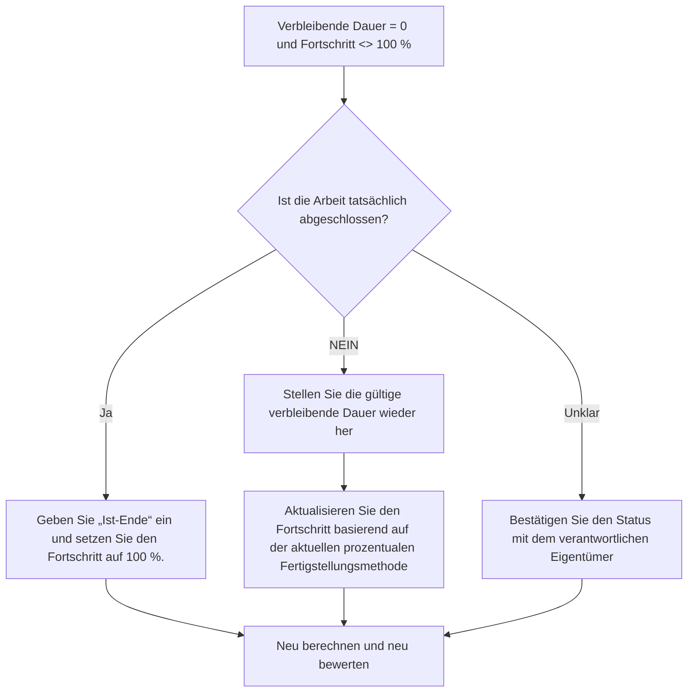

## Zweck

Dieser Leitfaden hilft Planern, Aktivitäten zu überprüfen und zu korrigieren, bei denen die verbleibende Dauer gleich 0 ist, der Fortschritt jedoch nicht 100 % beträgt. Es unterstützt sauberere Primavera P6-Statusaktualisierungen, indem es die verbleibende Dauer, den Fortschrittsprozentsatz, den tatsächlichen Abschluss und den Aktivitätsstatus anpasst.

## Bevor Sie beginnen

Sammeln Sie die folgenden Informationen, bevor Sie Maßnahmen ergreifen:

- Aktuelles Bewertungsergebnis für diese Metrik.
- Liste der Aktivitäten mit verbleibender Dauer = 0 und Fortschritt <> 100 %.
- Aktivitätsstatus, tatsächlicher Beginn, Ist-Ende, ursprüngliche Dauer, verbleibende Dauer und Dauer bei Abschluss.
- Typ „Prozent abgeschlossen“ und zugehörige Fortschrittsfelder.
- Physische Fertigstellung in Prozent, Dauer in Prozent abgeschlossen, Einheiten in Prozent abgeschlossen und Aktivität in Prozent abgeschlossen.
- Datenstichtag und aktuelle Fortschrittsaktualisierungsnotizen.
- Feldbestätigung, ob die Arbeit abgeschlossen ist oder noch Arbeit übrig ist.

## Verstehen Sie Ihr Ergebnis

Ein starkes Ergebnis sind null Aktivitäten mit einer verbleibenden Dauer = 0 und einem Fortschritt unter oder über 100 %.

Ein akzeptables Ergebnis kann seltene dokumentierte Fälle umfassen, in denen eine bestimmte Methode zur prozentualen Vollständigkeit zu einer vorübergehenden Differenz in der Berichterstellung führt. Diese sollten jedoch vor der formellen Berichterstattung behoben werden.

Ein schwaches Ergebnis bedeutet, dass der Terminplan Aktivitäten enthält, deren verbleibende Arbeit und Fortschrittsstatus nicht übereinstimmen. Dies kann zu ungenauen Berichten, Problemen mit dem Earned Value oder einem irreführenden Abschlussstatus führen.

## Verbesserungsziel

Das Ziel sind 0 ungelöste Aktivitäten mit einer verbleibenden Dauer = 0 und einem Fortschritt <> 100 %.

Das Ziel besteht darin, zu bestätigen, ob jede Aktivität abgeschlossen ist, ob der Fortschritt falsch aktualisiert wurde oder ob eine prozentuale Fertigstellungsmethode verwendet wird, die überprüft werden muss.

## Aktionsplan

### Schritt 1: Identifizieren Sie das Hauptproblem

Erstellen Sie ein P6-Layout oder einen Bericht, der nach Aktivitäten filtert, bei denen die verbleibende Dauer gleich 0 ist und der Fortschritt nicht 100 % beträgt. Dazu gehören Aktivitäts-ID, Aktivitätsname, WBS, Aktivitätsstatus, Ist-Start, Ist-Ende, ursprüngliche Dauer, verbleibende Dauer, Art des abgeschlossenen Prozentsatzes, physischer abgeschlossener Prozentsatz, abgeschlossener Prozentsatz der Dauer, abgeschlossener Einheiten-prozentualer Anteil und abgeschlossener Aktivitäts-Prozentsatz.

Überprüfen Sie jede Aktivität und fragen Sie:

- Ist die Arbeit tatsächlich abgeschlossen?
- Falls vollständig, fehlt das tatsächliche Ende?
- Wenn nicht vollständig, warum ist die verbleibende Dauer 0?
- Welcher prozentuale Typ wird verwendet?
- Kommt der Fortschrittswert vom physischen, Dauer- oder Einheitenfortschritt?
- Handelt es sich hierbei um einen Fehler bei der Statusaktualisierung oder um ein Problem bei der Fortschrittsberechnung?

### Schritt 2: Wenden Sie die empfohlenen Fixes an

Wenn die Arbeit abgeschlossen ist, aktualisieren Sie die Aktivität als abgeschlossen. Geben Sie das tatsächliche Ende ein, bestätigen Sie, dass die verbleibende Dauer 0 ist, und bestätigen Sie, dass der Fortschritt gemäß dem Projektaktualisierungsverfahren 100 % beträgt.

Wenn die Arbeit nicht abgeschlossen ist, stellen Sie eine angemessene verbleibende Dauer wieder her. Bestätigen Sie die verbleibende Arbeit mit dem verantwortlichen Eigentümer und aktualisieren Sie das relevante Fortschrittsfeld basierend auf dem Fertigstellungsgrad der Aktivität.

Wenn das Problem durch eine prozentuale Fertigstellungsmethode verursacht wird, prüfen Sie, ob für die Aktivität „Physischer Abschluss in Prozent“, „Dauer in Prozent“ oder „Einheiten in Prozent abgeschlossen“ verwendet werden soll. Ändern Sie den Typ „Prozent abgeschlossen“ nicht einfach so; Passen Sie es an das Projektkontrollverfahren an.

### Schritt 3: Häufige Blocker entfernen

Zu den häufigsten Hindernissen gehören unvollständige Feldaktualisierungen, fehlende tatsächliche Endtermine, Verwechslungen zwischen physischem Abschluss und Fertigstellungsgrad und Fortschritt, der ohne Validierung aus externen Systemen importiert wird.

Ein weiterer Blocker behandelt die verbleibende Dauer als Fortschrittsfeld. Die verbleibende Dauer sollte angeben, wie viel Zeit noch benötigt wird, um die Aktivität abzuschließen, und nicht nur die Menge der als erledigt gemeldeten Arbeit.

### Schritt 4: Validieren Sie die Änderungen

Berechnen Sie den Terminplan nach Korrekturen neu. Führen Sie die Metrik erneut aus und bestätigen Sie, dass jedes verbleibende Element korrigiert oder zur Nachverfolgung zugewiesen wurde.

Überprüfen Sie abgeschlossene Aktivitäten, tatsächliche Endtermine, Fortschrittsberichte, Earned Valueausgaben und Vorausschauberichte, um sicherzustellen, dass die Korrektur keine neuen Inkonsistenzen verursacht hat.

## Verbesserungsplan

### Tag 1: Überprüfung und Diagnose

Führen Sie die Metrik aus, bestätigen Sie der Datenstichtag und unterteilen Sie die Ergebnisse in den Status „Abgeschlossene Arbeit fehlt“, „Unvollendete Arbeit ohne verbleibende Dauer“ und „Prozent abgeschlossen“-Methodenprobleme.

### Tage 2–3: Implementieren Sie vorrangige Maßnahmen

Korrekte Aktivitäten, die zuerst in der Berichterstattung verwendet werden. Aktualisieren Sie das tatsächliche Ende, stellen Sie die verbleibende Dauer wieder her oder korrigieren Sie die Fortschrittswerte nach Bedarf.

### Tage 4–5: Überwachen Sie die ersten Ergebnisse

Berechnen Sie den Terminplan neu und überprüfen Sie Fortschrittsberichte, Listen abgeschlossener Aktivitäten und Ergebnisse des verdienten Werts.

### Tag 6: Letzte Anpassungen

Klären Sie verbleibende Unklarheiten mit dem zuständigen Disziplin-, Außendienst- oder Projektkontrollleiter.

### Tag 7: Neubewertung und Vergleich

Führen Sie die Bewertung erneut durch und vergleichen Sie das Ergebnis mit dem Zielschwellenwert.

## Fortschritt verfolgen

Verwenden Sie einen einfachen Tracker, um Korrekturen und Genehmigungen zu verwalten.

| Datum | Maßnahmen ergriffen | Erwartete Auswirkungen | Ergebnis / Beobachtung | Nächster Schritt |
| --- | --- | --- | --- | --- |
| [Datum] | Überprüfte RD 0 und Fortschritt nicht 100 Aktivitäten | Identifizieren Sie Statusinkonsistenzen | [Beobachtetes Ergebnis] | Besitzer zuweisen |
| [Datum] | Ist-Ende eingegeben und Fortschritt korrigiert | Status „Abgeschlossen“ ausrichten | [Beobachtetes Ergebnis] | Terminplan neu berechnen |
| [Datum] | Verbleibende Dauer wiederhergestellt | Korrigieren Sie den Status der unvollendeten Aktivität | [Beobachtetes Ergebnis] | Metrik neu bewerten |

## Wenn sich die Ergebnisse nicht verbessern

Wenn sich die Ergebnisse nicht verbessern, prüfen Sie, ob Fortschrittsaktualisierungen importiert, kopiert oder inkonsistent berechnet werden. Überprüfen Sie, ob verschiedene Teams unterschiedliche Methoden für den Fertigstellungsgrad verwenden oder ob im Aktualisierungsworkflow tatsächliche Endtermine fehlen.

Eskalieren Sie ungelöste Probleme, wenn sie kritische, nahezu kritische, verdiente Werte, Kundenberichte, Zahlungen oder übergabebezogene Arbeiten betreffen.

## Wartung

Überprüfen Sie diese Metrik bei jedem Aktualisierungszyklus, bevor Sie Berichte veröffentlichen. Es sollte neben den Ist-Terminen, der verbleibenden Dauer, dem Fertigstellungsgrad und den Aktivitätsstatusprüfungen Teil der standardmäßigen Update-Validierung sein.

## Zusammenfassende Checkliste

- [ ] Aktuelles Ergebnis überprüft
- [ ] Zielschwelle bestätigt
- [ ] Datenstichtag bestätigt
- [ ] Hauptproblem identifiziert
- [ ] Abgeschlossene Aktivitäten wurden korrekt aktualisiert
- [ ] Bei Bedarf werden tatsächliche Endtermine eingegeben
- [ ] Die verbleibende Dauer wird wiederhergestellt, wenn die Arbeit unvollständig ist
- [ ] Prozentsatz der Fertigstellung Typ überprüft
- [ ] Terminplan neu berechnet
- [ ] Ergebnisse überwacht
- [ ] Beurteilung wiederholt
- [ ] Nächste Schritte dokumentiert
## Verwandte Inhalte
- [Blog-Vorlage](03_blog_template.md)
- [Was für ein Terminplan ist](../../09b_blogs_de/01_WHAT%20A%20SCHEDULE%20IS/01_blog.md)
- [Robuste Logik](../../09b_blogs_de/02_ROBUST%20LOGIC/02_ROBUST%20LOGIC.md)
