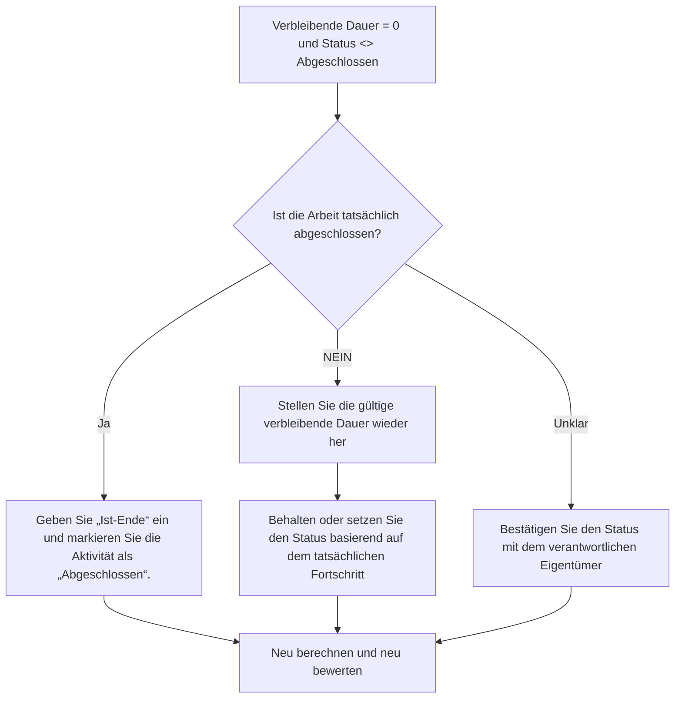

# Aktivitäten mit verbleibender Dauer 0 und Status nicht abgeschlossen - Verbesserungsleitfaden

## Zweck

Dieser Leitfaden hilft Planern, Aktivitäten zu überprüfen und zu korrigieren, bei denen die verbleibende Dauer gleich 0 ist, der Aktivitätsstatus jedoch nicht abgeschlossen ist. Es unterstützt saubere Primavera P6-Updates, indem es die verbleibende Dauer, das tatsächliche Ende und den Aktivitätsstatus anpasst.

## Bevor Sie beginnen

Sammeln Sie die folgenden Informationen, bevor Sie Maßnahmen ergreifen:

- Aktuelles Bewertungsergebnis für diese Metrik.
- Liste der Aktivitäten mit Restdauer = 0 und Aktivitätsstatus <> Abgeschlossen.
- Aktivitätsstatus, tatsächlicher Beginn, Ist-Ende, ursprüngliche Dauer, verbleibende Dauer und Dauer bei Abschluss.
- Typ „Prozent abgeschlossen“ und wichtige Fortschrittsfelder.
- Datenstichtag und neueste Aktualisierungshinweise.
- Feldbestätigung, ob die Arbeit abgeschlossen ist oder noch Arbeit übrig ist.

## Verstehen Sie Ihr Ergebnis

Ein starkes Ergebnis sind null Aktivitäten mit der verbleibenden Dauer = 0 und dem Status nicht abgeschlossen.

Ein akzeptables Ergebnis kann seltene vorübergehende Aktualisierungsfälle umfassen, diese sollten jedoch vor der formellen Berichterstattung gelöst werden.

Ein schwaches Ergebnis bedeutet, dass der Terminplan Aktivitäten enthält, deren verbleibende Zeit und Abschlussstatus nicht übereinstimmen. Dies kann zu irreführenden Fortschrittsberichten, unvollständiger Aktualisierung und unzuverlässigen Vorschau- oder Earned Valueergebnissen führen.

## Verbesserungsziel

Das Ziel sind 0 ungelöste Aktivitäten mit verbleibender Dauer = 0 und Aktivitätsstatus <> Abgeschlossen.

Das Ziel besteht darin, zu bestätigen, ob jede Aktivität abgeschlossen ist und geschlossen werden sollte oder ob sie unvollständig ist und die gültige Restdauer wiederhergestellt werden sollte.

## Aktionsplan

### Schritt 1: Identifizieren Sie das Hauptproblem

Erstellen Sie ein P6-Layout oder einen Bericht, der nach Aktivitäten filtert, bei denen die verbleibende Dauer gleich 0 ist und der Aktivitätsstatus nicht abgeschlossen ist. Dazu gehören Aktivitäts-ID, Aktivitätsname, PSP, Aktivitätsstatus, Ist-Start, Ist-Ende, ursprüngliche Dauer, verbleibende Dauer, Art des abgeschlossenen Prozentsatzes, abgeschlossener Prozentsatz der Aktivität, Start, Ende und Gesamtpuffer.

Überprüfen Sie jede Aktivität und fragen Sie:

- Ist die Arbeit tatsächlich abgeschlossen?
- Wenn abgeschlossen, warum ist der Aktivitätsstatus nicht abgeschlossen?
- Fehlt das tatsächliche Finish?
- Wenn die Arbeit nicht abgeschlossen ist, warum ist die verbleibende Dauer 0?
- Wurde der Status manuell importiert oder aktualisiert?
- Handelt es sich bei der Aktivität um einen Meilenstein, ein Leistungsniveau oder einen anderen speziellen Aktivitätstyp?

### Schritt 2: Wenden Sie die empfohlenen Fixes an

Wenn die Arbeit abgeschlossen ist, aktualisieren Sie die Aktivität als Abgeschlossen. Geben Sie das tatsächliche Ende ein, bestätigen Sie, dass die verbleibende Dauer 0 ist, und bestätigen Sie, dass die Fortschrittswerte mit dem Projektaktualisierungsverfahren übereinstimmen.

Wenn die Arbeit nicht abgeschlossen ist, stellen Sie eine angemessene verbleibende Dauer wieder her. Bestätigen Sie die verbleibenden Arbeiten mit dem verantwortlichen Eigentümer und behalten Sie den Aktivitätsstatus basierend auf dem tatsächlichen Fortschritt auf „In Bearbeitung“ oder „Nicht gestartet“ bei.

Wenn das Problem auf importierte Fortschrittsdaten zurückzuführen ist, überprüfen Sie den Importzuordnungs- und Aktualisierungsworkflow. Der Aktualisierungsprozess sollte keine Aktivitäten mit einer verbleibenden Zeit von Null, aber einem unvollständigen Status hinterlassen.

### Schritt 3: Häufige Blocker entfernen

Häufige Hindernisse sind fehlende tatsächliche Endtermine, unvollständige Feldbestätigungen, importierte Aktualisierungsdaten und Verwechslungen zwischen Dauerstatus und Aktivitätsstatus.

Ein weiterer Blocker ist das Schließen der verbleibenden Dauer, ohne die Aktivität offiziell abzuschließen. Die verbleibende Dauer und der Aktivitätsstatus sollten das gleiche Aufschluss darüber geben, ob Arbeit verbleibt.

### Schritt 4: Validieren Sie die Änderungen

Berechnen Sie den Terminplan nach Korrekturen neu. Führen Sie die Metrik erneut aus und bestätigen Sie, dass jedes verbleibende Element korrigiert oder zur Nachverfolgung zugewiesen wurde.

Überprüfen Sie abgeschlossene Aktivitätslisten, tatsächliche Endtermine, Fortschrittsberichte, Earned Valueausgaben und Vorausschauberichte, um sicherzustellen, dass die Korrektur keine neuen Inkonsistenzen verursacht hat.

## Verbesserungsplan

### Tag 1: Überprüfung und Diagnose

Führen Sie die Metrik aus, bestätigen Sie der Datenstichtag und unterteilen Sie die Ergebnisse in vollständige Arbeit ohne abgeschlossenen Status, unvollständige Arbeit ohne verbleibende Dauer und Import- oder Workflow-Probleme.

### Tage 2–3: Implementieren Sie vorrangige Maßnahmen

Korrekte Aktivitäten, die zuerst in der Berichterstattung verwendet werden. Geben Sie das tatsächliche Ende ein, markieren Sie Aktivitäten als abgeschlossen oder stellen Sie die verbleibende Dauer nach Bedarf wieder her.

### Tage 4–5: Überwachen Sie die ersten Ergebnisse

Berechnen Sie den Terminplan neu und überprüfen Sie abgeschlossene Aktivitätsberichte, Fortschrittsberichte und Earned Valueergebnisse.

### Tag 6: Letzte Anpassungen

Klären Sie verbleibende Unklarheiten mit dem zuständigen Disziplin-, Außendienst- oder Projektkontrollleiter.

### Tag 7: Neubewertung und Vergleich

Führen Sie die Bewertung erneut durch und vergleichen Sie das Ergebnis mit dem Zielschwellenwert.

## Fortschritt verfolgen

Verwenden Sie einen einfachen Tracker, um Korrekturen und Genehmigungen zu verwalten.

| Datum | Maßnahmen ergriffen | Erwartete Auswirkungen | Ergebnis / Beobachtung | Nächster Schritt |
| --- | --- | --- | --- | --- |
| [Datum] | Überprüfte RD 0 und Status nicht abgeschlossene Aktivitäten | Identifizieren Sie Statusinkonsistenzen | [Beobachtetes Ergebnis] | Besitzer zuweisen |
| [Datum] | Ist-Ende eingegeben und als „Abgeschlossen“ markiert | Status „Abgeschlossen“ ausrichten | [Beobachtetes Ergebnis] | Terminplan neu berechnen |
| [Datum] | Verbleibende Dauer wiederhergestellt | Korrigieren Sie den Status der unvollendeten Aktivität | [Beobachtetes Ergebnis] | Metrik neu bewerten |

## Wenn sich die Ergebnisse nicht verbessern

Wenn sich die Ergebnisse nicht verbessern, prüfen Sie, ob Fortschrittsaktualisierungen inkonsistent importiert, kopiert oder manuell bearbeitet werden. Überprüfen Sie, ob im Aktualisierungsworkflow tatsächliche Endtermine fehlen oder ob Benutzer die verbleibende Dauer auf 0 setzen, ohne Aktivitäten abzuschließen.

Eskalieren Sie ungelöste Probleme, wenn sie kritische, nahezu kritische, verdiente Werte, Kundenberichte, Zahlungen oder übergabebezogene Arbeiten betreffen.

## Wartung

Überprüfen Sie diese Metrik bei jedem Aktualisierungszyklus, bevor Sie Berichte veröffentlichen. Es sollte neben den Ist-Terminen, der verbleibenden Dauer, dem Fertigstellungsgrad und den Aktivitätsstatusprüfungen Teil der standardmäßigen Update-Validierung sein.

## Zusammenfassende Checkliste

- [ ] Aktuelles Ergebnis überprüft
- [ ] Zielschwelle bestätigt
- [ ] Datenstichtag bestätigt
- [ ] Hauptproblem identifiziert
- [ ] Abgeschlossene Aktivitäten korrekt markiert
- [ ] Bei Bedarf werden tatsächliche Endtermine eingegeben
- [ ] Die verbleibende Dauer wird wiederhergestellt, wenn die Arbeit unvollständig ist
- [ ] Import- oder Update-Workflow überprüft
- [ ] Terminplan neu berechnet
- [ ] Ergebnisse überwacht
- [ ] Beurteilung wiederholt
- [ ] Nächste Schritte dokumentiert
## Verwandte Inhalte
- [Aktivitäten mit verbleibender Dauer 0 und Status nicht abgeschlossen - Überblick](01_overview_template.md)
- [Blog-Vorlage](03_blog_template.md)
- [Was für ein Terminplan ist](../../09b_blogs_de/01_WHAT%20A%20SCHEDULE%20IS/01_blog.md)
- [Robuste Logik](../../09b_blogs_de/02_ROBUST%20LOGIC/02_ROBUST%20LOGIC.md)
