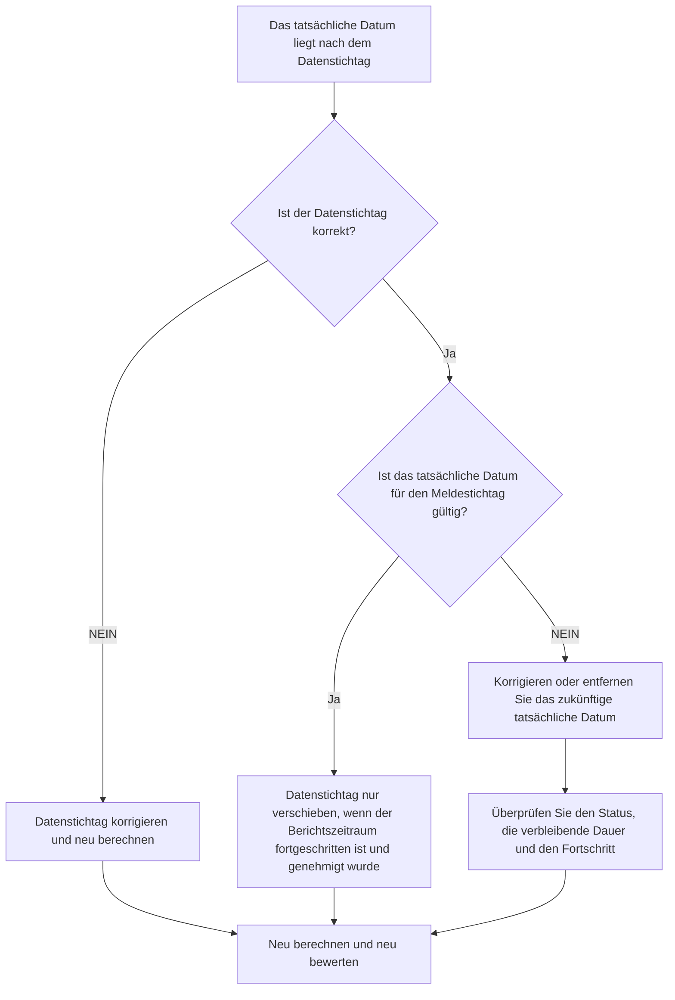

## Zweck

Dieser Leitfaden hilft Planern, Aktivitäten mit Ist-Terminen nach dem Primavera P6-Datenstichtag zu überprüfen und zu korrigieren. Es unterstützt eine saubere Update-Disziplin, indem es die tatsächliche Leistung auf oder vor der Update-Grenze hält.

## Bevor Sie beginnen

Sammeln Sie die folgenden Informationen, bevor Sie Maßnahmen ergreifen:

- Aktuelles Bewertungsergebnis für diese Metrik.
- Projektdatendatum, das in der letzten Terminplanaktualisierung verwendet wird.
- Liste der Aktivitäten mit Ist-Terminen, die über dem Datenstichtag liegen.
- Felder „Ist-Start“, „Ist-Ende“, „Aktivitätsstatus“, „Verbleibende Dauer“ und „Prozent abgeschlossen“.
- Quelle der Fortschrittsaktualisierung, z. B. Feldbericht, Importdatei, Stundenzettel oder manuelle Aktualisierung.
- Cut-Off-Regeln und Berichtszeitraum für Projektaktualisierungen.
- Alle bekannten in der Zukunft liegenden Arbeitseinträge oder Probleme beim Datenimport.

## Verstehen Sie Ihr Ergebnis

Ein starkes Ergebnis sind keine Aktivitäten mit Ist-Terminen, die nach dem Datenstichtag liegen.

Ein akzeptables Ergebnis sollte immer noch Null sein. Tatsächliche Daten nach dem Datenstichtag weisen normalerweise auf einen Aktualisierungsfehler oder ein falsches Datenstichtag hin.

Ein schwaches Ergebnis bedeutet, dass der Terminplan zukünftige Ist-Werte enthält. Dies kann dazu führen, dass der Terminplanbericht als abgeschlossen oder gestartet gilt, bevor der Aktualisierungszeitraum dieses Datum tatsächlich erreicht hat.

## Verbesserungsziel

Das Ziel sind 0 ungelöste Aktivitäten mit Ist-Terminen, die über dem Datenstichtag liegen.

Das Ziel besteht darin, zu bestätigen, ob das tatsächliche Datum falsch ist, der Datenstichtag falsch ist oder der Update-Importprozess zukünftige Ist-Werte zulässt.

## Aktionsplan

### Schritt 1: Identifizieren Sie das Hauptproblem

Erstellen Sie ein P6-Layout oder einen Bericht, der nach Aktivitäten filtert, deren Ist-Start, Ist-Ende oder andere Ist-Termine größer als der Datenstichtag sind. Geben Sie Aktivitäts-ID, Aktivitätsname, WBS, Aktivitätsstatus, tatsächlichen Start, Ist-Ende, Start, Ende, verbleibende Dauer, Fertigstellungsgrad, Kalender und Datenstichtagsreferenz an.

Überprüfen Sie jede Aktivität und fragen Sie:

- Ist das Projektdatendatum korrekt?
- Ist das tatsächliche Datum korrekt?
- Hat das Update Fortschritte über den Stichtag hinaus beinhaltet?
- Hat eine Importdatei zukünftige Ist-Termine geladen?
- Sollte das tatsächliche Datum geändert oder der Datenstichtag verschoben werden?
- Stimmt der Aktivitätsstatus mit dem korrigierten Ist-Datum überein?

### Schritt 2: Wenden Sie die empfohlenen Fixes an

Wenn der Datenstichtag falsch ist, korrigieren Sie es entsprechend dem genehmigten Berichtszeitraum und berechnen Sie den Terminplan neu.

Wenn das tatsächliche Datum falsch ist, korrigieren Sie den tatsächlichen Start oder das tatsächliche Ende auf das richtige Datum. Wenn die Arbeit bis zum Datenstichtag noch nicht begonnen oder abgeschlossen hat, entfernen Sie den zukünftigen Ist- und Aktualisierungsstatus, die verbleibende Dauer und den Fertigstellungsgrad korrekt.

Wenn das Problem auf einen Import zurückzuführen ist, überprüfen Sie die Importdatei und die Zuordnung. Bestätigen Sie, dass zukünftige tatsächliche Termine blockiert oder überprüft werden, bevor Terminplanberichte ausgegeben werden.

### Schritt 3: Häufige Blocker entfernen

Zu den häufigsten Hindernissen gehören Fortschrittsdateien, die Daten abdecken, die über den Berichtsstichtag hinausgehen, manuelle Aktualisierungen, die ohne Überprüfung des Datenstichtags eingegeben werden, und Verwechslungen zwischen tatsächlichen und prognostizierten Daten.

Ein weiteres Hindernis besteht darin, der Datenstichtag zu verschieben, nur um zukünftige Ist-Werte zu akzeptieren. Der Datenstichtag sollte die genehmigte Aktualisierungsgrenze darstellen und nicht leichtfertig geändert werden, um einen Statusfehler zu verbergen.

### Schritt 4: Validieren Sie die Änderungen

Berechnen Sie den Terminplan nach Korrekturen neu. Führen Sie die Metrik erneut aus und stellen Sie sicher, dass nach dem Datenstichtag keine Ist-Terminen mehr übrig sind.

Überprüfen Sie die Listen abgeschlossener Aktivitäten, Listen laufender Aktivitäten, Earned Valueausgaben und Terminplanvergleichsberichte, um sicherzustellen, dass die Korrektur keine weiteren Statusinkonsistenzen verursacht hat.

## Verbesserungsplan

### Tag 1: Überprüfung und Diagnose

Führen Sie die Metrik aus, bestätigen Sie der Datenstichtag und unterteilen Sie die Ergebnisse in falsche Ist-Termine, falsches Datenstichtag, Importprobleme und Aktualisierungsstichtagsprobleme.

### Tage 2–3: Implementieren Sie vorrangige Maßnahmen

Korrekte Aktivitäten, die zuerst in der Berichterstattung verwendet werden. Beheben Sie aktuelle Daten, aktualisieren Sie den Status und beheben Sie Importprobleme.

### Tage 4–5: Überwachen Sie die ersten Ergebnisse

Berechnen Sie den Terminplan neu und überprüfen Sie Fortschrittsberichte, Listen abgeschlossener Aktivitäten, Earned Valueergebnisse und Meilensteintermine.

### Tag 6: Letzte Anpassungen

Klären Sie verbleibende Unklarheiten mit dem zuständigen Disziplin-, Außendienst- oder Projektkontrollleiter.

### Tag 7: Neubewertung und Vergleich

Führen Sie die Bewertung erneut durch und vergleichen Sie das Ergebnis mit dem Zielschwellenwert.

## Fortschritt verfolgen

Verwenden Sie einen einfachen Tracker, um Korrekturen und Genehmigungen zu verwalten.

| Datum | Maßnahmen ergriffen | Erwartete Auswirkungen | Ergebnis / Beobachtung | Nächster Schritt |
| --- | --- | --- | --- | --- |
| [Datum] | Überprüfte Ist-Termine nach dem Datenstichtag | Identifizieren Sie zukünftige Ist-Werte | [Beobachtetes Ergebnis] | Besitzer zuweisen |
| [Datum] | Korrigierter Ist-Start bzw. Ist-Ende | Stellen Sie die gültige Statusgrenze wieder her | [Beobachtetes Ergebnis] | Terminplan neu berechnen |
| [Datum] | Überprüfter Importvorgang | Verhindern Sie wiederholte zukünftige Ist-Werte | [Beobachtetes Ergebnis] | Metrik neu bewerten |

## Wenn sich die Ergebnisse nicht verbessern

Wenn sich die Ergebnisse nicht verbessern, prüfen Sie, ob zukünftige Istwerte wiederholt durch Importe, Arbeitszeittabellen oder manuelle Aktualisierungsworkflows eingeführt werden. Überprüfen Sie das Update-Cut-Off-Verfahren und stellen Sie sicher, dass der Datenstichtag allen Mitwirkenden klar mitgeteilt wird.

Eskalieren Sie ungelöste Probleme, wenn sie kritische, nahezu kritische, verdiente Werte, Kundenberichte, Zahlungen oder übergabebezogene Arbeiten betreffen.

## Wartung

Überprüfen Sie diese Metrik bei jedem Aktualisierungszyklus, bevor Sie Berichte veröffentlichen. Es sollte Teil der Standardstatusvalidierung sein, zusammen mit den Ist-Terminen, dem Datenstichtag, der verbleibenden Dauer, dem Fertigstellungsgrad und den Aktivitätsstatusprüfungen.

## Zusammenfassende Checkliste

- [ ] Aktuelles Ergebnis überprüft
- [ ] Zielschwelle bestätigt
- [ ] Datenstichtag bestätigt
- [ ] Hauptproblem identifiziert
- [ ] Zukünftige Ist-Termine korrigiert
- [ ] Aktivitätsstatus überprüft
- [ ] Verbleibende Dauer und Fortschritt überprüft
- [ ] Import- oder Update-Workflow überprüft
- [ ] Terminplan neu berechnet
- [ ] Ergebnisse überwacht
- [ ] Beurteilung wiederholt
- [ ] Nächste Schritte dokumentiert
## Verwandte Inhalte
- [Blog-Vorlage](03_blog_template.md)
- [Was für ein Terminplan ist](../../09b_blogs_de/01_WHAT%20A%20SCHEDULE%20IS/01_blog.md)
- [Robuste Logik](../../09b_blogs_de/02_ROBUST%20LOGIC/02_ROBUST%20LOGIC.md)
