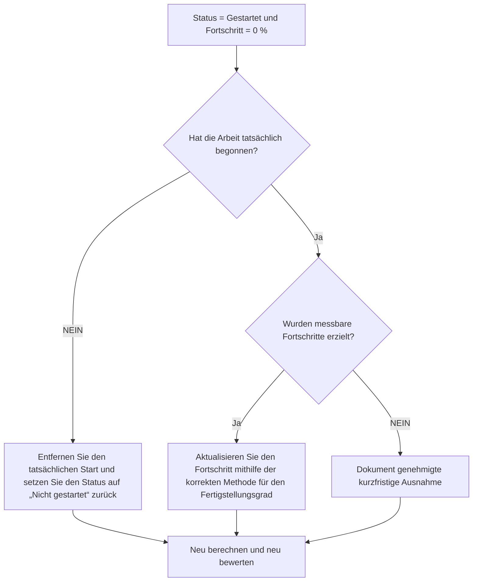

## Zweck

Dieser Leitfaden hilft Planern, Aktivitäten zu überprüfen und zu korrigieren, bei denen der Aktivitätsstatus „Gestartet“ lautet, der Fortschritt jedoch 0 % beträgt. Es unterstützt sauberere Primavera P6-Updates, indem es den tatsächlichen Start, den Aktivitätsstatus, den Prozentsatz der Fertigstellung und die verbleibende Dauer anpasst.

## Bevor Sie beginnen

Sammeln Sie die folgenden Informationen, bevor Sie Maßnahmen ergreifen:

- Aktuelles Bewertungsergebnis für diese Metrik.
- Liste der Aktivitäten mit Aktivitätsstatus = Gestartet und Fortschritt = 0 %.
- Ist-Start, Ist-Ende, verbleibende Dauer, ursprüngliche Dauer und Aktivitätsstatus.
- Typ „Prozent abgeschlossen“ und zugehörige Fortschrittsfelder.
- Physische Fertigstellung in Prozent, Dauer in Prozent abgeschlossen, Einheiten in Prozent abgeschlossen und Aktivität in Prozent abgeschlossen.
- Datenstichtag und neueste Aktualisierungshinweise.
- Bestätigung vor Ort, ob mit den Arbeiten tatsächlich begonnen wurde und welche Fortschritte erzielt wurden.

## Verstehen Sie Ihr Ergebnis

Ein starkes Ergebnis sind null Aktivitäten mit dem Status „Gestartet“ und 0 % Fortschritt.

Ein akzeptables Ergebnis kann in seltenen dokumentierten Fällen vorliegen, in denen eine Aktivität ganz am Ende des Aktualisierungszeitraums gestartet wurde und noch kein messbarer Fortschritt erzielt wurde. Diese Fälle sollten begrenzt und klar erläutert werden.

Ein schwaches Ergebnis bedeutet, dass der Terminplan Aktivitäten enthält, deren Startstatus und Fortschrittswert nicht übereinstimmen. Dies kann zu irreführenden Fortschrittsberichten, Problemen mit dem verdienten Wert und Verwirrung bei der Vorausschau führen.

## Verbesserungsziel

Das Ziel sind 0 ungelöste Aktivitäten mit Aktivitätsstatus = Gestartet und Fortschritt = 0 %.

Das Ziel besteht darin, zu bestätigen, ob jede Aktivität tatsächlich gestartet wurde, ob Fortschritte verpasst wurden oder ob die Aktivität auf „Nicht gestartet“ zurückgesetzt werden sollte.

## Aktionsplan

### Schritt 1: Identifizieren Sie das Hauptproblem

Erstellen Sie ein P6-Layout oder einen Bericht, der nach Aktivitäten mit dem Status „Gestartet“ und einem Fortschritt von 0 % filtert. Dazu gehören Aktivitäts-ID, Aktivitätsname, PSP, Aktivitätsstatus, Ist-Start, Ist-Ende, ursprüngliche Dauer, verbleibende Dauer, Art des abgeschlossenen Prozentsatzes, physischer abgeschlossener Prozentsatz, abgeschlossener Prozentsatz der Dauer, abgeschlossener Einheiten-prozentualer Anteil, abgeschlossener Aktivitäts-Prozentsatz, Start, Ende und Gesamtpuffer.

Überprüfen Sie jede Aktivität und fragen Sie:

- Hat die Arbeit tatsächlich begonnen?
- Welche messbaren Fortschritte wurden erzielt, wenn mit den Arbeiten begonnen wurde?
- Ist der tatsächliche Start korrekt?
- Welcher prozentuale Typ wird verwendet?
- Fehlt der Fortschritt im richtigen Feld?
- Wurde die Aktivität administrativ begonnen, ohne dass mit der eigentlichen Arbeit begonnen wurde?

### Schritt 2: Wenden Sie die empfohlenen Fixes an

Wenn die Arbeit nicht tatsächlich gestartet wurde, entfernen Sie den falschen tatsächlichen Start und setzen Sie die Aktivität auf „Nicht gestartet“ zurück. Bestätigen Sie, dass die verbleibende Dauer und die Prognosedaten noch gültig sind.

Wenn die Arbeit tatsächlich begonnen hat und Fortschritte erzielt wurden, aktualisieren Sie das richtige Fortschrittsfeld basierend auf dem Typ „Prozent abgeschlossen“. Geben Sie unter „Physischer Fertigstellungsgrad“ den physischen Fortschritt ein. Bestätigen Sie für die Dauer in Prozent, dass die verbleibende Dauer die geleistete Arbeit widerspiegelt. Bestätigen Sie für den Fertigstellungsgrad der Einheiten, dass der Fortschritt der Einheiten aktualisiert wird.

Wenn mit der Arbeit begonnen wurde, aber keine messbaren Fortschritte erzielt wurden, dokumentieren Sie den Grund. Dies sollte selten und vorübergehend sein, wie zum Beispiel ein Mobilisierungsbeginn, der kurz vor dem Update-Cut-Off aufgezeichnet wird und noch kein Fortschritt erzielt wurde.

### Schritt 3: Häufige Blocker entfernen

Zu den häufigsten Hindernissen zählen fehlende Feldmengen, importierte tatsächliche Starts ohne Fortschrittswerte, Verwirrung über den Fertigstellungsgrad und der Druck, die Arbeit als begonnen anzuzeigen, bevor messbare Fortschritte verfügbar sind.

Ein weiteres Hindernis besteht darin, den tatsächlichen Start als Planungssignal und nicht als Statusfakt zu behandeln. Der tatsächliche Start sollte den tatsächlichen Beginn der Arbeit darstellen und nicht die Absicht, bald damit zu beginnen.

### Schritt 4: Validieren Sie die Änderungen

Berechnen Sie den Terminplan nach Korrekturen neu. Führen Sie die Metrik erneut aus und bestätigen Sie, dass jedes verbleibende Element korrigiert, begründet oder zur Nachverfolgung zugewiesen wurde.

Überprüfen Sie Fortschrittsberichte, Earned Valueausgaben, Vorschauberichte und laufende Aktivitätslisten, um sicherzustellen, dass die Korrektur keine neuen Inkonsistenzen verursacht hat.

## Verbesserungsplan

### Tag 1: Überprüfung und Diagnose

Führen Sie die Metrik aus, bestätigen Sie der Datenstichtag und unterteilen Sie die Ergebnisse in fehlerhafte Starts, fehlenden Fortschritt, Probleme mit der prozentualen Fertigstellungsmethode und mögliche Ausnahmen.

### Tage 2–3: Implementieren Sie vorrangige Maßnahmen

Korrekte Aktivitäten, die zuerst in der Berichterstattung verwendet werden. Entfernen Sie falsche tatsächliche Starts, aktualisieren Sie Fortschrittswerte oder dokumentieren Sie gültige Ausnahmen.

### Tage 4–5: Überwachen Sie die ersten Ergebnisse

Berechnen Sie den Terminplan neu und überprüfen Sie Fortschrittsberichte, verdiente Wertausgaben, Listen laufender Aktivitäten und Vorschauberichte.

### Tag 6: Letzte Anpassungen

Klären Sie verbleibende Unklarheiten mit dem zuständigen Disziplin-, Außendienst- oder Projektkontrollleiter.

### Tag 7: Neubewertung und Vergleich

Führen Sie die Bewertung erneut durch und vergleichen Sie das Ergebnis mit dem Zielschwellenwert.

## Fortschritt verfolgen

Verwenden Sie einen einfachen Tracker, um Korrekturen und Genehmigungen zu verwalten.

| Datum | Maßnahmen ergriffen | Erwartete Auswirkungen | Ergebnis / Beobachtung | Nächster Schritt |
| --- | --- | --- | --- | --- |
| [Datum] | Überprüfte gestartete Aktivitäten mit 0 % Fortschritt | Identifizieren Sie Statusinkonsistenzen | [Beobachtetes Ergebnis] | Besitzer zuweisen |
| [Datum] | Falscher Ist-Start entfernt | Stellen Sie den genauen Status wieder her | [Beobachtetes Ergebnis] | Terminplan neu berechnen |
| [Datum] | Aktualisierter Fortschrittswert | Richten Sie den Startstatus am Fortschritt aus | [Beobachtetes Ergebnis] | Metrik neu bewerten |

## Wenn sich die Ergebnisse nicht verbessern

Wenn sich die Ergebnisse nicht verbessern, prüfen Sie, ob tatsächliche Starts ohne übereinstimmende Fortschrittswerte importiert werden oder ob Teams unterschiedliche Regeln dafür verwenden, was als gestartet gilt. Überprüfen Sie das Update-Cut-Off-Verfahren und die Methode für den Fertigstellungsgrad.

Eskalieren Sie ungelöste Probleme, wenn sie kritische, nahezu kritische, verdiente Werte, Kundenberichte, Zahlungen oder übergabebezogene Arbeiten betreffen.

## Wartung

Überprüfen Sie diese Metrik bei jedem Aktualisierungszyklus, bevor Sie Berichte veröffentlichen. Es sollte zusammen mit den Ist-Terminen, der verbleibenden Dauer, dem Fertigstellungsgrad und den Aktivitätsstatusprüfungen Teil der standardmäßigen Update-Validierung sein.

## Zusammenfassende Checkliste

- [ ] Aktuelles Ergebnis überprüft
- [ ] Zielschwelle bestätigt
- [ ] Datenstichtag bestätigt
- [ ] Hauptproblem identifiziert
- [ ] Falsche tatsächliche Starts entfernt
- [ ] Fehlender Fortschritt aktualisiert
- [ ] Prozentsatz der Fertigstellung Typ überprüft
- [ ] Gültige Ausnahmen dokumentiert
- [ ] Terminplan neu berechnet
- [ ] Ergebnisse überwacht
- [ ] Beurteilung wiederholt
- [ ] Nächste Schritte dokumentiert
## Verwandte Inhalte
- [Blog-Vorlage](03_blog_template.md)
- [Was für ein Terminplan ist](../../09b_blogs_de/01_WHAT%20A%20SCHEDULE%20IS/01_blog.md)
- [Robuste Logik](../../09b_blogs_de/02_ROBUST%20LOGIC/02_ROBUST%20LOGIC.md)
