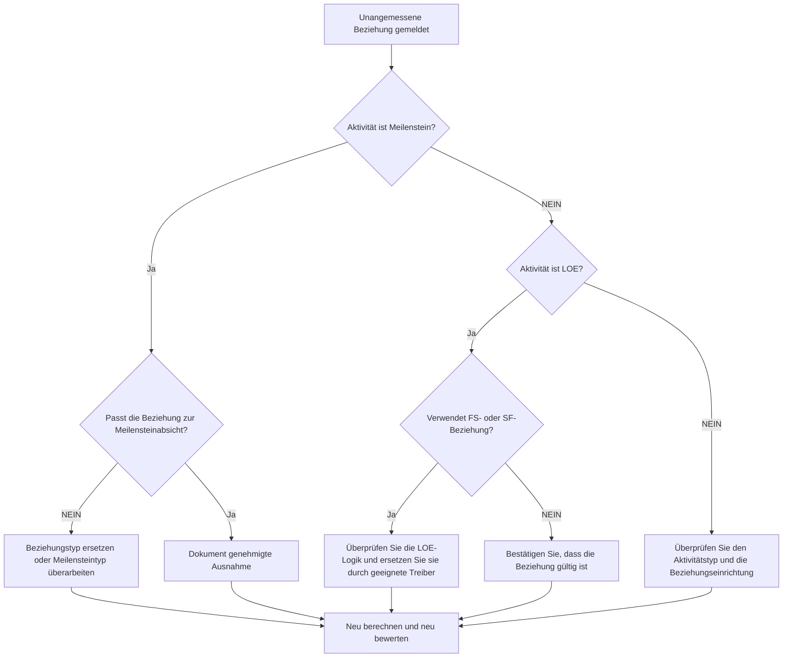

## Zweck

Dieser Leitfaden hilft Planern dabei, unangemessene Beziehungen zwischen Endmeilensteinen, Startmeilensteinen und Level of Effort (LOE)-Aktivitäten in Primavera P6 zu überprüfen und zu korrigieren.

## Bevor Sie beginnen

Sammeln Sie die folgenden Informationen, bevor Sie Maßnahmen ergreifen:

- Aktuelles Bewertungsergebnis für diese Metrik.
- Liste der gekennzeichneten Beziehungen nach Vorgänger, Nachfolger, Aktivitätstyp und Beziehungstyp.
- Aktivitäts-ID, Aktivitätsname, PSP, Aktivitätstyp, Start, Ende, Gesamtpuffer und kritischer oder längster Pfadstatus.
- Beziehungstyp, Verzögerung, Vorgängeraktivitätstyp und Nachfolgeraktivitätstyp.
- Meilensteinzweck, LOE-Zweck und zugehörige Berichtspflicht.
- Datenstichtag und letzte Ausgabe der Terminplanberechnung.

## Verstehen Sie Ihr Ergebnis

Ein starkes Ergebnis sind keine ungelösten unziemlichen Beziehungen.

Die Metrik sollte diese Fälle kennzeichnen:

- Schließe Milestone mit einem SS- oder SF-Nachfolger ab.
- Schließe Milestone mit dem SS-Vorgänger ab.
- Starten Sie Milestone mit dem FF- oder SF-Vorgänger.
- Starten Sie Milestone mit FS- oder FF-Nachfolger.
- LOE mit FS-Beziehung.
- LOE mit SF-Beziehung.

Es kann seltene Ausnahmen geben, diese sollten jedoch dokumentiert und im Rahmen einer Terminplanprüfung leicht erklärt werden.

## Verbesserungsziel

Das Ziel sind 0 ungelöste unziemliche Beziehungen.

Das Ziel besteht darin, jeden Meilenstein und jede LOE-Beziehung dem beabsichtigten Planungsverhalten anzupassen, ohne Termine zu erzwingen oder schwache Logik zu verbergen.

## Aktionsplan

### Schritt 1: Identifizieren Sie das Hauptproblem

Erstellen Sie ein P6-Layout oder einen Bericht, der alle Meilenstein- und LOE-Aktivitäten mit Vorgänger- und Nachfolgerdetails anzeigt. Berücksichtigen Sie Aktivitätstyp, Beziehungstyp, Verzögerung, Start, Ende, Gesamtpuffer und kritische oder längste Pfadindikatoren.

Überprüfen Sie jede gemeldete Beziehung und fragen Sie:

- Ist die Aktivitätsart korrekt?
- Entspricht der Beziehungstyp dem Zweck des Meilensteins oder LOE?
- Versucht die Beziehung, ein Start-, End- oder Berichtsdatum zu erzwingen?
- Würde eine normale FS-, SS- oder FF-Beziehung die Logik besser widerspiegeln?
- Ist die Beziehung eine genehmigte Ausnahme?

### Schritt 2: Wenden Sie die empfohlenen Fixes an

Bestätigen Sie bei Abschlussmeilensteinen, dass die Logik den Abschluss vorantreibt oder darauf reagiert. Ersetzen Sie SS- oder SF-Beziehungen, wenn sie keine echte abschlussbasierte Abhängigkeit darstellen.

Bestätigen Sie für Startmeilensteine, dass die Logik das Startereignis unterstützt. Ersetzen Sie FF-, SF-, FS-Nachfolger oder andere ungeeignete Beziehungen, wenn sie zur Erzwingung eines Berichtstermins verwendet werden.

Überprüfen Sie bei LOE-Aktivitäten, ob FS- oder SF-Beziehungen fälschlicherweise dafür sorgen, dass das LOE-Laufwerk diskret funktioniert. LOE-Aktivitäten fassen normalerweise andere Arbeiten zusammen oder überspannen diese, daher sollten ihre Beziehungen sorgfältig gehandhabt werden.

Wenn die Beziehung durch Vertrag, Kundenmethode oder spezielle Terminplangestaltung gültig ist, dokumentieren Sie den Grund und die Genehmigung.

### Schritt 3: Häufige Blocker entfernen

Zu den häufigsten Blockaden gehören kopierte Logik aus älteren Terminplänen, Missverständnisse des Meilensteinverhaltens, die Verwendung von SF-Beziehungen als Abkürzung und die Verwendung von LOE-Aktivitäten zur Steuerung von Arbeiten, die durch diskrete Aktivitäten gesteuert werden sollten.

Ein weiteres Hindernis besteht darin, die Bereinigung einer Beziehung als Kosmetik zu betrachten. Diese Links können sich auf Puffer, kritische Pfadberichte, Meilensteintermine und die Glaubwürdigkeit des Terminplans auswirken.

### Schritt 4: Validieren Sie die Änderungen

Berechnen Sie den Terminplan nach Korrekturen neu. Führen Sie die Metrik erneut aus und bestätigen Sie, dass jedes verbleibende Element korrigiert, begründet oder zur Nachverfolgung zugewiesen wurde.

Überprüfen Sie Meilensteindaten, LOE-Daten, Gesamtpuffer, kritischer oder längster Pfad und wichtige Berichtsergebnisse, um zu bestätigen, dass die Korrektur keine neuen Probleme verursacht hat.

## Verbesserungsplan

### Tag 1: Überprüfung und Diagnose

Führen Sie die Metrik aus und gruppieren Sie die Ergebnisse nach Aktivitätstyp und Beziehungsmuster.

### Tage 2–3: Implementieren Sie vorrangige Maßnahmen

Korrigieren Sie zuerst die Beziehungen zu kritischen, nahezu kritischen, vertraglichen, Übergabe- und kundenorientierten Meilensteinen.

### Tage 4–5: Überwachen Sie die ersten Ergebnisse

Berechnen Sie den Terminplan neu und überprüfen Sie Puffer, kritischen Pfad, Meilensteinbewegung und LOE-Verhalten.

### Tag 6: Letzte Anpassungen

Lösen Sie verbleibende Ausnahmen mit dem Planer, dem Projektkontrollleiter oder dem PMO-Prüfer.

### Tag 7: Neubewertung und Vergleich

Führen Sie die Bewertung erneut durch und vergleichen Sie das Ergebnis mit dem Zielschwellenwert.

## Fortschritt verfolgen

Verwenden Sie einen einfachen Tracker, um Korrekturen und Genehmigungen zu verwalten.

| Datum | Maßnahmen ergriffen | Erwartete Auswirkungen | Ergebnis / Beobachtung | Nächster Schritt |
| --- | --- | --- | --- | --- |
| [Datum] | Überprüfte unziemliche Beziehungen | Identifizieren Sie Beziehungsprobleme | [Beobachtetes Ergebnis] | Besitzer zuweisen |
| [Datum] | Meilensteinbeziehung korrigiert | Richten Sie die Logik am Ziel des Meilensteins aus | [Beobachtetes Ergebnis] | Terminplan neu berechnen |
| [Datum] | Überprüfte LOE-Beziehungen | Verhindern Sie, dass LOE diskrete Arbeit falsch steuert | [Beobachtetes Ergebnis] | Metrik neu bewerten |

## Wenn sich die Ergebnisse nicht verbessern

Wenn sich die Ergebnisse nicht verbessern, prüfen Sie, ob dieselben Beziehungen durch Importe, kopierte Logik, globale Änderungen oder externe Terminplanintegration wieder eingeführt werden.

Eskalieren Sie ungelöste Punkte, wenn sie vertragliche Meilensteine, Berichte über kritische Pfade, Kundeneingaben, Zahlungsereignisse oder Übergabetermine betreffen.

## Wartung

Überprüfen Sie diese Metrik während jedes Aktualisierungszyklus und vor des Basisplans-Genehmigung. Dies ist besonders nützlich nach Terminplanimporten, kopierten Fragmenten, größeren Neusequenzierungen und Meilensteinrevisionen.

## Zusammenfassende Checkliste

- [ ] Aktuelles Ergebnis überprüft
- [ ] Zielschwelle bestätigt
- [ ] Meilenstein- und LOE-Aktivitätstypen überprüft
- [ ] Markierte Beziehungstypen überprüft
- [ ] Falsche Beziehungen korrigiert
- [ ] Gültige Ausnahmen dokumentiert
- [ ] Terminplan neu berechnet
- [ ] Puffer und kritischer Pfad überprüft
- [ ] Ergebnisse überwacht
- [ ] Beurteilung wiederholt
- [ ] Nächste Schritte dokumentiert
## Verwandte Inhalte
- [03_blog_template](../14_unusual_relations/03_blog_template.md)
- [Was für ein Terminplan ist](../../09b_blogs_de/01_WHAT%20A%20SCHEDULE%20IS/01_blog.md)
- [Robuste Logik](../../09b_blogs_de/02_ROBUST%20LOGIC/02_ROBUST%20LOGIC.md)
