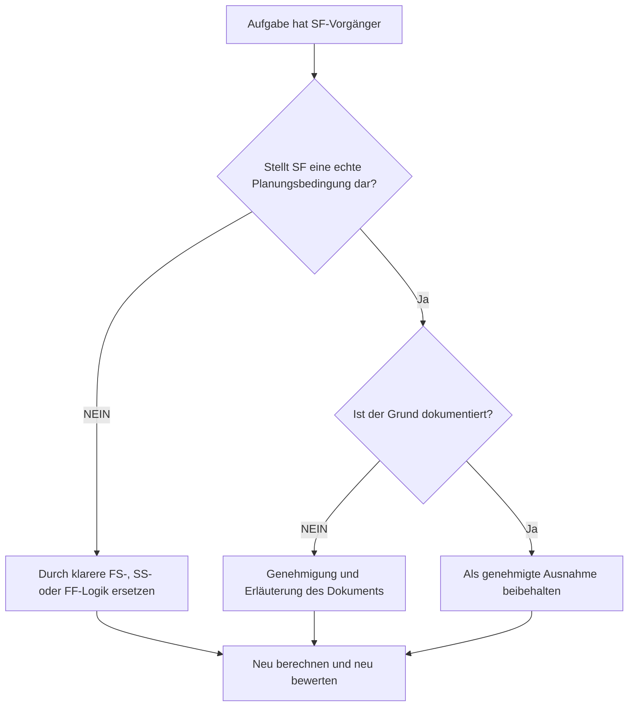

# Aufgabenaktivitäten mit SF-Vorgängern in Primavera P6 - Verbesserungsleitfaden

## Zweck

Dieser Leitfaden hilft Planern, Aufgabenaktivitäten zu überprüfen und zu korrigieren, die in Primavera P6 Start-to-Finish-Vorgängerbeziehungen (SF) aufweisen.

## Bevor Sie beginnen

Sammeln Sie die folgenden Informationen, bevor Sie Maßnahmen ergreifen:

- Aktuelles Bewertungsergebnis für diese Metrik.
- Liste der Aufgabenaktivitäten mit mindestens einem SF-Vorgänger.
- Aktivitäts-ID, Aktivitätsname, PSP, Aktivitätstyp, Start, Ende, Gesamtpuffer und kritischer oder längster Pfadstatus.
- Vorgängeraktivitäts-ID, Vorgängeraktivitätstyp, Beziehungstyp und Verzögerung.
- Alle Einschränkungen, Kalender, erwarteten Endbedingungen und zugehörige Aktualisierungshinweise.
- Datenstichtag und letzte Ausgabe der Terminplanberechnung.

## Verstehen Sie Ihr Ergebnis

Ein starkes Ergebnis sind keine ungelösten Aufgabenaktivitäten mit SF-Vorgängerbeziehungen.

Eine SF-Beziehung bedeutet, dass die Nachfolgeaktivität erst beendet werden kann, wenn die Vorgängeraktivität beginnt. Dies ist in der normalen Bau-, Konstruktions-, Beschaffungs- oder Inbetriebnahmelogik ungewöhnlich. Die meisten Aufgabenbeziehungen sollten mit FS-, SS- oder FF-Logik dargestellt werden, wenn sie eine echte Reihenfolge widerspiegeln.

Ein schwaches Ergebnis bedeutet, dass der Abschluss von Aufgabenaktivitäten möglicherweise durch eine Logik gesteuert wird, die schwer zu rechtfertigen ist oder die ohne Überprüfung aus einem anderen Teil des Terminplans kopiert wurde.

## Verbesserungsziel

Das Ziel sind 0 ungelöste SF-Vorgängerbeziehungen zu Aufgabenaktivitäten.

Das Ziel besteht darin, zu bestätigen, ob jede SF-Beziehung ein gültiges Planungsmodell ist oder durch eine klarere Logik ersetzt werden sollte.

## Aktionsplan

### Schritt 1: Identifizieren Sie das Hauptproblem

Erstellen Sie ein P6-Layout oder einen Bericht, der Aufgabenaktivitäten mit einem SF-Vorgänger filtert. Beziehen Sie Vorgänger- und Nachfolger-IDs, Aktivitätstyp, Beziehungstyp, Verzögerung, Start, Ende, Gesamtpuffer, Einschränkungen und kritische oder längste Pfadindikatoren ein.

Überprüfen Sie jede Beziehung und fragen Sie:

- Welchen realen Zustand versucht die SF-Beziehung darzustellen?
- Sollte der Anfang des Vorgängers wirklich das Ende des Nachfolgers kontrollieren?
- Würde die FS-, SS- oder FF-Logik die Sequenz klarer beschreiben?
- Wird die Verzögerung genutzt, um ein Datum zu erzwingen?
- Befindet sich die Beziehung auf dem kritischen oder nahezu kritischen Pfad?
- Gibt es einen dokumentierten Grund für die Verwendung von SF?

### Schritt 2: Wenden Sie die empfohlenen Fixes an

Wenn die SF-Beziehung keine reale Bedingung darstellt, ersetzen Sie sie durch den Beziehungstyp, der die Sequenz am besten beschreibt. Verwenden Sie FS, wenn der Nachfolger nach Abschluss des Vorgängers beginnen soll, SS, wenn Starts verknüpft sind, und FF, wenn die Endausrichtung die beabsichtigte Logik ist.

Wenn die SF-Beziehung hinzugefügt wurde, um einen Endtermin zu steuern, prüfen Sie, ob der Terminplan stattdessen einen ordnungsgemäßen Vorgänger, Meilenstein, eine Einschränkungsüberprüfung oder eine Aktivitätsaufteilung benötigt.

Wenn die SF-Beziehung gültig ist, dokumentieren Sie, warum sie erforderlich ist und wer sie genehmigt hat. Dies sollte eine seltene Ausnahme und kein übliches Planungsmuster sein.

### Schritt 3: Häufige Blocker entfernen

Zu den häufigsten Blockern gehören kopierte Beziehungen, importierte externe Logik, Missverständnisse des SF-Verhaltens und die Verwendung von SF mit Verzögerung, um einen Endtermin zu erzwingen.

Ein weiteres Hindernis besteht darin, die Beziehung zu verlassen, weil das berechnete Datum akzeptabel erscheint. Die Beziehung muss immer noch logisch vertretbar sein.

### Schritt 4: Validieren Sie die Änderungen

Berechnen Sie den Terminplan nach Korrekturen neu. Führen Sie die Metrik erneut aus und bestätigen Sie, dass jeder verbleibende SF-Vorgänger korrigiert, begründet oder zur Nachverfolgung zugewiesen wurde.

Überprüfen Sie den Gesamtpuffer, den kritischen oder längsten Pfad, die betroffenen Meilensteine ​​und die Lookahead-Ausgaben, um zu bestätigen, dass die Logikänderung keine neuen Probleme verursacht hat.

## Verbesserungsplan

### Tag 1: Überprüfung und Diagnose

Führen Sie die Metrik aus, bestätigen Sie der Datenstichtag und unterteilen Sie die Ergebnisse in ungültige SF-Beziehungen, mögliche Ausnahmen und Elemente, die eine Eingabe des Eigentümers erfordern.

### Tage 2–3: Implementieren Sie vorrangige Maßnahmen

Korrigieren Sie zunächst SF-Beziehungen zu kritischen, nahezu kritischen, vertraglichen und kurzfristigen Aktivitäten.

### Tage 4–5: Überwachen Sie die ersten Ergebnisse

Berechnen Sie den Terminplan neu und überprüfen Sie den Puffer, den kritischen Pfad, die voraussichtlichen Termine und die Meilensteinbewegung.

### Tag 6: Letzte Anpassungen

Beheben Sie verbleibende Ausnahmen mit dem Planer, dem Disziplinarleiter, dem Projektkontrollleiter oder dem PMO-Prüfer.

### Tag 7: Neubewertung und Vergleich

Führen Sie die Bewertung erneut durch und vergleichen Sie das Ergebnis mit dem Zielschwellenwert.

## Fortschritt verfolgen

Verwenden Sie einen einfachen Tracker, um Korrekturen und Genehmigungen zu verwalten.

| Datum | Maßnahmen ergriffen | Erwartete Auswirkungen | Ergebnis / Beobachtung | Nächster Schritt |
| --- | --- | --- | --- | --- |
| [Datum] | Überprüfte Aufgabenaktivitäten mit SF-Vorgängern | Identifizieren Sie ungewöhnliche Beziehungslogiken | [Beobachtetes Ergebnis] | Besitzer zuweisen |
| [Datum] | Ungültige SF-Beziehung ersetzt | Verbessern Sie die Klarheit der Logik | [Beobachtetes Ergebnis] | Terminplan neu berechnen |
| [Datum] | Dokumentierte gültige SF-Ausnahme | Behalten Sie die genehmigte Speziallogik bei | [Beobachtetes Ergebnis] | Metrik neu bewerten |

## Wenn sich die Ergebnisse nicht verbessern

Wenn sich die Ergebnisse nicht verbessern, prüfen Sie, ob SF-Beziehungen durch Importe, kopierte Fragmente, globale Änderungen oder externe Terminplanintegration wieder eingeführt werden.

Eskalieren Sie ungelöste Probleme, wenn sie sich auf den kritischen Pfad, vertragliche Meilensteine, Kundeneingaben, Zahlungsereignisse oder kurzfristige Ausführungsarbeiten auswirken.

## Wartung

Überprüfen Sie diese Metrik bei jedem Update-Zyklus und vor des Basisplans-Genehmigung. Dies ist besonders nützlich nach Terminplanimporten, größeren Neusequenzierungen und Logikbereinigungsübungen.

## Zusammenfassende Checkliste

- [ ] Aktuelles Ergebnis überprüft
- [ ] Zielschwelle bestätigt
- [ ] SF-Vorgängerliste generiert
- [ ] Kritische und nahezu kritische Elemente werden priorisiert
- [ ] Ungültige SF-Beziehungen korrigiert
- [ ] Gültige Ausnahmen dokumentiert
- [ ] Terminplan neu berechnet
- [ ] Puffer und kritischer Pfad überprüft
- [ ] Ergebnisse überwacht
- [ ] Beurteilung wiederholt
- [ ] Nächste Schritte dokumentiert
## Verwandte Inhalte
- [Aufgabenaktivitäten mit SF-Vorgängern in Primavera P6 - Überblick](01_overview_template.md)
- [Aufgabenaktivitäten mit SF-Vorgängern in Primavera P6](03_blog_template.md)
- [Was für ein Terminplan ist](../../09b_blogs_de/01_WHAT%20A%20SCHEDULE%20IS/01_blog.md)
- [Robuste Logik](../../09b_blogs_de/02_ROBUST%20LOGIC/02_ROBUST%20LOGIC.md)
