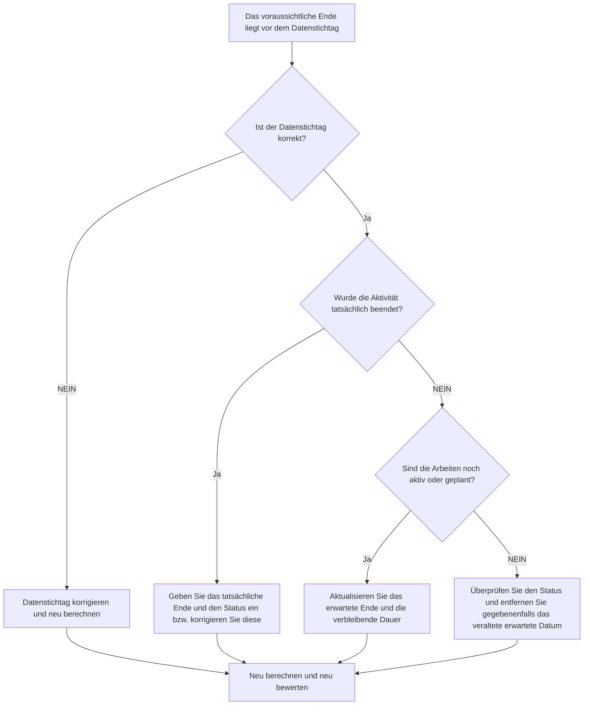

# Voraussichtliches Ende vor dem Datenstichtag in Primavera P6 - Verbesserungsleitfaden

## Zweck

Dieser Leitfaden hilft Planern, Aktivitäten zu überprüfen und zu korrigieren, deren voraussichtliches Enddatum vor dem Primavera P6-Datenstichtag liegt. Es unterstützt eine sauberere Update-Disziplin, indem es die erwarteten Daten an die aktuelle Berichtsgrenze anpasst.

## Bevor Sie beginnen

Sammeln Sie die folgenden Informationen, bevor Sie Maßnahmen ergreifen:

- Aktuelles Bewertungsergebnis für diese Metrik.
- Projektdatendatum, das in der letzten Terminplanaktualisierung verwendet wird.
- Liste der Aktivitäten, bei denen das erwartete Ende vor dem Datenstichtag liegt.
- Aktivitätsstatus, Ist-Start, Ist-Ende, verbleibende Dauer, Fertigstellungsgrad, Start, Ende und Gesamtpuffer.
- Erwartete Abschlussquelle, z. B. manuelle Eingabe, Importdatei, Feldprognose oder P6-Aktualisierungsworkflow.
- Cut-Off-Regeln für Projektaktualisierungen und aktuelle Fortschrittsnotizen.

## Verstehen Sie Ihr Ergebnis

Ein starkes Ergebnis sind null Aktivitäten mit erwartetem Ende vor dem Datenstichtag.

Ein erwartetes Ende vor dem Stichtag bedeutet normalerweise, dass die Prognose oder die Informationen zum erwarteten Abschluss nicht aktualisiert wurden, als der Terminplan voranschritt. Es kann auch darauf hinweisen, dass die Aktivität ein Ist-Ende, eine geänderte verbleibende Dauer oder einen korrigierten Status haben sollte.

Ein schwaches Ergebnis bedeutet, dass der Terminplan erwartete Abschlusstermine enthält, die relativ zur aktuellen Aktualisierungsgrenze in der Vergangenheit liegen.

## Verbesserungsziel

Das Ziel sind 0 ungelöste Aktivitäten, deren Abschluss vor dem Datenstichtag erwartet wird.

Das Ziel besteht darin, zu bestätigen, ob jede Aktivität abgeschlossen wurde, noch in Bearbeitung ist, nicht gestartet oder falsch aktualisiert wurde.

## Aktionsplan

### Schritt 1: Identifizieren Sie das Hauptproblem

Erstellen Sie ein P6-Layout oder einen Bericht, der nach Aktivitäten filtert, bei denen das erwartete Ende vor dem Datenstichtag liegt. Dazu gehören Aktivitäts-ID, Aktivitätsname, PSP, Aktivitätsstatus, erwartetes Ende, Ist-Start, Ist-Ende, verbleibende Dauer, Prozentsatz der Fertigstellung, Start, Ende, Gesamtpuffer und Kalender.

Überprüfen Sie jede Aktivität und fragen Sie:

- Ist der Datenstichtag korrekt?
- Wurde die Aktivität tatsächlich vor dem Datenstichtag abgeschlossen?
- Wenn es fertig ist, fehlt das tatsächliche Ende?
- Sollte das erwartete Ende aktualisiert werden, wenn es nicht abgeschlossen wurde?
- Stellt die verbleibende Dauer immer noch die verbleibende Arbeit dar?
- Hat ein Import oder ein manuelles Update einen alten Wert für „Erwartetes Ende“ zurückgelassen?

### Schritt 2: Wenden Sie die empfohlenen Fixes an

Wenn der Datenstichtag falsch ist, korrigieren Sie es entsprechend dem genehmigten Berichtszeitraum und berechnen Sie den Terminplan neu.

Wenn die Aktivität vor dem Datenstichtag abgeschlossen wurde, geben Sie das tatsächliche Ende ein oder korrigieren Sie es und bestätigen Sie, dass Aktivitätsstatus, Fertigstellungsgrad und verbleibende Dauer konsistent sind.

Wenn die Aktivität noch aktiv oder noch nicht abgeschlossen ist, aktualisieren Sie das erwartete Ende auf ein gültiges Datum am oder nach dem Datenstichtag. Bestätigen Sie die verbleibende Dauer und die Prognosetermine spiegeln die neuesten Feldinformationen wider.

Wenn das erwartete Ende durch einen Import eingeführt wurde, überprüfen Sie die Importdatei und die Zuordnung, damit veraltete erwartete Daten nicht wiederholt geladen werden.

### Schritt 3: Häufige Blocker entfernen

Zu den häufigsten Hindernissen gehören veraltete Feldprognosen, Fortschrittsimporte, die den Prozentsatz der abgeschlossenen, aber nicht erwarteten Daten aktualisieren, und Verwirrung zwischen erwartetem Ende, prognostiziertem Ende und tatsächlichem Ende.

Ein weiterer Blocker ist das Ignorieren des erwarteten Endes, weil geplante Termine akzeptabel erscheinen. In P6 können erwartete Termine je nach Einstellungen und Arbeitsabläufen die Terminplanberechnung beeinflussen, daher sollten veraltete Werte überprüft werden.

### Schritt 4: Validieren Sie die Änderungen

Berechnen Sie den Terminplan nach Korrekturen neu. Führen Sie die Metrik erneut aus und stellen Sie sicher, dass vor dem Datenstichtag keine ungelösten erwarteten Endtermine verbleiben.

Überprüfen Sie die laufenden Aktivitäten, den kurzfristigen Ausblick, den Gesamtbestand, die Meilensteintermine und die Terminplanvergleichsberichte, um sicherzustellen, dass die Korrektur keine neuen Inkonsistenzen verursacht hat.

## Verbesserungsplan

### Tag 1: Überprüfung und Diagnose

Führen Sie die Metrik aus, bestätigen Sie der Datenstichtag und unterteilen Sie die Ergebnisse in abgeschlossene Arbeiten, veraltete erwartete Daten, Probleme mit der verbleibenden Dauer und Importprobleme.

### Tage 2–3: Implementieren Sie vorrangige Maßnahmen

Korrekte Aktivitäten, die zuerst in der Berichterstattung verwendet werden. Aktualisieren Sie nach Bedarf das tatsächliche Ende, das erwartete Ende, die verbleibende Dauer, den Prozentsatz der Fertigstellung oder den Aktivitätsstatus.

### Tage 4–5: Überwachen Sie die ersten Ergebnisse

Berechnen Sie den Terminplan neu und überprüfen Sie Look-Ahead-Berichte, Listen laufender Aktivitäten, Meilensteinverschiebungen und Puffer-Änderungen.

### Tag 6: Letzte Anpassungen

Klären Sie verbleibende Unklarheiten mit dem zuständigen Disziplin-, Außendienst- oder Projektkontrollleiter.

### Tag 7: Neubewertung und Vergleich

Führen Sie die Bewertung erneut durch und vergleichen Sie das Ergebnis mit dem Zielschwellenwert.

## Fortschritt verfolgen

Verwenden Sie einen einfachen Tracker, um Korrekturen und Genehmigungen zu verwalten.

| Datum | Maßnahmen ergriffen | Erwartete Auswirkungen | Ergebnis / Beobachtung | Nächster Schritt |
| --- | --- | --- | --- | --- |
| [Datum] | Erwartete Fertigstellung vor Datenstichtag überprüft | Identifizieren Sie veraltete erwartete Termine | [Beobachtetes Ergebnis] | Besitzer zuweisen |
| [Datum] | Erwartetes Ende oder Ist-Ende aktualisiert | Richten Sie den Status an der Aktualisierungsgrenze aus | [Beobachtetes Ergebnis] | Terminplan neu berechnen |
| [Datum] | Überprüfter Importvorgang | Verhindern Sie wiederholt veraltete erwartete Termine | [Beobachtetes Ergebnis] | Metrik neu bewerten |

## Wenn sich die Ergebnisse nicht verbessern

Wenn sich die Ergebnisse nicht verbessern, prüfen Sie, ob erwartete Daten ohne Validierung aus Feldsystemen, Tabellenkalkulationen oder früheren Aktualisierungsdateien importiert werden. Überprüfen Sie den Update-Workflow und bestätigen Sie, wem Expected Finish-Updates gehören.

Eskalieren Sie ungelöste Probleme, wenn sie kritische, nahezu kritische Kundenberichte, Zahlungen, Übergaben oder kurzfristige Ausführungsarbeiten betreffen.

## Wartung

Überprüfen Sie diese Metrik bei jedem Aktualisierungszyklus, bevor Sie Berichte veröffentlichen. Es sollte Teil der Standardstatusvalidierung sein, zusammen mit Datenstichtag, Ist-Terminen, verbleibender Dauer, Prozentsatz der Fertigstellung und Aktivitätsstatusprüfungen.

## Zusammenfassende Checkliste

- [ ] Aktuelles Ergebnis überprüft
- [ ] Zielschwelle bestätigt
- [ ] Datenstichtag bestätigt
- [ ] Erwartete Zielliste erstellt
- [ ] Abgeschlossene Arbeiten mit tatsächlichem Abschluss
- [ ] Veraltete voraussichtliche Endtermine aktualisiert
- [ ] Verbleibende Dauer überprüft
- [ ] Aktivitätsstatus und Fertigstellungsgrad überprüft
- [ ] Import- oder Update-Workflow überprüft
- [ ] Terminplan neu berechnet
- [ ] Beurteilung wiederholt
- [ ] Nächste Schritte dokumentiert
## Verwandte Inhalte
- [Voraussichtliches Ende vor dem Datenstichtag in Primavera P6 - Überblick](01_overview_template.md)
- [Voraussichtliches Ende vor dem Datenstichtag in Primavera P6](03_blog_template.md)
- [Was für ein Terminplan ist](../../09b_blogs_de/01_WHAT%20A%20SCHEDULE%20IS/01_blog.md)
- [Robuste Logik](../../09b_blogs_de/02_ROBUST%20LOGIC/02_ROBUST%20LOGIC.md)
