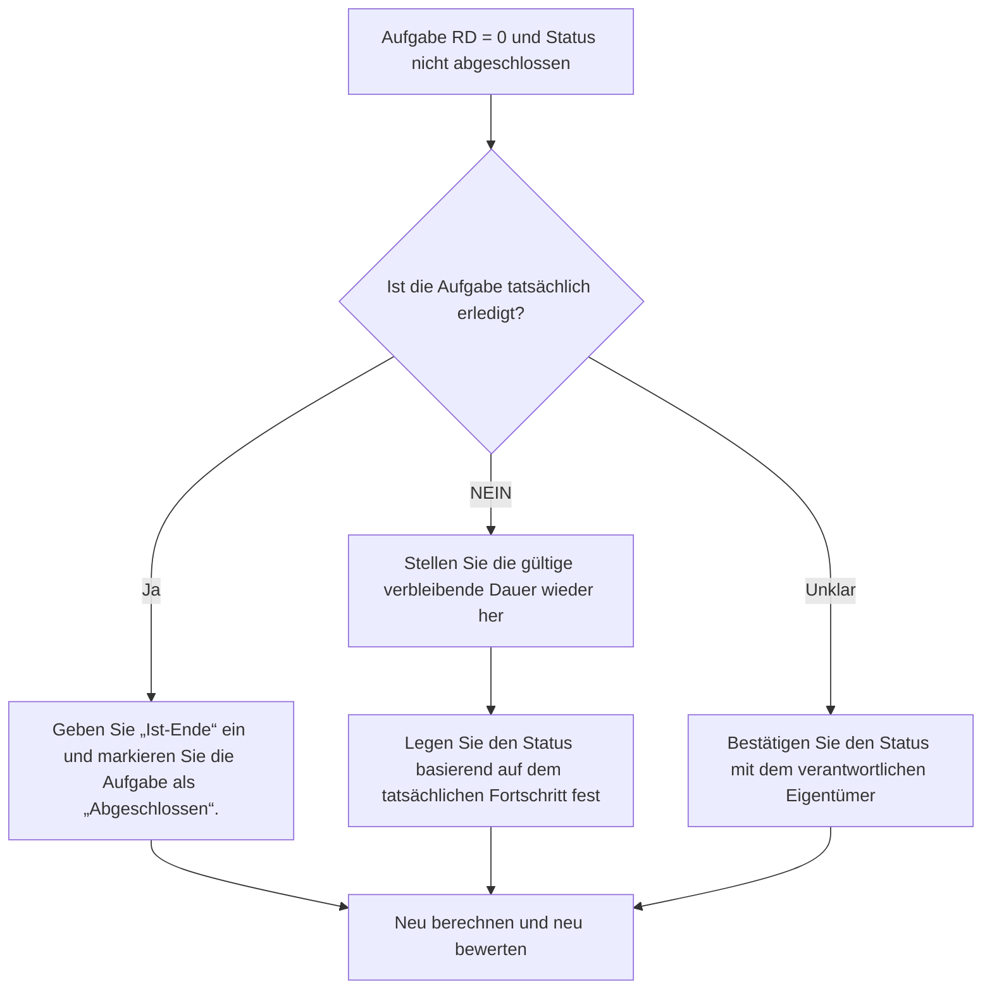

## Zweck

Dieser Leitfaden hilft Planern, Aufgabenaktivitäten zu überprüfen und zu korrigieren, bei denen die verbleibende Dauer gleich 0 ist, der Aufgabenstatus jedoch nicht „Abgeschlossen“ ist. Es unterstützt saubere Primavera P6-Updates, indem es die verbleibende Arbeit, den tatsächlichen Abschluss und den Aktivitätsstatus anpasst.

## Bevor Sie beginnen

Sammeln Sie die folgenden Informationen, bevor Sie Maßnahmen ergreifen:

- Aktuelles Bewertungsergebnis für diese Metrik.
- Liste der Aufgabenaktivitäten mit verbleibender Dauer = 0 und Status nicht abgeschlossen.
- Aktivitäts-ID, Aktivitätsname, WBS, Aktivitätstyp, Aktivitätsstatus, tatsächlicher Beginn, Ist-Ende, ursprüngliche Dauer, verbleibende Dauer und Dauer bei Abschluss.
- Typ „Prozent abgeschlossen“ und wichtige Fortschrittsfelder.
- Datenstichtag und neueste Aktualisierungshinweise.
- Feldbestätigung, ob die Aufgabe abgeschlossen ist oder noch Arbeit übrig ist.

## Verstehen Sie Ihr Ergebnis

Ein starkes Ergebnis sind keine Aufgabenaktivitäten mit der verbleibenden Dauer = 0 und dem Status „Nicht abgeschlossen“.

Diese Metrik ist auf Aufgabenaktivitäten beschränkt, daher konzentriert sich die Überprüfung auf normale Arbeitsaktivitäten und nicht auf Meilensteine ​​oder LOE-Datensätze. Eine Aufgabe mit einer verbleibenden Dauer von Null sollte normalerweise den Status „Abgeschlossen“ und ein „Ist-Ende“ haben.

Ein schwaches Ergebnis bedeutet, dass der Terminplan Aufgaben enthält, deren verbleibende Zeit und Abschlussstatus nicht übereinstimmen.

## Verbesserungsziel

Das Ziel sind 0 ungelöste Aufgabenaktivitäten mit der verbleibenden Dauer = 0 und dem Status „Nicht abgeschlossen“.

Das Ziel besteht darin, zu bestätigen, ob jede Aufgabe abgeschlossen ist und geschlossen werden sollte oder ob sie unvollständig ist und eine gültige verbleibende Dauer wiederhergestellt werden sollte.

## Aktionsplan

### Schritt 1: Identifizieren Sie das Hauptproblem

Erstellen Sie ein P6-Layout oder einen Bericht, der nach Aufgabenaktivitäten filtert, bei denen die verbleibende Dauer gleich 0 ist und der Aktivitätsstatus nicht abgeschlossen ist. Dazu gehören Aktivitäts-ID, Aktivitätsname, PSP, Aktivitätstyp, Aktivitätsstatus, Ist-Start, Ist-Ende, ursprüngliche Dauer, verbleibende Dauer, Art des abgeschlossenen Prozentsatzes, abgeschlossener Prozentsatz der Aktivität, Start, Ende und Gesamtpuffer.

Überprüfen Sie jede Aufgabe und fragen Sie:

- Ist die Aufgabe tatsächlich erledigt?
- Wenn abgeschlossen, warum ist der Status nicht abgeschlossen?
- Fehlt das tatsächliche Finish?
- Wenn die Arbeit nicht abgeschlossen ist, warum ist die verbleibende Dauer 0?
- Wurde der Status manuell importiert oder aktualisiert?
- Entspricht die Methode „Prozent abgeschlossen“ der vorgenommenen Aktualisierung?

### Schritt 2: Wenden Sie die empfohlenen Fixes an

Wenn die Aufgabe abgeschlossen ist, aktualisieren Sie die Aktivität als „Abgeschlossen“. Geben Sie das tatsächliche Ende ein, bestätigen Sie, dass die verbleibende Dauer 0 ist, und bestätigen Sie, dass die Fortschrittswerte mit dem Projektaktualisierungsverfahren übereinstimmen.

Wenn die Aufgabe nicht abgeschlossen ist, stellen Sie eine entsprechende verbleibende Dauer wieder her. Bestätigen Sie die verbleibende Arbeit mit dem verantwortlichen Eigentümer und behalten Sie den Aufgabenstatus basierend auf dem tatsächlichen Fortschritt als „In Bearbeitung“ oder „Nicht gestartet“ bei.

Wenn das Problem auf importierte Fortschrittsdaten zurückzuführen ist, überprüfen Sie den Importzuordnungs- und Aktualisierungsworkflow. Der Aktualisierungsprozess sollte nicht dazu führen, dass Aufgabenaktivitäten keine verbleibende Zeit, sondern einen unvollständigen Status aufweisen.

### Schritt 3: Häufige Blocker entfernen

Häufige Hindernisse sind fehlende tatsächliche Endtermine, unvollständige Feldbestätigungen, importierte Aktualisierungsdaten und Verwechslungen zwischen Dauerstatus und Aktivitätsstatus.

Ein weiterer Blocker besteht darin, die verbleibende Dauer auf 0 zu reduzieren, um den Fortschritt anzuzeigen, ohne die Aufgabe offiziell abzuschließen. Die verbleibende Dauer und der Aktivitätsstatus sollten das gleiche Aufschluss darüber geben, ob Arbeit verbleibt.

### Schritt 4: Validieren Sie die Änderungen

Berechnen Sie den Terminplan nach Korrekturen neu. Führen Sie die Metrik erneut aus und bestätigen Sie, dass jedes verbleibende Element korrigiert oder zur Nachverfolgung zugewiesen wurde.

Überprüfen Sie abgeschlossene Aufgabenlisten, tatsächliche Endtermine, Fortschrittsberichte, Earned Valueausgaben und Vorausschauberichte, um sicherzustellen, dass die Korrektur keine neuen Inkonsistenzen verursacht hat.

## Verbesserungsplan

### Tag 1: Überprüfung und Diagnose

Führen Sie die Metrik aus, bestätigen Sie der Datenstichtag und unterteilen Sie die Ergebnisse in abgeschlossene Aufgaben ohne den Status „Abgeschlossen“, unvollständige Aufgaben mit einer verbleibenden Dauer von Null und Import- oder Workflow-Probleme.

### Tage 2–3: Implementieren Sie vorrangige Maßnahmen

Korrekte Aufgaben, die zuerst in der Berichterstattung verwendet werden. Geben Sie das tatsächliche Ende ein, markieren Sie Aufgaben als abgeschlossen oder stellen Sie die verbleibende Dauer nach Bedarf wieder her.

### Tage 4–5: Überwachen Sie die ersten Ergebnisse

Berechnen Sie den Terminplan neu und überprüfen Sie abgeschlossene Aufgabenberichte, Fortschrittsberichte, Earned Valueausgaben und Look-Ahead-Berichte.

### Tag 6: Letzte Anpassungen

Klären Sie verbleibende Unklarheiten mit dem zuständigen Disziplin-, Außendienst- oder Projektkontrollleiter.

### Tag 7: Neubewertung und Vergleich

Führen Sie die Bewertung erneut durch und vergleichen Sie das Ergebnis mit dem Zielschwellenwert.

## Fortschritt verfolgen

Verwenden Sie einen einfachen Tracker, um Korrekturen und Genehmigungen zu verwalten.

| Datum | Maßnahmen ergriffen | Erwartete Auswirkungen | Ergebnis / Beobachtung | Nächster Schritt |
| --- | --- | --- | --- | --- |
| [Datum] | Überprüfte Aufgabe RD 0 und Status nicht abgeschlossen | Identifizieren Sie Inkonsistenzen im Aufgabenstatus | [Beobachtetes Ergebnis] | Besitzer zuweisen |
| [Datum] | Ist-Ende eingegeben und als „Abgeschlossen“ markiert | Status „Abgeschlossen“ ausrichten | [Beobachtetes Ergebnis] | Terminplan neu berechnen |
| [Datum] | Verbleibende Dauer wiederhergestellt | Korrigieren Sie den Status der unvollendeten Aufgabe | [Beobachtetes Ergebnis] | Metrik neu bewerten |

## Wenn sich die Ergebnisse nicht verbessern

Wenn sich die Ergebnisse nicht verbessern, prüfen Sie, ob Fortschrittsaktualisierungen inkonsistent importiert, kopiert oder manuell bearbeitet werden. Überprüfen Sie, ob im Aktualisierungsworkflow tatsächliche Endtermine fehlen oder ob Benutzer die verbleibende Dauer auf 0 setzen, ohne Aufgaben abzuschließen.

Eskalieren Sie ungelöste Probleme, wenn sie kritische, nahezu kritische, verdiente Werte, Kundenberichte, Zahlungen oder übergabebezogene Arbeiten betreffen.

## Wartung

Überprüfen Sie diese Metrik bei jedem Aktualisierungszyklus, bevor Sie Berichte veröffentlichen. Es sollte Teil der standardmäßigen Aufgabenstatusvalidierung sein, zusammen mit den Ist-Terminen, der verbleibenden Dauer, dem Fertigstellungsgrad und den Aktivitätsstatusprüfungen.

## Zusammenfassende Checkliste

- [ ] Aktuelles Ergebnis überprüft
- [ ] Zielschwelle bestätigt
- [ ] Datenstichtag bestätigt
- [ ] Nur-Aufgaben-Filter bestätigt
- [ ] Hauptproblem identifiziert
- [ ] Erledigte Aufgaben korrekt markiert
- [ ] Bei Bedarf werden tatsächliche Endtermine eingegeben
- [ ] Die verbleibende Dauer wird wiederhergestellt, wenn die Arbeit unvollständig ist
- [ ] Import- oder Update-Workflow überprüft
- [ ] Terminplan neu berechnet
- [ ] Beurteilung wiederholt
- [ ] Nächste Schritte dokumentiert
## Verwandte Inhalte
- [Die verbleibende Dauer der Aufgabe ist Null, während der Status nicht abgeschlossen ist](03_blog_template.md)
- [Was für ein Terminplan ist](../../09b_blogs_de/01_WHAT%20A%20SCHEDULE%20IS/01_blog.md)
- [Robuste Logik](../../09b_blogs_de/02_ROBUST%20LOGIC/02_ROBUST%20LOGIC.md)
