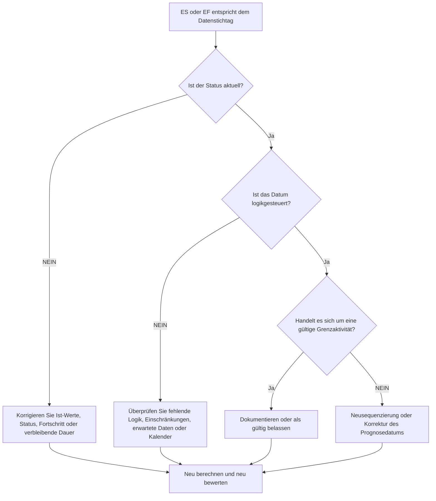

# Aktivitäten am Datenstichtag - Verbesserungsleitfaden

## Zweck

Dieser Leitfaden hilft Planern dabei, Aktivitäten zu überprüfen, deren früher Beginn oder frühes Ende genau auf das Primavera P6-Datenstichtag fällt. Es unterstützt Aktualisierungszyklusprüfungen, indem es zeigt, wo sich an der Grenze zwischen tatsächlicher Leistung und prognostizierter Arbeit Arbeit ansammelt.

## Bevor Sie beginnen

Sammeln Sie die folgenden Informationen, bevor Sie Maßnahmen ergreifen:

- Aktuelles Bewertungsergebnis für diese Metrik.
- Projektdatendatum, das in der letzten Terminberechnung verwendet wird.
- Liste der Aktivitäten, bei denen früher Start = Datenstichtag ist.
- Liste der Aktivitäten, bei denen Frühes Ende = Datenstichtag.
- Aktivitätsstatus, Ist-Start, Ist-Ende, verbleibende Dauer, Start, Ende, Gesamtpuffer und Kalender.
- Details zur Vorgänger- und Nachfolgerbeziehung.
- Einschränkungen, voraussichtliche Termine und Aktualisierungshinweise.

## Verstehen Sie Ihr Ergebnis

Ein starkes Ergebnis sind keine ungeklärten Aktivitäten mit frühem Start oder frühem Ende am Datenstichtag.

Einige Aktivitäten können berechtigterweise auf dem Datenstichtag liegen, insbesondere kurzfristige Arbeiten, die zum Fortfahren bereit sind, oder Arbeiten, die an der Aktualisierungsgrenze enden. Das Problem ist nicht nur das Datum; Die Frage besteht darin, ob das Datum durch gültige Status-, Logik- und Aktualisierungsinformationen erklärt wird.

Ein schwaches Ergebnis bedeutet, dass viele Aktivitäten ohne klaren Terminplangrund zum Datenstichtag erfasst werden.

## Verbesserungsziel

Das Ziel sind 0 ungeklärte Aktivitäten mit ES = Datenstichtag oder EF = Datenstichtag.

Das Ziel besteht darin, zu bestätigen, ob jede Aktivität den korrekten Status aufweist, logisch gesteuert wird und anhand der richtigen Aktualisierungsgrenze prognostiziert wird.

## Aktionsplan

### Schritt 1: Identifizieren Sie das Hauptproblem

Erstellen Sie ein P6-Layout oder einen Bericht, der nach Aktivitäten filtert, bei denen der frühe Start dem Datenstichtag oder das frühe Ende dem Datenstichtag entspricht. Dazu gehören Aktivitäts-ID, Aktivitätsname, WBS, Aktivitätsstatus, früher Start, frühes Ende, Start, Ende, Ist-Start, Ist-Ende, verbleibende Dauer, Gesamtpuffer, Kalender, Einschränkungen, Vorgänger und Nachfolger.

Überprüfen Sie jede Aktivität und fragen Sie:

- Ist die Aktivität abgeschlossen, läuft sie oder wurde sie noch nicht gestartet?
- Fehlt ein Ist-Start oder ein Ist-Ende?
- Ist die Aktivität logisch auf der Datenstichtag ausgerichtet?
- Wird die Aktivität durch eine Einschränkung, ein erwartetes Datum oder einen Kalender auf der Datenstichtag verschoben?
- Ist die Aktivität zeitlich unbefristet oder nur schwach verknüpft?
- Ist der Datenstichtag für den Aktualisierungszeitraum korrekt?

### Schritt 2: Wenden Sie die empfohlenen Fixes an

Wenn der Status unvollständig ist, korrigieren Sie den tatsächlichen Start, das tatsächliche Ende, die verbleibende Dauer, den Prozentsatz der Fertigstellung und den Aktivitätsstatus, bevor Sie die Logik ändern.

Wenn eine Aktivität am Datenstichtag beginnt, weil die Vorgängerlogik fehlt oder nicht zielführend ist, fügen Sie Beziehungen hinzu oder korrigieren Sie sie, die den tatsächlichen Arbeitsablauf darstellen.

Wenn eine Aktivität am Datenstichtag abgeschlossen ist, weil der Fortschritt nicht aktualisiert wurde, überprüfen Sie, ob die Arbeit bis zur Aktualisierungsgrenze abgeschlossen ist. Geben Sie das tatsächliche Ende ein, wenn die Arbeit abgeschlossen ist, oder aktualisieren Sie die verbleibende Dauer und prognostizieren Sie das Ende, wenn noch Arbeit übrig ist.

Wenn Einschränkungen oder erwartete Termine dazu führen, dass Aktivitäten bis zum Datenstichtag verschoben werden, entfernen, überarbeiten oder dokumentieren Sie sie gemäß dem Projektkontrollverfahren.

### Schritt 3: Häufige Blocker entfernen

Häufige Hindernisse sind unvollständige Aktualisierungen, offene Starts, offene Enden, als Ersatz für Logik verwendete Einschränkungen und die Verschiebung von Datendaten ohne ausreichende Statusüberprüfung.

Ein weiterer Blocker geht davon aus, dass Aktivitäten am Datenstichtag harmlos seien. Ein großer Cluster an der Aktualisierungsgrenze kann fehlende Sequenzierung verbergen oder dazu führen, dass die kurzfristige Prognose sauberer aussieht, als sie ist.

### Schritt 4: Validieren Sie die Änderungen

Berechnen Sie den Terminplan nach Korrekturen neu. Führen Sie die Metrik erneut aus und bestätigen Sie, dass jede verbleibende Aktivität am Datenstichtag durch den aktuellen Status, eine gültige Logik oder eine genehmigte Ausnahme erklärt wird.

Überprüfen Sie den gesamten Puffer, den kritischen oder längsten Pfad, die Meilensteindaten und die kurzfristigen Look-Ahead-Berichte, um sicherzustellen, dass die Korrektur keine neuen Inkonsistenzen verursacht hat.

## Verbesserungsplan

### Tag 1: Überprüfung und Diagnose

Führen Sie die Metrik aus, bestätigen Sie der Datenstichtag und unterteilen Sie die Ergebnisse in ES zum Datenstichtag, EF zum Datenstichtag, Statusprobleme, Logikprobleme, Einschränkungen und gültige Grenzaktivitäten.

### Tage 2–3: Implementieren Sie vorrangige Maßnahmen

Korrigieren Sie zuerst kritische, nahezu kritische und kurzfristige Aktivitäten. Aktualisieren Sie den Status, fügen Sie Logik hinzu oder korrigieren Sie sie und überprüfen Sie Einschränkungen.

### Tage 4–5: Überwachen Sie die ersten Ergebnisse

Berechnen Sie den Terminplan neu und überprüfen Sie Look-Ahead-Ausgaben, Puffer-Änderungen, Meilensteinbewegungen und Aktivitäten, die noch am Datenstichtag liegen.

### Tag 6: Letzte Anpassungen

Klären Sie verbleibende Unklarheiten mit dem zuständigen Disziplin-, Außendienst- oder Projektkontrollleiter.

### Tag 7: Neubewertung und Vergleich

Führen Sie die Bewertung erneut durch und vergleichen Sie das Ergebnis mit dem Zielschwellenwert.

## Fortschritt verfolgen

Verwenden Sie einen einfachen Tracker, um Korrekturen und Genehmigungen zu verwalten.

| Datum | Maßnahmen ergriffen | Erwartete Auswirkungen | Ergebnis / Beobachtung | Nächster Schritt |
| --- | --- | --- | --- | --- |
| [Datum] | Überprüft ES/EF am Datenstichtag | Identifizieren Sie Grenzcluster | [Beobachtetes Ergebnis] | Besitzer zuweisen |
| [Datum] | Korrigierter Status oder Ist-Termine | Richten Sie den Arbeitsstatus an der Aktualisierungsgrenze aus | [Beobachtetes Ergebnis] | Terminplan neu berechnen |
| [Datum] | Logik oder Einschränkungen korrigiert | Reduzieren Sie unerklärliche Daten-Datums-Clustering | [Beobachtetes Ergebnis] | Metrik neu bewerten |

## Wenn sich die Ergebnisse nicht verbessern

Wenn sich die Ergebnisse nicht verbessern, prüfen Sie, ob Aktivitäten aufgrund fehlender Logik, Einschränkungen, veralteter erwarteter Daten oder unvollständiger Aktualisierungsverfahren wiederholt auf der Datenstichtag verschoben werden.

Eskalieren Sie ungelöste Probleme, wenn sie sich auf kritische, nahezu kritische, Kundenberichts-, Übergabe-, Zahlungs- oder kurzfristige Ausführungsarbeiten auswirken.

## Wartung

Überprüfen Sie diese Metrik bei jedem Aktualisierungszyklus, bevor Sie Berichte veröffentlichen. Dies ist besonders nützlich, nachdem der Datenstichtag verschoben, der Fortschritt importiert, die Arbeit neu geordnet oder eine Neuberechnung nach größeren Statusänderungen durchgeführt wurde.

## Zusammenfassende Checkliste

- [ ] Aktuelles Ergebnis überprüft
- [ ] Zielschwelle bestätigt
- [ ] Datenstichtag bestätigt
- [ ] ES = Datenstichtag-Aktivitäten überprüft
- [ ] EF = Überprüfte Datenstichtagsaktivitäten
- [ ] Status und tatsächliche Termine überprüft
- [ ] Verbleibende Dauer überprüft
- [ ] Logik und Einschränkungen überprüft
- [ ] Gültige Grenzaktivitäten dokumentiert
- [ ] Terminplan neu berechnet
- [ ] Beurteilung wiederholt
- [ ] Nächste Schritte dokumentiert
## Verwandte Inhalte
- [Aktivitäten am Datenstichtag: Frühstart- und Frühendprüfungen in Primavera P6 - Überblick](01_overview_template.md)
- [Aktivitäten am Datenstichtag: Frühstart- und Frühendprüfungen in Primavera P6](03_blog_template.md)
- [Was für ein Terminplan ist](../../09b_blogs_de/01_WHAT%20A%20SCHEDULE%20IS/01_blog.md)
- [Robuste Logik](../../09b_blogs_de/02_ROBUST%20LOGIC/02_ROBUST%20LOGIC.md)
