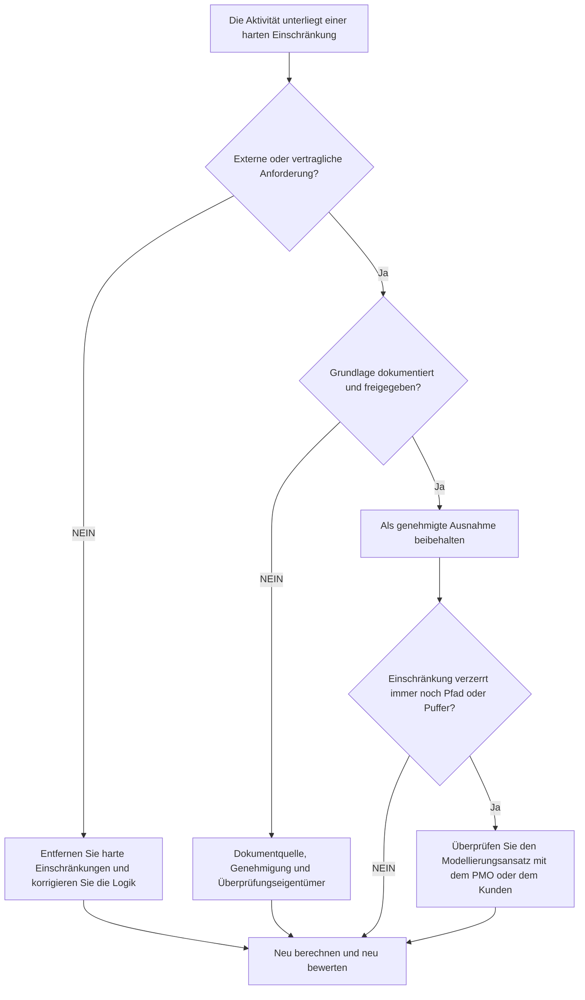

## Zweck

Dieser Leitfaden hilft Planern, harte Einschränkungen in Primavera P6 zu überprüfen und zu reduzieren. Es konzentriert sich auf Einschränkungen, die Aktivitätstermine stark steuern, insbesondere auf den obligatorischen Beginn und das obligatorische Ende.

## Bevor Sie beginnen

Sammeln Sie die folgenden Informationen, bevor Sie Maßnahmen ergreifen:

- Aktuelles Bewertungsergebnis für diese Metrik.
- Liste der Aktivitäten mit harten Einschränkungen.
- Einschränkungstyp und Einschränkungsdatum für jede Aktivität.
- Aktivitäts-ID, Aktivitätsname, WBS, Aktivitätsstatus, Start, Ende, Gesamtpuffer und kritischer oder längster Pfadstatus.
- Details zur Vorgänger- und Nachfolgerbeziehung.
- Vertrags-, Kunden-, Genehmigungs-, Zugangs-, Regulierungs- oder Übergabegrundlage für alle erforderlichen Einschränkungen.
- Basisplan- oder vorheriger Update-Vergleich, der zeigt, wann die Einschränkung hinzugefügt wurde.

## Verstehen Sie Ihr Ergebnis

Ein starkes Ergebnis sind keine unerklärlichen harten Einschränkungen.

Harte Einschränkungen können die normale CPM-Berechnung überschreiben oder stark einschränken. Sie gelten möglicherweise für Vertragsdaten, Zugangsfenster, Genehmigungsfreigaben, behördliche Haltepunkte oder eigentümergesteuerte Anforderungen, sollten jedoch nicht als Ersatz für fehlende Logik verwendet werden.

Ein schwaches Ergebnis bedeutet, dass der Terminplan vorgegebene Termine enthält, die möglicherweise die Prognose und nicht die Netzwerklogik steuern.

## Verbesserungsziel

Das Ziel sind 0 unerklärte harte Einschränkungen.

Das Ziel besteht darin, unnötige harte Einschränkungen zu beseitigen und alle tatsächlich erforderlichen Einschränkungen zu dokumentieren.

## Aktionsplan

### Schritt 1: Identifizieren Sie das Hauptproblem

Erstellen Sie ein P6-Layout oder einen Bericht, der nach Aktivitäten mit harten Einschränkungstypen filtert. Dazu gehören Aktivitäts-ID, Aktivitätsname, PSP, Aktivitätsstatus, Start, Ende, Einschränkungstyp, Einschränkungsdatum, Gesamtpuffer, kritischer oder längster Pfadstatus, Vorgänger und Nachfolger.

Überprüfen Sie jede eingeschränkte Aktivität und fragen Sie:

- Was ist die Ursache der harten Einschränkung?
- Ist es vertraglich oder extern erforderlich?
- Ersetzt es fehlende Vorgänger- oder Nachfolgerlogik?
- Erzwingt es ein Zieldatum, das im Terminplan vorhergesagt werden sollte?
- Beeinflusst es die Berichterstattung über den Gesamtpuffer, den kritischen Pfad oder die Meilensteine?
- Ist der Grund dokumentiert und genehmigt?

### Schritt 2: Wenden Sie die empfohlenen Fixes an

Wenn die harte Einschränkung nicht extern erforderlich ist, entfernen Sie sie und fügen Sie die CPM-Logik hinzu oder korrigieren Sie sie. Verwenden Sie Beziehungen, Aktivitätssequenzen, Kalender und realistische Dauern, um die Arbeit zu modellieren, anstatt Termine zu erzwingen.

Wenn die harte Einschränkung erforderlich ist, dokumentieren Sie die Grundlage. Erfassen Sie die Quelle, die Genehmigung, das Datum, den verantwortlichen Eigentümer und den Grund, warum dies nicht mit normaler Logik modelliert werden kann.

Wenn die Einschränkung verwendet wird, um ein Zieldatum beizubehalten, prüfen Sie, ob eine weichere Einschränkung, ein Meilenstein, eine Frist oder ein Berichtsvermerk besser geeignet wäre.

### Schritt 3: Häufige Blocker entfernen

Zu den häufigsten Blockaden gehören von alten Basisplans übernommene Einschränkungen, als Pflichttermine eingegebene Kundenzieldaten, Wiederherstellungspläne, die vorübergehende Einschränkungen hinterlassen, und fehlende Schnittstellenlogik.

Ein weiteres Hindernis ist die Annahme, dass eine harte Einschränkung akzeptabel ist, weil das Datum wichtig ist. Wichtige Termine sollten sichtbar sein, der Terminplan sollte aber dennoch erläutern, wie die Arbeit sie erreicht.

### Schritt 4: Validieren Sie die Änderungen

Berechnen Sie den Terminplan nach Korrekturen neu. Führen Sie die Metrik erneut aus und bestätigen Sie, dass die verbleibenden harten Einschränkungen genehmigt und dokumentiert sind.

Überprüfen Sie den gesamten Puffer, den kritischen oder längsten Pfad, die Meilensteindaten und die Ergebnisse des Terminplanvergleichs, um sicherzustellen, dass die Korrektur keine unerwartete Bewegung verursacht hat.

## Verbesserungsplan

### Tag 1: Überprüfung und Diagnose

Führen Sie die Metrik aus und gruppieren Sie die Ergebnisse nach WBS, Einschränkungstyp, Kritikalität und dokumentierter Basis.

### Tage 2–3: Implementieren Sie vorrangige Maßnahmen

Entfernen Sie zunächst unnötige harte Einschränkungen von kritischen, nahezu kritischen, vertraglichen und kurzfristigen Aktivitäten. Fügen Sie bei Bedarf fehlende Logik hinzu.

### Tage 4–5: Überwachen Sie die ersten Ergebnisse

Berechnen Sie den Terminplan neu und überprüfen Sie Puffer-Bewegungen, kritische Pfadänderungen und Meilensteinauswirkungen.

### Tag 6: Letzte Anpassungen

Lösen Sie verbleibende Ausnahmen mit dem Planer, dem Projektkontrollleiter, dem PMO-Prüfer oder dem Kundenvertreter.

### Tag 7: Neubewertung und Vergleich

Führen Sie die Bewertung erneut durch und vergleichen Sie das Ergebnis mit dem Zielschwellenwert.

## Fortschritt verfolgen

Verwenden Sie einen einfachen Tracker, um Korrekturen und Genehmigungen zu verwalten.

| Datum | Maßnahmen ergriffen | Erwartete Auswirkungen | Ergebnis / Beobachtung | Nächster Schritt |
| --- | --- | --- | --- | --- |
| [Datum] | Harte Einschränkungen überprüft | Identifizieren Sie auferlegte Datumskontrollen | [Beobachtetes Ergebnis] | Besitzer zuweisen |
| [Datum] | Unnötige harte Einschränkung entfernt | Stellen Sie die logikgesteuerte Berechnung wieder her | [Beobachtetes Ergebnis] | Terminplan neu berechnen |
| [Datum] | Dokumentierte genehmigte harte Einschränkung | Begründete Ausnahme beibehalten | [Beobachtetes Ergebnis] | Metrik neu bewerten |

## Wenn sich die Ergebnisse nicht verbessern

Wenn sich die Ergebnisse nicht verbessern, prüfen Sie, ob durch Importe, kopierte Fragmente, Basisplan-Updates oder Änderungen des Wiederherstellungsplans erneut harte Einschränkungen eingeführt werden.

Eskalieren Sie ungelöste Probleme, wenn sie sich auf den kritischen Pfad, vertragliche Meilensteine, Kundenberichte, Verzögerungsanalysen, Zahlungsereignisse oder Übergabetermine auswirken.

## Wartung

Überprüfen Sie diese Metrik bei jedem Update-Zyklus und vor des Basisplans-Genehmigung. Harte Einschränkungen sollten Teil der standardmäßigen Integritätsprüfungen des Terminplans sein, insbesondere nach größeren Neusequenzierungen, Wiederherstellungsplanungen und der Vorbereitung der Kundeneinreichung.

## Zusammenfassende Checkliste

- [ ] Aktuelles Ergebnis überprüft
- [ ] Zielschwelle bestätigt
- [ ] Hard-Constraint-Liste generiert
- [ ] Art und Datum der Einschränkung überprüft
- [ ] Externe Basis bestätigt
- [ ] Unnötige harte Einschränkungen entfernt
- [ ] Fehlende Logik korrigiert
- [ ] Genehmigte Ausnahmen dokumentiert
- [ ] Terminplan neu berechnet
- [ ] Puffer und kritischer Pfad überprüft
- [ ] Beurteilung wiederholt
- [ ] Nächste Schritte dokumentiert
## Verwandte Inhalte
- [Harte Einschränkungen in Primavera P6](03_blog_template.md)
- [Was für ein Terminplan ist](../../09b_blogs_de/01_WHAT%20A%20SCHEDULE%20IS/01_blog.md)
- [Robuste Logik](../../09b_blogs_de/02_ROBUST%20LOGIC/02_ROBUST%20LOGIC.md)
