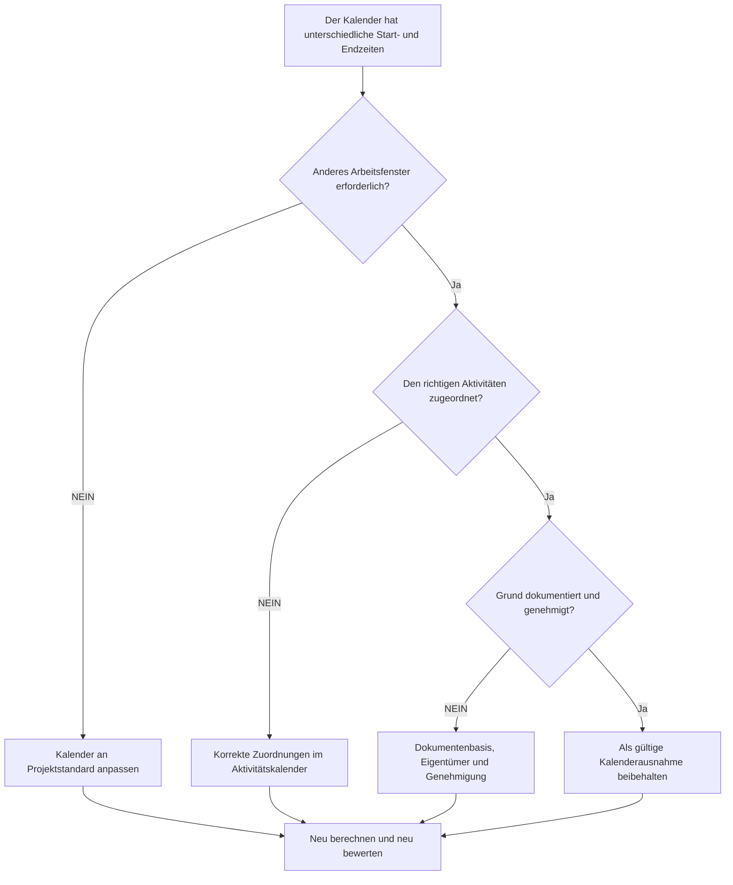

## Zweck

Dieser Leitfaden hilft Planern dabei, Primavera P6-Kalender zu überprüfen, die unterschiedliche Start- und Endzeiten für Arbeitstage verwenden. Es unterstützt die Prüfung der Terminplanqualität, indem es bestätigt, dass kalendarische Zeitunterschiede beabsichtigt, genehmigt und verstanden wurden.

## Bevor Sie beginnen

Sammeln Sie die folgenden Informationen, bevor Sie Maßnahmen ergreifen:

- Aktuelles Bewertungsergebnis für diese Metrik.
- Genehmigter Projektkalenderstandard und normales tägliches Arbeitsfenster.
- Liste von Kalendern mit unterschiedlichen Startzeiten, Endzeiten, Schichtfenstern oder Teiltagesmustern.
- Jedem betroffenen Kalender zugeordnete Aktivitäten.
- Kalendertyp, z. B. globaler Kalender, Projektkalender oder Ressourcenkalender.
- Kritische oder nahezu kritische Aktivitäten mit betroffenen Kalendern.
- Grund für jeden nicht standardmäßigen Kalender, z. B. Nachtschicht, Ausfallarbeiten, eingeschränkter Zugang oder spezieller Personalplan.

## Verstehen Sie Ihr Ergebnis

Ein starkes Ergebnis sind keine ungeklärten Kalender mit unterschiedlichen Start- oder Endzeiten.

Kalenderunterschiede können gültig sein, wenn die Arbeit tatsächlich unterschiedlichen Schichten, Zugriffsfenstern oder Ressourcenverfügbarkeiten folgt. Die Sorge besteht darin, dass Kalender je nach Tageszeit ohne klaren Grund abweichen.

Ein schwaches Ergebnis bedeutet, dass der Terminplan möglicherweise versteckte Kalenderannahmen enthält, die sich auf Datumsangaben, Puffer und Logikverhalten auswirken.

## Verbesserungsziel

Das Ziel sind 0 ungeklärte Kalender mit unterschiedlichen Start- oder Endzeiten.

Das Ziel besteht darin, zu bestätigen, ob die einzelnen Arbeitsfenster erforderlich, dokumentiert und nur den richtigen Aktivitäten zugeordnet sind.

## Aktionsplan

### Schritt 1: Identifizieren Sie das Hauptproblem

Erstellen Sie einen Kalenderüberprüfungsexport aus P6 oder einem Terminplanbewertungstool, der jeden Kalender, seine normale Startzeit, Endzeit, tägliche Stunden, Ausnahmen und zugewiesene Aktivitäten auflistet.

Überprüfen Sie jeden nicht standardmäßigen Kalender und fragen Sie:

- Was ist der genehmigte Standardarbeitstag für das Projekt?
- Welche Kalender verwenden unterschiedliche Start- oder Endzeiten?
- Sind die Unterschiede beabsichtigt oder zufällig?
- Für welche Aktivitäten wird jeder Kalender verwendet?
- Sind kritische oder nahezu kritische Aktivitäten betroffen?
- Ist die Kalenderdifferenz dokumentiert und genehmigt?

### Schritt 2: Wenden Sie die empfohlenen Fixes an

Wenn die Kalenderabweichung zufällig ist, stimmen Sie die Startzeit, Endzeit und die täglichen Arbeitsperioden mit dem genehmigten Projektstandard ab.

Wenn die Kalenderabweichung gültig ist, dokumentieren Sie den Grund. Häufige gültige Fälle sind Nachtschicht, Wochenendarbeit, Shutdown-Fenster, Zugangsbeschränkungen für Eigentümer, Umgebungseinschränkungen oder ressourcenspezifische Arbeitszeiten.

Wenn Aktivitäten dem falschen Kalender zugewiesen sind, korrigieren Sie die Zuordnung des Aktivitätskalenders, bevor Sie den Kalender selbst ändern. Ein gültiger Sonderkalender kann immer noch Probleme bereiten, wenn er zu weit gefasst wird.

### Schritt 3: Häufige Blocker entfernen

Zu den häufigsten Blockern gehören kopierte Kalender aus alten Terminplänen, importierte Kalender mit versteckten Zeiteinstellungen, Ressourcenkalender, die als Aktivitätskalender verwendet werden, und kleine Zeitunterschiede, die in Standard-Datumslayouts nicht sichtbar sind.

Ein weiterer Blocker ist die Überprüfung nur des Datums ohne Uhrzeit. In P6 kann die Tageszeit die Platzierung der Aktivität, den Puffer, das Beziehungsverhalten und die scheinbare eintägige Datumsverschiebung beeinflussen.

### Schritt 4: Validieren Sie die Änderungen

Berechnen Sie den Terminplan nach Kalenderkorrekturen neu. Führen Sie die Metrik erneut aus und bestätigen Sie, dass die verbleibenden Kalenderunterschiede gültig und dokumentiert sind.

Überprüfen Sie die Daten der betroffenen Aktivitäten, den gesamten Puffer, den kritischen oder längsten Pfad, die Beziehungsbeziehungen und die kurzfristigen Vorausschauberichte, um sicherzustellen, dass die Korrektur keine unerwartete Bewegung hervorgerufen hat.

## Verbesserungsplan

### Tag 1: Überprüfung und Diagnose

Führen Sie die Metrik aus und gruppieren Sie die Ergebnisse nach Kalender, Arbeitsfenster, Kalendertyp, zugewiesenen Aktivitäten und Kritikalität.

### Tage 2–3: Implementieren Sie vorrangige Maßnahmen

Korrigieren Sie zunächst versehentliche Kalenderzeitunterschiede und falsche Aktivitätskalenderzuweisungen für kritische, nahezu kritische und kurzfristige Aktivitäten.

### Tage 4–5: Überwachen Sie die ersten Ergebnisse

Berechnen Sie den Terminplan neu und überprüfen Sie Puffer-Bewegungen, Datumsverschiebungen, Meilensteinauswirkungen und Look-Ahead-Änderungen.

### Tag 6: Letzte Anpassungen

Lösen Sie verbleibende Kalenderausnahmen mit dem Planer, Disziplinverantwortlichen, Projektkontrollleiter oder PMO-Prüfer.

### Tag 7: Neubewertung und Vergleich

Führen Sie die Bewertung erneut durch und vergleichen Sie das Ergebnis mit dem Zielschwellenwert.

## Fortschritt verfolgen

Verwenden Sie einen einfachen Tracker, um Korrekturen und Genehmigungen zu verwalten.

| Datum | Maßnahmen ergriffen | Erwartete Auswirkungen | Ergebnis / Beobachtung | Nächster Schritt |
| --- | --- | --- | --- | --- |
| [Datum] | Überprüfte Start- und Endzeiten im Kalender | Identifizieren Sie nicht standardmäßige Arbeitsfenster | [Beobachtetes Ergebnis] | Besitzer zuweisen |
| [Datum] | Kalender an Projektstandard angepasst | Entfernen Sie versehentliche Zeitunterschiede | [Beobachtetes Ergebnis] | Terminplan neu berechnen |
| [Datum] | Dokumentierte gültige Kalenderausnahme | Behalten Sie das gerechtfertigte Arbeitsfenster bei | [Beobachtetes Ergebnis] | Metrik neu bewerten |

## Wenn sich die Ergebnisse nicht verbessern

Wenn sich die Ergebnisse nicht verbessern, prüfen Sie, ob nicht standardmäßige Kalender durch Importe, kopierte Terminpläne, Ressourcenzuweisungen oder Basisaktualisierungen wieder eingeführt werden.

Eskalieren Sie ungelöste Kalenderunterschiede, wenn sie sich auf den kritischen Pfad, die Kundenberichterstattung, Zahlungsmeilensteine, Ausfallarbeiten, Übergabetermine oder die kurzfristige Ausführung auswirken.

## Wartung

Überprüfen Sie diese Metrik während des Basisplans-Entwicklung, planen Sie Importe und jeden größeren Update-Zyklus. Kalenderzeiteinstellungen sollten Teil der Standardzustandsprüfungen des Terminplans sein, bevor Berichte ausgegeben werden.

## Zusammenfassende Checkliste

- [ ] Aktuelles Ergebnis überprüft
- [ ] Zielschwelle bestätigt
- [ ] Projektkalenderstandard bestätigt
- [ ] Nicht standardmäßige Kalenderzeiten identifiziert
- [ ] Zugewiesene Aktivitäten überprüft
- [ ] Kritische und nahezu kritische Auswirkungen überprüft
- [ ] Versehentliche Kalenderunterschiede korrigiert
- [ ] Gültige Kalenderausnahmen dokumentiert
- [ ] Terminplan neu berechnet
- [ ] Datums- und Puffer-Änderungen überprüft
- [ ] Beurteilung wiederholt
- [ ] Nächste Schritte dokumentiert
## Verwandte Inhalte
- [Kalender mit unterschiedlichen Start- und Endzeiten in Primavera P6](03_blog_template.md)
- [Was für ein Terminplan ist](../../09b_blogs_de/01_WHAT%20A%20SCHEDULE%20IS/01_blog.md)
- [Robuste Logik](../../09b_blogs_de/02_ROBUST%20LOGIC/02_ROBUST%20LOGIC.md)
