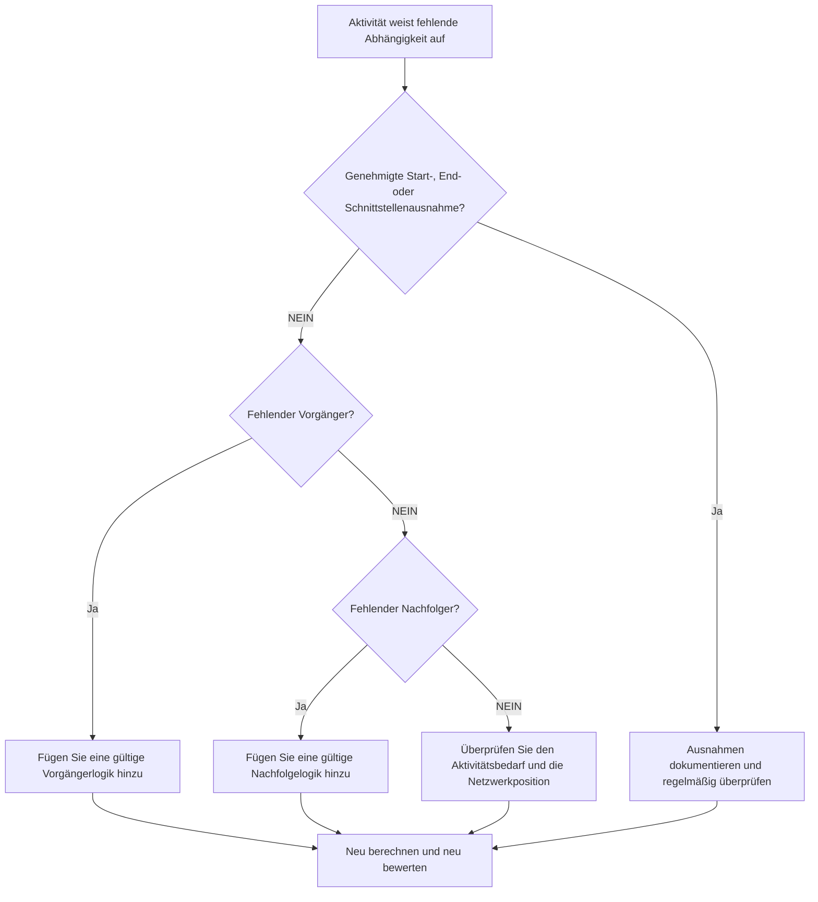

# Fehlende Abhängigkeiten in Primavera P6 - Verbesserungsleitfaden

## Zweck

Dieser Leitfaden hilft Planern, fehlende Vorgänger- oder Nachfolgerlogik in Primavera P6 zu identifizieren und zu korrigieren. Es unterstützt die Terminplanqualität, indem es die Vollständigkeit des CPM-Netzwerks verbessert.

## Bevor Sie beginnen

Sammeln Sie die folgenden Informationen, bevor Sie Maßnahmen ergreifen:

- Aktuelles Bewertungsergebnis für diese Metrik.
- Liste der Aktivitäten ohne Vorgänger.
- Liste der Aktivitäten ohne Nachfolger.
- Liste der Aktivitäten ohne Vorgänger- oder Nachfolgerlogik.
- Aktivitäts-ID, Aktivitätsname, PSP, Aktivitätstyp, Aktivitätsstatus, Start, Ende, Gesamtpuffer und Kalender.
- Genehmigter Projektstart, Projektende, externe Schnittstelle und vertragliche Ausnahmeliste.
- Aktuelle Update-Hinweise und verantwortliche Disziplin oder Paketeigentümer.

## Verstehen Sie Ihr Ergebnis

Ein starkes Ergebnis sind keine ungelösten Aktivitäten mit fehlender Abhängigkeitslogik.

Einige Aktivitäten können berechtigterweise keinen Vorgänger oder Nachfolger haben, wie z. B. der genehmigte Projektstartmeilenstein, der endgültige Abschlussmeilenstein oder genehmigte externe Schnittstellenmeilensteine. Diese sollten begrenzt und dokumentiert werden.

Ein schwaches Ergebnis bedeutet, dass der Terminplan Aktivitäten enthält, die nicht ordnungsgemäß mit dem CPM-Netzwerk verbunden sind.

## Verbesserungsziel

Das Ziel sind 0 ungelöste Aktivitäten mit fehlenden Abhängigkeiten.

Ziel ist es, jede Aktivität mit einer gültigen Vorgänger- und Nachfolgerlogik zu verknüpfen oder den genehmigten Grund zu dokumentieren, warum es sich um eine Ausnahme handelt.

## Aktionsplan

### Schritt 1: Identifizieren Sie das Hauptproblem

Erstellen Sie ein P6-Layout oder einen Bericht, der nach Aktivitäten ohne Vorgänger, ohne Nachfolger oder keines von beidem filtert. Schließen Sie Aktivitäts-ID, Aktivitätsname, WBS, Aktivitätstyp, Aktivitätsstatus, Start, Ende, Gesamtpuffer, Kalender, Einschränkungen, Vorgänger und Nachfolger ein.

Überprüfen Sie jede Aktivität und fragen Sie:

- Handelt es sich bei dieser Aktivität um einen genehmigten Projektstart- oder Projektabschlusspunkt?
- Handelt es sich um eine externe Schnittstelle, ein vom Eigentümer kontrolliertes Datum oder eine vertragliche Ausnahme?
- Welche Arbeiten müssen durchgeführt werden, bevor diese Aktivität beginnen kann?
- Welche Arbeit hängt vom Abschluss oder Beginn dieser Aktivität ab?
- Ist die Aktivität veraltet, dupliziert oder hat sie einen falschen Status?
- Welcher Eigentümer kann die tatsächliche Abhängigkeit bestätigen?

### Schritt 2: Wenden Sie die empfohlenen Fixes an

Fügen Sie für offene Starts eine Vorgängerlogik hinzu, die die tatsächliche Bedingung darstellt, die erforderlich ist, bevor die Aktivität beginnen kann. Dazu können vorherige Arbeiten, Genehmigungen, Zugang, Beschaffung, Designfreigabe, Inspektion oder Übergabe gehören.

Fügen Sie für offene Enden eine Nachfolgelogik hinzu, die darstellt, was von der Aktivität abhängt. Dazu können Folgearbeiten, Tests, Inbetriebnahme, Umsatz, Abschluss oder ein Fertigstellungsmeilenstein gehören.

Bestätigen Sie bei isolierten Aktivitäten ohne Vorgänger und ohne Nachfolger, ob die Aktivität noch benötigt wird. Wenn es sich um eine gültige Arbeit handelt, verbinden Sie es mit dem Netzwerk. Wenn es veraltet ist, entfernen oder schließen Sie es gemäß dem Projektkontrollverfahren.

### Schritt 3: Häufige Blocker entfernen

Zu den häufigsten Blockern gehören kopierte Aktivitäten, unvollständige Fragmente, unklare Übergaben zwischen Disziplinen, fehlende Schnittstelleninformationen und der Druck, Aktivitäten zu laden, bevor die Sequenzierung bekannt ist.

Ein weiterer Blocker ist das Hinzufügen von Platzhalterbeziehungen nur zur Übergabe der Metrik. Beziehungen sollten echte Abhängigkeiten darstellen, keine künstlichen Verbindungen.

### Schritt 4: Validieren Sie die Änderungen

Berechnen Sie den Terminplan nach Korrekturen neu. Führen Sie die Metrik erneut aus und bestätigen Sie, dass jede verbleibende Aktivität entweder verbunden oder als genehmigte Ausnahme dokumentiert ist.

Überprüfen Sie den gesamten Puffer, den kritischen oder längsten Pfad, die Meilensteindaten und die kurzfristigen Look-Ahead-Berichte, um sicherzustellen, dass die hinzugefügte Logik keine unerwartete Bewegung verursacht hat.

## Verbesserungsplan

### Tag 1: Überprüfung und Diagnose

Führen Sie die Metrik- und Gruppenergebnisse für fehlende Vorgänger, fehlende Nachfolger, isolierte Aktivitäten, gültige Ausnahmen und veraltete Aktivitäten aus.

### Tage 2–3: Implementieren Sie vorrangige Maßnahmen

Korrigieren Sie zuerst kritische, nahezu kritische, vertragliche und kurzfristige Aktivitäten. Fügen Sie gültige Logik hinzu und entfernen Sie gegebenenfalls veraltete Aktivitäten.

### Tage 4–5: Überwachen Sie die ersten Ergebnisse

Berechnen Sie den Terminplan neu und überprüfen Sie Puffer, kritischen Pfad, Voraussichtstermine und Meilensteinauswirkungen.

### Tag 6: Letzte Anpassungen

Klären Sie verbleibende Abhängigkeitsfragen mit Disziplinarleitern, Paketeigentümern, Bauleitern oder Projektkontrollleitern.

### Tag 7: Neubewertung und Vergleich

Führen Sie die Bewertung erneut durch und vergleichen Sie das Ergebnis mit dem Zielschwellenwert.

## Fortschritt verfolgen

Verwenden Sie einen einfachen Tracker, um Korrekturen und Genehmigungen zu verwalten.

| Datum | Maßnahmen ergriffen | Erwartete Auswirkungen | Ergebnis / Beobachtung | Nächster Schritt |
| --- | --- | --- | --- | --- |
| [Datum] | Fehlende Abhängigkeiten überprüft | Identifizieren Sie offene Anfänge und offene Enden | [Beobachtetes Ergebnis] | Besitzer zuweisen |
| [Datum] | Vorgängerlogik hinzugefügt | Verbessern Sie die Startlogik der Aktivität | [Beobachtetes Ergebnis] | Terminplan neu berechnen |
| [Datum] | Nachfolgelogik hinzugefügt | Verbessern Sie die Kontinuität des Aktivitätsendes | [Beobachtetes Ergebnis] | Metrik neu bewerten |

## Wenn sich die Ergebnisse nicht verbessern

Wenn sich die Ergebnisse nicht verbessern, prüfen Sie, ob neue Aktivitäten ohne Logik hinzugefügt werden, importierte Fragmente unvollständig sind oder Ausnahmeregeln zu locker sind.

Eskalieren Sie ungelöste Probleme, wenn sie sich auf den kritischen Pfad, die Kundenberichterstattung, Zahlungsmeilensteine, die Übergabe, die Beschaffung oder die kurzfristige Ausführung auswirken.

## Wartung

Überprüfen Sie diese Metrik bei jedem Update-Zyklus, nach geplanten Importen und vor des Basisplans-Genehmigung. Fehlende Abhängigkeiten sollten Teil der standardmäßigen Integritätsprüfungen des Terminplans sein.

## Zusammenfassende Checkliste

- [ ] Aktuelles Ergebnis überprüft
- [ ] Zielschwelle bestätigt
- [ ] Offene Starts überprüft
- [ ] Offene Ausführungen überprüft
- [ ] Isolierte Aktivitäten überprüft
- [ ] Gültige Ausnahmen dokumentiert
- [ ] Fehlende Vorgängerlogik hinzugefügt
- [ ] Fehlende Nachfolgelogik hinzugefügt
- [ ] Veraltete Aktivitäten behoben
- [ ] Terminplan neu berechnet
- [ ] Beurteilung wiederholt
- [ ] Nächste Schritte dokumentiert
## Verwandte Inhalte
- [Fehlende Abhängigkeiten in Primavera P6 - Überblick](01_overview_template.md)
- [Fehlende Abhängigkeiten in Primavera P6](03_blog_template.md)
- [Was für ein Terminplan ist](../../09b_blogs_de/01_WHAT%20A%20SCHEDULE%20IS/01_blog.md)
- [Robuste Logik](../../09b_blogs_de/02_ROBUST%20LOGIC/02_ROBUST%20LOGIC.md)
