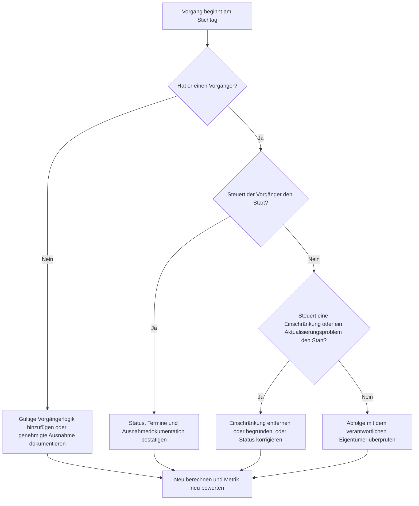

## Zweck

Dieser Leitfaden hilft Terminplanern und Projektsteuerungsteams, Vorgänge zu reduzieren oder zu eliminieren, die am Primavera P6-Stichtag ohne gültige Vorgängerlogik starten sollen. Er gilt für Terminqualitätsprüfungen, PMO-Gesundheitschecks und die Validierung im Aktualisierungszyklus.

Das Ziel ist zu bestätigen, dass kurzfristige Arbeit durch klare CPM-Logik unterstützt wird und dass Vorgänge nicht nur aufgrund fehlender Beziehungen, Einschränkungen, manueller Termine oder unvollständiger Fortschrittsaktualisierungen am Stichtag beginnen.

## Bevor Sie beginnen

Sammeln Sie die folgenden Informationen, bevor Sie Maßnahmen ergreifen:

- Aktuelles Bewertungsergebnis für diese Metrik.
- Projektdatum (Data Date) aus der neuesten Terminplanberechnung.
- Liste der offenen oder nicht gestarteten Vorgänge mit einem Startdatum gleich dem Stichtag.
- Vorgänger- und Nachfolgerbeziehungsdetails für jeden Vorgang.
- Einschränkungen, erwartete Termine, Ist-Termine und Kalenderzuweisungen.
- In P6 verwendete Terminplanoptionen für die Aktualisierung, einschließlich Retained Logic oder Progress Override-Einstellungen, sofern relevant.
- Etwaige genehmigte Ausnahmen, wie Projektstart-Vorgänge, externe Schnittstellen-Meilensteine oder vom Auftraggeber angeordnete Starts.

## Ihr Ergebnis verstehen

Ein starkes Ergebnis sind null ungelöste Vorgänge, die am Stichtag ohne steuernde Vorgängerlogik beginnen. Das bedeutet, dass die aktuelle und kurzfristige Arbeit mit dem Terminplannetzwerk verbunden ist und der Stichtag keine fehlende Sequenzierung verbirgt.

Ein akzeptables Ergebnis kann eine kleine Anzahl dokumentierter Ausnahmen umfassen. Diese sollten überprüft und genehmigt, nicht ignoriert werden. Zum Beispiel benötigt ein Ausführungsstartmeilenstein (Notice-to-Proceed) oder ein extern genehmigter Vorgang möglicherweise keinen normalen Vorgänger, aber der Grund sollte für Prüfer sichtbar sein.

Ein schwaches Ergebnis bedeutet, dass mehrere Vorgänge am Stichtag ohne klaren logischen Treiber beginnen. Dies kann auf offene Starts, fehlende Vorgängerbeziehungen, übermäßige Einschränkungen, unvollständige Fortschrittsaktualisierungen oder Vorgänge hinweisen, die nach der neuesten Aktualisierung nicht ordnungsgemäß neu sequenziert wurden.

## Verbesserungsziel

Das Ziel sind 0 ungelöste Vorgänge, die am Stichtag ohne gültige steuernde Logik beginnen.

Das Verbesserungsziel ist nicht nur, die Anzahl zu reduzieren. Das tiefere Ziel ist sicherzustellen, dass jeder Vorgang nahe dem Stichtag einen verteidigbaren Grund für seinen prognostizierten Start hat. Nach der Korrektur sollte jeder betroffene Vorgang entweder eine angemessene Vorgängerlogik, eine dokumentierte Ausnahme oder einen korrigierten Status/Terminzustand haben.

## Aktionsplan

### Schritt 1: Das Hauptproblem identifizieren

Erstellen Sie ein P6-Layout oder einen Bericht, das/der nach offenen oder nicht gestarteten Vorgängen mit einem Startdatum gleich dem Stichtag filtert. Fügen Sie Spalten für Vorgangs-ID, Vorgangsname, PSP (WBS), Start, Ende, Status, Gesamtpuffer, Kalender, primäre Einschränkung, Vorgänger, Nachfolger und steuernde Beziehungsindikatoren, sofern verfügbar, hinzu.

Überprüfen Sie jeden Vorgang und fragen Sie:

- Hat der Vorgang Vorgänger?
- Wenn Vorgänger vorhanden sind, steuern sie den Start tatsächlich?
- Wird der Vorgang durch eine Einschränkung gehalten oder verschoben?
- Fehlt dem Vorgang ein Ist-Start oder eine Fortschrittsaktualisierung?
- Ist der Vorgang eine gültige Ausnahme, z. B. ein Projektstart-Meilenstein?
- Gehört der Vorgang zu einem PSP-Bereich, in dem die Logik generell schwach ist?

Gruppieren Sie die Ergebnisse in praktische Ursachen: fehlende Vorgänger, nicht steuernde Vorgänger, Einschränkungen oder erwartete Termine, Aktualisierungs-/Statusfehler oder genehmigte Ausnahmen.

### Schritt 2: Die empfohlenen Korrekturen anwenden

Beginnen Sie mit fehlender oder schwacher Logik. Fügen Sie gültige Vorgängerbeziehungen hinzu, die die echte Arbeitsabfolge darstellen, wie Ende-Anfang-, Anfang-Anfang- oder Ende-Ende-Beziehungen, wo angemessen. Vermeiden Sie das Hinzufügen von Beziehungen nur zur Erfüllung der Metrik; jede Beziehung sollte eine echte Bau-, Engineering-, Beschaffungs-, Zugangs-, Genehmigungs- oder Übergabeabhängigkeit widerspiegeln.

Überprüfen Sie als nächstes Einschränkungen. Wenn ein Vorgang aufgrund einer Starteinschränkung am Stichtag beginnt, bestätigen Sie, ob die Einschränkung vertraglich oder betrieblich gerechtfertigt ist. Entfernen Sie unnötige Einschränkungen und erlauben Sie dem Vorgang, durch Logik gesteuert zu werden. Wenn die Einschränkung gültig ist, dokumentieren Sie den Grund und bestätigen Sie, dass sie den kritischen Weg nicht verzerrt.

Überprüfen Sie den Fortschrittsstatus. Wenn die Arbeit bereits begonnen hat, aktualisieren Sie den Ist-Start und die verbleibende Dauer korrekt. Wenn die Arbeit nicht begonnen hat, bestätigen Sie, dass der prognostizierte Start am Stichtag bleiben sollte. Ein Vorgang sollte nicht startbereit erscheinen, nur weil der Aktualisierungszyklus ihn auf das aktuelle Datum gezogen hat.

Berechnen Sie den Terminplan nach den Änderungen neu und überprüfen Sie die betroffenen Vorgänge erneut. Bestätigen Sie, dass das Startdatum jetzt durch Logik gesteuert, korrekt bearbeitet oder als genehmigte Ausnahme dokumentiert ist.

### Schritt 3: Häufige Hindernisse beseitigen

Zu den häufigen Hindernissen gehören unklares Felderfeedback, fehlende Schnittstelleninformationen und Druck, kurzfristige Arbeit als bereit darzustellen. Lösen Sie diese, indem Sie die betroffenen Vorgänge mit Fachbereichsleitern, Bauleitern, Beschaffungsverantwortlichen oder Paketmanagern überprüfen.

Ein weiteres häufiges Hindernis ist der Missbrauch von Einschränkungen als Ersatz für Logik. Einschränkungen können in einigen Fällen erforderlich sein, sollten aber das Terminplannetzwerk nicht ersetzen. Wenn eine Einschränkung beibehalten wird, dokumentieren Sie, warum sie existiert und wie sie den Puffer und den längsten Weg beeinflusst.

Überprüfen Sie auch, ob das Problem durch Terminplanberechnungseinstellungen oder Aktualisierungspraktiken verursacht wird. Wenn Progress Override, Retained Logic, außerplanmäßiger Fortschritt oder unvollständige Aktualisierung das Ergebnis beeinflusst, stimmen Sie die Aktualisierungsmethode mit dem Projektsteuerungsverfahren ab, bevor Sie die Metrik neu bewerten.

### Schritt 4: Die Änderungen validieren

Validieren Sie den korrigierten Terminplan vor der nächsten Bewertung. Führen Sie den Filter für offene oder nicht gestartete Vorgänge, die am Stichtag ohne steuernde Logik beginnen, erneut aus. Bestätigen Sie, dass jedes verbleibende Element entweder korrigiert oder als genehmigte Ausnahme dokumentiert ist.

Überprüfen Sie Gesamtpuffer, längsten Weg und kurzfristige Vorausschauvorgänge nach der Neuberechnung. Eine Logikkorrektur kann den kritischen Weg ändern oder zusätzliche Sequenzierungsprobleme aufdecken. Wenn die Terminplanbewegung erheblich ist, kommunizieren Sie die Auswirkung an den Projektsteuerungsleiter oder PMO-Prüfer.

## Verbesserungszeitplan

### Tag 1: Überprüfen und Diagnostizieren

Führen Sie die Metrik aus, bestätigen Sie den Stichtag und erstellen Sie die Vorgangsliste. Trennen Sie die Ergebnisse in fehlende Logik, nicht steuernde Logik, Einschränkungen, Statusfehler und potenzielle Ausnahmen.

### Tage 2–3: Prioritätsmaßnahmen umsetzen

Korrigieren Sie zuerst die wirkungsstärksten Vorgänge, insbesondere kritische oder nahezu kritische Vorgänge. Fügen Sie gültige Vorgängerlogik hinzu, entfernen Sie unnötige Einschränkungen, aktualisieren Sie falschen Status und dokumentieren Sie Ausnahmen.

### Tage 4–5: Frühe Ergebnisse überwachen

Berechnen Sie den Terminplan neu und überprüfen Sie, ob die betroffenen Vorgänge jetzt logikgesteuert sind. Prüfen Sie auf unerwartete Änderungen am Gesamtpuffer, längsten Weg und Meilensteinterminen.

### Tag 6: Abschließende Anpassungen

Lösen Sie verbleibende Hindernisse mit dem verantwortlichen Fachbereich oder Paketverantwortlichen. Bestätigen Sie, dass etwaige beigehaltene Ausnahmen gerechtfertigt und klar dokumentiert sind.

### Tag 7: Neu bewerten und vergleichen

Führen Sie die Bewertung erneut durch und vergleichen Sie das neue Ergebnis mit dem vorherigen Ergebnis und dem Zielgrenzwert. Bestätigen Sie, ob die Metrik jetzt bei null ungelösten Vorgängen liegt oder ob weitere Maßnahmen erforderlich sind.

## Fortschritt verfolgen

Verwenden Sie einen einfachen Tracker zur Verwaltung von Korrekturen und Genehmigungen.

| Datum | Durchgeführte Maßnahme | Erwartete Auswirkung | Ergebnis / Beobachtung | Nächster Schritt |
| --- | --- | --- | --- | --- |
| [Datum] | Vorgänge überprüft, die am Stichtag ohne steuernde Logik beginnen | Fehlende oder schwache Logik identifizieren | [Beobachtetes Ergebnis] | Korrekturen dem verantwortlichen Eigentümer zuweisen |
| [Datum] | Gültige Vorgängerbeziehungen hinzugefügt | CPM-Sequenzierung verbessern | [Beobachtetes Ergebnis] | Neu berechnen und Pufferauswirkung überprüfen |
| [Datum] | Einschränkungen entfernt oder begründet | Künstliche Starts reduzieren | [Beobachtetes Ergebnis] | Verbleibende Ausnahmen bestätigen |
| [Datum] | Falschen Vorgangsstatus aktualisiert | Aktualisierungsgenauigkeit verbessern | [Beobachtetes Ergebnis] | Bewertung erneut durchführen |

## Wenn sich die Ergebnisse nicht verbessern

Wenn sich das Ergebnis nicht verbessert, überprüfen Sie, ob dieselben Vorgänge immer noch auffällig sind oder ob neue Vorgänge am Stichtag erscheinen. Wiederholte Fehler können auf ein umfassenderes Terminplanentwicklungsproblem hinweisen, wie unvollständige Logik in einem PSP-Bereich, schwache Aktualisierungsdisziplin oder inkonsistente Verwendung von Einschränkungen.

Eskalieren Sie anhaltende Probleme an den Projektsteuerungsleiter, Planungsmanager oder PMO-Prüfer. Bei größeren Terminplänen sollten Sie einen gezielten Logikprüfungs-Workshop für die betroffenen Arbeitspakete in Betracht ziehen. Wenn der Terminplan für vertragliche Berichterstattung, Verzögerungsanalyse oder Earned-Value-Prognose verwendet wird, sollten ungelöste Elemente als Qualitätsproblem behandelt werden.

## Pflege

Überprüfen Sie diese Metrik während jedes Aktualisierungszyklus vor der Terminplanausgabe. Die Prüfung sollte Teil der standardmäßigen Termingesundheitsprüfung sein, insbesondere nach Fortschrittsaktualisierungen, Neusequenzierung, größeren Umfangsänderungen oder der Wiederherstellungsplanung.

Gute Pflegegewohnheiten umfassen das Sichtbarhalten von Vorgänger- und Nachfolgerspalten in P6-Layouts, die Überprüfung offener Starts vor jeder Einreichung, die Dokumentation genehmigter Ausnahmen und die Überprüfung, ob die Stichtagsverschiebung keine neue Gruppe ungesteuerter Vorgänge erzeugt.

## Zusammenfassende Checkliste

- [ ] Aktuelles Ergebnis überprüft
- [ ] Zielgrenzwert bestätigt
- [ ] Stichtag bestätigt
- [ ] Am Stichtag beginnende Vorgänge identifiziert
- [ ] Hauptproblem identifiziert
- [ ] Fehlende oder schwache Logik korrigiert
- [ ] Einschränkungen überprüft und begründet oder entfernt
- [ ] Statusdaten geprüft
- [ ] Genehmigte Ausnahmen dokumentiert
- [ ] Terminplan neu berechnet
- [ ] Ergebnisse überwacht
- [ ] Bewertung wiederholt
- [ ] Nächste Schritte dokumentiert
