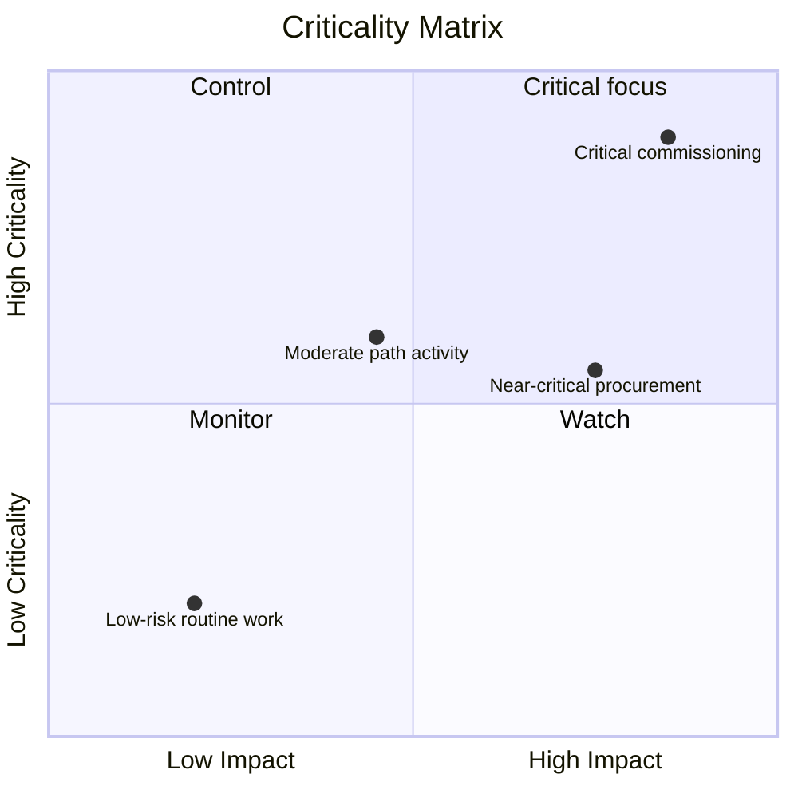

# Criticality Matrix

A criticality matrix is a visual or analytical method used to classify and prioritize project activities based on how critical they are to project completion. In a Primavera P6 context, it helps project managers, planners, and PMO reviewers identify which activities create the greatest schedule risk.

The critical path tells the current deterministic story of the schedule. A criticality matrix goes a step further. It helps the team understand which activities are already critical, which are close to becoming critical, and which would cause serious impact if they slip.

This matters because the activity that is critical today is not always the only activity that deserves attention. A near-critical activity with high delay impact may become tomorrow's problem. A long-duration procurement activity may not be on the current critical path, but it may carry enough risk to justify close control.

## What Criticality Means in P6

In Primavera P6, criticality usually refers to whether an activity can affect the project finish date if it is delayed. Traditionally, P6 identifies critical activities using total float or longest path settings.

The common deterministic definition is simple:

- Critical activities are activities with zero or negative float.
- These activities are on, or tied closely to, the critical path.
- If they are delayed, the project finish date is likely to be delayed.

That definition is useful, but it is not complete. It is based on one calculated schedule condition. It does not fully explain uncertainty, probability, or the size of the impact if an activity slips.

A criticality matrix expands the discussion from "is this activity critical today?" to "how likely is this activity to become critical, and how much damage could it cause?"

## What a Criticality Matrix Combines

A criticality matrix normally combines two dimensions.

The first dimension is schedule sensitivity or likelihood. This can be measured by how often an activity becomes critical during Monte Carlo simulation, or by how close it is to critical based on total float or near-critical thresholds.

The second dimension is impact. This means the severity of delay if the activity slips. Impact may be based on activity duration, delay effect on the project finish, sensitivity index, cost exposure, contractual milestone impact, or management judgment.

Together, these dimensions help the team prioritize activities.

This type of view is useful because it separates activities that merely appear in the critical filter from activities that deserve active management attention.

## A Simple Matrix Structure

A basic criticality matrix can be shown as a grid:

| Criticality / Impact | Low Impact | Medium Impact | High Impact |
| --- | --- | --- | --- |
| Low Criticality | Monitor | Monitor | Watch |
| Medium Criticality | Review | Control | High priority |
| High Criticality | Control | High priority | Critical focus |

The exact labels can change by organization, but the idea remains the same. Activities with low criticality and low impact can be monitored. Activities with high criticality and high impact require focused control.

## P6 Data Used in the Matrix

Primavera P6 does not usually provide a built-in criticality matrix view by default. The matrix is commonly built using P6 activity data combined with external analysis.

Useful P6 fields include:

- Total Float.
- Free Float.
- Activity duration.
- Remaining Duration.
- Activity Status.
- Start and Finish dates.
- Constraints.
- Relationship logic.
- Calendar.
- WBS or activity codes.
- Critical or longest path indicators.

This data gives the deterministic schedule view. It shows the current calculated path, near-critical work, constrained activities, and activities with long remaining exposure.

## Risk Analysis Inputs

To make the matrix more powerful, the team can add probabilistic schedule risk data from Monte Carlo analysis. This may come from tools such as Primavera Risk Analysis or other risk simulation platforms.

Important risk metrics include Criticality Index, Total Float, Schedule Sensitivity Index, and duration or impact value.

Criticality Index, often called CI, shows the percentage of simulations where an activity appears on the critical path. For example, if an activity has CI = 80%, it was critical in 80% of the simulated scenarios.

Total Float shows how close an activity is to affecting the project finish in the deterministic schedule. Near-zero float is a warning sign.

Schedule Sensitivity Index combines criticality and impact. It helps show not only whether the activity becomes critical, but also whether it meaningfully affects the outcome.

Duration or impact value helps estimate severity. A longer activity, a high-risk procurement package, or a task connected to a contractual milestone may carry more impact if delayed.

## Example

Consider the following simplified activity set:

| Activity | Float | Criticality Index | Duration | Matrix Result |
| --- | ---: | ---: | ---: | --- |
| A | 0 days | 95% | 20 days | Critical focus |
| B | 5 days | 60% | 15 days | High priority |
| C | 20 days | 15% | 10 days | Monitor |

Activity A belongs in the high criticality and high impact area. It has no float, appears critical in most simulations, and has a long duration. It deserves focused control.

Activity B may not be as urgent as Activity A, but it still deserves attention. It has limited float and a meaningful probability of becoming critical.

Activity C has more float and lower criticality. It should not be ignored, but it does not require the same level of management focus.

## Why It Is Useful

A criticality matrix helps the project team avoid relying only on the single deterministic critical path. The deterministic path is important, but it is only one view of the schedule.

The matrix helps teams:

- Prioritize what to monitor closely.
- Focus mitigation on key risk activities.
- Identify near-critical activities before they become critical.
- Understand probabilistic schedule risk.
- Compare likelihood and impact in one view.
- Communicate schedule risk to management more clearly.

For PMO reporting, this is especially useful because it translates schedule complexity into a decision framework. Instead of presenting hundreds of activities, the team can show which activities are in "critical focus," "high priority," "control," or "monitor" zones.

## A Simple Way to Build One

Start by exporting activity data from P6. Include Activity ID, Activity Name, WBS, Total Float, Remaining Duration, Start, Finish, Calendar, constraints, and critical or longest path indicators.

Then add optional risk analysis fields, such as Criticality Index and Schedule Sensitivity Index. If simulation data is not available, use practical thresholds based on float and duration. For example, high criticality might mean total float less than or equal to 0 days, or CI above 70%. Medium criticality might mean near-critical float or CI between 40% and 70%.

Define impact thresholds. A high-impact activity may be long duration, tied to a contractual milestone, part of a high-risk package, or shown by simulation to affect the project finish.

Finally, plot the activities in Excel, Power BI, or another reporting tool. The result does not need to be complicated. The value comes from making priority visible.

## Use Judgment

A criticality matrix is a decision-support tool, not an automatic answer. Thresholds should be reviewed by the project controls team and adjusted to the project type, contract sensitivity, and schedule maturity.

Also remember that the matrix depends on schedule quality. If the P6 schedule has missing logic, unrealistic durations, hard constraints, poor calendars, or weak status updates, the matrix will inherit those weaknesses.

The best use of the matrix is to combine analytical output with professional scheduling judgment.

## Conclusion

A criticality matrix ranks project activities by how likely they are to become critical and how much impact they would have if delayed. It uses P6 data such as total float, duration, constraints, and logic, and it can be strengthened with Monte Carlo results such as Criticality Index and Schedule Sensitivity Index.

For project managers and PMO reviewers, the matrix turns schedule risk into a clearer management conversation. It helps the team focus on the activities that matter most, not only the activities that appear in today's critical filter.

Used well, a criticality matrix helps the project team move from reactive reporting to proactive schedule control.

## Related Content
- [Critical Path or Float Path Starting with Constraint](../../metrics/09_cp_or_float_path_starting_with_constraint/02_guide_template.md)
- [Critical Path](../03_CRITICAL%20PATH/03_CRITICAL%20PATH.md)
- [Activity Types in P6](../05_ACTIVITY%20TYPES%20IN%20P6/05_ACTIVITY%20TYPES%20IN%20P6.md)
