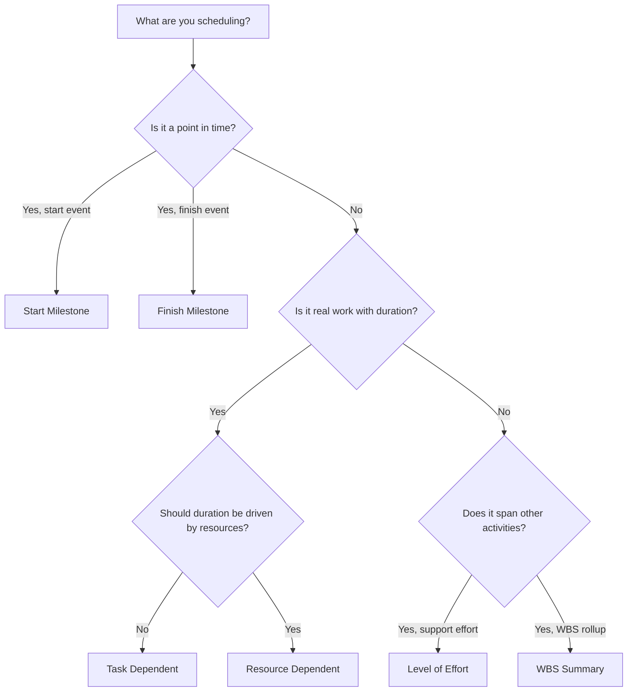

# Activity Types in P6

Activity Type is one of the most important setup fields in Primavera P6. It tells P6 what kind of activity it is calculating and how that activity should behave in the schedule.

Many schedulers focus first on activity names, durations, dates, and relationships. Those are essential, but the activity type matters too. A task activity, a milestone, a Level of Effort activity, and a WBS Summary activity do not behave the same way. Choosing the wrong type can distort dates, progress, resource loading, float, and reporting.

The purpose of this blog is to explain the main activity types available in P6, what each one is used for, and how to decide which type fits the work being planned.

## Why Activity Type Matters

An activity type should match the scheduling purpose of the item. Is it real work with a duration? Is it a point in time? Is it a summary of work that spans other activities? Is it effort that depends on resources rather than a fixed task duration?

If the activity type does not match the purpose, the schedule can become confusing. A milestone with duration is not a milestone. A normal task used as a summary may hide logic. A Level of Effort activity used to drive work can distort the critical path. A Resource Dependent activity used incorrectly may calculate differently than expected.

In P6, activity type helps answer a practical question: how should this item behave when the schedule is calculated?

## The Main Activity Types in P6

The most common Primavera P6 activity types are:

- Task Dependent.
- Resource Dependent.
- Level of Effort.
- Start Milestone.
- Finish Milestone.
- WBS Summary.

Each has a different purpose.

## Task Dependent Activities

Task Dependent is the most common activity type in P6. Use it for normal planned work where the activity duration is controlled by the activity's assigned calendar, not by individual resource calendars.

Examples include:

- Excavate foundation.
- Install cable tray.
- Pour concrete slab.
- Prepare design package.
- Perform pressure test.

Task Dependent activities are usually the best choice for most construction, engineering, procurement, testing, and commissioning tasks. They are clear, stable, and easy to understand. The scheduler defines the duration, assigns the activity calendar, connects the logic, and P6 calculates dates.

Use Task Dependent when the activity represents a discrete scope of work and the work duration should not change based on resource calendars.

## Resource Dependent Activities

Resource Dependent activities are used when the duration and scheduling behavior should be influenced by the resources assigned to the activity. In this case, P6 can use resource calendars and resource availability to calculate how the activity is scheduled.

This can be useful when resource availability is a real driver of the work. For example, a specialized crew, inspector, or equipment resource may only be available on certain days or shifts.

Examples may include:

- Specialized inspection by a limited inspector.
- Vendor technician support.
- Equipment calibration using a scarce resource.
- Resource-driven maintenance work.

Resource Dependent activities should be used with care. If the project is not actively resource-loaded or resource-leveled, using Resource Dependent by habit can create confusion. Many schedules use Task Dependent as the default because the activity calendar is the main scheduling basis.

Use Resource Dependent when resources and their calendars are intended to influence the schedule calculation.

## Start Milestone

A Start Milestone is a zero-duration activity that represents the start of an event, phase, access window, authorization, or major work condition.

Examples include:

- Notice to Proceed received.
- Area access granted.
- Construction start.
- Design package released for execution.
- Start commissioning window.

Start Milestones do not represent work being performed. They represent a point in time that allows work to begin or marks a significant start event.

Use a Start Milestone when the schedule needs to mark the beginning of something important. It should normally be connected with logic that explains what drives the milestone and what work it releases.

## Finish Milestone

A Finish Milestone is a zero-duration activity that represents completion of an event, phase, deliverable, or contractual point.

Examples include:

- Mechanical completion achieved.
- System turnover complete.
- Permit approval received.
- Substantial completion.
- Final completion.

Finish Milestones are useful for reporting because they mark achievement. They should not be used as normal work activities. If effort is required to reach the milestone, that effort should be modeled as tasks leading into the milestone.

Use a Finish Milestone when the schedule needs to mark that something has been completed or achieved.

## Level of Effort

Level of Effort, often called LOE, is used for activities that span other work rather than drive the project directly. LOE activities are commonly used for management, supervision, inspection support, project controls, or ongoing coordination.

Examples include:

- Project management support.
- Site supervision.
- Engineering management.
- Construction management.
- Quality inspection support.

An LOE activity normally derives its dates from other activities. It should represent support effort that continues while other work is happening. It is not usually intended to be a driver of discrete construction or engineering tasks.

Use LOE when the activity represents ongoing support, oversight, or management that should span a group of activities.

Be careful with LOE logic. If an LOE is linked incorrectly, it may appear to drive dates or distort float. LOE activities should be reviewed during schedule quality checks, especially when they appear on the critical path or have unusual FS or SF relationships.

## WBS Summary

WBS Summary activities summarize a group of activities within a WBS element. Their dates are derived from the activities under the WBS, not from their own detailed logic.

Examples include:

- Engineering summary.
- Procurement summary.
- Area A construction summary.
- System 01 commissioning summary.

WBS Summary activities can be useful for high-level reporting, but they should not replace real activities or logic. They are rollup tools, not execution tasks.

Use WBS Summary activities when you need a summary-level view of a WBS section, and only when the project reporting method supports their use.

## Choosing the Right Type

A simple rule helps:

- If it is real work with duration, use Task Dependent unless resource calendars should drive it.
- If resource availability should drive it, use Resource Dependent.
- If it is a start event, use Start Milestone.
- If it is a completion event, use Finish Milestone.
- If it is ongoing support that spans other work, use Level of Effort.
- If it is a reporting rollup, use WBS Summary.

The activity type should make the schedule easier to understand. If reviewers need to ask why a milestone has duration, why an LOE is driving work, or why a WBS Summary appears in detailed logic, the activity type may be wrong.

## Common Mistakes

One common mistake is using milestones as stand-ins for work. A milestone should mark a point in time. If work is required, create activities for the work.

Another mistake is using LOE activities to control discrete work. LOE should support or span work, not replace logic between real activities.

A third mistake is using Resource Dependent without a resource-driven scheduling process. If resource calendars are not being maintained, the activity type may create more confusion than value.

Finally, avoid using WBS Summary activities as a substitute for a well-built WBS and detailed logic. Summaries are useful for reporting, but the schedule still needs real activities underneath.

## Conclusion

Activity types in P6 define how activities behave. They are not just labels. The right activity type helps the schedule calculate correctly and communicate clearly.

Task Dependent activities represent most normal work. Resource Dependent activities are useful when resource calendars should control scheduling. Start and Finish Milestones mark key points in time. Level of Effort activities represent support that spans other work. WBS Summary activities support rollup reporting.

Choosing the right activity type makes the schedule easier to review, easier to explain, and more reliable for project controls. A strong schedule does not only have good dates and logic. It also uses the right kind of activity for the work being represented.

## Related Content
- [Activities Starting in Data Date with No Logic Driving](../../metrics/01_activities_starting_in_dd_with_no_logic_driving/02_guide_template.md)
- [Criticality Matrix](../04_CRITICALITY%20MATRIX/04_CRITICALITY%20MATRIX.md)
- [Duration Types in P6](../06_DURATION%20TYPES%20IN%20P6/06_DURATION%20TYPES%20IN%20P6.md)
