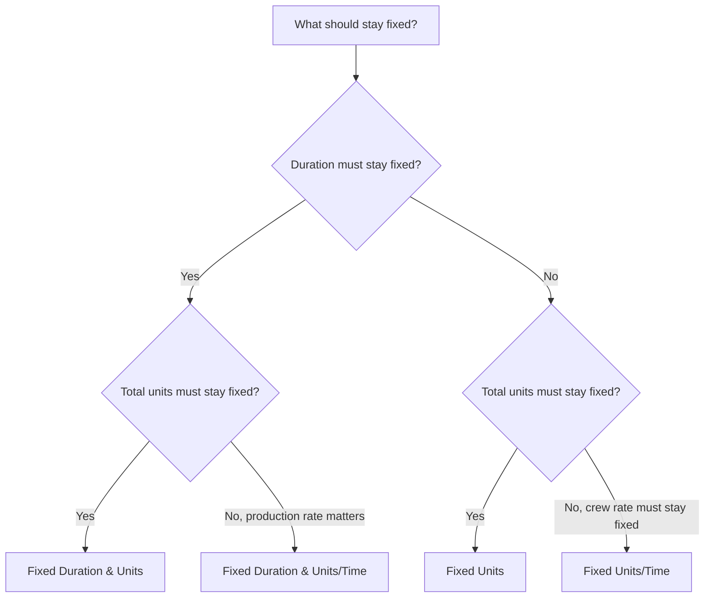

# Duration Types in P6

Duration Type is one of the fields in Primavera P6 that controls how an activity behaves when duration, units, and resource productivity change. It is easy to overlook, but it can affect schedule dates, resource loading, cost forecasts, earned value, and update behavior.

Many schedulers think of duration only as a number of days. In P6, duration is more than a number. An activity can also have labor units, nonlabor units, units per time, resource calendars, activity calendars, and remaining work. The Duration Type tells P6 what should stay fixed when the schedule recalculates or when the scheduler changes resources and durations.

This blog explains the main Duration Types available for activities in P6, how they differ, what each one is used for, and when to use one instead of another.

## Duration Type Is Not the Same as Duration Field

Before looking at the types, it helps to separate two ideas.

Duration fields are values such as Original Duration, Remaining Duration, Actual Duration, and At Completion Duration. These describe time.

Duration Type is a calculation setting. It tells P6 how to balance duration, total units, and units per time when something changes.

For example, if you add more resources to an activity, should the activity finish earlier? Or should the duration stay the same and the total effort increase? The answer depends on the Duration Type.

## The Main Duration Types

The common P6 Duration Types are:

- Fixed Duration & Units.
- Fixed Duration & Units/Time.
- Fixed Units.
- Fixed Units/Time.

The names can feel technical at first, but each one answers a practical question: what part of the activity should P6 protect when something changes?

## Fixed Duration & Units

Fixed Duration & Units keeps the activity duration and total units fixed. If units per time changes, P6 adjusts the rate rather than changing the duration or total effort.

This type is useful when both the planned time window and the total effort are intended to remain stable.

Example:

An activity is planned for 10 days with 400 labor hours. The schedule team wants the duration to remain 10 days and the total budgeted effort to remain 400 hours. If resource assignment details change, the planned duration and total units should not automatically move.

Use Fixed Duration & Units when:

- The activity has a fixed work window.
- The total effort is already agreed.
- Resource rate changes should not automatically change the activity duration.
- The schedule is used for stable cost or earned value control.

This is often useful for managed work packages where both schedule duration and budgeted effort are controlled.

## Fixed Duration & Units/Time

Fixed Duration & Units/Time keeps the duration and the resource rate fixed. If resources are added or removed, P6 can adjust total units.

This type is useful when the activity must occur during a fixed time window and the resource loading rate should remain consistent.

Example:

A project management support activity lasts for 20 days. The team assigns one project engineer at 8 hours per day. The duration should remain 20 days, and the daily rate should remain 8 hours per day. The total units are a result of the time window and the rate.

Use Fixed Duration & Units/Time when:

- The activity duration is fixed.
- The daily or hourly resource rate is important.
- Total units should calculate from duration and rate.
- The activity represents ongoing support or a fixed work period.

This can be useful for supervision, management, inspection support, or time-based support activities.

## Fixed Units

Fixed Units keeps the total units fixed. If the resource rate changes, P6 can adjust the duration.

This type is useful when the amount of work is fixed, but the duration depends on productivity or resource availability.

Example:

An activity requires 800 labor hours. If the team assigns more crew capacity, the activity may finish sooner. If less crew capacity is available, the activity may take longer. The total work stays 800 hours.

Use Fixed Units when:

- The quantity of work or total effort is fixed.
- Duration should respond to resource availability or productivity.
- Crew size can change the time needed to complete the activity.
- Resource planning is active and maintained.

This can be useful for production-style work where total effort is known and duration is expected to respond to crew loading.

## Fixed Units/Time

Fixed Units/Time keeps the resource rate fixed. If duration changes, total units change with it.

This type is useful when a crew or resource works at a fixed rate for as long as the activity lasts.

Example:

A site supervision activity uses one supervisor at 8 hours per day. If the activity duration increases from 10 days to 15 days, the total units should increase because the supervisor is needed for more days. The daily rate remains fixed.

Use Fixed Units/Time when:

- The crew or resource rate is fixed.
- Total units should increase or decrease when duration changes.
- The activity represents time-based effort.
- The resource is assigned for the full activity duration.

This is often useful for support, supervision, inspection, and management activities where time drives total effort.

## How to Choose the Right Duration Type

The best Duration Type depends on what the activity represents and how the project controls team expects P6 to calculate changes.

A simple way to choose is to ask:

- Is the duration fixed by plan, contract, window, or access?
- Is the total effort fixed by quantity, budget, or estimate?
- Is the resource rate fixed by crew plan or staffing plan?
- Should adding resources shorten the activity?
- Should extending the activity increase the total units?

If duration and total units should stay fixed, use Fixed Duration & Units.

If duration and production rate should stay fixed, use Fixed Duration & Units/Time.

If total work should stay fixed and duration should respond to resource loading, use Fixed Units.

If resource rate should stay fixed and units should change with duration, use Fixed Units/Time.

## Practical Examples

For a concrete pour planned as a fixed 1-day operation with a defined crew and cost budget, Fixed Duration & Units may be appropriate.

For project management support assigned at a steady daily rate across a fixed reporting period, Fixed Duration & Units/Time or Fixed Units/Time may be appropriate depending on whether total units or duration changes should drive the forecast.

For an installation activity with a known total quantity of work where crew size affects completion time, Fixed Units may be appropriate.

For site supervision that continues as long as the construction period extends, Fixed Units/Time may be appropriate.

The important point is that the choice should reflect the project control method, not habit.

## Common Mistakes

One common mistake is leaving the default Duration Type on every activity without checking whether it matches the activity purpose.

Another mistake is using resource-driven duration behavior when the project does not maintain resource assignments carefully. If resource data is weak, resource-based calculation can create unreliable results.

A third mistake is changing durations during updates without understanding how P6 will recalculate units or rates. This can affect cost loading, earned value, and resource histograms.

Finally, avoid treating Duration Type as a purely technical setting. It affects how the schedule behaves when the plan changes.

## Duration Type and Schedule Quality

Duration Type is part of schedule quality because it affects whether the forecast is believable. If an activity's duration, units, and resource rate do not behave as expected, the schedule may show misleading dates or resource demand.

For PMO reviews, it is useful to check whether Duration Types are consistent across similar activity groups. Engineering activities, procurement activities, construction activities, LOE activities, and support activities may require different rules, but the choices should be intentional.

If the schedule is resource-loaded, Duration Type becomes even more important. It helps determine whether resource changes affect duration, total units, or units per time.

## Conclusion

Duration Types in P6 define how activities respond when duration, total units, and resource rates change. They are not just background settings.

Fixed Duration & Units protects both time and total effort. Fixed Duration & Units/Time protects time and rate. Fixed Units protects total effort. Fixed Units/Time protects the resource rate.

Choosing the right Duration Type helps the schedule calculate in a way that matches the project plan. It also makes resource loading, progress updates, cost forecasts, and schedule reports easier to understand and defend.

## Related Content
- [Activities Starting in Data Date with No Logic Driving](../../metrics/01_activities_starting_in_dd_with_no_logic_driving/02_guide_template.md)
- [Activity Types in P6](../05_ACTIVITY%20TYPES%20IN%20P6/05_ACTIVITY%20TYPES%20IN%20P6.md)
- [Dates in P6](../07_DATES%20IN%20P6/07_DATES%20IN%20P6.md)
