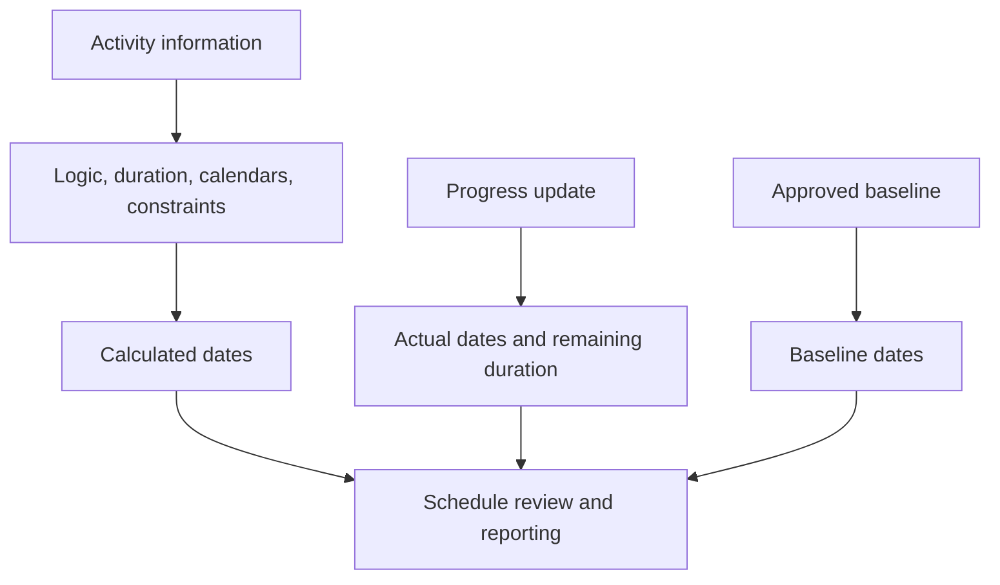

# Dates in P6

Dates in Primavera P6 can be confusing because an activity does not have only one start date and one finish date. It can have planned dates, current schedule dates, early dates, late dates, actual dates, baseline dates, constraint dates, expected dates, and sometimes external or forecast-related dates depending on the layout and project settings.

These dates do not all mean the same thing. Some are calculated by CPM logic. Some are entered during progress updates. Some are used for comparison. Some are used to control or limit the schedule. Understanding the difference is essential for schedule quality, PMO reporting, delay analysis readiness, and basic project control.

The most important question is simple: what is this date telling me, and where did it come from?

## Why P6 Has So Many Dates

P6 is not only a date list. It is a calculation model. The software calculates dates from activity durations, calendars, relationships, constraints, resources, progress status, and the Data Date.

Different date fields exist because planners need to answer different questions:

- What was the original plan?
- What is the current forecast?
- What actually happened?
- What is the earliest the activity can start or finish?
- What is the latest it can start or finish without affecting the project?
- Is a constraint forcing the activity?
- How does the current plan compare with the baseline?

The problem begins when these date types are mixed together without understanding their purpose.

## Data Date

The Data Date is not an activity date, but it controls how all activity dates should be interpreted.

The Data Date is the boundary between actual performance and forecast work. Work before the Data Date should be actualized or statused. Work after the Data Date should be forecast.

If an activity has actual dates after the Data Date, that is usually a status error. If an open activity starts exactly on the Data Date with no driving logic, that may indicate missing sequencing. If an expected finish is before the Data Date, that may indicate stale update information.

Before reviewing any activity date, confirm the Data Date.

## Start and Finish

Start and Finish are the main schedule dates most users see in P6 layouts. They represent the current calculated or scheduled dates for the activity based on the schedule data.

For not-started activities, Start and Finish are forecast dates. For in-progress activities, they may combine actual status and remaining forecast. For completed activities, they should align with actual dates.

These are usually the dates used in reports, lookahead schedules, and management discussions. However, they should not be accepted without checking the logic and status behind them.

Use Start and Finish to answer: when is the activity currently scheduled to start and finish?

## Early Start and Early Finish

Early Start and Early Finish are CPM calculation dates. They show the earliest dates an activity can start and finish based on predecessor logic, calendars, constraints, and current schedule conditions.

Early dates are important because they help explain the forward pass of the schedule calculation. They show how work can move through the network as soon as logic allows.

If many activities have Early Start on the Data Date, the reviewer should check whether they are truly ready or whether they are open starts, constrained activities, or weakly linked activities.

Use Early Start and Early Finish to answer: what is the earliest this activity can happen according to the current network?

## Late Start and Late Finish

Late Start and Late Finish show the latest dates an activity can start or finish without delaying the project finish or the controlling finish point, depending on schedule setup.

Late dates are part of the backward pass. They are used to calculate float. The difference between early and late dates helps show how much flexibility the activity has.

If late dates seem strange, look for constraints, missing successors, open finishes, calendars, or unusual project finish settings.

Use Late Start and Late Finish to answer: how late can this activity move before it affects the controlling completion date?

## Actual Start and Actual Finish

Actual Start and Actual Finish are status facts. They should represent what actually happened in the field or in project execution.

Actual Start means the activity actually began. Actual Finish means the activity actually completed. These dates should not be used as planning targets or forecast dates.

Actual dates should normally be on or before the Data Date. If actual dates are after the Data Date, the schedule is reporting future work as already started or completed, which weakens update credibility.

Use Actual Start and Actual Finish to answer: what has really happened?

## Planned Start and Planned Finish

Planned Start and Planned Finish are often misunderstood. Depending on how the schedule is created, updated, and displayed, these fields may not behave like a formal approved baseline.

Some users expect Planned dates to show the original plan forever. That is not always a safe assumption. For formal variance reporting, an assigned baseline is usually more reliable than relying casually on Planned dates.

Use Planned Start and Planned Finish only when your project controls procedure clearly defines how they are maintained and what they mean.

## Baseline Start and Baseline Finish

Baseline dates come from an assigned baseline schedule. They are used to compare the current schedule against the approved plan.

For example, BL1 Start and BL1 Finish may show the activity's start and finish dates from the approved baseline. Current Start and Finish show the latest forecast. The difference between them shows variance.

Baseline dates are central to performance reporting, schedule variance, change control, and delay analysis preparation.

Use Baseline Start and Baseline Finish to answer: how does the current schedule compare with the approved plan?

## Constraint Date

Constraint dates are imposed date controls. They are connected to constraint types such as Start On, Start On or After, Finish On, Finish On or Before, Mandatory Start, or Mandatory Finish.

Constraints are not automatically wrong. Some represent real contract dates, access restrictions, permit releases, outage windows, or owner requirements. But constraints can also hide missing logic or force unrealistic dates.

Hard constraints, especially Mandatory Start and Mandatory Finish, should be rare and documented.

Use Constraint Date to answer: is an imposed date controlling or limiting this activity?

## Expected Finish and Forecast-Type Dates

Expected Finish is often used during updates to capture when the project team expects an activity to finish. Depending on settings and procedures, expected dates can influence how P6 calculates or displays activity dates.

Expected Finish can be useful for in-progress work when field teams provide a realistic finish expectation. But if it is not maintained, it can become stale. An Expected Finish before the Data Date is a common warning sign.

Some projects also use forecast-related date fields or user-defined fields for reporting. The key is to define them clearly so the team knows whether they are calculated, manually entered, or imported.

Use expected or forecast dates to answer: what is the team's latest expectation, and is it controlled by a defined update procedure?

## Primary and Secondary Constraint Dates

P6 can hold more than one constraint condition on an activity, depending on the selected constraint fields. The primary constraint is usually the main one shown in standard layouts, but a secondary constraint can also affect interpretation.

During schedule review, do not look only at Start and Finish. Add constraint type and constraint date fields to the layout. If dates are not behaving as expected, constraints are one of the first things to check.

## Which Dates Should You Use?

Use each date for its purpose:

- Use Start and Finish for the current schedule forecast.
- Use Early and Late dates to understand CPM calculation and float.
- Use Actual dates for completed or started work.
- Use Baseline dates for variance against the approved plan.
- Use Constraint dates to identify imposed date controls.
- Use Expected Finish or forecast fields only when the update procedure defines them.
- Use the Data Date to separate actual performance from forecast work.

## Common Mistakes

One common mistake is comparing the wrong dates. For example, comparing current Start to Planned Start may not be meaningful if Planned dates are not controlled by the project procedure.

Another mistake is treating Actual Start as a forecast. Actual dates should represent real performance, not intent.

A third mistake is ignoring time of day. P6 stores dates with time, and calendar differences can create apparent one-day shifts or float surprises.

Finally, avoid hiding constraint dates. If a date is imposed, reviewers need to see it.

## Conclusion

Dates in P6 are powerful because they tell different parts of the schedule story. Current dates show the forecast. Early and late dates explain CPM calculation. Actual dates record what happened. Baseline dates support comparison. Constraint dates reveal imposed controls. Expected dates can support updates when they are maintained properly.

A strong schedule review does not ask only "what is the date?" It asks "what kind of date is this, where did it come from, and is it credible?"

When the project team understands the meaning of each date field, the schedule becomes easier to explain, easier to audit, and more reliable for project control.

## Related Content
- [Actual Date Greater Than Data Date](../../metrics/12_actual_date_greater_than_data_date/02_guide_template.md)
- [Duration Types in P6](../06_DURATION%20TYPES%20IN%20P6/06_DURATION%20TYPES%20IN%20P6.md)
- [Calendars in P6](../08_CALENDARS%20IN%20P6/08_CALENDARS%20IN%20P6.md)
