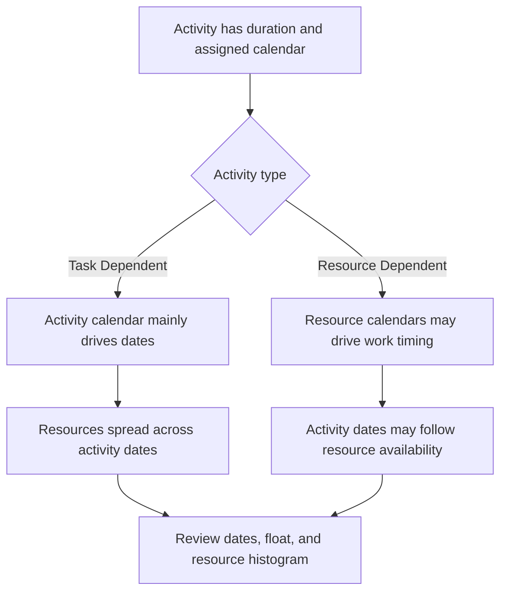

# Calendars in P6

Calendars are one of the quiet foundations of a Primavera P6 schedule. They define when work can happen. They tell P6 which days are working days, which days are nonworking days, how many hours are available in a day, and what time of day work starts and finishes.

Because calendars work behind the scenes, they are easy to underestimate. A schedule may have strong logic and reasonable durations, but if calendars are wrong or inconsistent, the dates can still be misleading.

Understanding calendars is essential for schedule quality, resource planning, critical path review, and update discipline.

## What a Calendar Does in P6

In P6, a calendar converts duration into dates. If an activity has a duration of 10 working days, P6 needs to know what a working day means. Is it Monday to Friday? Is Saturday included? Is the workday 8 hours, 10 hours, or 12 hours? Does work start at 7:00 or 8:00? Are holidays excluded?

The calendar answers those questions.

Calendars influence:

- Activity start and finish dates.
- Early and late dates.
- Total Float.
- Critical path and longest path.
- Resource usage timing.
- Relationship lag interpretation.
- Date shifts during updates.
- Lookahead and reporting accuracy.

A calendar is not just an administrative setup item. It is part of the schedule calculation.

## Why More Than One Calendar May Be Needed

Many projects need more than one calendar because not all work follows the same working pattern.

Examples include:

- Office engineering work on a 5-day calendar.
- Site construction work on a 6-day calendar.
- Shutdown or outage work on a 24-hour calendar.
- Night shift commissioning work.
- Owner access windows.
- Environmental restrictions.
- Procurement activities based on supplier working days.
- Resource-specific calendars for inspectors, vendors, or specialty crews.

Using one calendar for everything may look simple, but it can produce unrealistic dates. If commissioning can only occur at night, a normal daytime calendar may be wrong. If a vendor works only weekdays, a 7-day construction calendar may overstate availability.

The goal is not to create many calendars. The goal is to create enough calendars to model real working conditions without making the schedule unnecessarily complex.

## Activity Calendars

The activity calendar is assigned directly to an activity. It defines the working time used to calculate that activity's duration and dates, especially for Task Dependent activities.

For example, if "Install Cable Tray" has a 6-day construction calendar, P6 will calculate its work based on that calendar. If Saturday is a working day, the activity may finish earlier than it would on a 5-day calendar.

Activity calendars are usually the main calendar control for normal schedule activities.

Use activity calendars when the work itself follows a defined work pattern, such as day shift, night shift, shutdown work, or office work.

## Resource Calendars

Resource calendars define when a resource is available. A resource may be a person, crew, equipment item, vendor specialist, or other assigned resource.

Resource calendars become especially important when activities are Resource Dependent or when the project is using resource leveling or detailed resource planning.

For example, an activity may be assigned to a 6-day construction calendar, but the specialist inspector assigned to it may only be available Monday to Wednesday. If the activity is resource-driven, P6 may calculate dates based on the resource calendar rather than only the activity calendar.

Resource calendars are useful when resource availability is a real scheduling constraint. They can also create confusion if they are assigned but not maintained.

## How Activity and Resource Calendars Interface

The relationship between activity calendars and resource calendars depends on activity type, resource settings, and schedule calculation behavior.

For Task Dependent activities, the activity calendar is usually the primary basis for the activity duration. Resource calendars may still affect resource spreads and usage.

For Resource Dependent activities, resource calendars can influence when the work is performed. This means the resource calendar may affect the activity dates more directly.

The key point is that calendars must be reviewed together. An activity calendar may say work is possible, while the resource calendar says the assigned resource is not available. That mismatch can create desynchronization.

## What Calendar Desynchronization Means

Calendar desynchronization happens when different calendars in the schedule are not aligned with the real way the project should work.

Common examples include:

- Activity uses a 6-day calendar, but assigned resources use a 5-day calendar.
- Activity uses a day-shift calendar, but resources use night shift.
- Two linked activities use different start and finish times in the day.
- Lag is interpreted through a calendar that does not match the work.
- A copied activity keeps an old calendar from another project.
- A resource calendar has holidays that the activity calendar does not have.

The result can be confusing. Dates may shift unexpectedly. Activities may appear to finish one day later. Float may change without an obvious logic reason. Resource histograms may not match the execution plan. The critical path may move because of calendar behavior rather than real sequence.

## Problems Caused by Calendar Mismatch

Calendar mismatch can create several schedule quality issues.

First, it can create misleading dates. A task may look like it takes longer because the calendar has fewer work periods.

Second, it can distort float. Activities on different calendars may calculate early and late dates in ways that are hard to explain.

Third, it can affect the critical path. A path may become critical because a calendar restricts work, not because the logic sequence is truly controlling.

Fourth, it can damage resource reporting. A resource histogram may show resource demand on dates when the resource is not actually available, or may miss demand that should appear.

Finally, it can create update confusion. When the Data Date moves, activities on different calendars may respond differently, making the schedule harder to status and review.

## How to Solve Desynchronizations

Start by identifying the project calendar standard. Define the normal workweek, workday start and finish times, holidays, shutdown periods, and special work windows.

Then review all calendars in the schedule. Check:

- Calendar name and purpose.
- Working days.
- Daily working hours.
- Start and finish times.
- Holidays and exceptions.
- Calendar type.
- Activities assigned to the calendar.
- Resources assigned to the calendar.

Next, review activities where dates look strange. Add columns for Activity Calendar, Activity Type, Start, Finish, Early Start, Early Finish, Total Float, resources, and resource calendars if available.

If a calendar is wrong, correct it. If the activity is assigned to the wrong calendar, change the assignment. If the resource calendar is valid but causing unexpected results, confirm whether the activity should be Resource Dependent or Task Dependent.

After making corrections, recalculate the schedule and review the affected dates, float, critical path, and resource histogram.

## Good Calendar Governance

Calendars should be governed like logic and constraints. They should not multiply without control.

Good practice includes:

- Use a clear naming convention.
- Keep a limited set of approved project calendars.
- Document why special calendars exist.
- Avoid copying unused calendars from old schedules.
- Review activity calendar assignments before baseline approval.
- Review resource calendars if resource loading is used.
- Check calendar start and finish times, not only working days.

Calendar governance is especially important in large schedules where many users can add or copy activities.

## Practical Example

A construction project uses a 6-day calendar for site work. Most construction activities run Monday to Saturday from 7:00 to 17:00. A commissioning team works night shift from 22:00 to 6:00 because testing can only happen when operations are offline.

Both calendars are valid.

The problem appears when copied construction activities accidentally inherit the night shift calendar. Their dates begin to move strangely. Some relationships appear to push successors into the next day. Float changes in a way the team cannot explain.

The fix is not to delete the night shift calendar. The fix is to correct the activity calendar assignment, confirm which activities truly need the night shift calendar, and recalculate the schedule.

## Conclusion

Calendars in P6 define when work can happen. They affect activity dates, float, critical path, resource loading, lags, and update behavior.

More than one calendar is often necessary because projects include different work patterns: site work, office work, night shifts, shutdowns, supplier work, and resource availability. But multiple calendars must be controlled carefully.

The main risk is desynchronization. When activity calendars and resource calendars do not match the real execution plan, the schedule can show confusing dates, misleading float, and unreliable resource information.

A strong schedule uses calendars intentionally. Each calendar has a purpose, each special calendar is documented, and activity and resource calendar assignments are reviewed before the schedule is trusted.

## Related Content
- [Calendars with Different Start and Finish Times in the Day](../../metrics/20_calendars_with_different_start_finish_time_in_day/02_guide_template.md)
- [Dates in P6](../07_DATES%20IN%20P6/07_DATES%20IN%20P6.md)
- [Duration in P6](../09_DURATION%20IN%20P6/09_DURATION%20IN%20P6.md)
