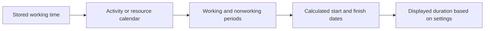

# Duration in P6

Duration in Primavera P6 looks simple at first: an activity takes a certain number of days. In practice, duration is one of the most important and most misunderstood parts of a schedule.

Duration is connected to calendars, activity type, resource assignments, progress updates, and user display settings. A duration shown as "5 days" may not mean the same thing in every schedule, every calendar, or every user's layout. This is why planners need to understand not only what duration is, but also how P6 stores it, calculates it, and displays it.

## What Duration Means

Duration is the amount of working time required to perform an activity. It is not simply the number of calendar days between a start date and a finish date.

For example, an activity with 5 days of duration may span:

- 5 calendar days on a Monday-to-Friday calendar with no interruption.
- 7 calendar days if a weekend falls inside the work period.
- Less than 5 calendar days on a 24-hour or extended-shift calendar.
- More than 5 calendar days if holidays or nonworking days interrupt the work.

This is the first key lesson: duration is working time, while the start and finish dates are calendar positions.

## How P6 Stores Duration

P6 stores duration as time, commonly at the hour level in the underlying schedule data. What the user sees in the layout may be shown as days, weeks, months, or years depending on preferences.

This means the displayed duration is often a conversion. If P6 stores an activity as 40 working hours, one user may see it as 5 days if the display conversion uses 8 hours per day. Another setup may show it differently if the time-period conversion or calendar basis is different.

This is why two people can look at the same schedule and become confused if their user preferences or administrative time-period settings are not aligned.

## Duration and Calendars

Calendars tell P6 when work can happen. Duration tells P6 how much working time is required. The calendar then places that working time onto real dates.

If an activity has 40 hours of remaining duration, the calendar determines how those 40 hours are spread.

On an 8-hour-per-day calendar, 40 hours may appear as 5 working days. On a 10-hour-per-day calendar, the same 40 hours may appear as 4 working days. On a 24-hour calendar, it may span much less calendar time.

This is why calendar assignments matter. Changing the calendar can change the finish date even if the stored working duration stays the same.

## Original Duration

Original Duration is the planned duration of the activity before progress is applied. It represents the initial estimate of working time needed to complete the activity.

Original Duration is important during planning and baseline development. It helps define the expected effort or time window for a task. It is also used in progress and performance discussions because it provides a reference point for how long the activity was expected to take.

Use Original Duration to answer: how long was this activity planned to take before status updates?

## Remaining Duration

Remaining Duration is the amount of working time still needed to complete the activity from the current Data Date.

For a not-started activity, Remaining Duration usually matches Original Duration unless it has been revised. For an in-progress activity, Remaining Duration should reflect the realistic work still required. For a completed activity, Remaining Duration should be 0.

Remaining Duration is one of the most important update fields in P6. If it is wrong, the forecast will be wrong.

Use Remaining Duration to answer: how much working time is still required?

## Actual Duration

Actual Duration represents the amount of time already spent on the activity based on actual progress. It is tied to Actual Start, Actual Finish, the Data Date, calendars, and the update method.

Actual Duration should support the status story. If an activity has started, the actual duration should make sense relative to the Actual Start and Data Date. If the activity is complete, Actual Duration should align with the actual work period.

Use Actual Duration to answer: how much working time has already been consumed?

## At Completion Duration

At Completion Duration represents the total expected duration of the activity after combining actual and remaining work.

In simple terms:

Actual Duration + Remaining Duration = At Completion Duration

This is useful because it shows whether an activity is expected to take more or less time than originally planned. If Original Duration was 10 days but At Completion Duration is now 15 days, the activity is forecast to take longer than planned.

Use At Completion Duration to answer: how long is this activity expected to take in total?

## Duration and User Preferences

User Preferences control how time units are displayed for an individual user. A user can choose whether durations are shown in hours, days, weeks, months, or years.

This affects what the user sees, not necessarily the underlying schedule calculation. For example, the same stored duration can be displayed as hours in one layout and days in another.

This is useful, but it can also create confusion. A planner reviewing detailed work may prefer hours. A project manager may prefer days. A portfolio report may show months. If the conversion basis is not understood, the numbers can look inconsistent.

When reviewing durations, confirm the display unit. Ask whether the duration shown is in hours, days, weeks, or another unit.

## Admin Preferences and Time Periods

Admin Preferences include time-period settings that define how P6 converts hours into larger units such as days, weeks, months, and years. These settings are important because they influence how duration values are displayed and converted.

For example, if the system uses 8 hours per day, 40 hours displays as 5 days. If the system uses 10 hours per day, 40 hours displays as 4 days.

This does not necessarily mean the work changed. It may only mean the conversion changed.

In some P6 configurations, duration display may also depend on whether the system or user is using assigned calendar hours for time-period conversion. This is why project teams should align calendar standards, user preferences, and admin time-period settings before formal reporting.

## Why Duration Can Look Different

Duration can look different for several reasons:

- Different users display time in different units.
- Admin time-period settings convert hours differently.
- Activity calendars have different hours per day.
- Resource calendars differ from activity calendars.
- Activities use different activity types.
- Remaining Duration was updated manually.
- Progress was applied incorrectly.
- Time of day is hidden in the layout.

This is why a duration problem is not always a duration problem. Sometimes it is a calendar problem. Sometimes it is a display setting problem. Sometimes it is a progress update problem.

## Relationship with Activity Types and Duration Types

Activity Type affects which calendar basis is most important. Task Dependent activities usually rely primarily on the activity calendar. Resource Dependent activities can be more influenced by resource calendars.

Duration Type affects how P6 balances duration, resource units, and units per time. For example, adding resources may or may not shorten the activity depending on the Duration Type.

So when a duration behaves unexpectedly, check three things together:

- Activity calendar and resource calendar.
- Activity Type.
- Duration Type.

These fields work together. Reviewing only one of them can lead to the wrong conclusion.

## Common Problems

One common problem is entering a duration in days without realizing the activity calendar uses a different number of hours per day than expected.

Another problem is comparing durations between activities that use different calendars. Five days on one calendar may not represent the same amount of working time as five days on another.

A third problem is inconsistent user preferences. One reviewer may see hours while another sees days, and both may think the schedule changed.

Another common issue is changing Admin Preferences after schedules already exist. This can make displayed durations appear different even when the underlying stored hours did not change.

## How to Review Duration Correctly

When reviewing duration in P6, do not look only at the number shown in the Duration column.

Check:

- Original Duration.
- Remaining Duration.
- Actual Duration.
- At Completion Duration.
- Activity calendar.
- Resource calendar if resources are used.
- Activity Type.
- Duration Type.
- User Preferences time unit display.
- Admin Preferences time-period conversion.

If dates or durations look strange, add calendar and time fields to the layout. Do not hide time of day during troubleshooting.

## Conclusion

Duration in P6 is working time, not just elapsed calendar time. P6 stores duration as time, applies calendars to place that time on the schedule, and displays it according to user preferences and administrative time-period settings.

This means duration must be reviewed with context. A value shown as "5 days" depends on calendar hours, display units, conversion settings, activity type, duration type, and update status.

A strong scheduler understands that duration is not only an input. It is part of the calculation engine. When duration, calendars, and preferences are aligned, the schedule becomes easier to explain and more reliable for project control.

## Related Content
- [Activities Starting in Data Date with No Logic Driving](../../metrics/01_activities_starting_in_dd_with_no_logic_driving/02_guide_template.md)
- [Calendars in P6](../08_CALENDARS%20IN%20P6/08_CALENDARS%20IN%20P6.md)
- [Percent Completion Types in P6](../10_PERCENT%20COMPLETION%20TYPES%20IN%20P6/10_PERCENT%20COMPLETION%20TYPES%20IN%20P6.md)
