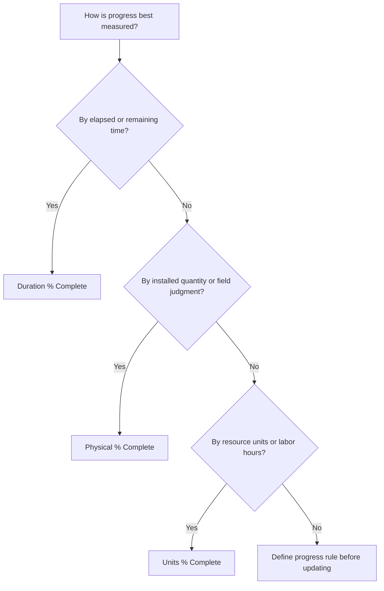

# Percent Complete Types in P6

Percent complete is one of the most visible progress fields in Primavera P6, but it is also one of the most misunderstood. A value of 50% complete can mean different things depending on how the activity is configured and how the project measures progress.

In P6, the Percent Complete Type controls how Activity % Complete is calculated or updated. It tells P6 whether progress should be based on time, physical achievement, or resource units.

The main Percent Complete Types for activities are:

- Duration % Complete.
- Physical % Complete.
- Units % Complete.

Choosing the right one matters because progress is not only a reporting number. It affects remaining duration, earned value, resource reporting, schedule credibility, and the quality of each update cycle.

## Why Percent Complete Type Matters

Different activities need different ways of measuring progress.

For some activities, time is a reasonable proxy. If a task had 10 days of duration and 5 working days are complete, it may be reasonable to say the activity is about 50% complete.

For other activities, time is not enough. A crew may spend 5 days on a 10-day task and complete only 20% of the physical work. Another crew may complete 80% of the quantity in the first half of the duration. In those cases, duration-based progress can mislead the project team.

For resource-loaded schedules, units may be the best progress basis. If an activity is planned for 1,000 labor hours and 600 labor hours have been earned or consumed, Units % Complete may better reflect progress.

The right Percent Complete Type depends on what the activity represents and how progress is actually measured.

## Activity % Complete

Activity % Complete is the general progress value displayed for the activity. Its source depends on the selected Percent Complete Type.

If the activity uses Duration % Complete, Activity % Complete is driven by the relationship between original, actual, and remaining duration.

If the activity uses Physical % Complete, Activity % Complete follows the Physical % Complete value entered by the user.

If the activity uses Units % Complete, Activity % Complete is based on resource units progress.

This is why two activities can both show 50% complete but mean very different things.

## Duration % Complete

Duration % Complete measures progress based on time. It compares how much duration has been consumed against the total expected duration.

In simple terms, if an activity has 10 days of planned or at-completion duration and 5 days have been consumed, the activity may show around 50% Duration % Complete.

Duration % Complete is useful when progress is reasonably proportional to time.

Examples include:

- Administrative review periods.
- Waiting or curing periods.
- Time-based support tasks.
- Some simple activities where work production is steady.

Use Duration % Complete when time is a fair measure of progress and the remaining duration is maintained carefully.

The risk is that time spent does not always equal work achieved. A task can consume half its planned duration and still be far behind physically. If the scheduler relies only on duration, progress reports may look better than reality.

## Physical % Complete

Physical % Complete is manually entered or updated based on actual physical progress. It represents what has truly been achieved in the work, independent of duration or resource units.

This is often the best option for construction, engineering deliverables, installation work, commissioning packages, or any activity where progress should be based on measurable accomplishment.

Examples include:

- 40% of drawings issued.
- 60% of cable tray installed.
- 75% of piping welded.
- 30% of test package complete.
- 100% of equipment alignment finished.

Use Physical % Complete when progress should be measured by quantity, deliverable status, field verification, or responsible-owner judgment.

The benefit is that it can reflect reality better than elapsed time. The risk is that it requires discipline. The project team must define how physical progress is measured, who approves it, and how evidence is collected.

## Units % Complete

Units % Complete measures progress based on resource units. It compares actual units against at-completion units.

This is useful when the schedule is resource-loaded and progress is tracked through labor hours, equipment hours, or other measurable resource units.

Examples include:

- Actual labor hours earned against budgeted labor hours.
- Equipment hours used against planned equipment hours.
- Installed work tied to resource unit progress.
- Earned value workflows based on units.

Use Units % Complete when resource units are reliable, maintained, and part of the project progress method.

The risk is that resource consumption is not always equal to physical progress. A team can spend many hours without completing the expected work. For this reason, Units % Complete works best when resource reporting and progress measurement are well controlled.

## How to Choose the Right Type

A practical way to choose the Percent Complete Type is to ask what progress means for the activity.

If progress means time has passed, use Duration % Complete.

If progress means physical work has been achieved, use Physical % Complete.

If progress means resource units have been earned or consumed, use Units % Complete.

The choice should be consistent across similar activity groups. Engineering deliverables may use Physical % Complete. Construction installation may use Physical % Complete based on quantities. Time-based management support may use Duration % Complete. Resource-heavy work packages may use Units % Complete if the resource data is reliable.

## Relationship with Remaining Duration

Percent complete and Remaining Duration should tell a consistent story.

An activity can be 80% physically complete but still have 10 days of Remaining Duration if the remaining work is difficult, delayed, or dependent on another condition. That may be valid.

An activity can be 50% Duration % Complete because half the planned time has passed, but if only 20% of the work is physically done, the Remaining Duration should probably be revised.

This is why good updates require both progress and forecast review. Percent complete tells how much has been achieved. Remaining Duration tells how much time is still needed.

## Common Mistakes

One common mistake is using Duration % Complete for activities where physical progress is not proportional to time. This can make progress look better or worse than the real work.

Another mistake is using Physical % Complete without a measurement rule. If one discipline reports physical progress by installed quantity and another reports by opinion, the schedule becomes inconsistent.

A third mistake is using Units % Complete when resource data is incomplete or unreliable. If actual units are not maintained, the progress value will not be trustworthy.

Another issue is updating percent complete but ignoring Remaining Duration. An activity can show progress and still have an unrealistic forecast.

## Good Practice

Define progress rules before the update cycle begins. The project team should know which activity groups use Duration, Physical, or Units % Complete.

Use layouts that show Percent Complete Type, Activity % Complete, Physical % Complete, Duration % Complete, Units % Complete, Remaining Duration, Actual Start, Actual Finish, and Activity Status.

Check for inconsistencies such as:

- Started activities with 0% progress.
- Remaining Duration = 0 but status not complete.
- 100% progress without Actual Finish.
- Physical % Complete that does not match field evidence.
- Units % Complete based on missing resource updates.

These checks help ensure that progress is not only entered, but credible.

## Conclusion

Percent Complete Type in P6 defines how activity progress is measured. Duration % Complete measures time-based progress. Physical % Complete measures actual work achieved. Units % Complete measures resource-unit progress.

No single type is best for every activity. The right choice depends on how the work is planned, measured, and controlled.

A strong schedule uses Percent Complete Types intentionally. When the method matches the work, progress updates become clearer, Remaining Duration becomes more reliable, and project reporting becomes easier to defend.

## Related Content
- [Activities Starting in Data Date with No Logic Driving](../../01_metrics_en/01_activities_starting_in_dd_with_no_logic_driving/01_overview_template.md)
- [Duration in P6](../09_DURATION%20IN%20P6/09_DURATION%20IN%20P6.md)
- [Where Costs Live in P6](../11_WHERE%20THE%20COST%20LIVE%20IN%20P6/11_WHERE%20THE%20COST%20LIVE%20IN%20P6.md)
