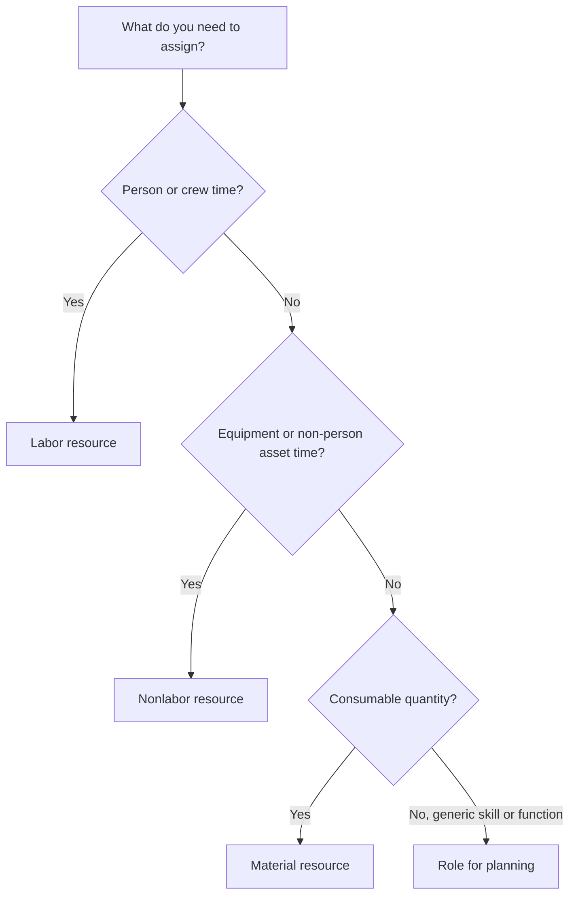

# Resource Types in P6

Resources in Primavera P6 represent the people, equipment, and materials needed to execute the work. They connect the schedule to capacity, productivity, cost, and resource demand over time.

A schedule can exist without resources, but a resource-loaded schedule gives the project team a deeper view. It can show labor histograms, equipment demand, material usage, cost curves, resource constraints, and possible overloads. To make that information useful, the scheduler must understand the different resource types available in P6 and when to use each one.

The main resource types in P6 are:

- Labor.
- Nonlabor.
- Material.

P6 also uses roles, which are not exactly the same as resources but are closely related and very useful during planning.

## Why Resource Type Matters

Resource type affects how P6 handles units, rates, costs, calendars, and reports.

A labor resource behaves differently from a material resource. A crane should not be treated the same way as concrete volume. A generic engineer role is not the same as a named engineer resource. If resource types are mixed incorrectly, histograms, cost reports, productivity reviews, and earned value outputs can become misleading.

Resource type answers a practical question: what kind of thing is being assigned to the activity?

## Labor Resources

Labor resources represent people or crews. They are usually measured in hours, days, or other time-based units. Labor resources can have rates, calendars, availability limits, and cost values.

Examples include:

- Planner.
- Civil crew.
- Electrician.
- Welding crew.
- Engineer.
- Inspector.
- Commissioning technician.

Use labor resources when the schedule needs to show human effort or crew demand. Labor resources are useful for manpower histograms, staffing plans, productivity analysis, and labor cost forecasting.

For example, an activity called "Install Cable Tray" may require 4 electricians for 5 days. Assigning labor resources allows the schedule to show the demand for electricians during that period.

Labor resources are also useful when the project needs to compare planned labor hours against actual labor hours.

## Nonlabor Resources

Nonlabor resources represent equipment or other reusable non-person assets. They are usually time-based, like labor, but they are not human resources.

Examples include:

- Crane.
- Excavator.
- Welding machine.
- Testing equipment.
- Scaffolding crew equipment.
- Specialized tool set.
- Generator.

Use nonlabor resources when equipment availability matters or when equipment cost should be tracked over time.

For example, if a heavy lift requires a crane for two days, assigning a nonlabor crane resource helps the project team see crane demand, avoid conflicts, and forecast equipment cost.

Nonlabor resources are important when equipment is scarce, expensive, shared between work areas, or a driver of the work sequence.

## Material Resources

Material resources represent consumable items. They are usually measured in quantities rather than time.

Examples include:

- Concrete cubic meters.
- Steel tons.
- Cable meters.
- Pipe spools.
- Valves.
- Coating liters.
- Panels.

Use material resources when the schedule needs to track quantity-based consumption or material-related cost.

Material resources can support material curves, quantity tracking, and cost loading. They are especially useful when the schedule is connected to installed quantities or earned value based on quantities.

For example, an activity may include 500 meters of cable installation. Assigning cable as a material resource helps the team track planned and actual installed quantity over time.

Material resources should not be used to represent labor hours or equipment time. They serve a different purpose.

## Roles

Roles are generic job functions or skill categories. They are not the same as resources, but they help during planning before named resources are known.

Examples include:

- Senior engineer.
- Electrical supervisor.
- Civil inspector.
- Scheduler.
- Commissioning lead.
- Crane operator.

Roles are useful in early planning because the project may know what type of skill is needed without knowing exactly who will perform the work.

For example, an engineering activity may need 80 hours of "Senior Electrical Engineer" effort. Later, that role can be replaced or supplemented with a named resource.

Use roles when:

- Planning is still at a high level.
- Named resources are not confirmed.
- Resource demand is needed by skill type.
- The organization wants early staffing forecasts.

Roles should be reviewed as the project matures. If the schedule requires detailed control, roles may need to be replaced by actual resources.

## Resource Calendars

Resources can have calendars. This matters because resource availability may differ from activity availability.

For example, a construction activity may use a 6-day activity calendar, but the assigned vendor specialist may only be available Monday to Friday. If the activity is Resource Dependent or resource leveling is used, the resource calendar can affect the schedule.

Labor and nonlabor resources often need calendars because people and equipment are available only at certain times. Material resources usually behave differently because they represent quantities, not working time.

When resource dates look strange, check both the activity calendar and the resource calendar.

## Resource Costs

Resources can carry cost rates. Labor and nonlabor resources often use time-based rates. Material resources often use unit rates.

For example:

- Electrician: cost per hour.
- Crane: cost per hour or day.
- Concrete: cost per cubic meter.

When resources are assigned to activities, P6 can calculate budgeted, actual, remaining, and at completion cost.

This is useful for cost-loaded schedules, earned value reporting, resource forecasts, and cash flow analysis. But it only works well when units, rates, calendars, and progress updates are maintained.

## Choosing the Right Resource Type

Use Labor when the resource is a person, crew, or human effort.

Use Nonlabor when the resource is equipment or a reusable asset whose time matters.

Use Material when the resource is a consumable quantity.

Use Roles when planning by skill or function before named resources are known.

The choice should reflect how the project wants to plan, measure, and report the work.

## Common Mistakes

One common mistake is using labor resources for everything. This can make cost loading easier at first, but it reduces clarity when equipment or material quantities matter.

Another mistake is using material resources for items that are really expenses or subcontract lump sums. If the project does not need quantity tracking, an expense may be more appropriate.

A third mistake is assigning resources without maintaining actual units. A resource-loaded schedule is only useful if progress updates keep the resource data current.

Another issue is confusing roles and resources. Roles are good for planning, but named resources are better when detailed assignment, calendars, and actuals matter.

## Good Practice

Define the resource strategy before loading the schedule.

Decide which work will use labor resources, which work will use nonlabor resources, which materials need quantity tracking, and where expenses should be used instead.

Use consistent naming conventions and resource codes. Keep the resource dictionary clean. Avoid duplicate resources with slightly different names.

Review resource assignments during each update cycle. Units, costs, calendars, and actuals should remain aligned with the project control process.

## Conclusion

Resource types in P6 help define what is needed to perform the work. Labor resources represent people and crews. Nonlabor resources represent equipment and reusable assets. Material resources represent consumable quantities. Roles support planning by skill or function before named resources are known.

Choosing the right resource type makes the schedule easier to analyze. It improves labor histograms, equipment planning, material tracking, cost loading, earned value, and forecast reporting.

A good resource-loaded schedule is not only a schedule with resources attached. It is a schedule where each resource type is used intentionally and maintained through the life of the project.

## Related Content
- [Activity Started with Zero Progress](../../metrics/13_activity_started_progress_zero/02_guide_template.md)
- [Where Costs Live in P6](../11_WHERE%20THE%20COST%20LIVE%20IN%20P6/11_WHERE%20THE%20COST%20LIVE%20IN%20P6.md)
- [Resource Limits in P6](../13_RESOURCES%20LIMITS%20IN%20P6/13_RESOURCES%20LIMITS%20IN%20P6.md)
