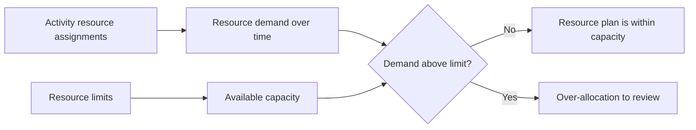

# Resource Limits in P6

Resource limits in Primavera P6 define how much of a resource is available during a period of time. They are used to compare the resource demand created by activity assignments against the capacity that the project actually has.

In simple terms, a resource limit answers the question: how much of this resource can the project use?

If a schedule says that one crew must work on five activities at the same time, P6 can show the demand. But without a resource limit, the schedule cannot clearly show whether that demand is realistic. The limit is what allows the planner to see overloads, capacity issues, and possible resource-driven schedule problems.

## What Resource Limits Are

A resource limit is the maximum availability of a resource. It can be defined as units per time period, such as hours per day, hours per week, or number of units available during a working period.

For example:

- One planner available 8 hours per day.
- Three electricians available 24 labor-hours per day.
- One crane available 8 equipment-hours per day.
- Two inspectors available 16 labor-hours per day.

When activities are resource loaded, P6 calculates the resource demand created by those assignments. The resource limit provides the capacity line that demand is compared against.

## Why Resource Limits Matter

Resource limits are important because schedules are often technically possible but practically impossible.

A logic network may calculate that several activities can happen in parallel. The dates may look acceptable. The critical path may appear reasonable. But if all those activities require the same limited crew, specialist, or equipment, the plan may not be executable.

Resource limits help expose that difference between a calculated schedule and a deliverable schedule.

They are useful for:

- Identifying overloaded labor crews.
- Checking equipment demand.
- Supporting resource histograms.
- Reviewing manpower plans.
- Preparing resource leveling.
- Explaining why some work cannot start even if logic allows it.
- Testing whether the plan matches available capacity.

In project controls, this is especially valuable when the schedule is used for staffing, procurement support, construction planning, or earned value reporting.

## Labor Resource Limits

Labor limits define how many people or labor-hours are available.

For example, if the project has 10 electricians working 8 hours per day, the daily labor limit may be 80 hours per day. If the schedule demand shows 120 electrician-hours on the same day, the schedule is asking for more electricians than the project has.

This does not automatically mean the schedule is wrong. It means the planner must review the plan. The solution may be adding crews, changing the sequence, moving noncritical work, using overtime, or accepting a temporary peak if it is realistic and approved.

Labor resource limits are useful when manpower availability is a real constraint. They are less useful when the schedule is not maintained at the level of detail needed to support resource control.

## Nonlabor Resource Limits

Nonlabor limits apply to equipment and other reusable assets.

Examples include cranes, excavators, testing equipment, specialized tools, generators, or temporary facilities. If only one crane is available, activities requiring the same crane cannot all be performed at the same time unless another crane is added or the work is resequenced.

This is where resource limits can be very practical. Equipment is often a true constraint, especially when it is expensive, shared between areas, difficult to mobilize, or required for critical work.

For example, two heavy lifts may both be logically ready. But if both need the same crane, the resource limit can show that the plan exceeds available capacity.

## Material Resources and Limits

Material resources behave differently from labor and nonlabor resources. They usually represent quantities, not daily availability of working time.

A material assignment may show planned concrete volume, cable length, steel tonnage, or installed quantity. The project may still have material constraints, but those are often managed through procurement dates, delivery milestones, inventory tracking, or constraints in the schedule rather than through the same type of daily resource availability limit used for people or equipment.

This does not mean materials are unimportant. It means the planner should be careful about what the limit is supposed to represent.

If the issue is production capacity, such as maximum cubic meters of concrete that can be placed per day, a resource or production model may be useful. If the issue is whether the material has arrived, logic ties or procurement milestones may be clearer.

## How P6 Uses Limits

P6 can use resource limits in resource profiles, spreadsheets, histograms, and resource analysis. The demand from activity assignments can be shown against the available limit.

When resource leveling is used, P6 may also use resource availability to delay activities so demand stays within limits, depending on the leveling settings.

This is powerful, but it must be handled carefully. Resource leveling can change forecast dates. If the limits, calendars, priorities, and activity logic are not well maintained, the leveled result may look mathematical but not practical.

Resource limits should therefore be part of a controlled scheduling process, not a button pressed at the end of an update.

## When to Use Resource Limits

Use resource limits when resources are truly limited and the schedule is resource loaded with enough quality to support the analysis.

Good use cases include:

- A project with a fixed number of crews.
- Shared cranes or specialized equipment.
- Limited engineering or commissioning specialists.
- Shutdowns, turnarounds, and outages.
- Construction plans where manpower peaks must be controlled.
- Programs where the same resource pool supports multiple projects.

Resource limits are also useful during what-if analysis. The planner can test whether the current plan works with available capacity or whether additional crews, overtime, or resequencing are needed.

## When to Be Careful

Be careful when the resource data is incomplete or symbolic.

If resources were added only for cost loading, the units may not represent real availability. If all work is assigned to generic resources, the histogram may be too broad to support real decisions. If actual units are not updated, the resource plan may quickly drift away from reality.

Also be careful with artificial limits. A limit that is too low may create unnecessary delays during leveling. A limit that is too high may hide real capacity problems.

The limit should match the real planning question. Are we testing actual crew availability, budgeted staffing, equipment access, or a management target? Each one may require a different setup.

## Common Mistakes

A common mistake is setting resource limits without agreeing what they represent. A resource may show 80 hours per day, but is that the current crew, the maximum crew, the budgeted crew, or the contractor's promised crew?

Another mistake is using leveling results without reviewing them. P6 can move activities based on resource rules, but the planner must still check whether the result makes construction sense.

Another issue is ignoring calendars. A resource limit is tied to availability, and availability depends on working time. If the resource calendar does not match the real work pattern, the limit may produce misleading overloads or false availability.

It is also common to overload resources and accept the histogram as if it were just a report. An overload is a planning signal. It should trigger review, not simply be ignored.

## Good Practice

Start with the resources that matter most. Not every resource needs a detailed limit. Focus on critical crews, scarce equipment, key specialists, and resources that affect project completion or major milestones.

Define whether the limit represents normal capacity, maximum capacity, or approved peak capacity. Keep that definition consistent.

Review resource profiles during schedule updates. If the forecast changes, resource demand changes too. Limits should be reviewed along with the logic, calendars, remaining durations, and progress.

Use resource leveling carefully and document the settings. Compare the leveled result with the unleveled schedule so the team understands what changed and why.

Most importantly, validate the output with the people executing the work. A histogram is useful only if it reflects a real resource plan.

## Conclusion

Resource limits in P6 define available capacity. They allow the project team to compare what the schedule demands against what the project can realistically provide.

Used well, resource limits help identify overloads, support manpower planning, control equipment demand, and improve schedule realism. Used poorly, they can create misleading histograms or artificial leveling results.

The best resource limits are simple, intentional, and connected to real project decisions. They help answer one practical question: can the project execute this plan with the resources it actually has?

## Related Content
- [Activity Started with Zero Progress](../../01_metrics_en/13_activity_started_progress_zero/01_overview_template.md)
- [Resource Types in P6](../12_RESOURCE%20TYPES%20IN%20P6/12_RESOURCE%20TYPES%20IN%20P6.md)
- [Resource Balancing in P6](../14_RESOURCES%20BALANCING%20IN%20P6/14_RESOURCES%20BALANCING%20IN%20P6.md)
