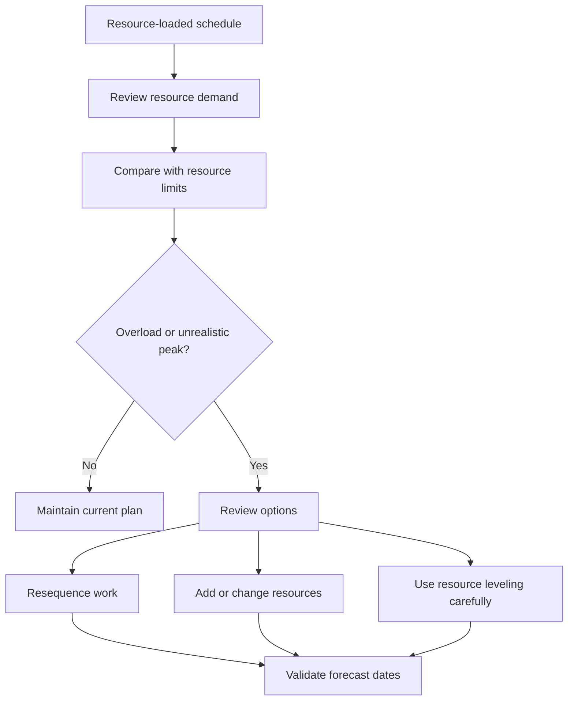

# Resource Balancing in P6

Resource balancing in Primavera P6 is the process of reviewing resource demand against available capacity and adjusting the plan so the work can be executed with the resources available. It helps the project team understand whether the schedule is only logically correct or also practical from a resource point of view.

In day-to-day scheduling, people often use the words resource balancing and resource leveling as if they mean the same thing. They are related, but they are not exactly the same.

Resource balancing is the broader planning review. It includes looking at histograms, resource profiles, crew availability, equipment demand, manpower peaks, and the realism of the plan.

Resource leveling is a P6 feature that can move activities based on resource availability and leveling settings.

The feature can be useful, but it should be used with control. P6 can calculate a leveled result, but the scheduler must decide whether that result makes sense for the project.

## What Resource Balancing Is

Resource balancing asks a practical question: can the project execute this schedule with the resources it actually has?

A schedule may have good logic, acceptable dates, and a reasonable critical path. But if it requires the same limited crew or equipment to work in too many places at the same time, the plan may not be realistic.

Balancing the resources means reviewing that demand and deciding how to manage it.

Possible actions include:

- Moving noncritical work.
- Adding resources.
- Splitting work into different crews or areas.
- Changing activity sequencing.
- Using overtime or shift work.
- Adjusting calendars.
- Updating resource limits.
- Accepting a temporary peak if it is realistic and approved.

The goal is not to make the histogram perfectly flat. Real projects have peaks and valleys. The goal is to make sure resource demand is understood, achievable, and aligned with the execution plan.

## Why It Matters

Resource balancing matters because the schedule is supposed to support execution, not only calculation.

If the plan requires 50 welders next week but the contractor can only provide 30, the schedule is showing a demand that cannot be met. If two critical activities require the same crane at the same time, at least one of them may have to move. If engineering review activities all require the same specialist, the bottleneck may appear before construction even starts.

Without resource balancing, the project may believe it has more capacity than it actually has.

This can affect:

- Near-term lookahead planning.
- Manpower forecasts.
- Equipment planning.
- Critical path credibility.
- Earned value forecasts.
- Cost and cash flow curves.
- Progress commitments.
- Recovery plans.

Resource balancing helps connect the CPM schedule with real field and office capacity.

## Resource Balancing vs Resource Leveling

Resource balancing is a management and planning activity.

Resource leveling is a scheduling calculation.

That distinction is important. A planner can balance resources manually by reviewing histograms and adjusting the schedule based on project knowledge. P6 resource leveling can also help by automatically delaying activities when resource demand exceeds availability.

Both approaches can be useful.

Manual balancing is better when the scheduler needs judgment, field input, constructability review, or careful control over which activities move.

P6 resource leveling is useful when the resource data is reliable, resource limits are defined, calendars are correct, and the scheduler wants to test how the schedule changes when resource availability is enforced.

Leveling should not replace planning judgment. It should support it.

## What P6 Needs Before Leveling

Before using the P6 resource leveling feature, the schedule should be ready for resource analysis.

At minimum, check:

- Activities have meaningful resource assignments.
- Resource units reflect real demand.
- Resource limits reflect real availability.
- Resource calendars are correct.
- Activity calendars are correct.
- Logic is complete enough to support scheduling decisions.
- Constraints are understood.
- Priorities are defined or reviewed.
- The current schedule has been saved so the leveled result can be compared.

If these items are weak, leveling may produce a result that looks precise but is not useful.

For example, if all construction labor is assigned to one generic "construction crew" resource, P6 may show a resource overload, but the result may not tell the project whether the problem is civil, piping, electrical, or mechanical. The resource setup must match the planning decision.

## How P6 Uses Resource Leveling

P6 resource leveling reviews resource assignments and availability. Depending on the settings, it may delay activities to reduce or remove resource over-allocation.

The calculation can consider resource limits, activity logic, float, calendars, priorities, and leveling options. The exact result depends on how the project is configured.

In practical terms, P6 looks for situations where resource demand is higher than availability and then tries to move activities to dates where the resources are available.

This can create a more resource-feasible schedule, but it can also change the critical path, delay milestones, or move work in ways that need review.

After leveling, the scheduler should compare the result against the original forecast:

- Which activities moved?
- Which milestones changed?
- Did the critical path change?
- Did leveling use available float or delay the project finish?
- Are the new dates constructible?
- Did the result solve the resource problem or create another one?

The leveled schedule should not be accepted blindly.

## When to Use Resource Balancing

Use resource balancing whenever resource availability affects execution.

It is especially useful in:

- Construction schedules with crew limitations.
- Shutdowns, turnarounds, and outages.
- Commissioning plans with limited specialists.
- Engineering schedules with shared reviewers.
- Projects with expensive or shared equipment.
- Programs where one resource pool supports multiple projects.
- Recovery plans where additional resources are being considered.

Resource balancing is also useful before baseline approval. A baseline that assumes unrealistic manpower or equipment availability may become difficult to defend later.

During updates, resource balancing helps confirm whether the remaining work can still be delivered with the current team and equipment.

## When to Be Careful

Be careful when resource data is not maintained.

If actual units are not updated, resource curves may drift away from reality. If resources are assigned only for cost loading, the units may not represent real capacity. If calendars are wrong, resource availability may be wrong too.

Also be careful when using resource leveling on a contractual or baseline schedule. Leveling can move dates and affect float. The team should understand whether the leveled schedule is the official plan, a what-if scenario, or an internal planning view.

Leveling can also hide logic weaknesses. If an activity moves because of leveling, reviewers may miss that the original logic was incomplete or incorrect. Always review logic first, then resources.

## How to Use It in Practice

Start by identifying the resources that matter most. Do not try to balance every minor resource with the same level of detail. Focus on key crews, critical specialists, shared equipment, and resources that could affect milestones.

Then review the resource profile or histogram in P6. Look for peaks, overloads, gaps, and sudden changes in demand.

Compare demand against resource limits. If demand exceeds the limit, discuss the issue with the responsible team. The answer may be operational, not only scheduling.

Next, decide the correction method:

- If the resource limit is wrong, update the resource limit.
- If the resource demand is wrong, correct the assignment.
- If the sequence is unrealistic, adjust logic or activity timing.
- If the overload is real, decide whether to add resources, use overtime, move work, or accept the peak.
- If automated leveling is appropriate, run it as a controlled scenario and compare the result.

Keep a copy of the unlevelled schedule before running resource leveling. This gives the team a reference point and helps explain what changed.

## Good Practice

Use resource balancing as part of schedule review, not as a one-time cleanup exercise.

Review resource curves during baseline development, major reforecasts, recovery planning, and regular update cycles.

Do not level a poor-quality schedule and expect the result to become reliable. First fix logic, calendars, activity status, remaining durations, and resource assignments.

Document leveling settings when the P6 feature is used. Resource leveling can produce different results depending on the options selected, so the settings are part of the schedule record.

Most importantly, validate the resource plan with the people who own the work. The project team should confirm whether the resource peaks are achievable, whether the sequence is practical, and whether additional resources are actually available.

## Conclusion

Resource balancing in P6 helps the project team test whether the schedule can be executed with available resources. It connects dates and logic with manpower, equipment, specialist availability, and real production capacity.

P6 resource leveling can support this review by moving activities based on resource availability, but it should be used carefully and reviewed after calculation.

A balanced schedule is not necessarily a perfectly smooth schedule. It is a schedule where resource demand is visible, realistic, and aligned with the way the project will actually be delivered.

## Related Content
- [Activity Started with Zero Progress](../../metrics/13_activity_started_progress_zero/02_guide_template.md)
- [Resource Limits in P6](../13_RESOURCES%20LIMITS%20IN%20P6/13_RESOURCES%20LIMITS%20IN%20P6.md)
- [SS & FF Relations](../15_SS%20&%20FF%20RELATIONS/15_SS%20&%20FF%20RELATIONS.md)
