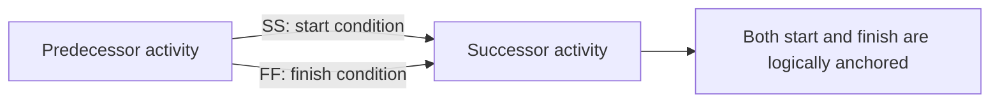

Start-to-Start (SS) and Finish-to-Finish (FF) relationships are valid logic types in Primavera P6. They are useful when two activities overlap and the schedule needs to model that overlap more accurately than a simple Finish-to-Start relationship can.

The problem is not SS or FF by themselves. The problem is using them alone when the activity needs both ends controlled. A single SS relationship controls the start of the successor, but not its finish. A single FF relationship controls the finish of the successor, but not its start. This is why many schedulers call them half relationships when they are used without complementary logic.

## What SS and FF Mean

An SS relationship says that the successor can start when the predecessor starts, or after a defined lag from the predecessor start.

An FF relationship says that the successor can finish when the predecessor finishes, or after a defined lag from the predecessor finish.

Both can represent real work. For example, engineering review may start after design production starts. Testing may finish only when installation finishes. Construction crews may work in overlapping areas where one trade starts after another trade has started, but both trades still need finish control.

## Why a Single SS Can Be Incomplete

A standalone SS relationship only anchors the successor start. It does not explain what controls the successor finish.

If the successor duration changes, or if the activity extends beyond what is realistic, the schedule may not properly show the impact unless downstream logic catches it. The start is connected, but the finish may be floating.

In P6, this can make the schedule look better connected than it really is. The activity has a predecessor, but the logic may not fully describe the way the work is executed.

## Why a Single FF Can Be Incomplete

A standalone FF relationship creates the opposite problem. It anchors the successor finish, but does not explain when the successor is allowed to start.

This can allow the early start of the activity to calculate too far back, especially in an updated schedule. The activity may appear able to start on the Data Date or even earlier, not because the work is actually ready, but because the logic has not defined the start condition.

This can distort float, critical path analysis, and near-term planning. A project team may see negative float or unusual early dates that are caused by weak logic rather than real execution risk.

## The SS + FF Pair

When work genuinely overlaps, the stronger model is often an SS + FF pair.

The SS relationship controls when the successor may start. The FF relationship controls when the successor may finish. Together, they define the logical envelope for the overlapping work.

This is useful for continuous or rolling work, such as area-by-area construction, design and review cycles, installation and testing, or repetitive production sequences.

The SS + FF pair is not extra logic for decoration. It can be the minimum logic needed to represent the actual overlap.

## When SS or FF Alone May Be Acceptable

Not every single SS or FF relationship is automatically wrong.

A single SS may be acceptable if the successor finish is controlled by another valid downstream relationship. A single FF may be acceptable if the successor start is controlled by another valid predecessor relationship. The key question is whether both ends of the activity are controlled somewhere in the network.

The scheduler should be able to explain why the single relationship is sufficient. If that explanation is not clear, the relationship should be reviewed.

## How to Review in P6

In P6, review activities with SS predecessors, SS successors, FF predecessors, and FF successors. Look especially for activities where the only predecessor is FF or the only successor is SS.

Useful review fields include Activity ID, Activity Name, Start, Finish, Activity Status, Total Float, Predecessors, Successors, Relationship Type, Lag, Constraints, and Driving Relationship indicators when available.

Ask these questions:

- What allows this activity to start?
- What controls this activity's finish?
- Is the overlap physically or contractually real?
- Is lag being used to hide missing detail?
- Does the relationship help explain the execution plan?
- Would an independent reviewer understand the logic?

## Common Problems

One common problem is using SS relationships to pull work earlier without modelling the real condition that allows the overlap.

Another problem is using FF relationships to hold a finish date while leaving the activity start open.

SS and FF can also be misused when the work should have been decomposed into smaller activities. If one activity is too broad, the planner may add SS or FF logic to force a result instead of breaking the work into clearer steps.

## Good Practice

Use SS and FF relationships intentionally. They should represent real sequencing, not schedule convenience.

When an SS relationship is used, confirm that the successor finish is also logically controlled. When an FF relationship is used, confirm that the successor start is also logically controlled.

Use SS + FF pairs for overlapping work when both the start and finish need to be linked. Avoid unnecessary duplication, but do not leave one end of the activity dangling.

Document exceptions when a single SS or FF relationship is deliberate and defensible.

## Conclusion

SS and FF relationships are useful tools in P6, but they need discipline. Used alone, they may create incomplete logic by controlling only one end of an activity.

A reliable CPM schedule should explain both why work can start and what controls its finish. When SS and FF relationships help answer those questions, they strengthen the schedule. When they leave one side of the activity open, they create weak logic that should be reviewed.

## Related Content
- [Activities Starting in Data Date with No Logic Driving](../../metrics/01_activities_starting_in_dd_with_no_logic_driving/02_guide_template.md)
- [Resource Balancing in P6](../14_RESOURCES%20BALANCING%20IN%20P6/14_RESOURCES%20BALANCING%20IN%20P6.md)
- [CPM (critical Path Method)](../16_CPM%20(CRITICAL%20PATH%20METHOD)/16_CPM%20(CRITICAL%20PATH%20METHOD).md)
