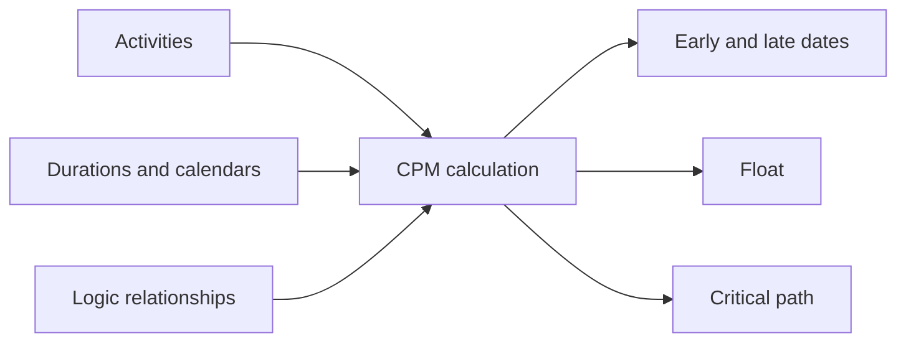

# CPM (Critical Path Method)

The Critical Path Method, or CPM, is the calculation method behind a serious project schedule. It turns a list of activities into a logic-driven model that can answer the questions project teams care about most: when can the project finish, which activities control that finish, and where does the schedule have flexibility?

In Primavera P6, CPM is often hidden behind the scheduling button. The software calculates dates, float, and critical activities very quickly. But the method itself is still important to understand. If the planner does not understand CPM, the schedule may calculate, but the result may not mean what the project team thinks it means.

## What CPM Does

CPM calculates the project duration from a network of activities, durations, calendars, and relationships.

The basic idea is simple: the duration of the project is not the sum of all activities. It is the duration of the longest connected path of dependent work through the schedule network. That path is the critical path.

If an activity on that path is delayed, the project finish is delayed unless the team recovers the time somewhere else on the same path.

## The Inputs CPM Needs

CPM depends on the quality of the schedule network.

First, the schedule needs activities that represent clear pieces of work. Each activity should have a defined scope, a reasonable duration, and a clear completion point.

Second, each activity needs a duration. In most P6 schedules, this is a deterministic estimate: one planned duration based on productivity, resources, calendars, and execution assumptions.

Third, the activities need logic. Relationships define what must happen before what, what can happen in parallel, and what conditions allow a successor to start or finish.

CPM does not know whether the logic is good. It calculates from the logic it receives. If the network contains missing logic, weak constraints, excessive lag, or incomplete SS/FF relationships, the CPM result may be mathematically correct but practically unreliable.

## Forward Pass and Backward Pass

CPM calculates the schedule in two main passes.

The forward pass moves from the Data Date toward the end of the project. It calculates the earliest dates each activity can start and finish, based on the logic, durations, calendars, and constraints.

These are the Early Start and Early Finish dates.

The backward pass moves from the project finish back toward the start. It calculates the latest dates each activity can start and finish without delaying the project completion or the selected finish target.

These are the Late Start and Late Finish dates.

Once P6 has early and late dates, it can calculate float.

## Float

Float is the amount of time an activity can move before it affects a defined schedule target.

Total Float is usually the main value reviewed in P6. It shows how much an activity can be delayed before it affects the project finish or the controlling path.

Free Float is more local. It shows how much an activity can be delayed before it affects the early start of its immediate successor.

Float is not spare time to waste. It is schedule flexibility. When float is consumed, the project has less protection against future delays.

## The Critical Path

The critical path is the longest connected path of dependent activities that controls the project finish. In many schedules, critical activities are identified by zero or negative total float, but the better review is to understand the longest path and confirm whether it makes sense.

A good critical path should tell a believable execution story. It should pass through activities that actually control completion: design releases, procurement, construction sequences, testing, commissioning, handover, or other real project drivers.

If the critical path runs through strange milestones, unnecessary constraints, missing logic, or activities that do not truly control completion, the schedule may be sending a false signal.

## Near-Critical Work

Project teams should not look only at activities with zero float.

Near-critical activities have low float and can become critical with a modest delay. The threshold depends on project size and sensitivity. On a major project, activities with less than 10 or 20 working days of float may deserve close attention.

Near-critical paths matter because risk rarely stays in one neat line. A schedule can have several paths close to becoming critical, especially during dense construction, commissioning, or shutdown windows.

## CPM and Risk Analysis

CPM gives a deterministic answer: if each activity takes the planned duration, this is when the project finishes.

Schedule Risk Analysis goes further. It tests uncertainty by applying ranges or probability distributions to activity durations and running many simulations. This helps estimate the probability of finishing by a target date.

But risk analysis depends on the CPM network. If the logic is weak, the risk output will also be weak. A Monte Carlo simulation cannot fix missing logic, unrealistic durations, or poor schedule structure.

## CPM in Primavera P6

P6 makes CPM calculation fast, but that speed can hide the assumptions behind the result.

When the schedule is calculated, P6 uses the Data Date, calendars, durations, activity relationships, constraints, actuals, remaining durations, and schedule options. Small changes in these settings can change float, critical path, and forecast dates.

That is why a planner should not only press F9 and accept the result. The planner should review what the calculation produced and challenge whether it matches the real execution plan.

## Good Practice

Build the CPM network from real execution logic. Avoid adding relationships only to make the schedule pass a check or produce a desired date.

Review the critical path after each update. Confirm that it starts and ends in a way that makes sense for the current project status.

Track float movement over time. A project may still look on plan while float is being consumed quietly.

Review near-critical paths. They often show where the next schedule problem will appear.

Keep the schedule clean enough to support CPM. Open starts, open finishes, hard constraints, excessive lag, and incomplete relationships all reduce the value of the CPM calculation.

## Conclusion

CPM is the engine that turns a Primavera P6 schedule into a project control tool. It calculates early dates, late dates, float, and the critical path from the activity network.

But CPM is only as reliable as the schedule it calculates. Good activities, realistic durations, sound calendars, and strong logic are what make the result meaningful.

The value of CPM is not only that it shows a project finish date. Its real value is that it explains why that finish date is controlled, where the schedule has flexibility, and where management attention should go next.

## Related Content
- [Critical Path or Float Path Starting with Constraint](../../metrics/09_cp_or_float_path_starting_with_constraint/02_guide_template.md)
- [SS & FF Relations](../15_SS%20&%20FF%20RELATIONS/15_SS%20&%20FF%20RELATIONS.md)
- [Develop a Project Schedule](../17_DEVELOPE%20A%20PROJECT%20SCHEDULE/17_DEVELOPE%20A%20PROJECT%20SCHEDULE.md)
