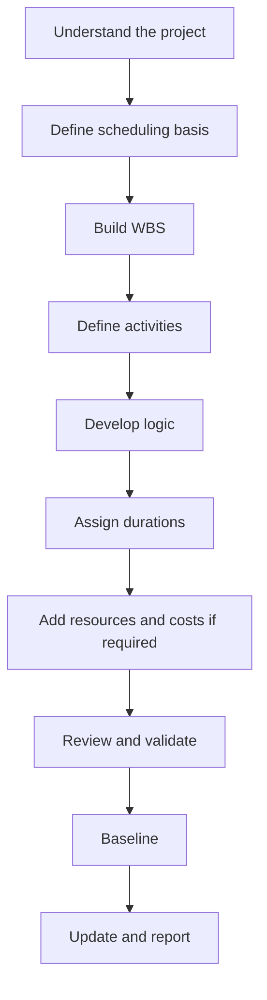

# Develop a Project Schedule

Developing a project schedule from zero is not just entering activities into Primavera P6. It is the process of turning scope, execution strategy, constraints, resources, and project commitments into a time model that can be reviewed, approved, updated, and used for decision-making.

A good schedule is built before it is calculated. The quality of the final P6 file depends on the thinking that happens before the first activity is entered.

## The Development Flow

## Understand the Project First

Do not start in P6 before understanding the project.

Review the contract, scope of work, specifications, key milestones, execution strategy, procurement constraints, permits, access limitations, and major handover requirements. Then speak with the people who will execute the work: project management, engineering, procurement, construction, commissioning, subcontractors, and suppliers when relevant.

The schedule is a model of how the team intends to deliver the project. If the planner does not understand that intent, the schedule will be built on assumptions.

## Define the Scheduling Basis

The scheduling basis explains how the schedule will be built. It should define the WBS, calendars, activity coding, level of detail, relationship rules, lag policy, P6 calculation settings, Data Date convention, reporting requirements, and baseline approach.

This document is important because it explains why the schedule looks the way it does. It also gives reviewers a reference when they assess schedule quality or compare later updates.

## Build the WBS

The Work Breakdown Structure is the organizing framework of the schedule. It should reflect how the project will be managed and reported.

A useful WBS may be organized by phase, area, system, discipline, deliverable, contract package, or a combination of these. The structure should be clear enough to support filtering, progress measurement, responsibility assignment, and reporting.

If the WBS does not match the way the project is controlled, the schedule may be difficult to use even if the activities are technically correct.

## Define the Activities

Activities should represent clear, measurable pieces of work. Each activity should have a defined scope, a clear start condition, a clear finish condition, and one responsible owner.

Activities that are too large become difficult to status. Activities that are too small make the schedule hard to maintain. The right level of detail depends on the project phase, contract requirements, reporting needs, and control expectations.

Activity names matter. A good name should say what work is being done, where it is being done, and what object, system, or deliverable it relates to.

## Develop the Logic

Logic is the heart of the CPM schedule. It defines what must happen before what, what can happen in parallel, and what condition allows each activity to start or finish.

The logic should be developed with the people who understand the work. In P6, avoid building logic only from a desk. Review the sequence with discipline leads, construction managers, commissioning leads, procurement teams, and subcontractors.

Use FS relationships where they best represent the work. Use SS and FF carefully when overlapping work is real. Avoid negative lag and avoid SF unless there is a very clear and approved reason. Each activity should normally have a predecessor and a successor, except valid project start and finish milestones.

## Assign Durations

Durations should be realistic, not aspirational. They should be based on scope, productivity, resources, calendars, vendor input, subcontractor input, and experience from comparable work.

A duration is not just a number. It assumes a certain crew, production rate, work calendar, access condition, and execution method. If those assumptions change, the duration may need to change too.

Document important duration assumptions. This helps during reviews, updates, change management, and delay analysis.

## Add Resources and Costs When Required

If the schedule will be used for resource planning, cost loading, earned value, or cash flow, resources and costs must be added with care.

Resource loading helps the team see labor demand, equipment demand, material quantities, and possible overloads. Cost loading helps connect the schedule to budgets, forecasts, and payment or progress curves.

Do not add resources only for appearance. If the project will rely on resource data, the data must be maintained during updates.

## Review and Validate

Before baseline approval, the schedule should be reviewed technically and operationally.

Run schedule quality checks for open starts, open finishes, relationship types, lags, constraints, long durations, missing logic, float distribution, and critical path reasonableness. DCMA-style checks can be useful, but the result must still be interpreted with project judgment.

Walk the schedule with the project team. Ask whether the logic, durations, resources, and milestones match the real execution plan. A schedule that passes a metric but fails the field review is not ready.

## Baseline the Schedule

Once reviewed and approved, the schedule becomes the baseline. The baseline is the reference for measuring progress, variance, delay, recovery, and performance.

Baselining should be formal. Save the approved schedule version, protect it from uncontrolled changes, and document approvals. Later baseline changes should follow change control.

A baseline that changes whenever the project slips is not a baseline. It is a moving target.

## Establish the Update Cycle

The schedule only remains useful if it is updated consistently.

Define who provides progress, when updates are collected, what evidence is required, how actual dates are verified, how remaining durations are reviewed, and what reports are issued. Active construction and commissioning may need weekly or biweekly updates. Earlier project phases may use monthly cycles.

The update cycle turns the baseline from a static document into a living control tool.

## Conclusion

Developing a project schedule is a structured process. Understand the project, define the scheduling basis, build the WBS, create activities, develop logic, assign durations, load resources when needed, validate the result, baseline it, and maintain it through updates.

The best schedules are not built by rushing into P6. They are built by understanding the work, challenging assumptions, and creating a model that the project team can trust.

## Related Content
- [Activities Starting in Data Date with No Logic Driving](../../01_metrics_en/01_activities_starting_in_dd_with_no_logic_driving/01_overview_template.md)
- [CPM (critical Path Method)](../16_CPM%20(CRITICAL%20PATH%20METHOD)/16_CPM%20(CRITICAL%20PATH%20METHOD).md)
- [Activity Codes](../18_ACTIVITY%20CODES/18_ACTIVITY%20CODES.md)
