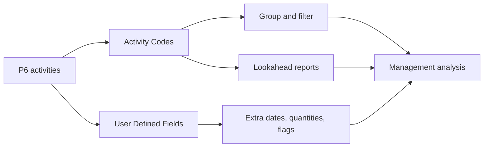

# Activity Codes

Activity Codes in Primavera P6 are one of the main tools that turn a schedule from a list of activities into a useful project controls database. They allow the project team to group, filter, sort, report, and analyze the schedule from different management perspectives.

A schedule is not only a bar chart. In P6, each activity is also a record that can carry information about responsibility, phase, area, system, discipline, contract, milestone type, and other project attributes. Activity Codes help organize that information in a controlled way.

## What Activity Codes Are

Activity Codes are structured classification fields assigned to activities. Each code type represents one reporting dimension, and each code value represents one option within that dimension.

For example:

- Code type: Area.
- Code values: Unit 1, Unit 2, Tank Farm, Utilities.

Or:

- Code type: Discipline.
- Code values: Civil, Mechanical, Electrical, Instrumentation, Commissioning.

The WBS tells where the work sits in the project structure. Activity Codes tell how the work can be viewed for reporting and analysis.

## What They Are Not

Activity Codes do not replace the WBS. The WBS is the scope hierarchy. Codes are additional views of the same activities.

Activity Codes do not replace logic. Logic defines the sequence of work.

Activity Codes do not replace resources. Resources define labor, equipment, material demand, and cost loading.

When these concepts are mixed, the schedule becomes harder to maintain. A clean P6 schedule uses WBS, logic, resources, Activity Codes, and UDFs for different purposes.

## Global and Project Activity Codes

P6 has Global Activity Codes and Project Activity Codes.

Global Activity Codes are shared across projects. They are useful when the same classification must be used across a portfolio, such as standard phases, corporate responsibility groups, or program-level reporting categories.

Project Activity Codes belong to a specific project. They are useful for project-specific needs such as areas, systems, contract packages, work fronts, turnover packages, or local reporting categories.

Use global codes carefully because changes may affect other projects. Use project codes for attributes that are meaningful only inside one project.

## Common Activity Code Types

Useful code types depend on the project, but common examples include:

- Responsible Party.
- Discipline.
- Project Phase.
- Area or Location.
- System or Subsystem.
- Contract Package.
- Work Package.
- Milestone Type.
- Turnover Package.
- Reporting Level.

The best code types come from reporting needs. Before creating codes, ask: what questions must the schedule answer?

Examples include:

- What work is planned in Area A next month?
- Which activities belong to the electrical contractor?
- Which systems are driving commissioning?
- Which contract package is slipping?
- Which milestones must be reported to the client?

## User Defined Fields

User Defined Fields, or UDFs, are different from Activity Codes. Codes classify activities into categories. UDFs store custom data such as dates, numbers, text, costs, quantities, or yes/no indicators.

Use UDFs when the information is not simply a category.

Examples include:

- Contractual finish date.
- Forecast finish date.
- Risk flag.
- Quantity planned.
- Quantity installed.
- Change order number.
- Drawing reference.
- Inspection status.

Activity Codes are best for grouping and filtering. UDFs are best for storing extra information that P6 does not already provide.

## Why Codes Matter for Reporting

Good coding makes reporting faster and more reliable.

With consistent Activity Codes, the scheduler can produce discipline lookaheads, area reports, contract package summaries, commissioning system reports, milestone reports, and management dashboards without rebuilding filters every time.

Without codes, reporting often becomes manual. The team exports data, edits spreadsheets, adds labels by hand, and then repeats the same work every update cycle. That creates errors and wastes time.

Codes make the schedule reusable as a data source.

## Governance

Activity Codes need governance. If everyone creates values freely, the schedule quickly becomes inconsistent.

For example, one person may use "Electrical", another may use "Elec", and another may use "E&I". The report may then miss activities because the same category is split into several labels.

Define code types and valid values before baseline when possible. Document what each code means, who maintains it, and whether it is mandatory.

Coding completeness should be checked like any other schedule quality item. If many activities are missing mandatory codes, reports based on those codes cannot be trusted.

## Avoid Over-Engineering

More codes do not automatically mean better control.

Every code and UDF creates maintenance work. If a code is never used in a report, filter, dashboard, or analysis, it may not be worth maintaining.

Start with the reporting questions that matter. Build enough structure to answer them, but avoid creating fields just because they might be useful someday.

## Good Practice

Design the coding structure during schedule development, not after baseline.

Align codes with the project reporting plan. If the project reports by area, discipline, contract, and system, those dimensions should exist in the P6 coding structure.

Keep code values consistent and controlled. Avoid duplicates and unclear abbreviations.

Use UDFs for custom dates, quantities, references, and indicators. Do not force numerical or date information into Activity Codes.

Review coding during each update cycle. New activities should receive the required codes before reports are issued.

## Conclusion

Activity Codes are not just administrative labels. They are what allow a Primavera P6 schedule to answer management questions quickly and consistently.

Used well, codes make the schedule easier to filter, group, report, and analyze. UDFs extend that capability by storing project-specific information that standard P6 fields do not cover.

The bar chart shows time. The coding structure explains how the schedule can be read, sliced, and used.

## Related Content
- [Missing Dependencies](../../metrics/21_missing_dependencies/02_guide_template.md)
- [Develop a Project Schedule](../17_DEVELOPE%20A%20PROJECT%20SCHEDULE/17_DEVELOPE%20A%20PROJECT%20SCHEDULE.md)
- [Schedule Basis](../19_SCHEDULE%20BASIS/19_SCHEDULE%20BASIS.md)
