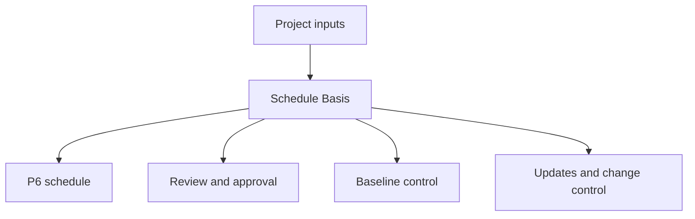

# Schedule Basis

A Schedule Basis, often called the Basis of Schedule, is the document that explains how a project schedule was built and what assumptions support it. It is the written companion to the Primavera P6 file.

The schedule shows dates, logic, float, milestones, resources, and the critical path. The Schedule Basis explains why those items look the way they do.

## What It Is Used For

The Schedule Basis supports review, approval, baseline control, progress updates, change management, and delay analysis. It helps a reviewer understand the rules, assumptions, inputs, and limitations behind the schedule.

Without it, the P6 file may calculate correctly, but the project team may not know what assumptions were used or whether the schedule is appropriate for management decisions.

## Who Writes It and Who Uses It

The scheduler or planning engineer usually prepares the Schedule Basis, with input from the project manager, engineering, procurement, construction, commissioning, project controls, contracts, and cost teams.

It is addressed to the project team, client, PMO, reviewers, claims analysts, and anyone who needs to understand how the schedule was built.

## Why It Matters

A schedule is full of decisions. Calendars, durations, logic, crews, milestones, approval cycles, permits, and resource limits all affect dates and float.

The Schedule Basis makes those decisions visible. It reduces ambiguity, supports auditability, and prevents future arguments about what the schedule assumed at baseline.

## What It Should Include

A comprehensive Basis of Schedule should include:

- Project scope and exclusions.
- Schedule purpose and contractual use.
- Schedule development methodology.
- WBS and activity coding structure.
- Calendars, shifts, holidays, weather, and non-work periods.
- Key assumptions and constraints.
- Milestones, including start, completion, access, client approvals, and material delivery.
- Approval and permit cycles.
- Handover and turnover assumptions.
- Logic rules, relationship types, and lag policy.
- Duration basis, productivity rates, and norms.
- Crews, resource availability, labor limits, and equipment limits.
- Cost loading rules, if applicable.
- Critical path and near-critical path explanation.
- Risk assumptions and major uncertainties.
- Update cycle, status rules, and reporting approach.

## Assumptions

Assumptions should be clear and testable. They may include site access dates, engineering release timing, vendor delivery dates, permit approval durations, client review periods, crew availability, weather allowances, and commissioning sequence assumptions.

Do not hide assumptions inside the schedule. If an assumption affects dates, float, resources, or handover, it belongs in the Schedule Basis.

## Calendars and Work Periods

The document should explain every major calendar used in P6. Include working days, shifts, holidays, seasonal shutdowns, weather calendars, night work, weekend work, and non-work periods.

Calendars directly affect activity dates and float. If different calendars are used for engineering, procurement, construction, commissioning, or resources, the basis should explain why.

## Crews, Resources, and Limits

Durations are only meaningful when the assumed resources are understood. The Schedule Basis should state the crew assumptions, resource availability, labor limits, equipment limits, and any planned overtime or shift strategy.

If resource loading is included, explain whether resources are used for manpower planning, cost loading, earned value, or resource leveling.

## Milestones, Approvals, Permits, and Handover

Major milestones should be listed and explained. This includes project start, contractual completion, access granted dates, owner or client approvals, third-party interfaces, material delivery dates, permits, system handovers, and final turnover.

Approval and permit cycles should show assumed durations and responsible parties. If client or third-party action drives the schedule, it should be visible.

## Methodology, Productivity, and Costs

The Schedule Basis should explain how the schedule was developed: sources used, workshops held, sequencing logic, duration estimating method, productivity rates, norms, and validation process.

If cost loading is included, state the rules. Explain whether costs are assigned by resource, expense, activity, WBS, contract package, or earned value method.

## Critical Path and Risk

The Schedule Basis should summarize the critical path and explain why it is reasonable. It should also identify near-critical paths, major risks, schedule sensitivities, and assumptions that may change during execution.

This helps the team understand not only the planned finish date, but what controls it.

## Good Practice

Write the Schedule Basis before baseline approval. Keep it aligned with the P6 file. Update it when approved changes alter key assumptions, calendars, milestones, resource strategy, or methodology.

Do not make it a generic narrative. It should be specific enough that another scheduler can understand how the schedule was built.

## Conclusion

The Schedule Basis is the explanation behind the schedule. It tells the project team what the schedule assumes, how it was built, what it includes, what it excludes, and what conditions must hold true for the dates to remain valid.

A strong Basis of Schedule makes the P6 file easier to review, defend, update, and trust.

## Related Content
- [Activities Starting in Data Date with No Logic Driving](../../01_metrics_en/01_activities_starting_in_dd_with_no_logic_driving/01_overview_template.md)
- [Activity Codes](../18_ACTIVITY%20CODES/18_ACTIVITY%20CODES.md)
