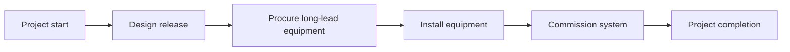

The critical path is the longest sequence of dependent activities in a schedule. It determines the shortest possible duration of the project and directly defines the project finish date.

In practical terms, the critical path is the chain of tasks that cannot be delayed without affecting the final deadline. If a critical path activity slips and nothing else changes, the project completion date will also slip.

That is why the critical path is one of the most important outputs of a Primavera P6 schedule. It is not just a filter, a color, or a report. It is the schedule's explanation of what is driving completion.

## What the Critical Path Means

A schedule contains many activities, but not all activities have the same impact on the finish date. Some activities have float. They can move a little before they affect the next activity or the project finish. Critical activities do not have that flexibility, or they have the least flexibility depending on the schedule method and settings.

The critical path shows the minimum time needed to complete the project based on the current logic, durations, calendars, constraints, and status.

If this is the controlling chain, a delay in procurement can delay installation. A delay in installation can delay commissioning. A delay in commissioning can delay project completion. The critical path helps the team see that connection.

## It Is the Chain You Cannot Delay

The critical path is not simply the work that feels important. It is the dependent sequence of work that defines the finish date.

This distinction matters. A high-value activity may not be critical if it has float. A visible client milestone may not be critical if another path is driving completion. A small technical activity may be critical if it sits in the only chain leading to final handover.

For project controls teams, this makes the critical path a decision tool. It helps answer:

- What is driving the project finish?
- Which activities need the most schedule attention?
- Where would a delay immediately affect completion?
- Which recovery actions could protect the finish date?
- Does the reported path make sense?

The last question is the one schedulers should never skip.

## Do Not Accept the Critical Filter Blindly

Primavera P6 can identify critical activities, but the software does not understand project intent. It calculates based on the data provided: logic, calendars, constraints, durations, progress, and schedule options.

If the data is weak, the critical path can look strange.

Activities or milestones may appear in the critical filter even though they are not truly driving the project. This can happen because of missing logic, hard constraints, stale dates, open ends, unusual calendars, negative float, incorrect status, or retained logic settings.

The scheduler must use professional judgment. The critical path should be challenged. It should seem reasonable. It should tell a story that the project team recognizes.

If the path says that final completion is driven by an administrative milestone with no real downstream work, challenge it. If the path starts with a milestone that does not actually control execution, challenge it. If the path jumps across unrelated WBS areas without a clear interface, challenge it.

The critical path is only as good as the schedule model behind it.

## Baseline Schedules and the Critical Path

In a schedule that has never been updated, such as a first baseline, the critical path often begins with the project start milestone and ends with the project completion milestone.

That is common, but it is not a rule written in stone.

Some projects have a critical path that begins at a key intermediate milestone. For example, construction may not be able to start until an owner hands over an area, a permit is released, or a design package reaches approved status. In that case, the handover or release milestone may trigger the start of the controlling path.

The same idea applies near the end of the project. The critical path may finish at final completion, but it may also drive an intermediate contractual milestone, handover stage, system turnover, or client access date that is currently more restrictive.

The key is not whether the path begins and ends in the most traditional place. The key is whether the path is logical, complete, and defensible.

## In-Progress Schedules

Once a schedule is in progress, the critical path changes shape. Completed work should no longer drive future completion. The path should begin from the current status boundary.

In an updated schedule, the critical path often starts with an activity currently in progress, a not-started activity ready to begin, or a valid milestone that controls access to future work. It may also begin from a project interface or handover milestone when that event is genuinely driving the next critical work.

This is where the Data Date matters. The Data Date separates actual performance from forecast work. A critical path after the Data Date should explain how remaining work leads to completion.

If the path starts with an activity that has no driving logic, an unexplained Data Date start, or a questionable milestone, the reviewer should investigate. The schedule may be showing a calculated path, but not a believable one.

## Be Careful with Milestones

Milestones are useful because they mark key points: notice to proceed, area handover, design approval, mechanical completion, system turnover, substantial completion, and final completion.

But milestones can also mislead a critical path review.

A milestone may appear critical because it has a constraint. It may appear critical because it has no duration and sits at a date boundary. It may appear critical because logic is missing around it. That does not automatically mean the milestone is truly part of the controlling execution chain.

Be extra careful when the critical path starts with a milestone. Ask:

- Does this milestone represent a real controlling event?
- What activity or external condition drives the milestone?
- What work is released by the milestone?
- Is the milestone constrained rather than logic-driven?
- Would the path still be critical if the milestone logic were corrected?

If the milestone does not control the work, it should not be allowed to define the story of the critical path.

## Retained Logic Can Change the Story

Retained logic is a Primavera P6 setting used to handle out-of-sequence progress. It can be appropriate, but it can also affect the critical path in ways that reviewers need to understand.

When retained logic is used, P6 may preserve predecessor logic even when successor work has already started out of sequence. This can cause remaining work to be held or sequenced in a way that changes the calculated critical path.

The issue is not that retained logic is always wrong. The issue is that the scheduler must understand whether it is producing a realistic forecast.

If retained logic makes the critical path run through relationships that no longer reflect how the work is being executed, the team should review the status, logic, and schedule options. The path should reflect a defensible remaining plan, not only a mechanical calculation.

## How to Review the Critical Path

A good critical path review should combine P6 output with scheduling judgment.

Start by generating the longest path or critical path report. Then review the path activity by activity. Look at predecessors, successors, relationship types, lags, constraints, calendars, actual dates, remaining duration, and total float.

Ask whether the path makes sense:

- Does the path follow a believable execution sequence?
- Does it begin from a valid current driver?
- Does it finish at the correct completion or control milestone?
- Are constraints forcing the path?
- Are missing relationships hiding the real driver?
- Is retained logic affecting the path in a misleading way?
- Does the project team recognize this as the controlling work?

If the answer is no, the schedule needs review before the critical path can be used confidently.

## Conclusion

The critical path is the sequence of dependent tasks that defines the project finish date. It shows the minimum time needed to complete the project and identifies the work that cannot slip without affecting the deadline.

But the critical path is not something to accept blindly. P6 calculates what the data tells it to calculate. The scheduler must challenge whether the result is reasonable, logical, and aligned with the real execution plan.

In a strong schedule, the critical path tells a clear story. It starts from a valid current driver, follows real dependencies, avoids misleading constraints, handles progress correctly, and leads to the correct completion milestone.

When that story makes sense, the critical path becomes one of the most powerful tools in project control. When it does not, it is a warning that the schedule needs more review before the forecast can be trusted.
