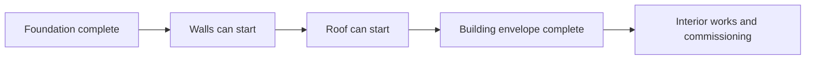
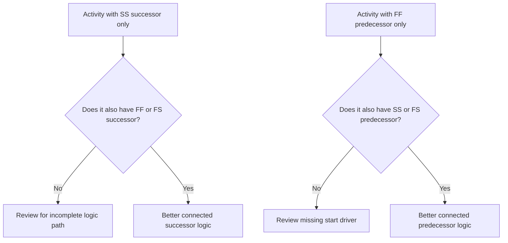

Logic is the mathematical representation of sequencing and dependencies inside a project schedule. It explains what must happen before what, which activities can happen at the same time, and how the project team intends to move from the first activity to final completion.

In a good Primavera P6 schedule, logic is not decoration. It is the engine that allows the schedule to calculate dates, float, critical path, and forecast movement. It tells the story of execution in a way that can be reviewed, challenged, and improved.

If the schedule says "lay foundations, then build walls, then build the roof," the logic is what turns that sequence into a calculable network. The planner is not only drawing a timeline. The planner is defining the delivery path.

## Logic Tells the Story of the Work

Every project team has an intended way to execute the project. Engineering may release design by area. Procurement may deliver equipment by package. Civil work may prepare access before structural work begins. Mechanical completion may need to happen before commissioning can start.

Logic links are the mathematical expression of that plan.

This simple diagram is not just a sequence. It is a decision model. If foundations are late, walls may be late. If walls are late, the roof may be late. If the roof is late, interior works may be affected. The schedule can only show that impact if the logic is present.

Robust logic means the schedule can explain why activities start, why they finish, and what happens when one part of the plan moves.

## Why Robust Logic Matters at the Data Date

The metric "Activities Starting on the Data Date with No Driving Logic" is a strong test of schedule quality.

The Data Date is the boundary between actual performance and forecast work. When an activity starts exactly on the Data Date, the reviewer should ask a simple question: what is driving this start?

If the activity has valid predecessor logic, the schedule can explain the start. Maybe an area was released. Maybe a material delivery was completed. Maybe the predecessor activity finished and allowed the next crew to begin.

If the activity has no driving logic, the start is weaker. The activity may be sitting on the Data Date because it has no predecessor, because the logic is incomplete, because a constraint is forcing it, or because the update was not fully statused.

That is why robust logic matters. A schedule should not allow work to appear ready just because the Data Date moved. It should show the real condition that allows the work to begin.

## The Balance: Enough Logic, Not Redundant Logic

Good logic is balanced. The schedule needs enough relationships to connect activities properly to predecessors and successors. At the same time, it should avoid redundant logic that repeats the same dependency in unnecessary ways.

Too little logic creates open starts, open finishes, unreliable float, and weak critical path results. Too much logic can make the network difficult to review and can hide the true driver of an activity.

The goal is not to maximize the number of relationships. The goal is to represent mandatory and required dependencies clearly.

For each activity, the scheduler should be able to answer:

- What allows this activity to start?
- What does this activity enable next?
- Which relationship is truly driving the activity?
- Is any relationship duplicated or unnecessary?
- Would a reviewer understand the intended sequence?

This balance is central to PMO schedule reviews. A dense network is not automatically a strong network. A light network is not automatically a clean network. The right network explains the execution plan without clutter.

## Every Activity Needs a Start Driver

Robust logic means every activity has a predecessor that allows or triggers its start, except for valid project-start or externally authorized exceptions.

For a construction activity, the start driver may be area access, predecessor completion, material availability, design release, permit approval, or prior trade completion. For a procurement activity, it may be design approval or purchase order release. For commissioning, it may be mechanical completion, test package readiness, or system turnover.

When this start driver is missing, the activity can float to an artificial position in the schedule. During updates, it may appear at the Data Date. That creates a false sense of readiness.

Consider an activity called "Install Pumps." If it starts on the Data Date but has no predecessor for foundation completion, pump delivery, or area handover, the schedule is not explaining why installation can begin. The activity may be planned, but the logic is not robust.

## SS and FF Are Half Relationships

Start-to-Start and Finish-to-Finish relationships are useful, but they should be used carefully. In many schedule reviews, they are best understood as "half" relationships because they do not fully place the activity into a complete logic path by themselves.

An SS relationship can explain when an activity may start, but it may not explain when the activity must finish or what it hands over. An FF relationship can explain finish alignment, but it may not explain when the activity is allowed to start.

That does not make SS or FF wrong. Overlapping work is common and often realistic. The issue is whether the activity is fully connected.

For example:

- An activity with an SS successor should usually also have an FF or FS successor.
- An activity with an FF predecessor should usually also have an SS or FS predecessor.

This helps prevent activities from being connected only at one side of their duration. The schedule should explain both how work starts and how work completes.

## Robust Logic in Practice

A practical logic review should start with activities near the Data Date, critical and near-critical work, and major handover paths. These areas have the highest impact on current decision-making.

In P6, useful review columns include Activity ID, Activity Name, WBS, Start, Finish, Activity Status, Total Float, predecessors, successors, relationship type, lag, constraints, calendar, and driving relationship indicators if available.

For each activity starting on the Data Date, ask:

- Is the activity truly ready to start?
- Which predecessor allows the start?
- Is that predecessor complete, in progress, or forecast?
- Is the relationship driving?
- Is a constraint or expected date replacing logic?
- Does the activity also have valid successor logic?

If the answer is unclear, the activity should be reviewed with the responsible owner. The correction may be adding a missing predecessor, changing the relationship type, removing a constraint, updating actuals, or documenting a valid exception.

## Avoiding Artificial Logic

One mistake is adding relationships only to pass a metric. That does not create robust logic. It creates artificial logic.

Relationships should represent real dependencies. If a link does not reflect construction sequence, engineering release, procurement need, access, approval, testing, commissioning, or handover, it may not belong in the network.

Another mistake is leaving redundant logic because it looks safer. If the same dependency is already represented by a clearer relationship, extra links may confuse the critical path and make the network harder to audit.

Robust logic is clear, purposeful, and defensible.

## Conclusion

Logic is the mathematical story of how the project will be executed. It defines what must happen first, what can happen together, and what follows next.

Robust logic does not mean adding as many links as possible. It means adding the right links: enough to connect each activity to real predecessors and successors, but not so many that the network becomes redundant or misleading.

When activities start on the Data Date with no driving logic, the schedule is exposing a weakness in that story. The activity may be shown as ready, but the network does not explain why.

A reliable schedule should answer that question clearly. What allows this work to start? What does it enable next? If the schedule can answer both, the logic is becoming robust. If it cannot, the project team has more sequencing work to do before the forecast can be trusted.
