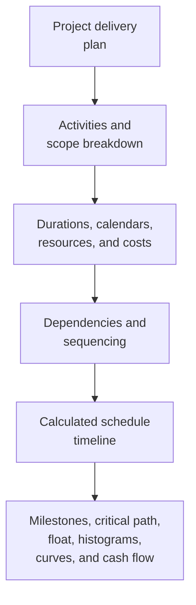

A project schedule is more than a list of dates. It is a graphic and logical representation of the project delivery plan. It explains how the project will be executed from start to finish, how work packages connect, when major milestones should be reached, and what information the project team should use to make decisions.

In simple terms, the schedule turns the project plan into a roadmap. It helps everyone involved understand what needs to be done, when it needs to happen, and who is responsible for making it happen. For project managers, planners, construction teams, engineers, procurement leads, and PMO reviewers, the schedule becomes one of the main tools for coordination and control.

The schedule is a timeline, but it is not only a timeline. A weak schedule may show dates. A strong schedule explains why those dates are credible.

## The Schedule as a Delivery Roadmap

Every project starts with intent. The team knows what must be delivered: a building, a facility, an industrial system, a shutdown, an infrastructure asset, or a package of work. But delivery requires more than knowing the final objective. The team must understand the sequence.

What comes first? What can happen in parallel? What must wait for design approval, material delivery, access, permit release, testing, or handover? Which activities control the finish date? Which milestones matter most to the client?

A schedule answers those questions by converting the plan into activities, durations, dependencies, calendars, resources, costs, and milestones.

The graphic timeline is useful because people can see the work. The logic network is useful because the software can calculate the work. Together, they allow the schedule to become both a communication tool and a control tool.

## What Feeds the Schedule

A schedule is only as reliable as the information used to build it. In Primavera P6, the schedule is fed by several major inputs.

The first input is the activity list. Activities break the project into manageable pieces of work. Each activity should be clear enough to plan, status, and measure.

The second input is deterministic duration. This is the planned working time needed to complete each activity. Duration should reflect the method of execution, productivity assumptions, crew size, access, workface constraints, and project conditions.

The third input is dependency logic. Dependencies explain how activities relate to each other. One activity may need to finish before another starts. Two activities may start together. Two finishes may need to align. These relationships create the CPM network.

The fourth input is sequencing. Sequencing is the practical order of execution. It considers constructability, engineering flow, procurement timing, access, commissioning logic, handover strategy, and client priorities.

The fifth input is resources and costs. Resource loading allows the schedule to show labor, equipment, and material demand over time. Cost loading allows the schedule to support cash flow, earned value, and financial forecasting.

When these inputs are complete and realistic, the schedule can produce useful outputs.

## What the Schedule Tells Us

A well-built schedule tells the overall project duration. It shows planned completion milestones and interim deliverables. It produces resource histograms that show when labor or equipment demand rises and falls. It supports progress curves, cash flow curves, earned value reporting, and lookahead planning.

Most importantly, it identifies the critical path or longest path. This is the chain of work that drives the project finish. If activities on that path slip, the project completion date may slip. This is why logic matters so much. Without good dependencies, the critical path may not show the real drivers of the project.

Float is another important output. Float tells how much flexibility an activity has before it affects another activity or the project finish. But float is only meaningful when the schedule network is complete. If activities are missing logic, float can look better or worse than reality.

## Why Logic Makes the Timeline Credible

This is where the metric "Activities Starting on the Data Date with No Driving Logic" becomes important.

The Data Date in P6 is the boundary between actual performance and the forecast. Everything before the Data Date should represent what has already happened. Everything after the Data Date should represent the plan from now forward.

When activities start exactly on the Data Date with no logic driving them, the schedule is sending a warning signal. It may look like the work is ready to begin immediately, but the schedule may not be able to explain why. There may be no predecessor showing that the area is available, no link to material delivery, no tie to design approval, no connection to inspection release, and no logic from prior work.

That matters because a schedule should not simply place work on a date. It should explain the path to that date.

If an activity starts on the Data Date because all required predecessor work is complete and the logic supports the start, the date is defensible. If it starts there because the activity is open, undriven, constrained, or poorly updated, the date is weak. The project team may believe work is ready when the real enabling conditions have not been modeled.

## A Practical Example

Imagine a project schedule with a Data Date of 01 June. After the update, several activities start on 01 June:

- Install cable tray in Area B.
- Start pipe pressure testing.
- Begin equipment alignment.
- Mobilize insulation crew.

At first glance, the lookahead appears busy and ready. But when the scheduler reviews the logic, the problem becomes clear. Cable tray installation is not linked to material delivery. Pressure testing is not linked to piping completion. Equipment alignment is missing the predecessor for mechanical completion. Insulation crew mobilization has no access-release predecessor.

The schedule is showing work at the Data Date, but it is not explaining why the work can start. That is not a reliable roadmap. It is a list of near-term intentions.

The fix is to add or correct real CPM logic. If material delivery drives cable tray installation, link it. If piping completion drives pressure testing, link it. If access release drives insulation, model that condition. After recalculation, some activities may still start near the Data Date, but now the schedule can explain why.

## What a Good Schedule Should Do

A good schedule should help the team see the plan, test the plan, and manage the plan.

It should show what needs to be done. It should explain the order of work. It should identify who needs to act and when. It should reveal the critical path. It should support resource planning, progress measurement, cash flow forecasting, and PMO reporting.

It should also make weak points visible. Missing logic, hard constraints, stale dates, open starts, open finishes, and activities clustering at the Data Date are not just technical issues. They affect how the project team understands readiness, risk, and control.

## Conclusion

A schedule is the project delivery plan expressed as time, logic, and measurable work. It is a roadmap, a calculation model, and a communication tool.

When built well, it tells the project team what needs to happen, when it needs to happen, and why the dates are credible. When activities start on the Data Date with no driving logic, that credibility is weakened. The schedule stops explaining the plan and starts guessing at the next step.

For that reason, schedule quality reviews should always ask a simple question: does the schedule explain why the work starts when it starts? If the answer is yes, the schedule is doing its job. If the answer is no, the roadmap needs more logic before it can be trusted.
