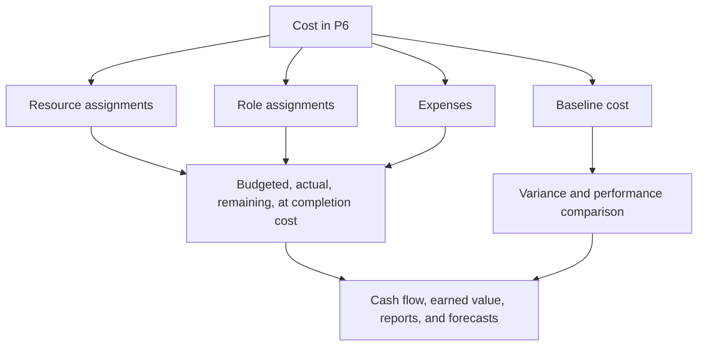

Cost in Primavera P6 can live in several places. That is useful, but it can also be confusing. A schedule may show budgeted cost, actual cost, remaining cost, at completion cost, resource cost, role cost, expense cost, earned value fields, and baseline cost. These values are related, but they do not all mean the same thing.

For project controls teams, the key question is not only "what is the cost?" The better question is: where does this cost come from, what does it represent, and how should it be used?

This blog explains the main types of costs available in P6, the differences between them, and when each one is useful.

## Why Cost Location Matters

P6 is primarily a scheduling tool, but it can also support cost-loaded schedules, earned value, cash flow, and forecast reporting. To do that properly, the cost must be placed in the right part of the schedule model.

If labor cost is entered as an expense, resource histograms may not tell the right story. If actual cost is manually entered but the project expects it to come from resource actuals, reports may become inconsistent. If baseline cost is missing, schedule variance and cost variance reporting lose context.

Cost location matters because the source of the cost affects how it rolls up, updates, forecasts, and reports.

## Resource Costs

Resource costs come from resources assigned to activities. A resource may represent labor, equipment, or another resource category. Each resource can have rates, units, and cost calculations.

For example, if an activity uses a pipefitter crew for 80 hours at a defined hourly rate, P6 can calculate the labor cost from the assigned units and rate.

Resource costs are useful when the project wants to connect schedule activities to labor, equipment, productivity, and resource histograms.

Use resource costs when:

- Labor or equipment demand matters.
- Resource histograms are needed.
- Cost is tied to hours or units.
- Earned value or progress is resource-based.
- The schedule is used for resource planning.

The main risk is maintenance. Resource-loaded schedules require discipline. If units, rates, calendars, or actuals are not maintained, the cost reports will not be reliable.

## Role Costs

Roles are generic job functions, such as engineer, electrician, planner, inspector, or crane operator. In P6, roles can be assigned to activities before named resources are known.

Role costs can support early planning when the team knows the type of resource needed but not the specific person or crew.

For example, during early engineering planning, an activity may need 120 hours of "Senior Engineer" time. The named person may not be assigned yet, but the role can provide a planning rate and cost estimate.

Use role costs when:

- The schedule is still in planning.
- Named resources are not yet confirmed.
- The project wants a high-level resource or cost estimate.
- Roles will later be replaced by actual resources.

Role costs are useful for early-stage planning, but they should be reviewed as the project matures. If roles remain after actual resources are known, the schedule may become too generic for detailed control.

## Expense Costs

Expenses are non-resource costs assigned directly to activities. They are useful for costs that are not best represented by labor or equipment resources.

Examples include:

- Permits.
- Travel.
- Vendor lump sums.
- Subcontractor packages.
- Materials purchased as a fixed amount.
- Testing fees.
- Mobilization charges.

Expense costs can be budgeted, actual, remaining, or at completion depending on how the project tracks them.

Use expenses when:

- The cost is not driven by resource hours.
- The cost is a fixed or lump-sum item.
- The activity needs a direct non-resource cost.
- The project wants cash flow for nonlabor items.

The risk is that expenses can become a dumping ground. If all costs are entered as expenses, the schedule may lose the ability to explain labor, equipment, and productivity separately.

## Budgeted Cost

Budgeted Cost is the planned cost assigned to the activity. It may come from resource assignments, role assignments, expenses, or a combination of these.

Budgeted Cost is important because it represents the cost plan before execution. It supports cash flow, baseline cost, earned value setup, and project control reporting.

Use Budgeted Cost to answer: what was the planned cost of this activity?

If Budgeted Cost is missing or inconsistent, the schedule may still calculate dates, but it cannot support meaningful cost-loaded reporting.

## Actual Cost

Actual Cost represents the cost already incurred. Depending on project setup, actual cost may be calculated from actual resource units and rates, entered manually, imported from timesheets, or loaded from an external cost system.

Actual Cost is important for progress reporting and earned value. It shows what has been spent or recorded so far.

Use Actual Cost to answer: what cost has already been incurred or recorded?

The risk is mixing sources. If some actual costs are imported from accounting and others are manually entered in P6, the team needs a clear rule to avoid duplication or gaps.

## Remaining Cost

Remaining Cost is the forecast cost still needed to complete the activity. It is tied to remaining units, resource rates, remaining expenses, and update assumptions.

Remaining Cost is one of the most important forecast fields. It tells the project team how much cost remains from the current Data Date forward.

Use Remaining Cost to answer: how much cost is still expected?

If Remaining Duration is updated but Remaining Cost is not, the forecast may become inconsistent. The same is true when resource units or expense remaining values are not maintained.

## At Completion Cost

At Completion Cost is the expected total cost of the activity after combining actual and remaining cost.

In simple terms:

Actual Cost + Remaining Cost = At Completion Cost

At Completion Cost helps show whether an activity is forecast to finish over, under, or on budget.

Use At Completion Cost to answer: what is the latest expected total cost?

## Baseline Cost

Baseline Cost comes from an assigned baseline schedule. It is used to compare current cost values against the approved plan.

Baseline cost is important for variance reporting. Without a baseline, the project may know current forecast cost but not whether that forecast is better or worse than the approved plan.

Use Baseline Cost to answer: how does the current cost compare with the approved cost plan?

Baseline cost is especially important when using P6 for earned value or formal PMO reporting.

## Earned Value Cost Fields

P6 can support earned value fields such as Planned Value, Earned Value, Actual Cost, Cost Variance, and Schedule Variance, depending on the project setup.

Earned value uses cost-loaded schedule information to compare planned work, earned work, and actual cost.

These fields are useful when the project has a formal earned value process. They require consistent baselines, progress rules, percent complete methods, and cost loading.

Use earned value cost fields when:

- The project requires EV reporting.
- Progress rules are defined.
- Baseline cost is approved.
- Actual cost source is controlled.
- Activity progress is maintained consistently.

Without those controls, earned value outputs can look precise while being unreliable.

## Which Cost Type Should You Use?

Use resource costs for labor and equipment that should support resource planning, productivity, and histograms.

Use role costs for early planning when named resources are not yet known.

Use expense costs for direct non-resource costs, lump sums, vendor items, permits, travel, or subcontract packages.

Use budgeted, actual, remaining, and at completion cost fields to understand the time-phased cost lifecycle.

Use baseline cost for comparison against the approved plan.

Use earned value fields when the project has the governance needed to support EV reporting.

## Common Problems

One common problem is cost duplication. The same subcontractor cost may be entered as a resource cost and again as an expense.

Another problem is missing actual cost. The schedule may have budget and remaining cost, but actual cost may live in a separate accounting system and never reach P6.

A third problem is using expenses for everything. This can produce total cost but weak resource visibility.

Another issue is inconsistent progress. If percent complete, remaining duration, and remaining cost are not aligned, at completion cost becomes unreliable.

## Good Practice

Define the cost strategy before loading the schedule. Decide where labor, equipment, materials, subcontractors, and indirect costs will live.

Use consistent cost accounts, activity codes, resources, roles, and expense categories.

Document whether actual costs will be entered in P6, imported, or reported from another system.

Review cost fields during each update cycle. Budgeted, actual, remaining, and at completion cost should tell a coherent story.

## Conclusion

Cost in P6 can live in resources, roles, expenses, baselines, and earned value fields. Each place has a different purpose.

Resource costs connect cost to labor and equipment. Role costs support early planning. Expense costs capture direct non-resource items. Budgeted, actual, remaining, and at completion costs show the cost lifecycle. Baseline and earned value fields support comparison and performance reporting.

A strong cost-loaded schedule is not built by putting numbers anywhere they fit. It is built by deciding where each type of cost belongs and maintaining that structure through every update cycle.
