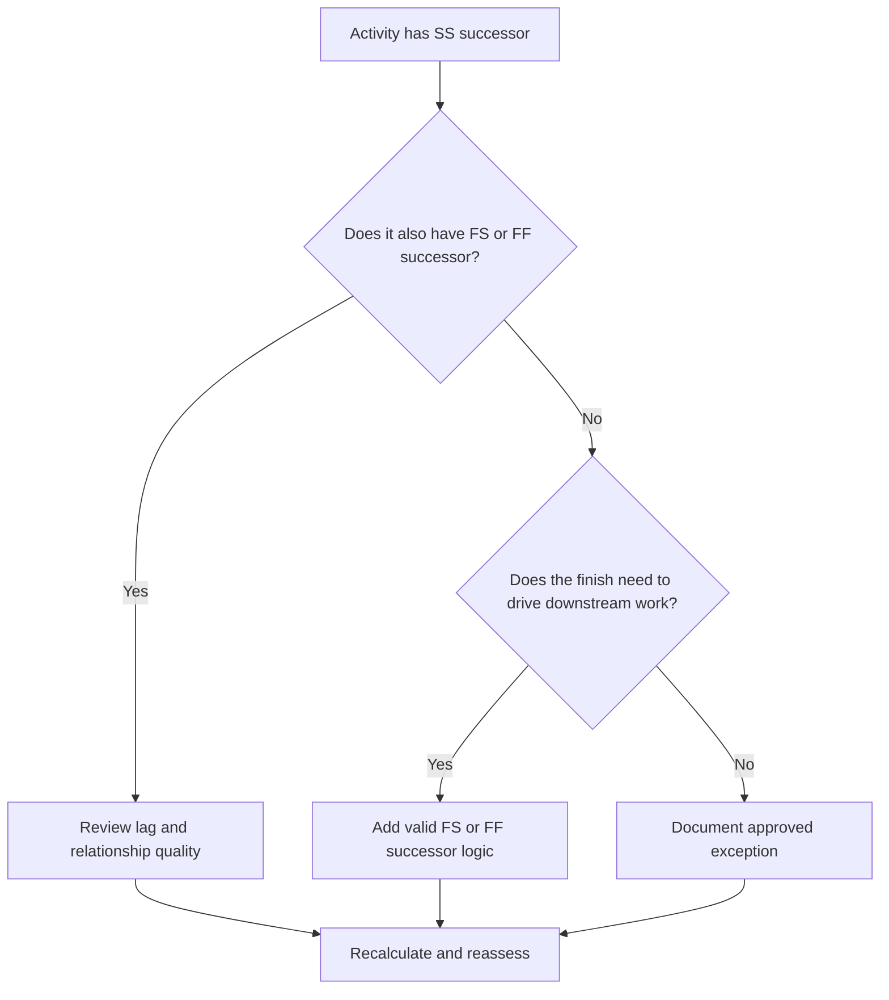

## Purpose

This guide helps schedulers review and correct activities that have Start-to-Start successors but no Finish-to-Start or Finish-to-Finish successors. It supports stronger CPM logic by confirming that activity finishes, not only starts, are connected to the downstream schedule network.

## Before You Start

Gather the following information before taking action:

- Current assessment result for this metric.
- List of activities with SS successors and no FS or FF successors.
- Successor relationship details for each activity.
- Activity type, duration, status, calendar, total float, and WBS.
- Any lags, constraints, or expected dates affecting the activity or its successors.
- Relevant construction, engineering, procurement, or handover sequence information.

## Understand Your Result

A strong result is zero unresolved activities in this condition. This means activities that start downstream work also have finish-based logic where the completion of the work matters.

An acceptable result may include documented exceptions, such as level-of-effort activities, administrative activities, or intentionally overlapping work where finish logic is not needed. These should be reviewed rather than assumed valid.

A weak result means several activities can start successors but do not control any successor finish or start through their own completion. This may allow unfinished work to stop influencing the schedule.

## Improvement Goal

The target is 0 unresolved activities with SS successors and no FS or FF successors.

The goal is to confirm that each activity has a realistic finish-driven successor where completion affects downstream work, or that the lack of finish logic is justified and documented.

## Action Plan

### Step 1: Identify the Main Issue

Create a P6 layout or export that lists activities with at least one SS successor and no FS or FF successor. Include Activity ID, Activity Name, WBS, Original Duration, Remaining Duration, Total Float, Successors, Relationship Type, Lag, Constraints, and Activity Status.

Review each activity and ask:

- What work starts because this activity starts?
- What work, milestone, handover, or inspection depends on this activity finishing?
- Is an FS or FF successor missing?
- Is the SS relationship being used to model overlapping work correctly?
- Is the activity a valid exception, such as a level-of-effort or support activity?

### Step 2: Apply the Recommended Fixes

Add finish-based logic where the activity completion should control later work. Use FS when the successor cannot start until the activity finishes. Use FF when the successor can overlap but cannot finish until the predecessor finishes.

Review SS relationships with lag. If the lag is being used to approximate finish dependency, replace or supplement it with a clearer FS or FF relationship. Avoid adding logic only to satisfy the metric; each relationship should reflect the real work sequence.

If the activity is a valid exception, document the reason in a notebook topic, UDF, comment field, or schedule quality tracker.

### Step 3: Remove Common Blockers

Common blockers include copied logic from old schedules, excessive SS relationships, unclear handover points, and missing input from field or discipline leads. Resolve these by reviewing the actual work sequence with the responsible owner.

Another blocker is the belief that overlapping work always needs only SS logic. Overlap may be valid, but the finish of the predecessor often still needs to control a successor finish, inspection, turnover, or follow-on activity.

### Step 4: Validate the Changes

Recalculate the schedule after corrections. Re-run the metric and confirm that each remaining activity is either corrected or documented as an approved exception.

Review the impact on total float, critical path, longest path, and near-term milestones. If adding finish logic changes key dates, communicate the result to the project controls lead or PMO reviewer.

## Improvement Schedule

### Day 1: Review and Diagnose

Run the metric, confirm the affected activity list, and separate activities into missing finish logic, weak SS logic, lag issues, and possible exceptions.

### Days 2-3: Implement Priority Actions

Correct critical and near-critical activities first. Add valid FS or FF successors, adjust inappropriate SS logic, and document justified exceptions.

### Days 4-5: Monitor Early Results

Recalculate the schedule and review movement in float, longest path, and milestone dates.

### Day 6: Final Adjustments

Resolve remaining uncertain items with the responsible discipline, package owner, or construction lead.

### Day 7: Reassess and Compare

Run the assessment again and compare the result against the target threshold.

## Tracking Progress

Use a simple tracker to manage corrections and approvals.

| Date | Action Taken | Expected Impact | Result / Observation | Next Step |
| --- | --- | --- | --- | --- |
| [Date] | Reviewed SS-only successor activities | Identify missing finish logic | [Observed result] | Assign corrections |
| [Date] | Added FS or FF successor logic | Improve CPM continuity | [Observed result] | Recalculate schedule |
| [Date] | Documented valid exceptions | Improve review traceability | [Observed result] | Reassess metric |

## If Results Do Not Improve

If results do not improve, check whether the filter is identifying valid exceptions, duplicate logic, or activities in a specific WBS area with weak network development. A repeated issue may indicate that the team is relying too heavily on SS relationships during planning.

Escalate unresolved items to the planning lead or PMO reviewer when they affect critical, near-critical, contractual, or handover-related work.

## Maintenance

Review this metric during each schedule update and before baseline approval. Pay special attention after resequencing, recovery planning, copied schedule development, or major scope changes.

## Summary Checklist

- [ ] Current result reviewed
- [ ] Target threshold confirmed
- [ ] Main issue identified
- [ ] SS successors reviewed
- [ ] Missing FS or FF logic corrected
- [ ] Lags and constraints checked
- [ ] Valid exceptions documented
- [ ] Schedule recalculated
- [ ] Results monitored
- [ ] Assessment repeated
- [ ] Next steps documented

## Related Content
- [Blog Article](03_blog_template.md)
- [What A Schedule Is](../../01b_blogs_en/01_WHAT%20A%20SCHEDULE%20IS/01_blog.md)
- [Robust Logic](../../01b_blogs_en/02_ROBUST%20LOGIC/02_ROBUST%20LOGIC.md)
