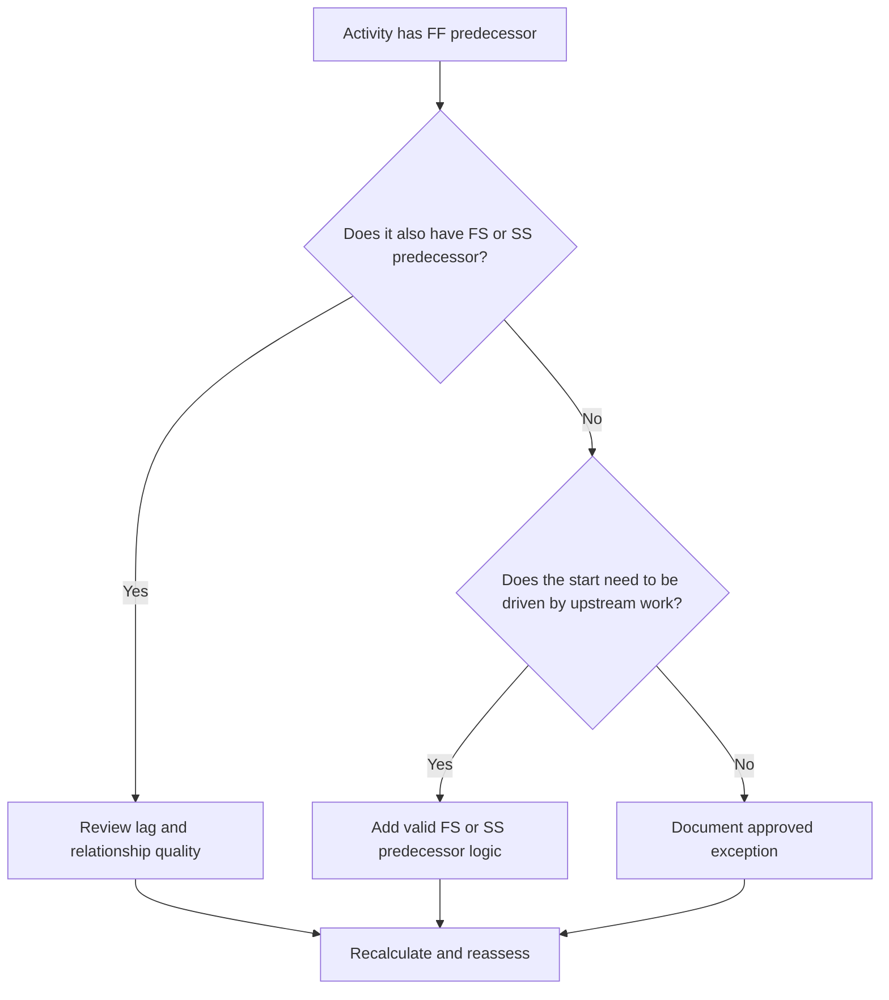

## Purpose

This guide helps schedulers review and correct activities that have Finish-to-Finish predecessors but no Finish-to-Start or Start-to-Start predecessors. It supports stronger CPM logic by confirming that activity starts, not only finishes, are connected to the upstream schedule network.

## Before You Start

Gather the following information before taking action:

- Current assessment result for this metric.
- List of activities with FF predecessors and no FS or SS predecessors.
- Predecessor relationship details for each activity.
- Activity type, duration, status, calendar, total float, and WBS.
- Any lags, constraints, or expected dates affecting the activity or its predecessors.
- Relevant construction, engineering, procurement, access, approval, or handover sequence information.

## Understand Your Result

A strong result is zero unresolved activities in this condition. This means activities whose finishes are tied to prior work also have valid start-driving logic where needed.

An acceptable result may include documented exceptions, such as level-of-effort activities, administrative activities, or intentionally modeled parallel work where start logic is not required. These should be reviewed rather than assumed valid.

A weak result means several activities can finish in relation to predecessors, but their starts are not controlled by upstream work. This may allow activities to start earlier than the real sequence supports.

## Improvement Goal

The target is 0 unresolved activities with FF predecessors and no FS or SS predecessors.

The goal is to confirm that each activity has a realistic start-driving predecessor where the start depends on upstream work, or that the lack of start logic is justified and documented.

## Action Plan

### Step 1: Identify the Main Issue

Create a P6 layout or export that lists activities with at least one FF predecessor and no FS or SS predecessor. Include Activity ID, Activity Name, WBS, Original Duration, Remaining Duration, Total Float, Predecessors, Relationship Type, Lag, Constraints, and Activity Status.

Review each activity and ask:

- What must happen before this activity can start?
- Is the FF predecessor only controlling finish alignment?
- Is an FS or SS predecessor missing?
- Is the FF relationship being used to model overlapping work correctly?
- Is the activity a valid exception, such as a level-of-effort or support activity?

### Step 2: Apply the Recommended Fixes

Add start-driving logic where the activity start should depend on prior work. Use FS when the activity cannot start until the predecessor finishes. Use SS when the activity can start after the predecessor starts or reaches a defined point of progress.

Review FF relationships with lag. If the lag is being used to approximate start dependency, replace or supplement it with clearer FS or SS logic. Avoid adding relationships only to satisfy the metric; each relationship should reflect the real work sequence.

If the activity is a valid exception, document the reason in a notebook topic, UDF, comment field, or schedule quality tracker.

### Step 3: Remove Common Blockers

Common blockers include copied logic from old schedules, overuse of FF relationships, unclear access or release points, and missing input from field or discipline leads. Resolve these by reviewing the actual start condition with the responsible owner.

Another blocker is the belief that FF logic is enough when two activities must finish together. Finish alignment may be valid, but the successor activity often still needs a clear start condition.

### Step 4: Validate the Changes

Recalculate the schedule after corrections. Re-run the metric and confirm that each remaining activity is either corrected or documented as an approved exception.

Review the impact on early dates, total float, critical path, longest path, and near-term milestones. If adding start logic changes key dates, communicate the result to the project controls lead or PMO reviewer.

## Improvement Schedule

### Day 1: Review and Diagnose

Run the metric, confirm the affected activity list, and separate activities into missing start logic, weak FF logic, lag issues, and possible exceptions.

### Days 2-3: Implement Priority Actions

Correct critical and near-critical activities first. Add valid FS or SS predecessors, adjust inappropriate FF logic, and document justified exceptions.

### Days 4-5: Monitor Early Results

Recalculate the schedule and review movement in early dates, float, longest path, and milestone dates.

### Day 6: Final Adjustments

Resolve remaining uncertain items with the responsible discipline, package owner, or construction lead.

### Day 7: Reassess and Compare

Run the assessment again and compare the result against the target threshold.

## Tracking Progress

Use a simple tracker to manage corrections and approvals.

| Date | Action Taken | Expected Impact | Result / Observation | Next Step |
| --- | --- | --- | --- | --- |
| [Date] | Reviewed FF-only predecessor activities | Identify missing start logic | [Observed result] | Assign corrections |
| [Date] | Added FS or SS predecessor logic | Improve CPM continuity | [Observed result] | Recalculate schedule |
| [Date] | Documented valid exceptions | Improve review traceability | [Observed result] | Reassess metric |

## If Results Do Not Improve

If results do not improve, check whether the filter is identifying valid exceptions, duplicate logic, or activities in a specific WBS area with weak network development. A repeated issue may indicate that the team is relying too heavily on FF relationships during planning.

Escalate unresolved items to the planning lead or PMO reviewer when they affect critical, near-critical, contractual, access-related, or handover-related work.

## Maintenance

Review this metric during each schedule update and before baseline approval. Pay special attention after resequencing, recovery planning, copied schedule development, or major scope changes.

## Summary Checklist

- [ ] Current result reviewed
- [ ] Target threshold confirmed
- [ ] Main issue identified
- [ ] FF predecessors reviewed
- [ ] Missing FS or SS logic corrected
- [ ] Lags and constraints checked
- [ ] Valid exceptions documented
- [ ] Schedule recalculated
- [ ] Results monitored
- [ ] Assessment repeated
- [ ] Next steps documented

## Related Content
- [Blog Article](03_blog_template.md)
- [What A Schedule Is](../../01b_blogs_en/01_WHAT%20A%20SCHEDULE%20IS/01_blog.md)
- [Robust Logic](../../01b_blogs_en/02_ROBUST%20LOGIC/02_ROBUST%20LOGIC.md)
