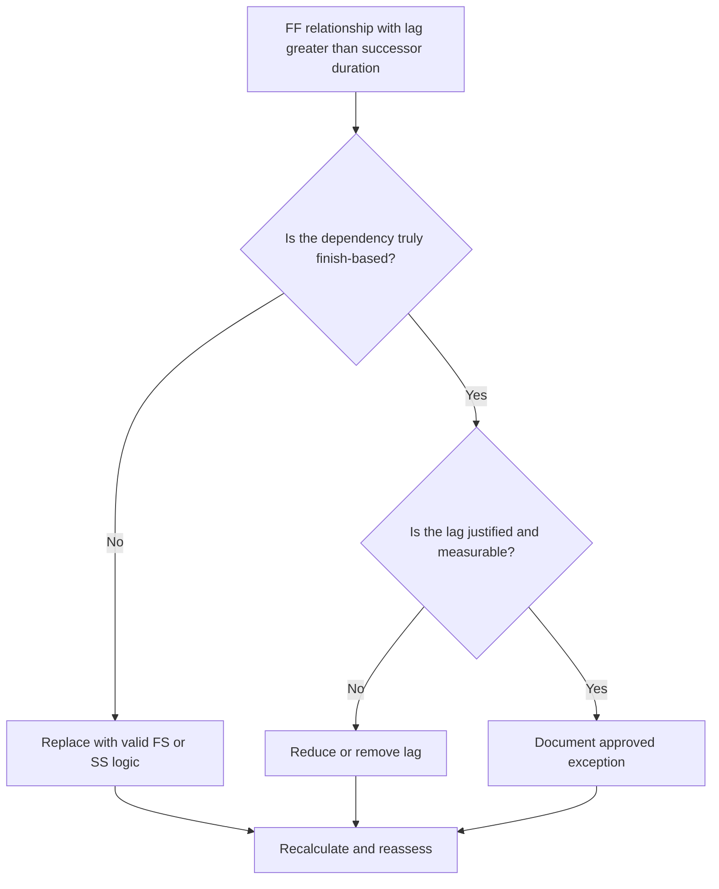

# FF Lag Greater Than Successor Duration - Improvement Guide
## Purpose

This guide helps schedulers review and correct Finish-to-Finish relationships where the lag is greater than the successor activity duration. It supports clearer CPM logic by replacing excessive FF lag with relationship logic or visible activities that better represent the real work sequence.

## Before You Start

Gather the following information before taking action:

- Current assessment result for this metric.
- List of FF relationships where lag is greater than successor duration.
- Predecessor and successor Activity IDs, names, WBS, durations, calendars, and status.
- Relationship lag, relationship type, and any related constraints.
- Schedule calculation settings and calendar basis used for lag.
- Field, engineering, procurement, approval, or handover logic explaining the intended dependency.

## Understand Your Result

A strong result is zero unresolved FF relationships where lag exceeds successor duration.

An acceptable result may include documented exceptions, but these should be rare. Long FF lag often indicates that the relationship type does not match the dependency being modeled.

A weak result means the schedule contains multiple finish-to-finish links where the successor finish is delayed by more time than the successor activity duration. This may hide start-driven logic, waiting periods, or missing intermediate activities.

## Improvement Goal

The target is 0 unresolved FF relationships with lag greater than successor duration.

The goal is to confirm whether each relationship should remain FF, be converted to FS or SS logic, have the lag reduced, or be documented as a valid exception.

## Action Plan

### Step 1: Identify the Main Issue

Create a P6 layout or export that lists FF relationships where lag is greater than the successor duration. Include predecessor and successor Activity ID, Activity Name, WBS, Original Duration, Remaining Duration, Relationship Type, Lag, Calendar, Total Float, and Activity Status.

Review each relationship and ask:

- Why does the successor finish after such a long delay?
- Does the successor actually depend on the predecessor finishing, or on another start or handover condition?
- Is the lag greater than the successor original duration, remaining duration, or both?
- Is the lag being used to model review time, curing, delivery, approval, access, or another real waiting period?
- Would an FS or SS relationship make the dependency clearer?

### Step 2: Apply the Recommended Fixes

If the successor should start after the predecessor finishes, replace the FF relationship with an FS relationship. If the successor can start after the predecessor starts or reaches a defined point of progress, use SS logic.

If the relationship is truly finish-based, review the lag value. Reduce excessive lag where it was used as a rough placeholder or inherited from copied logic. If the lag represents a real waiting period, confirm that the unit, calendar, and explanation are correct.

Avoid using long lag as a substitute for activities that should be visible in the schedule. If the lag represents review, curing, delivery, mobilization, approval, or closeout time, consider modeling that work as a separate activity.

### Step 3: Remove Common Blockers

Common blockers include copied logic from previous schedules, hidden waiting periods, calendar confusion, and pressure to keep the network simple. Resolve these by confirming the intended dependency with the responsible owner.

Another blocker is treating lag as harmless. Long lag can be difficult to review, can hide risk, and can make delay analysis harder because the waiting period is not visible as an activity.

### Step 4: Validate the Changes

Recalculate the schedule after corrections. Re-run the metric and confirm that each remaining item is either corrected or documented as an approved exception.

Review total float, longest path, critical path, and near-term milestones. If relationship changes move key dates, communicate the result to the project controls lead or PMO reviewer.

## Improvement Schedule

### Day 1: Review and Diagnose

Run the metric, confirm the affected relationship list, and separate items into wrong relationship type, excessive lag, hidden activity, calendar issue, and possible exception.

### Days 2-3: Implement Priority Actions

Correct critical and near-critical relationships first. Convert FF logic to FS or SS where appropriate, reduce unjustified lag, and document valid exceptions.

### Days 4-5: Monitor Early Results

Recalculate the schedule and review movement in float, longest path, and milestone dates.

### Day 6: Final Adjustments

Resolve remaining uncertain items with the responsible discipline, package owner, or construction lead.

### Day 7: Reassess and Compare

Run the assessment again and compare the result against the target threshold.

## Tracking Progress

Use a simple tracker to manage corrections and approvals.

| Date | Action Taken | Expected Impact | Result / Observation | Next Step |
| --- | --- | --- | --- | --- |
| [Date] | Reviewed FF lag greater than successor duration | Identify weak or unclear logic | [Observed result] | Assign corrections |
| [Date] | Converted relationship to FS or SS | Improve CPM logic clarity | [Observed result] | Recalculate schedule |
| [Date] | Reduced or documented lag | Improve review traceability | [Observed result] | Reassess metric |

## If Results Do Not Improve

If results do not improve, check whether the same relationship patterns are repeated in a specific WBS area, discipline, or copied schedule section. Repeated findings may indicate that the team is using FF lag as a standard shortcut instead of modeling real dependencies.

Escalate unresolved items when they affect critical, near-critical, contractual, procurement, approval, commissioning, or handover-related work.

## Maintenance

Review this metric during each schedule update and before baseline approval. Pay special attention after copied schedule development, resequencing, recovery planning, or major scope changes.

## Summary Checklist

- [ ] Current result reviewed
- [ ] Target threshold confirmed
- [ ] Main issue identified
- [ ] FF relationships reviewed
- [ ] Excessive lag corrected or justified
- [ ] FS or SS replacements applied where needed
- [ ] Hidden work modeled where appropriate
- [ ] Schedule recalculated
- [ ] Results monitored
- [ ] Assessment repeated
- [ ] Next steps documented

## Related Content
- [Overview](01_overview_template.md)
- [Blog Article](03_blog_template.md)
- [What A Schedule Is](../../01b_blogs_en/01_WHAT%20A%20SCHEDULE%20IS/01_blog.md)
- [Robust Logic](../../01b_blogs_en/02_ROBUST%20LOGIC/02_ROBUST%20LOGIC.md)
