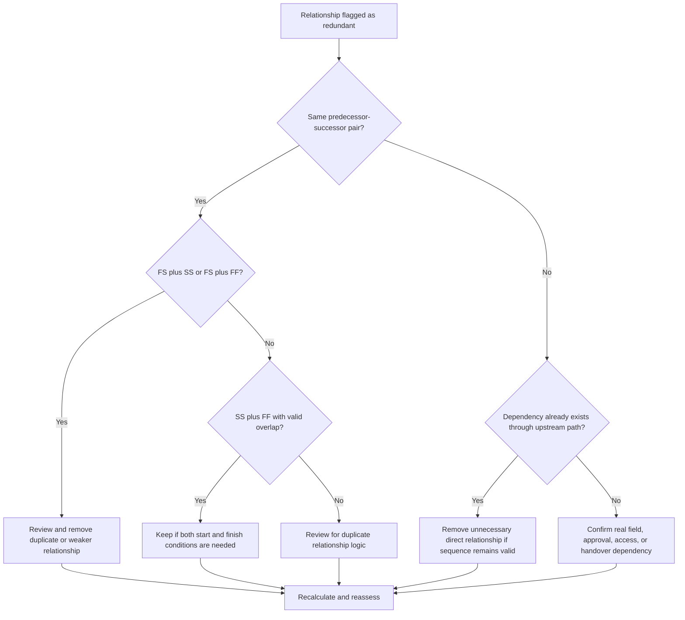

# Redundant Logic - Improvement Guide
## Purpose

This guide helps schedulers identify and remove redundant logic from a Primavera P6 schedule. It applies to duplicate relationship patterns, repeated predecessor logic, and unnecessary dependencies that do not represent a real work sequence.

## Before You Start

Gather the following information before taking action:

- Current assessment result for this metric.
- List of activities and relationships flagged as redundant logic.
- Predecessor and successor details for each flagged activity.
- Relationship types, lags, calendars, total float, and driving relationship indicators.
- WBS, activity codes, and discipline or work package ownership.
- Field, engineering, procurement, approval, or handover information that explains the real dependency.

## Understand Your Result

A strong result is zero unresolved redundant relationships.

An acceptable result may include rare documented exceptions where duplicate-looking logic is intentionally used for a defensible reason. These cases should be reviewed carefully because redundant logic is usually a schedule quality issue.

A weak result means the schedule contains repeated or unnecessary relationship logic. This may happen when copied schedule sections are not cleaned up, relationships are added without checking existing paths, or multiple dependency types are used between the same activities.

## Improvement Goal

The target is 0 unresolved redundant relationships.

The goal is to keep only the relationships that represent real dependencies and remove logic that duplicates, masks, or overstates the actual work sequence.

## Action Plan

### Step 1: Identify the Main Issue

Create a P6 layout, report, or external relationship review that identifies likely redundant logic. Focus on these cases:

- The same predecessor connected to the same successor more than once, especially FS plus SS or FS plus FF.
- SS plus FF between the same two activities may be valid when overlap is modeled correctly and both start and finish conditions matter.
- An activity with the same predecessor and relationship type as its own predecessor, creating repeated inherited logic through the chain.
- Longer repeated predecessor chains where the same dependency appears multiple steps back.
- Dependencies that do not change sequencing, dates, float, handover, access, or risk control.

Review each flagged relationship and ask:

- Does this relationship add a real dependency?
- Is the dependency already represented by another relationship between the same activities?
- Is the dependency already represented by an upstream path?
- Would removing the relationship change valid schedule logic or only simplify the network?
- Is the relationship driving dates for a legitimate reason, or only because redundant logic was added?

### Step 2: Apply the Recommended Fixes

Start with exact duplicates and repeated predecessor-successor pairs. If the same two activities are connected with FS plus SS or FS plus FF, determine which relationship represents the real dependency. Remove the relationship that duplicates or weakens the logic.

Review SS plus FF pairs separately. This combination can be valid when one relationship controls when overlapping work can start and the other controls when it can finish. Keep it only when both conditions are real and documented by the work sequence.

Next, review inherited predecessor logic. If Activity C has the same predecessor relationship as Activity B, and Activity B is already a predecessor of Activity C, the direct relationship from the earlier activity may be unnecessary. Remove it if the CPM sequence remains correct through the existing path.

Finally, remove unnecessary dependencies that do not support work sequence, access, approval, handover, risk control, or contractual logic.

### Step 3: Remove Common Blockers

Common blockers include copied logic from older schedules, over-modeling to make the network look connected, and adding relationships during updates without checking the existing path.

Another blocker is fear that removing relationships will weaken the schedule. The goal is not to remove valid controls; it is to remove relationships that duplicate controls already present in the network.

### Step 4: Validate the Changes

Recalculate the schedule after removing or adjusting redundant logic. Review total float, driving relationships, longest path, critical path, and key milestone dates.

If removing a relationship changes dates unexpectedly, investigate whether the removed link was actually serving a valid dependency or whether another missing relationship needs to be added more accurately.

## Improvement Schedule

### Day 1: Review and Diagnose

Run the metric, confirm the affected relationship list, and separate findings into duplicate pairs, FS plus SS/FF combinations, inherited predecessor logic, and unnecessary dependencies.

### Days 2-3: Implement Priority Actions

Correct critical and near-critical relationships first. Remove exact duplicates, clean up repeated predecessor pairs, and document valid SS plus FF combinations.

### Days 4-5: Monitor Early Results

Recalculate the schedule and review movement in float, longest path, driving relationships, and milestone dates.

### Day 6: Final Adjustments

Resolve uncertain items with the responsible discipline, package owner, or construction lead.

### Day 7: Reassess and Compare

Run the assessment again and compare the result against the target threshold.

## Tracking Progress

Use a simple tracker to manage corrections and approvals.

| Date | Action Taken | Expected Impact | Result / Observation | Next Step |
| --- | --- | --- | --- | --- |
| [Date] | Reviewed redundant relationship list | Identify duplicate or unnecessary logic | [Observed result] | Assign corrections |
| [Date] | Removed duplicate relationships | Simplify CPM network | [Observed result] | Recalculate schedule |
| [Date] | Documented valid exceptions | Improve review traceability | [Observed result] | Reassess metric |

## If Results Do Not Improve

If results do not improve, check whether redundant logic is concentrated in a specific WBS area, copied project section, discipline, or schedule update period. Repeated findings may indicate that relationship cleanup is not part of the normal scheduling workflow.

Escalate unresolved redundant logic when it affects critical, near-critical, contractual, access, approval, or handover-related work.

## Maintenance

Review this metric during each schedule update and before baseline approval. Pay special attention after copied schedule development, resequencing, recovery planning, or large logic revisions.

## Summary Checklist

- [ ] Current result reviewed
- [ ] Target threshold confirmed
- [ ] Main issue identified
- [ ] Duplicate predecessor-successor pairs reviewed
- [ ] FS plus SS or FS plus FF combinations corrected
- [ ] Valid SS plus FF combinations documented
- [ ] Inherited predecessor logic reviewed
- [ ] Unnecessary dependencies removed
- [ ] Schedule recalculated
- [ ] Results monitored
- [ ] Assessment repeated
- [ ] Next steps documented

## Related Content
- [Overview](01_overview_template.md)
- [Blog Article](03_blog_template.md)
- [What A Schedule Is](../../01b_blogs_en/01_WHAT%20A%20SCHEDULE%20IS/01_blog.md)
- [Robust Logic](../../01b_blogs_en/02_ROBUST%20LOGIC/02_ROBUST%20LOGIC.md)
