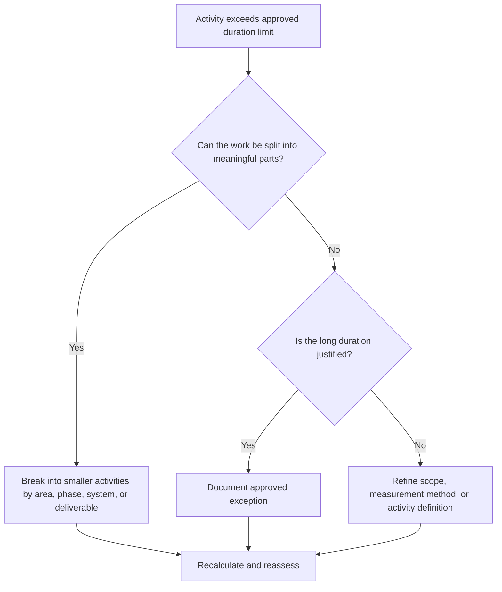

## Purpose

This guide helps schedulers review and improve activities with durations longer than the approved project threshold. The acceptable duration depends on project type, level of detail, reporting cycle, contract requirements, and client sensitivity to long activities.

## Before You Start

Gather the following information before taking action:

- Current assessment result for this metric.
- Approved maximum activity duration for the project or schedule level.
- List of activities above the duration threshold.
- Original Duration, Remaining Duration, Activity Type, Status, WBS, calendar, and total float.
- Baseline requirements, client reporting expectations, and PMO schedule quality rules.
- Lookahead planning period, progress update cycle, and discipline or package ownership.
- Any justified exceptions, such as procurement, curing, delivery, review, testing, or level-of-effort activities.

## Understand Your Result

A strong result is zero unresolved activities above the approved long-duration threshold.

An acceptable result may include documented exceptions, especially for activities that cannot reasonably be broken down or are intentionally managed as summary-like control activities. These should be limited and clearly justified.

A weak result means the schedule contains many activities that are too broad for effective planning and control. This may reduce progress visibility and make it harder to understand what work is actually driving the schedule.

## Improvement Goal

The target is 0 unresolved activities above the approved duration limit.

The goal is to split long activities into smaller, meaningful activities where better control is needed, while documenting valid exceptions where a long duration is appropriate.

## Action Plan

### Step 1: Identify the Main Issue

Create a P6 layout or report that lists activities exceeding the project-defined duration threshold. Include Activity ID, Activity Name, WBS, Activity Type, Original Duration, Remaining Duration, Start, Finish, Calendar, Total Float, and Activity Status.

Review each activity and ask:

- Is the activity duration longer than the approved threshold for this project type and schedule level?
- Does the activity cover multiple work steps, locations, systems, areas, or deliverables?
- Can progress be measured objectively during each update cycle?
- Does the activity need more detail because the client or PMO is sensitive to long durations?
- Is the activity a valid exception that should remain long?

### Step 2: Apply the Recommended Fixes

Split long activities where the work can be planned and measured in smaller pieces. Common breakdown methods include location, WBS area, discipline, system, deliverable, phase, crew sequence, or reporting period.

When splitting an activity, preserve the real logic sequence. Add appropriate predecessors and successors, assign the correct calendar, and confirm that the new activities reflect how the work will actually be executed.

Do not split activities only to satisfy the metric. The breakdown should improve control, progress measurement, lookahead planning, or reporting clarity.

### Step 3: Remove Common Blockers

Common blockers include incomplete scope definition, weak WBS structure, limited field input, and pressure to keep the activity count low. Resolve these by reviewing long activities with the responsible discipline, package owner, or construction lead.

Another blocker is using one long activity to represent work that should be planned as a sequence. If the activity contains multiple handovers, work faces, deliverables, or control points, it probably needs more detail.

### Step 4: Validate the Changes

Recalculate the schedule after splitting or adjusting long activities. Confirm that each new activity has appropriate logic, duration, calendar, and progress measurement.

Review total float, critical path, longest path, and milestone dates. If the breakdown changes key dates, communicate the reason to the project controls lead or PMO reviewer.

## Improvement Schedule

### Day 1: Review and Diagnose

Run the metric, confirm the duration threshold, and separate activities into split candidates, valid exceptions, and items requiring owner input.

### Days 2-3: Implement Priority Actions

Correct critical, near-critical, and client-sensitive activities first. Break down broad activities and document valid exceptions.

### Days 4-5: Monitor Early Results

Recalculate the schedule and review movement in float, longest path, milestone dates, and lookahead visibility.

### Day 6: Final Adjustments

Resolve remaining uncertain items with the responsible discipline, package owner, or project controls lead.

### Day 7: Reassess and Compare

Run the assessment again and compare the result against the target threshold.

## Tracking Progress

Use a simple tracker to manage corrections and approvals.

| Date | Action Taken | Expected Impact | Result / Observation | Next Step |
| --- | --- | --- | --- | --- |
| [Date] | Reviewed long-duration activities | Identify activities needing breakdown | [Observed result] | Assign owners |
| [Date] | Split activity into smaller work steps | Improve progress visibility | [Observed result] | Recalculate schedule |
| [Date] | Documented valid exception | Improve review traceability | [Observed result] | Reassess metric |

## If Results Do Not Improve

If results do not improve, check whether the duration threshold is unclear, applied inconsistently, or not aligned with the schedule level. Also review whether long activities are concentrated in a specific WBS area, discipline, or project phase.

Escalate unresolved long-duration activities when they affect critical, near-critical, contractual, reporting, or client-sensitive work.

## Maintenance

Review this metric during each schedule update, baseline development, and major resequencing exercise. Update the threshold if the project moves to a different phase or level of detail.

## Summary Checklist

- [ ] Current result reviewed
- [ ] Target threshold confirmed
- [ ] Main issue identified
- [ ] Long activities reviewed
- [ ] Split candidates identified
- [ ] Activities broken down where useful
- [ ] Valid exceptions documented
- [ ] Schedule recalculated
- [ ] Results monitored
- [ ] Assessment repeated
- [ ] Next steps documented

## Related Content
- [Blog Article](03_blog_template.md)
- [What A Schedule Is](../../01b_blogs_en/01_WHAT%20A%20SCHEDULE%20IS/01_blog.md)
- [Robust Logic](../../01b_blogs_en/02_ROBUST%20LOGIC/02_ROBUST%20LOGIC.md)
