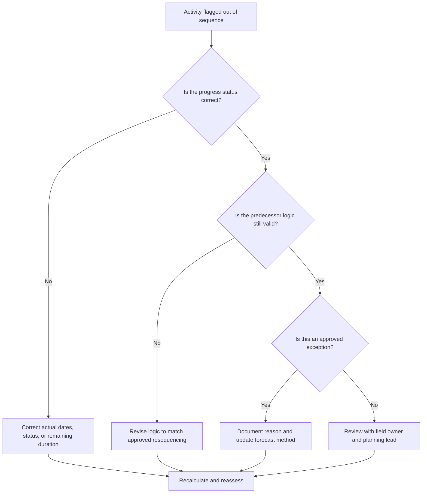

## Purpose

This guide helps schedulers review and correct activities that are out of sequence in Primavera P6. It applies when an activity has started or progressed before its required predecessor logic has been satisfied.

## Before You Start

Gather the following information before taking action:

- Current assessment result for this metric.
- List of activities flagged as out of sequence.
- Data Date used in the latest update.
- Actual Start, Actual Finish, Remaining Duration, and Activity Status.
- Predecessor and successor relationship details, including relationship type and lag.
- Schedule calculation settings, especially retained logic and progress override.
- Field explanation for why the work progressed before planned logic was complete.

## Understand Your Result

A strong result is zero unresolved out-of-sequence activities.

An acceptable result may include documented exceptions where the work was intentionally resequenced and the schedule logic has been updated to reflect the new plan.

A weak result means the schedule update contains progress that conflicts with the existing logic network. This may indicate incorrect status, missing actuals, outdated logic, or real field resequencing that has not yet been reflected in the forecast.

## Improvement Goal

The target is 0 unresolved out-of-sequence activities.

The goal is to determine whether each item is a status error, a logic error, or a real resequencing event, then correct the schedule so it represents the current plan.

## Action Plan

### Step 1: Identify the Main Issue

Create a P6 layout or report listing out-of-sequence activities. Include Activity ID, Activity Name, WBS, Status, Actual Start, Actual Finish, Remaining Duration, Start, Finish, Total Float, predecessors, successors, relationship type, lag, and driving relationship indicators.

Review each activity and ask:

- Did the activity actually start before its predecessor requirement was met?
- Is the predecessor status correct?
- Is the successor status correct?
- Is the relationship still valid after field resequencing?
- Should the schedule logic be changed, or should the progress update be corrected?
- Which P6 scheduling option is being used: retained logic or progress override?

### Step 2: Apply the Recommended Fixes

Correct status errors first. If an actual start, actual finish, remaining duration, or predecessor status is wrong, update the activity data before changing logic.

If the field sequence has changed, revise the logic to represent the approved current plan. Do not simply remove predecessor relationships to clear the metric. Replace outdated logic with relationships that match the real execution sequence.

Review retained logic and progress override settings. Retained logic generally preserves the original predecessor logic for remaining work, while progress override may allow remaining work to continue despite incomplete predecessor logic. The setting should align with the project controls procedure and be understood before reporting the result.

### Step 3: Remove Common Blockers

Common blockers include late field updates, incomplete actual dates, pressure to accept progress without logic review, and confusion about schedule calculation options.

Another blocker is treating out-of-sequence progress as only a software issue. The real question is whether the project has changed the sequence of work and whether the schedule now reflects that approved sequence.

### Step 4: Validate the Changes

Recalculate the schedule after corrections. Re-run the out-of-sequence check and confirm that each remaining item is corrected, justified, or assigned for follow-up.

Review total float, longest path, critical path, and near-term milestones. Out-of-sequence corrections can change forecast dates, so communicate meaningful impacts to the project controls lead or PMO reviewer.

## Improvement Schedule

### Day 1: Review and Diagnose

Run the metric, confirm the Data Date, and separate findings into status errors, logic errors, real resequencing, and possible exceptions.

### Days 2-3: Implement Priority Actions

Correct critical, near-critical, and lookahead activities first. Update status, revise outdated logic, and document approved resequencing.

### Days 4-5: Monitor Early Results

Recalculate the schedule and review movement in float, longest path, critical path, and milestone dates.

### Day 6: Final Adjustments

Resolve remaining items with field leads, discipline owners, or the planning manager.

### Day 7: Reassess and Compare

Run the assessment again and compare the result against the target threshold.

## Tracking Progress

Use a simple tracker to manage corrections and approvals.

| Date | Action Taken | Expected Impact | Result / Observation | Next Step |
| --- | --- | --- | --- | --- |
| [Date] | Reviewed out-of-sequence activities | Identify status or logic issue | [Observed result] | Assign owner |
| [Date] | Corrected status or actual dates | Improve update accuracy | [Observed result] | Recalculate schedule |
| [Date] | Revised logic for approved resequencing | Improve forecast reliability | [Observed result] | Reassess metric |

## If Results Do Not Improve

If results do not improve, check whether the same work areas are repeatedly progressing out of sequence. This may indicate weak update discipline, unrealistic logic, incomplete field coordination, or frequent unapproved resequencing.

Escalate unresolved items when they affect critical, near-critical, contractual, access, handover, or client-sensitive work.

## Maintenance

Review this metric during every update cycle before issuing the schedule. Confirm that out-of-sequence progress is resolved before schedule reports are used for PMO reporting, delay analysis, or recovery planning.

## Summary Checklist

- [ ] Current result reviewed
- [ ] Target threshold confirmed
- [ ] Data Date confirmed
- [ ] Main issue identified
- [ ] Status errors corrected
- [ ] Logic errors corrected
- [ ] Approved resequencing documented
- [ ] Schedule calculation setting reviewed
- [ ] Schedule recalculated
- [ ] Results monitored
- [ ] Assessment repeated
- [ ] Next steps documented

## Related Content
- [Blog Article](03_blog_template.md)
- [What A Schedule Is](../../01b_blogs_en/01_WHAT%20A%20SCHEDULE%20IS/01_blog.md)
- [Robust Logic](../../01b_blogs_en/02_ROBUST%20LOGIC/02_ROBUST%20LOGIC.md)
