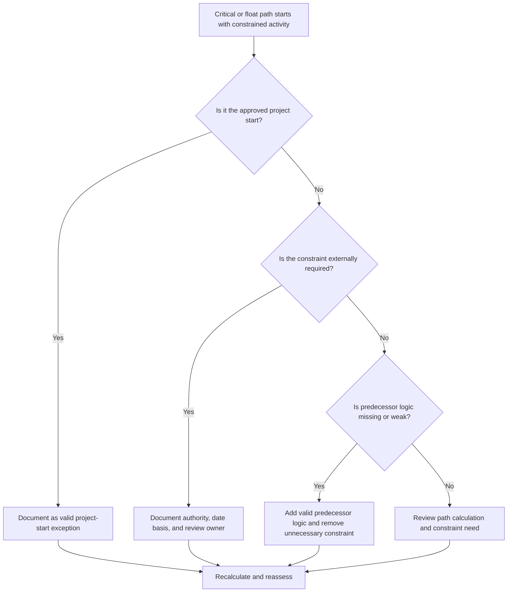

# Critical Path or Float Path Starting with Constraint - Improvement Guide
## Purpose

This guide helps schedulers review critical path or float path chains that start with a constrained activity. The approved project start is normally a valid exception; the concern is when a downstream path begins from a constraint instead of logical sequence.

## Before You Start

Gather the following information before taking action:

- Current assessment result for this metric.
- Critical path or float path report from Primavera P6.
- First activity on each flagged path.
- Constraint type, constraint date, and any expected dates.
- Predecessor and successor relationships for the path-start activity.
- Data Date, project start milestone, baseline requirements, and PMO or client scheduling rules.
- Explanation for any approved external constraint.

## Understand Your Result

A strong result is zero unresolved critical or float paths starting with a constraint, except the approved project start.

An acceptable result may include documented external constraints, such as notice to proceed, owner access release, permit release, or contractual hold points. These should be clearly justified.

A weak result means the path may be controlled by imposed dates instead of network logic. This can make the critical path or float path less reliable for forecasting, reporting, and delay analysis.

## Improvement Goal

The target is 0 unresolved paths starting with a constraint.

The goal is to confirm whether the path should start from the approved project start, from valid predecessor logic, or from a documented external constraint.

## Action Plan

### Step 1: Identify the Main Issue

Create a P6 layout or report that shows the critical path and selected float paths. For the first activity on each path, include Activity ID, Activity Name, WBS, Start, Finish, Total Float, Free Float, Primary Constraint, Constraint Date, Predecessors, Successors, and Activity Status.

Review each flagged path and ask:

- Is this the approved project start or notice-to-proceed activity?
- Is the constraint contractually or externally required?
- Does the activity have missing predecessor logic?
- Is the constraint masking a weak or incomplete schedule network?
- Would the path start differently if the constraint were removed?
- Is the constrained start documented for PMO or client review?

### Step 2: Apply the Recommended Fixes

If the constrained activity is the approved project start, document it as a valid exception and confirm that it is the intended start point for the path.

If the constraint is externally required, keep it only when the reason is clear. Document the source, such as a contract milestone, access release, permit, owner instruction, or regulatory requirement.

If the constraint is not required, remove it and add valid predecessor logic where the activity depends on earlier work, approvals, handovers, procurement, or access. Recalculate the schedule and confirm that the path is now logic-driven.

### Step 3: Remove Common Blockers

Common blockers include inherited constraints from old baselines, constraints used to force dates, missing interface logic, and unclear ownership of external dates.

Another blocker is assuming that a critical path is reliable simply because P6 identifies it. If the path begins with an unnecessary constraint, the path may be reflecting date control rather than true CPM logic.

### Step 4: Validate the Changes

Recalculate the schedule after changing constraints or logic. Review the critical path, longest path, selected float paths, total float, and key milestone dates.

If the path changes significantly, document the reason and communicate the impact to the project controls lead, PMO reviewer, or client scheduler.

## Improvement Schedule

### Day 1: Review and Diagnose

Run the metric, identify constrained path-start activities, and separate findings into project-start exceptions, valid external constraints, missing logic, and unnecessary constraints.

### Days 2-3: Implement Priority Actions

Correct critical and client-sensitive paths first. Remove unnecessary constraints, add missing logic, and document approved exceptions.

### Days 4-5: Monitor Early Results

Recalculate the schedule and review movement in critical path, longest path, float paths, and milestone dates.

### Day 6: Final Adjustments

Resolve remaining constrained path starts with the responsible owner, project controls lead, or client reviewer.

### Day 7: Reassess and Compare

Run the assessment again and compare the result against the target threshold.

## Tracking Progress

Use a simple tracker to manage corrections and approvals.

| Date | Action Taken | Expected Impact | Result / Observation | Next Step |
| --- | --- | --- | --- | --- |
| [Date] | Reviewed constrained path-start activities | Identify date-driven path starts | [Observed result] | Assign owner |
| [Date] | Removed unnecessary constraint | Restore logic-driven path | [Observed result] | Recalculate schedule |
| [Date] | Documented approved exception | Improve review traceability | [Observed result] | Reassess metric |

## If Results Do Not Improve

If results do not improve, check whether constraints are concentrated in a specific WBS area, interface package, or project phase. Repeated findings may indicate that the schedule is being controlled by imposed dates rather than complete logic.

Escalate unresolved constrained path starts when they affect critical, near-critical, contractual, client-sensitive, access, or handover-related work.

## Maintenance

Review this metric during each schedule update, baseline review, and major resequencing exercise. Pay special attention after recovery planning, client date changes, or interface revisions.

## Summary Checklist

- [ ] Current result reviewed
- [ ] Target threshold confirmed
- [ ] Critical or float path report reviewed
- [ ] Project start exceptions identified
- [ ] Constraint basis checked
- [ ] Missing logic corrected
- [ ] Unnecessary constraints removed
- [ ] Approved exceptions documented
- [ ] Schedule recalculated
- [ ] Results monitored
- [ ] Assessment repeated
- [ ] Next steps documented

## Related Content
- [Overview](01_overview_template.md)
- [Blog Article](03_blog_template.md)
- [What A Schedule Is](../../01b_blogs_en/01_WHAT%20A%20SCHEDULE%20IS/01_blog.md)
- [Robust Logic](../../01b_blogs_en/02_ROBUST%20LOGIC/02_ROBUST%20LOGIC.md)
